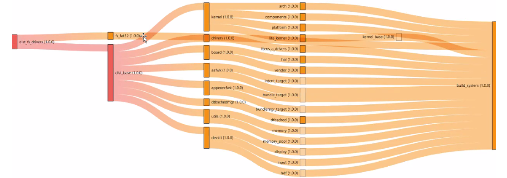

.. _compose1:

Bundle Management
=================

Dependency
----------

A basic **bundle.json** file needs to be enriched by bundle dependencies
to implement more complex features. Bundle names and version numbers
should be defined in the **dependencies** field of **bundle.json**.

::

   {
       "name": "my-bundle",
       "version": "1.0.0",
       "dependencies": {
           "net": "1.0.0"
       }
   }

In this example, **my-bundle** depends on **net 1.0.0**. After you
globally install the hpm-cli tool, run the following command to obtain
bundle dependencies from the remote repository:

::

   hpm install 

Bundle dependencies are then stored in the **ohos_bundles** folder in
the root directory of the current bundle. A tree structure illustrating
the bundle and its dependencies will be generated. You need to run the
following command in the root directory of the bundle:

::

   username@server MINGW64 /f/showcase/demo/demo
   $ hpm list
   +--demo@1.0.0
   | +--@huawei/media@1.0.2
   | +--@demo/sport_hi3518ev300_liteos_a@1.0.0
   | | +--@demo/app@4.0.1
   | | | +--@demo/build@4.0.1
   | | | +--@demo/arm_harmonyeabi_gcc@4.0.0   
   | | +--@demo/liteos_a@4.0.0
   | | | +--@demo/third_party_fatfs@4.0.0     
   | | | +--@demo/arm_harmonyeabi_gcc@4.0.0   
   | | +--@demo/init@4.0.0
   | | +--@demo/dist_tools@4.0.0

Alternatively, you can view the dependencies of the current bundle in a
graph by running the following command:

::

   hpm dependencies

A **deps_visual** folder is generated in the current directory. The
folder contains the **deps.html** and **deps-data.js** files. After you
open the **deps.html** file via a browser, you can view bundle
dependencies illustrated by a graph, as shown in the following figure.

Each dependency type is indicated by a different color at the
corresponding node. You can move the mouse pointer to a node to view the
implied information.

| **Figure 1** Bundle dependencies
| |image1|

HPM Command Reference
---------------------

You can use the hpm-cli tool to manage the lifecycle of a bundle. The
following table describes available HPM commands. (You can run the **hpm
-h** command to get the command details).

**Table 1** HPM commands

.. raw:: html

   <table>

.. raw:: html

   <thead align="left">

.. raw:: html

   <tr id="row125101745103718">

.. raw:: html

   <th class="cellrowborder" valign="top" width="20.95209520952095%" id="mcps1.2.4.1.1">

.. raw:: html

   

Function

.. raw:: html

   

.. raw:: html

   </th>

.. raw:: html

   <th class="cellrowborder" valign="top" width="30.623062306230626%" id="mcps1.2.4.1.2">

.. raw:: html

   

Command

.. raw:: html

   

.. raw:: html

   </th>

.. raw:: html

   <th class="cellrowborder" valign="top" width="48.42484248424842%" id="mcps1.2.4.1.3">

.. raw:: html

   

Description

.. raw:: html

   

.. raw:: html

   </th>

.. raw:: html

   </tr>

.. raw:: html

   </thead>

.. raw:: html

   <tbody>

.. raw:: html

   <tr id="row25106453375">

.. raw:: html

   <td class="cellrowborder" valign="top" width="20.95209520952095%" headers="mcps1.2.4.1.1 ">

.. raw:: html

   

Querying version information

.. raw:: html

   

.. raw:: html

   </td>

.. raw:: html

   <td class="cellrowborder" valign="top" width="30.623062306230626%" headers="mcps1.2.4.1.2 ">

.. raw:: html

   

hpm -V or hpm –version

.. raw:: html

   

.. raw:: html

   </td>

.. raw:: html

   <td class="cellrowborder" valign="top" width="48.42484248424842%" headers="mcps1.2.4.1.3 ">

.. raw:: html

   

Queries the hpm-cli version number.

.. raw:: html

   

.. raw:: html

   </td>

.. raw:: html

   </tr>

.. raw:: html

   <tr id="row651017455374">

.. raw:: html

   <td class="cellrowborder" rowspan="2" align="left" valign="top" width="20.95209520952095%" headers="mcps1.2.4.1.1 ">

.. raw:: html

   

Querying help information

.. raw:: html

   

.. raw:: html

   </td>

.. raw:: html

   <td class="cellrowborder" valign="top" width="30.623062306230626%" headers="mcps1.2.4.1.2 ">

.. raw:: html

   

hpm -h or hpm –version

.. raw:: html

   

.. raw:: html

   </td>

.. raw:: html

   <td class="cellrowborder" valign="top" width="48.42484248424842%" headers="mcps1.2.4.1.3 ">

.. raw:: html

   

Queries the command list and help information.

.. raw:: html

   

.. raw:: html

   </td>

.. raw:: html

   </tr>

.. raw:: html

   <tr id="row1751016452379">

.. raw:: html

   <td class="cellrowborder" valign="top" headers="mcps1.2.4.1.1 ">

.. raw:: html

   

hpm -h

.. raw:: html

   

.. raw:: html

   </td>

.. raw:: html

   <td class="cellrowborder" valign="top" headers="mcps1.2.4.1.2 ">

.. raw:: html

   

Queries command reference.

.. raw:: html

   

.. raw:: html

   </td>

.. raw:: html

   </tr>

.. raw:: html

   <tr id="row2511945123715">

.. raw:: html

   <td class="cellrowborder" rowspan="2" valign="top" width="20.95209520952095%" headers="mcps1.2.4.1.1 ">

.. raw:: html

   

Creating a project

.. raw:: html

   

.. raw:: html

   

.. raw:: html

   

.. raw:: html

   </td>

.. raw:: html

   <td class="cellrowborder" valign="top" width="30.623062306230626%" headers="mcps1.2.4.1.2 ">

.. raw:: html

   

hpm init bundle

.. raw:: html

   

.. raw:: html

   </td>

.. raw:: html

   <td class="cellrowborder" valign="top" width="48.42484248424842%" headers="mcps1.2.4.1.3 ">

.. raw:: html

   

Creates a bundle project.

.. raw:: html

   

.. raw:: html

   </td>

.. raw:: html

   </tr>

.. raw:: html

   <tr id="row351184593713">

.. raw:: html

   <td class="cellrowborder" valign="top" headers="mcps1.2.4.1.1 ">

.. raw:: html

   

hpm init -t template

.. raw:: html

   

.. raw:: html

   </td>

.. raw:: html

   <td class="cellrowborder" valign="top" headers="mcps1.2.4.1.2 ">

.. raw:: html

   

Creates a scaffolding project based on the template.

.. raw:: html

   

.. raw:: html

   </td>

.. raw:: html

   </tr>

.. raw:: html

   <tr id="row1751164511374">

.. raw:: html

   <td class="cellrowborder" rowspan="2" valign="top" width="20.95209520952095%" headers="mcps1.2.4.1.1 ">

.. raw:: html

   

Installing bundles

.. raw:: html

   

.. raw:: html

   

.. raw:: html

   

.. raw:: html

   </td>

.. raw:: html

   <td class="cellrowborder" valign="top" width="30.623062306230626%" headers="mcps1.2.4.1.2 ">

.. raw:: html

   

hpm install or hpm i

.. raw:: html

   

.. raw:: html

   </td>

.. raw:: html

   <td class="cellrowborder" valign="top" width="48.42484248424842%" headers="mcps1.2.4.1.3 ">

.. raw:: html

   

Installs dependent bundles in the bundle.json file.

.. raw:: html

   

.. raw:: html

   </td>

.. raw:: html

   </tr>

.. raw:: html

   <tr id="row15511194563712">

.. raw:: html

   <td class="cellrowborder" valign="top" headers="mcps1.2.4.1.1 ">

.. raw:: html

   

hpm install bundle@version

.. raw:: html

   

.. raw:: html

   </td>

.. raw:: html

   <td class="cellrowborder" valign="top" headers="mcps1.2.4.1.2 ">

.. raw:: html

   

Installs bundles of a specified version.

.. raw:: html

   

.. raw:: html

   </td>

.. raw:: html

   </tr>

.. raw:: html

   <tr id="row21051110155011">

.. raw:: html

   <td class="cellrowborder" rowspan="2" valign="top" width="20.95209520952095%" headers="mcps1.2.4.1.1 ">

.. raw:: html

   

Uninstalling bundles

.. raw:: html

   

.. raw:: html

   

.. raw:: html

   

.. raw:: html

   </td>

.. raw:: html

   <td class="cellrowborder" valign="top" width="30.623062306230626%" headers="mcps1.2.4.1.2 ">

.. raw:: html

   

hpm uninstall bundle

.. raw:: html

   

.. raw:: html

   </td>

.. raw:: html

   <td class="cellrowborder" valign="top" width="48.42484248424842%" headers="mcps1.2.4.1.3 ">

.. raw:: html

   

Removes dependent bundles.

.. raw:: html

   

.. raw:: html

   </td>

.. raw:: html

   </tr>

.. raw:: html

   <tr id="row73341617507">

.. raw:: html

   <td class="cellrowborder" valign="top" headers="mcps1.2.4.1.1 ">

.. raw:: html

   

hpm remove or hpm rm bundlename

.. raw:: html

   

.. raw:: html

   </td>

.. raw:: html

   <td class="cellrowborder" valign="top" headers="mcps1.2.4.1.2 ">

.. raw:: html

   

Removes dependent bundles.

.. raw:: html

   

.. raw:: html

   </td>

.. raw:: html

   </tr>

.. raw:: html

   <tr id="row166449214501">

.. raw:: html

   <td class="cellrowborder" rowspan="2" valign="top" width="20.95209520952095%" headers="mcps1.2.4.1.1 ">

.. raw:: html

   

Viewing information

.. raw:: html

   

.. raw:: html

   

.. raw:: html

   

.. raw:: html

   </td>

.. raw:: html

   <td class="cellrowborder" valign="top" width="30.623062306230626%" headers="mcps1.2.4.1.2 ">

.. raw:: html

   

hpm list or hpm ls

.. raw:: html

   

.. raw:: html

   </td>

.. raw:: html

   <td class="cellrowborder" valign="top" width="48.42484248424842%" headers="mcps1.2.4.1.3 ">

.. raw:: html

   

Displays the bundle tree of available bundles and distributions.

.. raw:: html

   

.. raw:: html

   </td>

.. raw:: html

   </tr>

.. raw:: html

   <tr id="row1764552105017">

.. raw:: html

   <td class="cellrowborder" valign="top" headers="mcps1.2.4.1.1 ">

.. raw:: html

   

hpm dependencies

.. raw:: html

   

.. raw:: html

   </td>

.. raw:: html

   <td class="cellrowborder" valign="top" headers="mcps1.2.4.1.2 ">

.. raw:: html

   

Generates the dependency diagram (in HTML format) of available bundles
and distributions.

.. raw:: html

   

.. raw:: html

   </td>

.. raw:: html

   </tr>

.. raw:: html

   <tr id="row1553428145020">

.. raw:: html

   <td class="cellrowborder" valign="top" width="20.95209520952095%" headers="mcps1.2.4.1.1 ">

.. raw:: html

   

Searching for bundles

.. raw:: html

   

.. raw:: html

   </td>

.. raw:: html

   <td class="cellrowborder" valign="top" width="30.623062306230626%" headers="mcps1.2.4.1.2 ">

.. raw:: html

   

hpm search name

.. raw:: html

   

.. raw:: html

   </td>

.. raw:: html

   <td class="cellrowborder" valign="top" width="48.42484248424842%" headers="mcps1.2.4.1.3 ">

.. raw:: html

   

Searches for bundles. –json is used to specify the search result in JSON
format, and -type is used to set the target type, which can be bundle,
distribution, or code-segment.

.. raw:: html

   

.. raw:: html

   </td>

.. raw:: html

   </tr>

.. raw:: html

   <tr id="row135482855018">

.. raw:: html

   <td class="cellrowborder" rowspan="2" valign="top" width="20.95209520952095%" headers="mcps1.2.4.1.1 ">

.. raw:: html

   

Setting HPM configuration items

.. raw:: html

   

.. raw:: html

   </td>

.. raw:: html

   <td class="cellrowborder" valign="top" width="30.623062306230626%" headers="mcps1.2.4.1.2 ">

.. raw:: html

   

hpm config set key value

.. raw:: html

   

.. raw:: html

   </td>

.. raw:: html

   <td class="cellrowborder" valign="top" width="48.42484248424842%" headers="mcps1.2.4.1.3 ">

.. raw:: html

   

Sets configuration items, such as the server address and network proxy.

.. raw:: html

   

.. raw:: html

   </td>

.. raw:: html

   </tr>

.. raw:: html

   <tr id="row454172810509">

.. raw:: html

   <td class="cellrowborder" valign="top" headers="mcps1.2.4.1.1 ">

.. raw:: html

   

hpm config delete key

.. raw:: html

   

.. raw:: html

   </td>

.. raw:: html

   <td class="cellrowborder" valign="top" headers="mcps1.2.4.1.2 ">

.. raw:: html

   

Deletes configurations.

.. raw:: html

   

.. raw:: html

   </td>

.. raw:: html

   </tr>

.. raw:: html

   <tr id="row3925233115011">

.. raw:: html

   <td class="cellrowborder" rowspan="2" valign="top" width="20.95209520952095%" headers="mcps1.2.4.1.1 ">

.. raw:: html

   

Updating bundle versions

.. raw:: html

   

.. raw:: html

   

.. raw:: html

   

.. raw:: html

   </td>

.. raw:: html

   <td class="cellrowborder" valign="top" width="30.623062306230626%" headers="mcps1.2.4.1.2 ">

.. raw:: html

   

hpm update

.. raw:: html

   

.. raw:: html

   </td>

.. raw:: html

   <td class="cellrowborder" valign="top" width="48.42484248424842%" headers="mcps1.2.4.1.3 ">

.. raw:: html

   

Updates the versions of dependent bundles.

.. raw:: html

   

.. raw:: html

   </td>

.. raw:: html

   </tr>

.. raw:: html

   <tr id="row692503385015">

.. raw:: html

   <td class="cellrowborder" valign="top" headers="mcps1.2.4.1.1 ">

.. raw:: html

   

hpm check-update

.. raw:: html

   

.. raw:: html

   </td>

.. raw:: html

   <td class="cellrowborder" valign="top" headers="mcps1.2.4.1.2 ">

.. raw:: html

   

Checks whether version updates are available to dependent bundles.

.. raw:: html

   

.. raw:: html

   </td>

.. raw:: html

   </tr>

.. raw:: html

   <tr id="row1925173385019">

.. raw:: html

   <td class="cellrowborder" rowspan="2" valign="top" width="20.95209520952095%" headers="mcps1.2.4.1.1 ">

.. raw:: html

   

Building

.. raw:: html

   

.. raw:: html

   

.. raw:: html

   

.. raw:: html

   </td>

.. raw:: html

   <td class="cellrowborder" valign="top" width="30.623062306230626%" headers="mcps1.2.4.1.2 ">

.. raw:: html

   

hpm build

.. raw:: html

   

.. raw:: html

   </td>

.. raw:: html

   <td class="cellrowborder" valign="top" width="48.42484248424842%" headers="mcps1.2.4.1.3 ">

.. raw:: html

   

Builds a bundle or distribution.

.. raw:: html

   

.. raw:: html

   </td>

.. raw:: html

   </tr>

.. raw:: html

   <tr id="row18925233115016">

.. raw:: html

   <td class="cellrowborder" valign="top" headers="mcps1.2.4.1.1 ">

.. raw:: html

   

hpm dist

.. raw:: html

   

.. raw:: html

   </td>

.. raw:: html

   <td class="cellrowborder" valign="top" headers="mcps1.2.4.1.2 ">

.. raw:: html

   

Packs a distribution, depending on the dist script in scripts of
bundle.json.

.. raw:: html

   

.. raw:: html

   </td>

.. raw:: html

   </tr>

.. raw:: html

   <tr id="row59261233155013">

.. raw:: html

   <td class="cellrowborder" valign="top" width="20.95209520952095%" headers="mcps1.2.4.1.1 ">

.. raw:: html

   

Packing

.. raw:: html

   

.. raw:: html

   </td>

.. raw:: html

   <td class="cellrowborder" valign="top" width="30.623062306230626%" headers="mcps1.2.4.1.2 ">

.. raw:: html

   

hpm pack

.. raw:: html

   

.. raw:: html

   </td>

.. raw:: html

   <td class="cellrowborder" valign="top" width="48.42484248424842%" headers="mcps1.2.4.1.3 ">

.. raw:: html

   

Packs dependencies of local bundles.

.. raw:: html

   

.. raw:: html

   </td>

.. raw:: html

   </tr>

.. raw:: html

   <tr id="row1592653305016">

.. raw:: html

   <td class="cellrowborder" valign="top" width="20.95209520952095%" headers="mcps1.2.4.1.1 ">

.. raw:: html

   

Burning

.. raw:: html

   

.. raw:: html

   </td>

.. raw:: html

   <td class="cellrowborder" valign="top" width="30.623062306230626%" headers="mcps1.2.4.1.2 ">

.. raw:: html

   

hpm run flash

.. raw:: html

   

.. raw:: html

   </td>

.. raw:: html

   <td class="cellrowborder" valign="top" width="48.42484248424842%" headers="mcps1.2.4.1.3 ">

.. raw:: html

   

Burns the firmware, depending on the flash script in scripts of
bundle.json.

.. raw:: html

   

.. raw:: html

   </td>

.. raw:: html

   </tr>

.. raw:: html

   <tr id="row992615339504">

.. raw:: html

   <td class="cellrowborder" valign="top" width="20.95209520952095%" headers="mcps1.2.4.1.1 ">

.. raw:: html

   

Publishing

.. raw:: html

   

.. raw:: html

   </td>

.. raw:: html

   <td class="cellrowborder" valign="top" width="30.623062306230626%" headers="mcps1.2.4.1.2 ">

.. raw:: html

   

hpm publish

.. raw:: html

   

.. raw:: html

   </td>

.. raw:: html

   <td class="cellrowborder" valign="top" width="48.42484248424842%" headers="mcps1.2.4.1.3 ">

.. raw:: html

   

Publishes a bundle, which must be unique in the repository and has a
unique version. (An account is required for login.)

.. raw:: html

   

.. raw:: html

   </td>

.. raw:: html

   </tr>

.. raw:: html

   <tr id="row5926333135014">

.. raw:: html

   <td class="cellrowborder" valign="top" width="20.95209520952095%" headers="mcps1.2.4.1.1 ">

.. raw:: html

   

Running extended commands

.. raw:: html

   

.. raw:: html

   </td>

.. raw:: html

   <td class="cellrowborder" valign="top" width="30.623062306230626%" headers="mcps1.2.4.1.2 ">

.. raw:: html

   

hpm run

.. raw:: html

   

.. raw:: html

   </td>

.. raw:: html

   <td class="cellrowborder" valign="top" width="48.42484248424842%" headers="mcps1.2.4.1.3 ">

.. raw:: html

   

Runs the commands in scripts defined in bundle.json. Multiple commands
can be executed in batches by using &&.

.. raw:: html

   

.. raw:: html

   </td>

.. raw:: html

   </tr>

.. raw:: html

   <tr id="row122864915206">

.. raw:: html

   <td class="cellrowborder" valign="top" width="20.95209520952095%" headers="mcps1.2.4.1.1 ">

.. raw:: html

   

Generating a key

.. raw:: html

   

.. raw:: html

   </td>

.. raw:: html

   <td class="cellrowborder" valign="top" width="30.623062306230626%" headers="mcps1.2.4.1.2 ">

.. raw:: html

   

hpm gen-keys

.. raw:: html

   

.. raw:: html

   </td>

.. raw:: html

   <td class="cellrowborder" valign="top" width="48.42484248424842%" headers="mcps1.2.4.1.3 ">

.. raw:: html

   

Generates a public-private key pair and configures the public key on the
hpm server, achieving password-free hpm-cli login for bundle publishing.

.. raw:: html

   

.. raw:: html

   </td>

.. raw:: html

   </tr>

.. raw:: html

   <tr id="row3556450102011">

.. raw:: html

   <td class="cellrowborder" valign="top" width="20.95209520952095%" headers="mcps1.2.4.1.1 ">

.. raw:: html

   

Generating third-party open source notice

.. raw:: html

   

.. raw:: html

   </td>

.. raw:: html

   <td class="cellrowborder" valign="top" width="30.623062306230626%" headers="mcps1.2.4.1.2 ">

.. raw:: html

   

hpm gen-notice

.. raw:: html

   

.. raw:: html

   </td>

.. raw:: html

   <td class="cellrowborder" valign="top" width="48.42484248424842%" headers="mcps1.2.4.1.3 ">

.. raw:: html

   

Generates a joint file describing the notice on third-party open source
based on the description of each bundle.

.. raw:: html

   

.. raw:: html

   </td>

.. raw:: html

   </tr>

.. raw:: html

   </tbody>

.. raw:: html

   </table>

