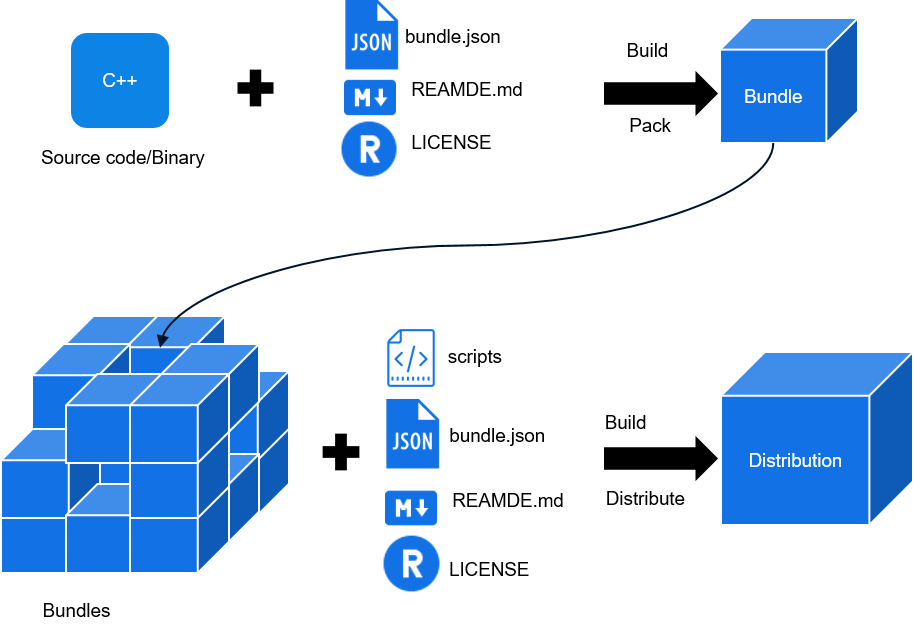

.. _overview-0:

Overview
========

This document describes how to develop OpenHarmony bundles and
distributions, and how to create, develop, and build code, as well as
burn and debug devices by using a command line tool.

-  A bundle usually maps onto a code repository, which is a code archive
   with the **bundle.json**, **README**, and **LICENSE** files.
-  A distribution consists of multiple bundles. Each distribution
   integrates various bundles of a comprehensive system, such as the
   driver, kernel, framework, and applications. These bundles can be
   used for device burning.

**Table 1** Differences between a bundle and a distribution

.. raw:: html

   <table>

.. raw:: html

   <thead align="left">

.. raw:: html

   <tr id="row17288183614415">

.. raw:: html

   <th class="cellrowborder" valign="top" width="16.24162416241624%" id="mcps1.2.4.1.1">

.. raw:: html

   

Aspect

.. raw:: html

   

.. raw:: html

   </th>

.. raw:: html

   <th class="cellrowborder" valign="top" width="33.31333133313331%" id="mcps1.2.4.1.2">

.. raw:: html

   

Bundle

.. raw:: html

   

.. raw:: html

   </th>

.. raw:: html

   <th class="cellrowborder" valign="top" width="50.44504450445044%" id="mcps1.2.4.1.3">

.. raw:: html

   

Distribution

.. raw:: html

   

.. raw:: html

   </th>

.. raw:: html

   </tr>

.. raw:: html

   </thead>

.. raw:: html

   <tbody>

.. raw:: html

   <tr id="row1728813361848">

.. raw:: html

   <td class="cellrowborder" valign="top" width="16.24162416241624%" headers="mcps1.2.4.1.1 ">

.. raw:: html

   

Application scenario

.. raw:: html

   

.. raw:: html

   </td>

.. raw:: html

   <td class="cellrowborder" valign="top" width="33.31333133313331%" headers="mcps1.2.4.1.2 ">

.. raw:: html

   

Feature-oriented

.. raw:: html

   

.. raw:: html

   </td>

.. raw:: html

   <td class="cellrowborder" valign="top" width="50.44504450445044%" headers="mcps1.2.4.1.3 ">

.. raw:: html

   

System-oriented

.. raw:: html

   

.. raw:: html

   </td>

.. raw:: html

   </tr>

.. raw:: html

   <tr id="row676745614472">

.. raw:: html

   <td class="cellrowborder" valign="top" width="16.24162416241624%" headers="mcps1.2.4.1.1 ">

.. raw:: html

   

Content

.. raw:: html

   

.. raw:: html

   </td>

.. raw:: html

   <td class="cellrowborder" valign="top" width="33.31333133313331%" headers="mcps1.2.4.1.2 ">

.. raw:: html

   

Codes or a binary library for implementing features

.. raw:: html

   

.. raw:: html

   </td>

.. raw:: html

   <td class="cellrowborder" valign="top" width="50.44504450445044%" headers="mcps1.2.4.1.3 ">

.. raw:: html

   

List of dependent bundles as well as their compiling and building
scripts

.. raw:: html

   

.. raw:: html

   </td>

.. raw:: html

   </tr>

.. raw:: html

   <tr id="row95114356">

.. raw:: html

   <td class="cellrowborder" valign="top" width="16.24162416241624%" headers="mcps1.2.4.1.1 ">

.. raw:: html

   

Integrity

.. raw:: html

   

.. raw:: html

   </td>

.. raw:: html

   <td class="cellrowborder" valign="top" width="33.31333133313331%" headers="mcps1.2.4.1.2 ">

.. raw:: html

   

A part of the operating system

.. raw:: html

   

.. raw:: html

   </td>

.. raw:: html

   <td class="cellrowborder" valign="top" width="50.44504450445044%" headers="mcps1.2.4.1.3 ">

.. raw:: html

   

An entire operating system

.. raw:: html

   

.. raw:: html

   </td>

.. raw:: html

   </tr>

.. raw:: html

   <tr id="row13581419518">

.. raw:: html

   <td class="cellrowborder" valign="top" width="16.24162416241624%" headers="mcps1.2.4.1.1 ">

.. raw:: html

   

Compilation result

.. raw:: html

   

.. raw:: html

   </td>

.. raw:: html

   <td class="cellrowborder" valign="top" width="33.31333133313331%" headers="mcps1.2.4.1.2 ">

.. raw:: html

   

Bundles

.. raw:: html

   

.. raw:: html

   </td>

.. raw:: html

   <td class="cellrowborder" valign="top" width="50.44504450445044%" headers="mcps1.2.4.1.3 ">

.. raw:: html

   

System image

.. raw:: html

   

.. raw:: html

   </td>

.. raw:: html

   </tr>

.. raw:: html

   </tbody>

.. raw:: html

   </table>

**Figure 1** Composition of bundles and distributions

|image1|

