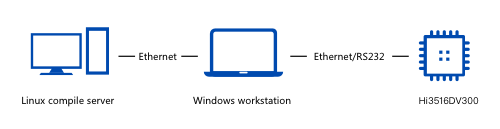

.. _prepare:

Preparations
============

Hardware Requirements
---------------------

-  Development boards (examples: Hi3861, Hi3516DV300, and Hi3518EV300)
-  Host computer (Windows workstation)
-  Linux server

| **Figure 1** Hardware connections
| |image1|

Installing **Node.js** and the **hpm-cli** Tool
-----------------------------------------------

1. Install **Node.js**.

   Download **Node.js** from its official website and install it on your
   local PC.

   You are advised to install `Node.js <https://nodejs.org/>`__ 12.x
   (including npm 6.14.4) or a later version (12.13.0 or later is
   recommended).

2. Install the **hpm-cli** tool using **npm** delivered with
   **Node.js**.

   Start **cmd.exe** to run the following command:

   ::

      npm install -g @ohos/hpm-cli

3. Run the following command to check whether the installation is
   successful. If an HPM version is displayed, the installation is
   successful.

   ::

      hpm -V or hpm --version

4. (Optional) Run the following command to upgrade the HPM version if
   needed:

   ::

      npm update -g @ohos/hpm-cli

(Optional) Modifying HPM Configurations
---------------------------------------

After the **hpm-cli** tool is installed, run the following command to
view HPM configurations:

::

   hpm config

Default HPM configurations are displayed upon the command execution. You
can modify the default configurations as required. The following lists
common HPM configurations:

::

   registry = https://hpm.harmonyos.com/hpm/registry/api              # Configure the address of the HPM registry, mandatory for downloading bundles.
   login = https://hpm.harmonyos.com/hpm/auth/pk                      # Configure the address for HPM login, mandatory for publishing bundles.
   loginUser = {your-account}                                         # Configure the account for HPM login, mandatory for publishing bundles.
   shellPath = C:\WINDOWS\System32\cmd.exe                            # Configure the shell for running HPM commands.
   globalRepo = C:\Users\yourname\.global                             # Configure the path for storing bundles that are installed globally.
   http_proxy = http://your-proxy-server:port                         # Configure the HTTP proxy.
   https_proxy = http://your-proxy-server:port                        # Configure the HTTPS proxy.

For details about **hpm-cli** commands, see `HPM
Commands <bundle-management.rst#table10510164515371>`__.

Downloading OpenHarmony Code
----------------------------

For details, see .

Installing Dependent Bundles
----------------------------

The HPM publishes commonly used development tools (such as those for
burning, compiling, and compression) as bundles. You can run the
following command to install these tools. After the command is executed,
the system automatically downloads and installs the tools, which need to
be installed globally only once.

::

   hpm i -g @ohos/llvm
   hpm i -g @ohos/ninja
   hpm i -g @ohos/gn
   hpm i -g @ohos/hc_gen
   hpm i -g @ohos/sysroot

These are a set of development tools (such as **gn** and **ninja**).
With these tools, you can start your general bundle development based on
source code.

