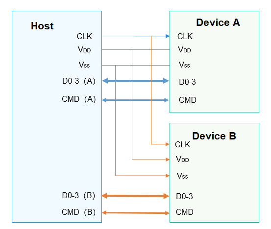

SDIO Overview
=============

Introduction
------------

-  Secure Digital Input/Output (SDIO) is a peripheral interface evolved
   from the Secure Digital (SD) memory card interface. The SDIO
   interface is compatible with SD memory cards and can be connected to
   devices that support the SDIO interface.

-  SDIO is widely used. Currently, many smartphones support SDIO, and
   many SDIO peripherals are developed for connections to smartphones.
   Common SDIO peripherals include WLAN, GPS, cameras, and Bluetooth.

-  The SDIO bus has two ends, named host and device. All communication
   starts when the host sends a command. The device can communicate with
   the host as long as it can parse the command of the host. An SDIO
   host can connect to multiple devices, as shown in the figure below.

   1. CLK signal: clock signal sent from the host to the device
   2. VDD signal: power signal
   3. VSS signal: ground signal
   4. D0-3 signal: four data lines. The DAT1 signal cable is multiplexed
      as the interrupt line. In 1-bit mode, DAT0 is used to transmit
      data. In 4-bit mode, DAT0 to DAT3 are used to transmit data.
   5. CMD signal: used by the host to send commands and the device to
      respond to commands.

   **Figure 1** Connections between the host and devices in SDIO

   |image1|

-  The SDIO interface defines a set of common methods for operating an
   SDIO device, including opening and closing an SDIO controller,
   exclusively claiming and releasing the host, enabling and disabling
   devices, claiming and releasing an SDIO IRQ, reading and writing data
   based on SDIO, and obtaining and setting common information.

Available APIs
--------------

**Table 1** APIs available for the SDIO driver

.. raw:: html

   <table>

.. raw:: html

   <thead align="left">

.. raw:: html

   <tr id="row1625342317507">

.. raw:: html

   <th class="cellrowborder" valign="top" width="21.07%" id="mcps1.2.4.1.1">

.. raw:: html

   

Capability

.. raw:: html

   

.. raw:: html

   </th>

.. raw:: html

   <th class="cellrowborder" valign="top" width="34.04%" id="mcps1.2.4.1.2">

.. raw:: html

   

Function

.. raw:: html

   

.. raw:: html

   </th>

.. raw:: html

   <th class="cellrowborder" valign="top" width="44.89%" id="mcps1.2.4.1.3">

.. raw:: html

   

Description

.. raw:: html

   

.. raw:: html

   </th>

.. raw:: html

   </tr>

.. raw:: html

   </thead>

.. raw:: html

   <tbody>

.. raw:: html

   <tr id="row1351945135614">

.. raw:: html

   <td class="cellrowborder" rowspan="2" valign="top" width="21.07%" headers="mcps1.2.4.1.1 ">

.. raw:: html

   

SDIO device opening/closing

.. raw:: html

   

.. raw:: html

   </td>

.. raw:: html

   <td class="cellrowborder" valign="top" width="34.04%" headers="mcps1.2.4.1.2 ">

.. raw:: html

   

SdioOpen

.. raw:: html

   

.. raw:: html

   </td>

.. raw:: html

   <td class="cellrowborder" valign="top" width="44.89%" headers="mcps1.2.4.1.3 ">

.. raw:: html

   

Opens an SDIO controller with a specified bus number.

.. raw:: html

   

.. raw:: html

   </td>

.. raw:: html

   </tr>

.. raw:: html

   <tr id="row1062610995616">

.. raw:: html

   <td class="cellrowborder" valign="top" headers="mcps1.2.4.1.1 ">

.. raw:: html

   

SdioClose

.. raw:: html

   

.. raw:: html

   </td>

.. raw:: html

   <td class="cellrowborder" valign="top" headers="mcps1.2.4.1.2 ">

.. raw:: html

   

Closes an SDIO controller.

.. raw:: html

   

.. raw:: html

   </td>

.. raw:: html

   </tr>

.. raw:: html

   <tr id="row337105133315">

.. raw:: html

   <td class="cellrowborder" rowspan="6" valign="top" width="21.07%" headers="mcps1.2.4.1.1 ">

.. raw:: html

   

SDIO reading/writing

.. raw:: html

   

.. raw:: html

   </td>

.. raw:: html

   <td class="cellrowborder" valign="top" width="34.04%" headers="mcps1.2.4.1.2 ">

.. raw:: html

   

SdioReadBytes

.. raw:: html

   

.. raw:: html

   </td>

.. raw:: html

   <td class="cellrowborder" valign="top" width="44.89%" headers="mcps1.2.4.1.3 ">

.. raw:: html

   

Incrementally reads a given length of data from a specified SDIO
address.

.. raw:: html

   

.. raw:: html

   </td>

.. raw:: html

   </tr>

.. raw:: html

   <tr id="row9317134301618">

.. raw:: html

   <td class="cellrowborder" valign="top" headers="mcps1.2.4.1.1 ">

.. raw:: html

   

SdioWriteBytes

.. raw:: html

   

.. raw:: html

   </td>

.. raw:: html

   <td class="cellrowborder" valign="top" headers="mcps1.2.4.1.2 ">

.. raw:: html

   

Incrementally writes a given length of data into a specified SDIO
address.

.. raw:: html

   

.. raw:: html

   </td>

.. raw:: html

   </tr>

.. raw:: html

   <tr id="row131301734171616">

.. raw:: html

   <td class="cellrowborder" valign="top" headers="mcps1.2.4.1.1 ">

.. raw:: html

   

SdioReadBytesFromFixedAddr

.. raw:: html

   

.. raw:: html

   </td>

.. raw:: html

   <td class="cellrowborder" valign="top" headers="mcps1.2.4.1.2 ">

.. raw:: html

   

Reads a given length of data from a fixed SDIO address.

.. raw:: html

   

.. raw:: html

   </td>

.. raw:: html

   </tr>

.. raw:: html

   <tr id="row1434434011147">

.. raw:: html

   <td class="cellrowborder" valign="top" headers="mcps1.2.4.1.1 ">

.. raw:: html

   

SdioWriteBytesToFixedAddr

.. raw:: html

   

.. raw:: html

   </td>

.. raw:: html

   <td class="cellrowborder" valign="top" headers="mcps1.2.4.1.2 ">

.. raw:: html

   

Writes a given length of data into a fixed SDIO address.

.. raw:: html

   

.. raw:: html

   </td>

.. raw:: html

   </tr>

.. raw:: html

   <tr id="row364393591410">

.. raw:: html

   <td class="cellrowborder" valign="top" headers="mcps1.2.4.1.1 ">

.. raw:: html

   

SdioReadBytesFromFunc0

.. raw:: html

   

.. raw:: html

   </td>

.. raw:: html

   <td class="cellrowborder" valign="top" headers="mcps1.2.4.1.2 ">

.. raw:: html

   

Reads a given length of data from the address space of SDIO function 0.

.. raw:: html

   

.. raw:: html

   </td>

.. raw:: html

   </tr>

.. raw:: html

   <tr id="row17455333175">

.. raw:: html

   <td class="cellrowborder" valign="top" headers="mcps1.2.4.1.1 ">

.. raw:: html

   

SdioWriteBytesToFunc0

.. raw:: html

   

.. raw:: html

   </td>

.. raw:: html

   <td class="cellrowborder" valign="top" headers="mcps1.2.4.1.2 ">

.. raw:: html

   

Writes a given length of data into the address space of SDIO function 0.

.. raw:: html

   

.. raw:: html

   </td>

.. raw:: html

   </tr>

.. raw:: html

   <tr id="row34145016535">

.. raw:: html

   <td class="cellrowborder" valign="top" width="21.07%" headers="mcps1.2.4.1.1 ">

.. raw:: html

   

SDIO block size setting

.. raw:: html

   

.. raw:: html

   </td>

.. raw:: html

   <td class="cellrowborder" valign="top" width="34.04%" headers="mcps1.2.4.1.2 ">

.. raw:: html

   

SdioSetBlockSize

.. raw:: html

   

.. raw:: html

   </td>

.. raw:: html

   <td class="cellrowborder" valign="top" width="44.89%" headers="mcps1.2.4.1.3 ">

.. raw:: html

   

Sets the block size.

.. raw:: html

   

.. raw:: html

   </td>

.. raw:: html

   </tr>

.. raw:: html

   <tr id="row778816813238">

.. raw:: html

   <td class="cellrowborder" rowspan="2" valign="top" width="21.07%" headers="mcps1.2.4.1.1 ">

.. raw:: html

   

SDIO common information retrieval/setting

.. raw:: html

   

.. raw:: html

   </td>

.. raw:: html

   <td class="cellrowborder" valign="top" width="34.04%" headers="mcps1.2.4.1.2 ">

.. raw:: html

   

SdioGetCommonInfo

.. raw:: html

   

.. raw:: html

   </td>

.. raw:: html

   <td class="cellrowborder" valign="top" width="44.89%" headers="mcps1.2.4.1.3 ">

.. raw:: html

   

Obtains common information.

.. raw:: html

   

.. raw:: html

   </td>

.. raw:: html

   </tr>

.. raw:: html

   <tr id="row5667102342417">

.. raw:: html

   <td class="cellrowborder" valign="top" headers="mcps1.2.4.1.1 ">

.. raw:: html

   

SdioSetCommonInfo

.. raw:: html

   

.. raw:: html

   </td>

.. raw:: html

   <td class="cellrowborder" valign="top" headers="mcps1.2.4.1.2 ">

.. raw:: html

   

Sets common information.

.. raw:: html

   

.. raw:: html

   </td>

.. raw:: html

   </tr>

.. raw:: html

   <tr id="row1165101111256">

.. raw:: html

   <td class="cellrowborder" valign="top" width="21.07%" headers="mcps1.2.4.1.1 ">

.. raw:: html

   

SDIO data flushing

.. raw:: html

   

.. raw:: html

   </td>

.. raw:: html

   <td class="cellrowborder" valign="top" width="34.04%" headers="mcps1.2.4.1.2 ">

.. raw:: html

   

SdioFlushData

.. raw:: html

   

.. raw:: html

   </td>

.. raw:: html

   <td class="cellrowborder" valign="top" width="44.89%" headers="mcps1.2.4.1.3 ">

.. raw:: html

   

Flushes data.

.. raw:: html

   

.. raw:: html

   </td>

.. raw:: html

   </tr>

.. raw:: html

   <tr id="row17388101522515">

.. raw:: html

   <td class="cellrowborder" rowspan="2" valign="top" width="21.07%" headers="mcps1.2.4.1.1 ">

.. raw:: html

   

SDIO host exclusively claiming or releasing

.. raw:: html

   

.. raw:: html

   </td>

.. raw:: html

   <td class="cellrowborder" valign="top" width="34.04%" headers="mcps1.2.4.1.2 ">

.. raw:: html

   

SdioClaimHost

.. raw:: html

   

.. raw:: html

   </td>

.. raw:: html

   <td class="cellrowborder" valign="top" width="44.89%" headers="mcps1.2.4.1.3 ">

.. raw:: html

   

Claims a host exclusively.

.. raw:: html

   

.. raw:: html

   </td>

.. raw:: html

   </tr>

.. raw:: html

   <tr id="row5352175517251">

.. raw:: html

   <td class="cellrowborder" valign="top" headers="mcps1.2.4.1.1 ">

.. raw:: html

   

SdioReleaseHost

.. raw:: html

   

.. raw:: html

   </td>

.. raw:: html

   <td class="cellrowborder" valign="top" headers="mcps1.2.4.1.2 ">

.. raw:: html

   

Releases the exclusively claimed host.

.. raw:: html

   

.. raw:: html

   </td>

.. raw:: html

   </tr>

.. raw:: html

   <tr id="row8759125415269">

.. raw:: html

   <td class="cellrowborder" rowspan="2" valign="top" width="21.07%" headers="mcps1.2.4.1.1 ">

.. raw:: html

   

SDIO device enablement

.. raw:: html

   

.. raw:: html

   </td>

.. raw:: html

   <td class="cellrowborder" valign="top" width="34.04%" headers="mcps1.2.4.1.2 ">

.. raw:: html

   

SdioEnableFunc

.. raw:: html

   

.. raw:: html

   </td>

.. raw:: html

   <td class="cellrowborder" valign="top" width="44.89%" headers="mcps1.2.4.1.3 ">

.. raw:: html

   

Enables an SDIO device.

.. raw:: html

   

.. raw:: html

   </td>

.. raw:: html

   </tr>

.. raw:: html

   <tr id="row1166105762620">

.. raw:: html

   <td class="cellrowborder" valign="top" headers="mcps1.2.4.1.1 ">

.. raw:: html

   

SdioDisableFunc

.. raw:: html

   

.. raw:: html

   </td>

.. raw:: html

   <td class="cellrowborder" valign="top" headers="mcps1.2.4.1.2 ">

.. raw:: html

   

Disables an SDIO device.

.. raw:: html

   

.. raw:: html

   </td>

.. raw:: html

   </tr>

.. raw:: html

   <tr id="row12332331113517">

.. raw:: html

   <td class="cellrowborder" rowspan="2" valign="top" width="21.07%" headers="mcps1.2.4.1.1 ">

.. raw:: html

   

SDIO IRQ claiming/releasing

.. raw:: html

   

.. raw:: html

   </td>

.. raw:: html

   <td class="cellrowborder" valign="top" width="34.04%" headers="mcps1.2.4.1.2 ">

.. raw:: html

   

SdioClaimIrq

.. raw:: html

   

.. raw:: html

   </td>

.. raw:: html

   <td class="cellrowborder" valign="top" width="44.89%" headers="mcps1.2.4.1.3 ">

.. raw:: html

   

Claims an SDIO IRQ.

.. raw:: html

   

.. raw:: html

   </td>

.. raw:: html

   </tr>

.. raw:: html

   <tr id="row173103413357">

.. raw:: html

   <td class="cellrowborder" valign="top" headers="mcps1.2.4.1.1 ">

.. raw:: html

   

SdioReleaseIrq

.. raw:: html

   

.. raw:: html

   </td>

.. raw:: html

   <td class="cellrowborder" valign="top" headers="mcps1.2.4.1.2 ">

.. raw:: html

   

Releases an SDIO IRQ.

.. raw:: html

   

.. raw:: html

   </td>

.. raw:: html

   </tr>

.. raw:: html

   </tbody>

.. raw:: html

   </table>

..

   |image2| **NOTE:** All functions provided in this document can be
   called only in kernel mode.

.. |image2| image:: public_sys-resources/icon-note.gif
