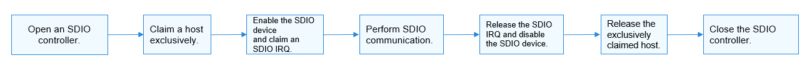

SDIO Usage Guidelines
=====================

How to Use
----------

`Figure 1 <spiusage-guidelines.rst#fig23885455594>`__ illustrates the
process of using an SDIO.

**Figure 1** Process of using an SDIO

|image1|

Opening an SDIO Controller
--------------------------

Before performing SDIO communication, obtain the device handle of an
SDIO controller by calling **SdioOpen**. This function returns the
device handle of the SDIO controller with a specified bus number.

struct DevHandle \*SdioOpen(int16_t busNum);

**Table 1** Parameters and return values of SdioOpen

.. raw:: html

   <table>

.. raw:: html

   <thead align="left">

.. raw:: html

   <tr id="row1011212598452">

.. raw:: html

   <th class="cellrowborder" valign="top" width="50%" id="mcps1.2.3.1.1">

.. raw:: html

   

Parameter

.. raw:: html

   

.. raw:: html

   </th>

.. raw:: html

   <th class="cellrowborder" valign="top" width="50%" id="mcps1.2.3.1.2">

.. raw:: html

   

Description

.. raw:: html

   

.. raw:: html

   </th>

.. raw:: html

   </tr>

.. raw:: html

   </thead>

.. raw:: html

   <tbody>

.. raw:: html

   <tr id="row19112195918454">

.. raw:: html

   <td class="cellrowborder" valign="top" width="50%" headers="mcps1.2.3.1.1 ">

.. raw:: html

   

busNum

.. raw:: html

   

.. raw:: html

   </td>

.. raw:: html

   <td class="cellrowborder" valign="top" width="50%" headers="mcps1.2.3.1.2 ">

.. raw:: html

   

SDIO bus number.

.. raw:: html

   

.. raw:: html

   </td>

.. raw:: html

   </tr>

.. raw:: html

   <tr id="row6112659184518">

.. raw:: html

   <td class="cellrowborder" valign="top" width="50%" headers="mcps1.2.3.1.1 ">

.. raw:: html

   

Return Value

.. raw:: html

   

.. raw:: html

   </td>

.. raw:: html

   <td class="cellrowborder" valign="top" width="50%" headers="mcps1.2.3.1.2 ">

.. raw:: html

   

Description

.. raw:: html

   

.. raw:: html

   </td>

.. raw:: html

   </tr>

.. raw:: html

   <tr id="row3113559164519">

.. raw:: html

   <td class="cellrowborder" valign="top" width="50%" headers="mcps1.2.3.1.1 ">

.. raw:: html

   

NULL

.. raw:: html

   

.. raw:: html

   </td>

.. raw:: html

   <td class="cellrowborder" valign="top" width="50%" headers="mcps1.2.3.1.2 ">

.. raw:: html

   

Failed to obtain the device handle of an SDIO controller.

.. raw:: html

   

.. raw:: html

   </td>

.. raw:: html

   </tr>

.. raw:: html

   <tr id="row201131059194512">

.. raw:: html

   <td class="cellrowborder" valign="top" width="50%" headers="mcps1.2.3.1.1 ">

.. raw:: html

   

Device handle

.. raw:: html

   

.. raw:: html

   </td>

.. raw:: html

   <td class="cellrowborder" valign="top" width="50%" headers="mcps1.2.3.1.2 ">

.. raw:: html

   

Device handle of an SDIO controller.

.. raw:: html

   

.. raw:: html

   </td>

.. raw:: html

   </tr>

.. raw:: html

   </tbody>

.. raw:: html

   </table>

The following example shows how to open an SDIO controller.

::

   struct DevHandle *handle = NULL;
   int16_t busNum = 1;
   /* Open an SDIO controller whose bus number is 1. */
   handle = SdioOpen(busNum);
   if (handle == NULL) {
       HDF_LOGE("SdioOpen: failed!\n");
   }

Claiming a Host Exclusively
---------------------------

After obtaining the device handle of an SDIO controller, exclusively
claim the host before performing subsequent operations on the SDIO
device.

void SdioClaimHost(struct DevHandle \*handle);

**Table 2** Parameter description of SdioClaimHost

.. raw:: html

   <table>

.. raw:: html

   <thead align="left">

.. raw:: html

   <tr id="row1211325914459">

.. raw:: html

   <th class="cellrowborder" valign="top" width="50%" id="mcps1.2.3.1.1">

.. raw:: html

   

Parameter

.. raw:: html

   

.. raw:: html

   </th>

.. raw:: html

   <th class="cellrowborder" valign="top" width="50%" id="mcps1.2.3.1.2">

.. raw:: html

   

Description

.. raw:: html

   

.. raw:: html

   </th>

.. raw:: html

   </tr>

.. raw:: html

   </thead>

.. raw:: html

   <tbody>

.. raw:: html

   <tr id="row3114205920451">

.. raw:: html

   <td class="cellrowborder" valign="top" width="50%" headers="mcps1.2.3.1.1 ">

.. raw:: html

   

handle

.. raw:: html

   

.. raw:: html

   </td>

.. raw:: html

   <td class="cellrowborder" valign="top" width="50%" headers="mcps1.2.3.1.2 ">

.. raw:: html

   

Device handle of an SDIO controller

.. raw:: html

   

.. raw:: html

   </td>

.. raw:: html

   </tr>

.. raw:: html

   </tbody>

.. raw:: html

   </table>

The following example shows how to exclusively claim a host.

::

   SdioClaimHost(handle); /* Claim a host exclusively. */

Enabling the SDIO Device
------------------------

Before accessing a register, enable the SDIO device.

int32_t SdioEnableFunc(struct DevHandle \*handle);

**Table 3** Parameters and return values of SdioEnableFunc

.. raw:: html

   <table>

.. raw:: html

   <thead align="left">

.. raw:: html

   <tr id="row8487204184815">

.. raw:: html

   <th class="cellrowborder" valign="top" width="50%" id="mcps1.2.3.1.1">

.. raw:: html

   

Parameter

.. raw:: html

   

.. raw:: html

   </th>

.. raw:: html

   <th class="cellrowborder" valign="top" width="50%" id="mcps1.2.3.1.2">

.. raw:: html

   

Description

.. raw:: html

   

.. raw:: html

   </th>

.. raw:: html

   </tr>

.. raw:: html

   </thead>

.. raw:: html

   <tbody>

.. raw:: html

   <tr id="row16487044480">

.. raw:: html

   <td class="cellrowborder" valign="top" width="50%" headers="mcps1.2.3.1.1 ">

.. raw:: html

   

handle

.. raw:: html

   

.. raw:: html

   </td>

.. raw:: html

   <td class="cellrowborder" valign="top" width="50%" headers="mcps1.2.3.1.2 ">

.. raw:: html

   

Device handle of an SDIO controller.

.. raw:: html

   

.. raw:: html

   </td>

.. raw:: html

   </tr>

.. raw:: html

   <tr id="row13487748487">

.. raw:: html

   <td class="cellrowborder" valign="top" width="50%" headers="mcps1.2.3.1.1 ">

.. raw:: html

   

Return Value

.. raw:: html

   

.. raw:: html

   </td>

.. raw:: html

   <td class="cellrowborder" valign="top" width="50%" headers="mcps1.2.3.1.2 ">

.. raw:: html

   

Description

.. raw:: html

   

.. raw:: html

   </td>

.. raw:: html

   </tr>

.. raw:: html

   <tr id="row1748814494812">

.. raw:: html

   <td class="cellrowborder" valign="top" width="50%" headers="mcps1.2.3.1.1 ">

.. raw:: html

   

0

.. raw:: html

   

.. raw:: html

   </td>

.. raw:: html

   <td class="cellrowborder" valign="top" width="50%" headers="mcps1.2.3.1.2 ">

.. raw:: html

   

The SDIO device is enabled.

.. raw:: html

   

.. raw:: html

   </td>

.. raw:: html

   </tr>

.. raw:: html

   <tr id="row54881416482">

.. raw:: html

   <td class="cellrowborder" valign="top" width="50%" headers="mcps1.2.3.1.1 ">

.. raw:: html

   

Negative value

.. raw:: html

   

.. raw:: html

   </td>

.. raw:: html

   <td class="cellrowborder" valign="top" width="50%" headers="mcps1.2.3.1.2 ">

.. raw:: html

   

Failed to enable the SDIO device.

.. raw:: html

   

.. raw:: html

   </td>

.. raw:: html

   </tr>

.. raw:: html

   </tbody>

.. raw:: html

   </table>

The following example shows how to enable the SDIO device.

::

   int32_t ret;
   /* Enable the SDIO device. */
   ret = SdioEnableFunc(handle);
   if (ret != 0) {
       HDF_LOGE("SdioEnableFunc: failed, ret %d\n", ret);
   }

Claiming an SDIO IRQ
--------------------

Before SDIO communication, claim an SDIO IRQ.

int32_t SdioClaimIrq(struct DevHandle \*handle, SdioIrqHandler
\*handler);

**Table 4** Parameters and return values of SdioClaimIrq

.. raw:: html

   <table>

.. raw:: html

   <thead align="left">

.. raw:: html

   <tr id="row114891042488">

.. raw:: html

   <th class="cellrowborder" valign="top" width="49.980000000000004%" id="mcps1.2.3.1.1">

.. raw:: html

   

Parameter

.. raw:: html

   

.. raw:: html

   </th>

.. raw:: html

   <th class="cellrowborder" valign="top" width="50.019999999999996%" id="mcps1.2.3.1.2">

.. raw:: html

   

Description

.. raw:: html

   

.. raw:: html

   </th>

.. raw:: html

   </tr>

.. raw:: html

   </thead>

.. raw:: html

   <tbody>

.. raw:: html

   <tr id="row048911404820">

.. raw:: html

   <td class="cellrowborder" valign="top" width="49.980000000000004%" headers="mcps1.2.3.1.1 ">

.. raw:: html

   

handle

.. raw:: html

   

.. raw:: html

   </td>

.. raw:: html

   <td class="cellrowborder" valign="top" width="50.019999999999996%" headers="mcps1.2.3.1.2 ">

.. raw:: html

   

Device handle of an SDIO controller.

.. raw:: html

   

.. raw:: html

   </td>

.. raw:: html

   </tr>

.. raw:: html

   <tr id="row204894454813">

.. raw:: html

   <td class="cellrowborder" valign="top" width="49.980000000000004%" headers="mcps1.2.3.1.1 ">

.. raw:: html

   

handler

.. raw:: html

   

.. raw:: html

   </td>

.. raw:: html

   <td class="cellrowborder" valign="top" width="50.019999999999996%" headers="mcps1.2.3.1.2 ">

.. raw:: html

   

Pointer to the SDIO IRQ function.

.. raw:: html

   

.. raw:: html

   </td>

.. raw:: html

   </tr>

.. raw:: html

   <tr id="row44898413488">

.. raw:: html

   <td class="cellrowborder" valign="top" width="49.980000000000004%" headers="mcps1.2.3.1.1 ">

.. raw:: html

   

Return Value

.. raw:: html

   

.. raw:: html

   </td>

.. raw:: html

   <td class="cellrowborder" valign="top" width="50.019999999999996%" headers="mcps1.2.3.1.2 ">

.. raw:: html

   

Description

.. raw:: html

   

.. raw:: html

   </td>

.. raw:: html

   </tr>

.. raw:: html

   <tr id="row748994144811">

.. raw:: html

   <td class="cellrowborder" valign="top" width="49.980000000000004%" headers="mcps1.2.3.1.1 ">

.. raw:: html

   

0

.. raw:: html

   

.. raw:: html

   </td>

.. raw:: html

   <td class="cellrowborder" valign="top" width="50.019999999999996%" headers="mcps1.2.3.1.2 ">

.. raw:: html

   

The SDIO IRQ is claimed.

.. raw:: html

   

.. raw:: html

   </td>

.. raw:: html

   </tr>

.. raw:: html

   <tr id="row448914420489">

.. raw:: html

   <td class="cellrowborder" valign="top" width="49.980000000000004%" headers="mcps1.2.3.1.1 ">

.. raw:: html

   

Negative value

.. raw:: html

   

.. raw:: html

   </td>

.. raw:: html

   <td class="cellrowborder" valign="top" width="50.019999999999996%" headers="mcps1.2.3.1.2 ">

.. raw:: html

   

Failed to claim an SDIO IRQ.

.. raw:: html

   

.. raw:: html

   </td>

.. raw:: html

   </tr>

.. raw:: html

   </tbody>

.. raw:: html

   </table>

The following example shows how to claim an SDIO IRQ.

::

   /* Implement the SDIO IRQ function based on the application. */
   static void SdioIrqFunc(void *data)
   {
       if (data == NULL) {
           HDF_LOGE("SdioIrqFunc: data is NULL.\n");
           return;
       }
       /* You need to add specific implementations. */
   }

   int32_t ret;
   /* Claim an SDIO IRQ. */
   ret = SdioClaimIrq(handle, SdioIrqFunc);
   if (ret != 0) {
       HDF_LOGE("SdioClaimIrq: failed, ret %d\n", ret);
   }

Performing SDIO Communication
-----------------------------

-  Incrementally write a given length of data into the SDIO device.

The corresponding function is as follows:

int32_t SdioWriteBytes(struct DevHandle \*handle, uint8_t \*data,
uint32_t addr, uint32_t size, uint32_t timeOut);

**Table 5** Parameters and return values of SdioWriteBytes

.. raw:: html

   <table>

.. raw:: html

   <thead align="left">

.. raw:: html

   <tr id="row10887144111419">

.. raw:: html

   <th class="cellrowborder" valign="top" width="50%" id="mcps1.2.3.1.1">

.. raw:: html

   

Parameter

.. raw:: html

   

.. raw:: html

   </th>

.. raw:: html

   <th class="cellrowborder" valign="top" width="50%" id="mcps1.2.3.1.2">

.. raw:: html

   

Description

.. raw:: html

   

.. raw:: html

   </th>

.. raw:: html

   </tr>

.. raw:: html

   </thead>

.. raw:: html

   <tbody>

.. raw:: html

   <tr id="row4887341174114">

.. raw:: html

   <td class="cellrowborder" valign="top" width="50%" headers="mcps1.2.3.1.1 ">

.. raw:: html

   

handle

.. raw:: html

   

.. raw:: html

   </td>

.. raw:: html

   <td class="cellrowborder" valign="top" width="50%" headers="mcps1.2.3.1.2 ">

.. raw:: html

   

Device handle of an SDIO controller.

.. raw:: html

   

.. raw:: html

   </td>

.. raw:: html

   </tr>

.. raw:: html

   <tr id="row18881041144120">

.. raw:: html

   <td class="cellrowborder" valign="top" width="50%" headers="mcps1.2.3.1.1 ">

.. raw:: html

   

data

.. raw:: html

   

.. raw:: html

   </td>

.. raw:: html

   <td class="cellrowborder" valign="top" width="50%" headers="mcps1.2.3.1.2 ">

.. raw:: html

   

Pointer to the data to write.

.. raw:: html

   

.. raw:: html

   </td>

.. raw:: html

   </tr>

.. raw:: html

   <tr id="row191054911432">

.. raw:: html

   <td class="cellrowborder" valign="top" width="50%" headers="mcps1.2.3.1.1 ">

.. raw:: html

   

addr

.. raw:: html

   

.. raw:: html

   </td>

.. raw:: html

   <td class="cellrowborder" valign="top" width="50%" headers="mcps1.2.3.1.2 ">

.. raw:: html

   

Start address where the data is written into.

.. raw:: html

   

.. raw:: html

   </td>

.. raw:: html

   </tr>

.. raw:: html

   <tr id="row14888144124119">

.. raw:: html

   <td class="cellrowborder" valign="top" width="50%" headers="mcps1.2.3.1.1 ">

.. raw:: html

   

size

.. raw:: html

   

.. raw:: html

   </td>

.. raw:: html

   <td class="cellrowborder" valign="top" width="50%" headers="mcps1.2.3.1.2 ">

.. raw:: html

   

Length of the data to write.

.. raw:: html

   

.. raw:: html

   </td>

.. raw:: html

   </tr>

.. raw:: html

   <tr id="row188213710445">

.. raw:: html

   <td class="cellrowborder" valign="top" width="50%" headers="mcps1.2.3.1.1 ">

.. raw:: html

   

timeOut

.. raw:: html

   

.. raw:: html

   </td>

.. raw:: html

   <td class="cellrowborder" valign="top" width="50%" headers="mcps1.2.3.1.2 ">

.. raw:: html

   

Timeout duration for writing data, in milliseconds. If the value is 0,
the default value is used.

.. raw:: html

   

.. raw:: html

   </td>

.. raw:: html

   </tr>

.. raw:: html

   <tr id="row18247654163519">

.. raw:: html

   <td class="cellrowborder" valign="top" width="50%" headers="mcps1.2.3.1.1 ">

.. raw:: html

   

Return Value

.. raw:: html

   

.. raw:: html

   </td>

.. raw:: html

   <td class="cellrowborder" valign="top" width="50%" headers="mcps1.2.3.1.2 ">

.. raw:: html

   

Description

.. raw:: html

   

.. raw:: html

   </td>

.. raw:: html

   </tr>

.. raw:: html

   <tr id="row10574165663512">

.. raw:: html

   <td class="cellrowborder" valign="top" width="50%" headers="mcps1.2.3.1.1 ">

.. raw:: html

   

0

.. raw:: html

   

.. raw:: html

   </td>

.. raw:: html

   <td class="cellrowborder" valign="top" width="50%" headers="mcps1.2.3.1.2 ">

.. raw:: html

   

Data is written into the SDIO device.

.. raw:: html

   

.. raw:: html

   </td>

.. raw:: html

   </tr>

.. raw:: html

   <tr id="row1490635883519">

.. raw:: html

   <td class="cellrowborder" valign="top" width="50%" headers="mcps1.2.3.1.1 ">

.. raw:: html

   

Negative value

.. raw:: html

   

.. raw:: html

   </td>

.. raw:: html

   <td class="cellrowborder" valign="top" width="50%" headers="mcps1.2.3.1.2 ">

.. raw:: html

   

Failed to write data into the SDIO device.

.. raw:: html

   

.. raw:: html

   </td>

.. raw:: html

   </tr>

.. raw:: html

   </tbody>

.. raw:: html

   </table>

The following example shows how to incrementally write a given length of
data into the SDIO device.

::

   int32_t ret;
   uint8_t wbuff[] = {1,2,3,4,5};
   uint32_t addr = 0x100 + 0x09;
   /* Incrementally write 5-byte data into the start address 0x109 of the SDIO device. */
   ret = SdioWriteBytes(handle, wbuff, addr, sizeof(wbuff) / sizeof(wbuff[0]), 0);
   if (ret != 0) {
       HDF_LOGE("SdioWriteBytes: failed, ret %d\n", ret);
   }

-  Incrementally read a given length of data from the SDIO device.

The corresponding function is as follows:

int32_t SdioReadBytes(struct DevHandle \*handle, uint8_t \*data,
uint32_t addr, uint32_t size, uint32_t timeOut);

**Table 6** Parameters and return values of SdioReadBytes

.. raw:: html

   <table>

.. raw:: html

   <thead align="left">

.. raw:: html

   <tr id="row19783355162116">

.. raw:: html

   <th class="cellrowborder" valign="top" width="50%" id="mcps1.2.3.1.1">

.. raw:: html

   

Parameter

.. raw:: html

   

.. raw:: html

   </th>

.. raw:: html

   <th class="cellrowborder" valign="top" width="50%" id="mcps1.2.3.1.2">

.. raw:: html

   

Description

.. raw:: html

   

.. raw:: html

   </th>

.. raw:: html

   </tr>

.. raw:: html

   </thead>

.. raw:: html

   <tbody>

.. raw:: html

   <tr id="row137831055192118">

.. raw:: html

   <td class="cellrowborder" valign="top" width="50%" headers="mcps1.2.3.1.1 ">

.. raw:: html

   

handle

.. raw:: html

   

.. raw:: html

   </td>

.. raw:: html

   <td class="cellrowborder" valign="top" width="50%" headers="mcps1.2.3.1.2 ">

.. raw:: html

   

Device handle of an SDIO controller.

.. raw:: html

   

.. raw:: html

   </td>

.. raw:: html

   </tr>

.. raw:: html

   <tr id="row4784155102111">

.. raw:: html

   <td class="cellrowborder" valign="top" width="50%" headers="mcps1.2.3.1.1 ">

.. raw:: html

   

data

.. raw:: html

   

.. raw:: html

   </td>

.. raw:: html

   <td class="cellrowborder" valign="top" width="50%" headers="mcps1.2.3.1.2 ">

.. raw:: html

   

Pointer to the data to read.

.. raw:: html

   

.. raw:: html

   </td>

.. raw:: html

   </tr>

.. raw:: html

   <tr id="row63651118499">

.. raw:: html

   <td class="cellrowborder" valign="top" width="50%" headers="mcps1.2.3.1.1 ">

.. raw:: html

   

addr

.. raw:: html

   

.. raw:: html

   </td>

.. raw:: html

   <td class="cellrowborder" valign="top" width="50%" headers="mcps1.2.3.1.2 ">

.. raw:: html

   

Start address where the data is read from.

.. raw:: html

   

.. raw:: html

   </td>

.. raw:: html

   </tr>

.. raw:: html

   <tr id="row7784145510218">

.. raw:: html

   <td class="cellrowborder" valign="top" width="50%" headers="mcps1.2.3.1.1 ">

.. raw:: html

   

size

.. raw:: html

   

.. raw:: html

   </td>

.. raw:: html

   <td class="cellrowborder" valign="top" width="50%" headers="mcps1.2.3.1.2 ">

.. raw:: html

   

Length of the data to read.

.. raw:: html

   

.. raw:: html

   </td>

.. raw:: html

   </tr>

.. raw:: html

   <tr id="row1823311517494">

.. raw:: html

   <td class="cellrowborder" valign="top" width="50%" headers="mcps1.2.3.1.1 ">

.. raw:: html

   

timeOut

.. raw:: html

   

.. raw:: html

   </td>

.. raw:: html

   <td class="cellrowborder" valign="top" width="50%" headers="mcps1.2.3.1.2 ">

.. raw:: html

   

Timeout duration for reading data, in milliseconds. If the value is 0,
the default value is used.

.. raw:: html

   

.. raw:: html

   </td>

.. raw:: html

   </tr>

.. raw:: html

   <tr id="row964182643610">

.. raw:: html

   <td class="cellrowborder" valign="top" width="50%" headers="mcps1.2.3.1.1 ">

.. raw:: html

   

Return Value

.. raw:: html

   

.. raw:: html

   </td>

.. raw:: html

   <td class="cellrowborder" valign="top" width="50%" headers="mcps1.2.3.1.2 ">

.. raw:: html

   

Description

.. raw:: html

   

.. raw:: html

   </td>

.. raw:: html

   </tr>

.. raw:: html

   <tr id="row199479312363">

.. raw:: html

   <td class="cellrowborder" valign="top" width="50%" headers="mcps1.2.3.1.1 ">

.. raw:: html

   

0

.. raw:: html

   

.. raw:: html

   </td>

.. raw:: html

   <td class="cellrowborder" valign="top" width="50%" headers="mcps1.2.3.1.2 ">

.. raw:: html

   

Data is read from the SDIO device.

.. raw:: html

   

.. raw:: html

   </td>

.. raw:: html

   </tr>

.. raw:: html

   <tr id="row5166203418361">

.. raw:: html

   <td class="cellrowborder" valign="top" width="50%" headers="mcps1.2.3.1.1 ">

.. raw:: html

   

Negative value

.. raw:: html

   

.. raw:: html

   </td>

.. raw:: html

   <td class="cellrowborder" valign="top" width="50%" headers="mcps1.2.3.1.2 ">

.. raw:: html

   

Failed to read data from the SDIO device.

.. raw:: html

   

.. raw:: html

   </td>

.. raw:: html

   </tr>

.. raw:: html

   </tbody>

.. raw:: html

   </table>

The following example shows how to incrementally read a given length of
data from the SDIO device.

::

   int32_t ret;
   uint8_t rbuff[5] = {0};
   uint32_t addr = 0x100 + 0x09;
   /* Incrementally read 5-byte data from the start address 0x109 of the SDIO device. */
   ret = SdioReadBytes(handle, rbuff, addr, 5, 0);
   if (ret != 0) {
       HDF_LOGE("SdioReadBytes: failed, ret %d\n", ret);
   }

-  Write a given length of data into the fixed address of an SDIO
   device.

   The corresponding function is as follows:

   int32_t SdioWriteBytesToFixedAddr(struct DevHandle \*handle, uint8_t
   \*data, uint32_t addr, uint32_t size, uint32_t timeOut)

   **Table 7** Parameters and return values of SdioWriteBytesToFixedAddr

   .. raw:: html

      <table>

   .. raw:: html

      <thead align="left">

   .. raw:: html

      <tr id="row1582911114010">

   .. raw:: html

      <th class="cellrowborder" valign="top" width="48.43%" id="mcps1.2.3.1.1">

   .. raw:: html

      

   Parameter

   .. raw:: html

      

   .. raw:: html

      </th>

   .. raw:: html

      <th class="cellrowborder" valign="top" width="51.57000000000001%" id="mcps1.2.3.1.2">

   .. raw:: html

      

   Description

   .. raw:: html

      

   .. raw:: html

      </th>

   .. raw:: html

      </tr>

   .. raw:: html

      </thead>

   .. raw:: html

      <tbody>

   .. raw:: html

      <tr id="row10830141111014">

   .. raw:: html

      <td class="cellrowborder" valign="top" width="48.43%" headers="mcps1.2.3.1.1 ">

   .. raw:: html

      

   handle

   .. raw:: html

      

   .. raw:: html

      </td>

   .. raw:: html

      <td class="cellrowborder" valign="top" width="51.57000000000001%" headers="mcps1.2.3.1.2 ">

   .. raw:: html

      

   Device handle of an SDIO controller.

   .. raw:: html

      

   .. raw:: html

      </td>

   .. raw:: html

      </tr>

   .. raw:: html

      <tr id="row48303111304">

   .. raw:: html

      <td class="cellrowborder" valign="top" width="48.43%" headers="mcps1.2.3.1.1 ">

   .. raw:: html

      

   data

   .. raw:: html

      

   .. raw:: html

      </td>

   .. raw:: html

      <td class="cellrowborder" valign="top" width="51.57000000000001%" headers="mcps1.2.3.1.2 ">

   .. raw:: html

      

   Pointer to the data to write.

   .. raw:: html

      

   .. raw:: html

      </td>

   .. raw:: html

      </tr>

   .. raw:: html

      <tr id="row9830111119019">

   .. raw:: html

      <td class="cellrowborder" valign="top" width="48.43%" headers="mcps1.2.3.1.1 ">

   .. raw:: html

      

   addr

   .. raw:: html

      

   .. raw:: html

      </td>

   .. raw:: html

      <td class="cellrowborder" valign="top" width="51.57000000000001%" headers="mcps1.2.3.1.2 ">

   .. raw:: html

      

   Fixed address where the data is written into.

   .. raw:: html

      

   .. raw:: html

      </td>

   .. raw:: html

      </tr>

   .. raw:: html

      <tr id="row683091120012">

   .. raw:: html

      <td class="cellrowborder" valign="top" width="48.43%" headers="mcps1.2.3.1.1 ">

   .. raw:: html

      

   size

   .. raw:: html

      

   .. raw:: html

      </td>

   .. raw:: html

      <td class="cellrowborder" valign="top" width="51.57000000000001%" headers="mcps1.2.3.1.2 ">

   .. raw:: html

      

   Length of the data to write.

   .. raw:: html

      

   .. raw:: html

      </td>

   .. raw:: html

      </tr>

   .. raw:: html

      <tr id="row58301911309">

   .. raw:: html

      <td class="cellrowborder" valign="top" width="48.43%" headers="mcps1.2.3.1.1 ">

   .. raw:: html

      

   timeOut

   .. raw:: html

      

   .. raw:: html

      </td>

   .. raw:: html

      <td class="cellrowborder" valign="top" width="51.57000000000001%" headers="mcps1.2.3.1.2 ">

   .. raw:: html

      

   Timeout duration for writing data, in milliseconds. If the value is
   0, the default value is used.

   .. raw:: html

      

   .. raw:: html

      </td>

   .. raw:: html

      </tr>

   .. raw:: html

      <tr id="row18215162810212">

   .. raw:: html

      <td class="cellrowborder" valign="top" width="48.43%" headers="mcps1.2.3.1.1 ">

   .. raw:: html

      

   Return Value

   .. raw:: html

      

   .. raw:: html

      </td>

   .. raw:: html

      <td class="cellrowborder" valign="top" width="51.57000000000001%" headers="mcps1.2.3.1.2 ">

   .. raw:: html

      

   Description

   .. raw:: html

      

   .. raw:: html

      </td>

   .. raw:: html

      </tr>

   .. raw:: html

      <tr id="row2197123118210">

   .. raw:: html

      <td class="cellrowborder" valign="top" width="48.43%" headers="mcps1.2.3.1.1 ">

   .. raw:: html

      

   0

   .. raw:: html

      

   .. raw:: html

      </td>

   .. raw:: html

      <td class="cellrowborder" valign="top" width="51.57000000000001%" headers="mcps1.2.3.1.2 ">

   .. raw:: html

      

   Data is written into the SDIO device.

   .. raw:: html

      

   .. raw:: html

      </td>

   .. raw:: html

      </tr>

   .. raw:: html

      <tr id="row18629103314218">

   .. raw:: html

      <td class="cellrowborder" valign="top" width="48.43%" headers="mcps1.2.3.1.1 ">

   .. raw:: html

      

   Negative value

   .. raw:: html

      

   .. raw:: html

      </td>

   .. raw:: html

      <td class="cellrowborder" valign="top" width="51.57000000000001%" headers="mcps1.2.3.1.2 ">

   .. raw:: html

      

   Failed to write data into the SDIO device.

   .. raw:: html

      

   .. raw:: html

      </td>

   .. raw:: html

      </tr>

   .. raw:: html

      </tbody>

   .. raw:: html

      </table>

   The following example shows how to write a given length of data into
   the fixed address of an SDIO device.

   ::

      int32_t ret;
      uint8_t wbuff[] = {1, 2, 3, 4, 5};
      uint32_t addr = 0x100 + 0x09;
      /* Write 5-byte data into the fixed address 0x109 of the SDIO device. */
      ret = SdioWriteBytesToFixedAddr(handle, wbuff, addr, sizeof(wbuff) / sizeof(wbuff[0]), 0);
      if (ret != 0) {
          HDF_LOGE("SdioWriteBytesToFixedAddr: failed, ret %d\n", ret);
      }

-  Read a given length of data from the fixed address of an SDIO device.

   The corresponding function is as follows:

   int32_t SdioReadBytesFromFixedAddr(struct DevHandle \*handle, uint8_t
   \*data, uint32_t addr, uint32_t size, uint32_t timeOut)

   **Table 8** Parameters and return values of
   SdioReadBytesFromFixedAddr

   .. raw:: html

      <table>

   .. raw:: html

      <thead align="left">

   .. raw:: html

      <tr id="row8724142214115">

   .. raw:: html

      <th class="cellrowborder" valign="top" width="48.699999999999996%" id="mcps1.2.3.1.1">

   .. raw:: html

      

   Parameter

   .. raw:: html

      

   .. raw:: html

      </th>

   .. raw:: html

      <th class="cellrowborder" valign="top" width="51.300000000000004%" id="mcps1.2.3.1.2">

   .. raw:: html

      

   Description

   .. raw:: html

      

   .. raw:: html

      </th>

   .. raw:: html

      </tr>

   .. raw:: html

      </thead>

   .. raw:: html

      <tbody>

   .. raw:: html

      <tr id="row1372462214119">

   .. raw:: html

      <td class="cellrowborder" valign="top" width="48.699999999999996%" headers="mcps1.2.3.1.1 ">

   .. raw:: html

      

   handle

   .. raw:: html

      

   .. raw:: html

      </td>

   .. raw:: html

      <td class="cellrowborder" valign="top" width="51.300000000000004%" headers="mcps1.2.3.1.2 ">

   .. raw:: html

      

   Device handle of an SDIO controller.

   .. raw:: html

      

   .. raw:: html

      </td>

   .. raw:: html

      </tr>

   .. raw:: html

      <tr id="row197244220117">

   .. raw:: html

      <td class="cellrowborder" valign="top" width="48.699999999999996%" headers="mcps1.2.3.1.1 ">

   .. raw:: html

      

   data

   .. raw:: html

      

   .. raw:: html

      </td>

   .. raw:: html

      <td class="cellrowborder" valign="top" width="51.300000000000004%" headers="mcps1.2.3.1.2 ">

   .. raw:: html

      

   Pointer to the data to read.

   .. raw:: html

      

   .. raw:: html

      </td>

   .. raw:: html

      </tr>

   .. raw:: html

      <tr id="row172519228116">

   .. raw:: html

      <td class="cellrowborder" valign="top" width="48.699999999999996%" headers="mcps1.2.3.1.1 ">

   .. raw:: html

      

   addr

   .. raw:: html

      

   .. raw:: html

      </td>

   .. raw:: html

      <td class="cellrowborder" valign="top" width="51.300000000000004%" headers="mcps1.2.3.1.2 ">

   .. raw:: html

      

   Start address where the data is read from.

   .. raw:: html

      

   .. raw:: html

      </td>

   .. raw:: html

      </tr>

   .. raw:: html

      <tr id="row137251922131117">

   .. raw:: html

      <td class="cellrowborder" valign="top" width="48.699999999999996%" headers="mcps1.2.3.1.1 ">

   .. raw:: html

      

   size

   .. raw:: html

      

   .. raw:: html

      </td>

   .. raw:: html

      <td class="cellrowborder" valign="top" width="51.300000000000004%" headers="mcps1.2.3.1.2 ">

   .. raw:: html

      

   Length of the data to read.

   .. raw:: html

      

   .. raw:: html

      </td>

   .. raw:: html

      </tr>

   .. raw:: html

      <tr id="row972552281111">

   .. raw:: html

      <td class="cellrowborder" valign="top" width="48.699999999999996%" headers="mcps1.2.3.1.1 ">

   .. raw:: html

      

   timeOut

   .. raw:: html

      

   .. raw:: html

      </td>

   .. raw:: html

      <td class="cellrowborder" valign="top" width="51.300000000000004%" headers="mcps1.2.3.1.2 ">

   .. raw:: html

      

   Timeout duration for reading data, in milliseconds. If the value is
   0, the default value is used.

   .. raw:: html

      

   .. raw:: html

      </td>

   .. raw:: html

      </tr>

   .. raw:: html

      <tr id="row15725162210117">

   .. raw:: html

      <td class="cellrowborder" valign="top" width="48.699999999999996%" headers="mcps1.2.3.1.1 ">

   .. raw:: html

      

   Return Value

   .. raw:: html

      

   .. raw:: html

      </td>

   .. raw:: html

      <td class="cellrowborder" valign="top" width="51.300000000000004%" headers="mcps1.2.3.1.2 ">

   .. raw:: html

      

   Description

   .. raw:: html

      

   .. raw:: html

      </td>

   .. raw:: html

      </tr>

   .. raw:: html

      <tr id="row1772511227119">

   .. raw:: html

      <td class="cellrowborder" valign="top" width="48.699999999999996%" headers="mcps1.2.3.1.1 ">

   .. raw:: html

      

   0

   .. raw:: html

      

   .. raw:: html

      </td>

   .. raw:: html

      <td class="cellrowborder" valign="top" width="51.300000000000004%" headers="mcps1.2.3.1.2 ">

   .. raw:: html

      

   Data is read from the SDIO device.

   .. raw:: html

      

   .. raw:: html

      </td>

   .. raw:: html

      </tr>

   .. raw:: html

      <tr id="row191829161138">

   .. raw:: html

      <td class="cellrowborder" valign="top" width="48.699999999999996%" headers="mcps1.2.3.1.1 ">

   .. raw:: html

      

   Negative value

   .. raw:: html

      

   .. raw:: html

      </td>

   .. raw:: html

      <td class="cellrowborder" valign="top" width="51.300000000000004%" headers="mcps1.2.3.1.2 ">

   .. raw:: html

      

   Failed to read data from the SDIO device.

   .. raw:: html

      

   .. raw:: html

      </td>

   .. raw:: html

      </tr>

   .. raw:: html

      </tbody>

   .. raw:: html

      </table>

   The following example shows how to read a given length of data from
   the fixed address of an SDIO device.

   ::

      int32_t ret;
      uint8_t rbuff[5] = {0};
      uint32_t addr = 0x100 + 0x09;
      /* Read 5-byte data from the fixed address 0x109 of the SDIO device. */
      ret = SdioReadBytesFromFixedAddr(handle, rbuff, addr, 5, 0);
      if (ret != 0) {
          HDF_LOGE("SdioReadBytesFromFixedAddr: failed, ret %d\n", ret);
      }

-  Write a given length of data into the address space of SDIO function
   0.

Currently, only 1-byte data can be written. The corresponding function
is as follows:

int32_t SdioWriteBytesToFunc0(struct DevHandle \*handle, uint8_t \*data,
uint32_t addr, uint32_t size, uint32_t timeOut);

**Table 9** Parameters and return values of SdioWriteBytesToFunc0

.. raw:: html

   <table>

.. raw:: html

   <thead align="left">

.. raw:: html

   <tr id="row2033991881120">

.. raw:: html

   <th class="cellrowborder" valign="top" width="49.94%" id="mcps1.2.3.1.1">

.. raw:: html

   

Parameter

.. raw:: html

   

.. raw:: html

   </th>

.. raw:: html

   <th class="cellrowborder" valign="top" width="50.06%" id="mcps1.2.3.1.2">

.. raw:: html

   

Description

.. raw:: html

   

.. raw:: html

   </th>

.. raw:: html

   </tr>

.. raw:: html

   </thead>

.. raw:: html

   <tbody>

.. raw:: html

   <tr id="row9339171871118">

.. raw:: html

   <td class="cellrowborder" valign="top" width="49.94%" headers="mcps1.2.3.1.1 ">

.. raw:: html

   

handle

.. raw:: html

   

.. raw:: html

   </td>

.. raw:: html

   <td class="cellrowborder" valign="top" width="50.06%" headers="mcps1.2.3.1.2 ">

.. raw:: html

   

Device handle of an SDIO controller.

.. raw:: html

   

.. raw:: html

   </td>

.. raw:: html

   </tr>

.. raw:: html

   <tr id="row93401118171116">

.. raw:: html

   <td class="cellrowborder" valign="top" width="49.94%" headers="mcps1.2.3.1.1 ">

.. raw:: html

   

data

.. raw:: html

   

.. raw:: html

   </td>

.. raw:: html

   <td class="cellrowborder" valign="top" width="50.06%" headers="mcps1.2.3.1.2 ">

.. raw:: html

   

Pointer to the data to write.

.. raw:: html

   

.. raw:: html

   </td>

.. raw:: html

   </tr>

.. raw:: html

   <tr id="row534019182114">

.. raw:: html

   <td class="cellrowborder" valign="top" width="49.94%" headers="mcps1.2.3.1.1 ">

.. raw:: html

   

addr

.. raw:: html

   

.. raw:: html

   </td>

.. raw:: html

   <td class="cellrowborder" valign="top" width="50.06%" headers="mcps1.2.3.1.2 ">

.. raw:: html

   

Start address where the data is written into.

.. raw:: html

   

.. raw:: html

   </td>

.. raw:: html

   </tr>

.. raw:: html

   <tr id="row334011871113">

.. raw:: html

   <td class="cellrowborder" valign="top" width="49.94%" headers="mcps1.2.3.1.1 ">

.. raw:: html

   

size

.. raw:: html

   

.. raw:: html

   </td>

.. raw:: html

   <td class="cellrowborder" valign="top" width="50.06%" headers="mcps1.2.3.1.2 ">

.. raw:: html

   

Length of the data to write.

.. raw:: html

   

.. raw:: html

   </td>

.. raw:: html

   </tr>

.. raw:: html

   <tr id="row1634015181114">

.. raw:: html

   <td class="cellrowborder" valign="top" width="49.94%" headers="mcps1.2.3.1.1 ">

.. raw:: html

   

timeOut

.. raw:: html

   

.. raw:: html

   </td>

.. raw:: html

   <td class="cellrowborder" valign="top" width="50.06%" headers="mcps1.2.3.1.2 ">

.. raw:: html

   

Timeout duration for writing data, in milliseconds. If the value is 0,
the default value is used.

.. raw:: html

   

.. raw:: html

   </td>

.. raw:: html

   </tr>

.. raw:: html

   <tr id="row123407185111">

.. raw:: html

   <td class="cellrowborder" valign="top" width="49.94%" headers="mcps1.2.3.1.1 ">

.. raw:: html

   

Return Value

.. raw:: html

   

.. raw:: html

   </td>

.. raw:: html

   <td class="cellrowborder" valign="top" width="50.06%" headers="mcps1.2.3.1.2 ">

.. raw:: html

   

Description

.. raw:: html

   

.. raw:: html

   </td>

.. raw:: html

   </tr>

.. raw:: html

   <tr id="row8950101811164">

.. raw:: html

   <td class="cellrowborder" valign="top" width="49.94%" headers="mcps1.2.3.1.1 ">

.. raw:: html

   

0

.. raw:: html

   

.. raw:: html

   </td>

.. raw:: html

   <td class="cellrowborder" valign="top" width="50.06%" headers="mcps1.2.3.1.2 ">

.. raw:: html

   

Data is written into the SDIO device.

.. raw:: html

   

.. raw:: html

   </td>

.. raw:: html

   </tr>

.. raw:: html

   <tr id="row42485216168">

.. raw:: html

   <td class="cellrowborder" valign="top" width="49.94%" headers="mcps1.2.3.1.1 ">

.. raw:: html

   

Negative value

.. raw:: html

   

.. raw:: html

   </td>

.. raw:: html

   <td class="cellrowborder" valign="top" width="50.06%" headers="mcps1.2.3.1.2 ">

.. raw:: html

   

Failed to write data into the SDIO device.

.. raw:: html

   

.. raw:: html

   </td>

.. raw:: html

   </tr>

.. raw:: html

   </tbody>

.. raw:: html

   </table>

The following example shows how to write a given length of data into the
address space of SDIO function 0.

::

   int32_t ret;
   uint8_t wbuff = 1;
   /* Write 1-byte data into the address 0x2 of SDIO function 0. */
   ret = SdioWriteBytesToFunc0(handle, &wbuff, 0x2, 1, 0);
   if (ret != 0) {
       HDF_LOGE("SdioWriteBytesToFunc0: failed, ret %d\n", ret);
   }

-  Read a given length of data from the address space of SDIO function
   0.

Currently, only 1-byte data can be read. The corresponding function is
as follows:

int32_t SdioReadBytesFromFunc0(struct DevHandle \*handle, uint8_t
\*data, uint32_t addr, uint32_t size, uint32_t timeOut);

**Table 10** Parameters and return values of SdioReadBytesFromFunc0

.. raw:: html

   <table>

.. raw:: html

   <thead align="left">

.. raw:: html

   <tr id="row771918171819">

.. raw:: html

   <th class="cellrowborder" valign="top" width="50%" id="mcps1.2.3.1.1">

.. raw:: html

   

Parameter

.. raw:: html

   

.. raw:: html

   </th>

.. raw:: html

   <th class="cellrowborder" valign="top" width="50%" id="mcps1.2.3.1.2">

.. raw:: html

   

Description

.. raw:: html

   

.. raw:: html

   </th>

.. raw:: html

   </tr>

.. raw:: html

   </thead>

.. raw:: html

   <tbody>

.. raw:: html

   <tr id="row9720113186">

.. raw:: html

   <td class="cellrowborder" valign="top" width="50%" headers="mcps1.2.3.1.1 ">

.. raw:: html

   

handle

.. raw:: html

   

.. raw:: html

   </td>

.. raw:: html

   <td class="cellrowborder" valign="top" width="50%" headers="mcps1.2.3.1.2 ">

.. raw:: html

   

Device handle of an SDIO controller.

.. raw:: html

   

.. raw:: html

   </td>

.. raw:: html

   </tr>

.. raw:: html

   <tr id="row672017114185">

.. raw:: html

   <td class="cellrowborder" valign="top" width="50%" headers="mcps1.2.3.1.1 ">

.. raw:: html

   

data

.. raw:: html

   

.. raw:: html

   </td>

.. raw:: html

   <td class="cellrowborder" valign="top" width="50%" headers="mcps1.2.3.1.2 ">

.. raw:: html

   

Pointer to the data to read.

.. raw:: html

   

.. raw:: html

   </td>

.. raw:: html

   </tr>

.. raw:: html

   <tr id="row5720910188">

.. raw:: html

   <td class="cellrowborder" valign="top" width="50%" headers="mcps1.2.3.1.1 ">

.. raw:: html

   

addr

.. raw:: html

   

.. raw:: html

   </td>

.. raw:: html

   <td class="cellrowborder" valign="top" width="50%" headers="mcps1.2.3.1.2 ">

.. raw:: html

   

Start address where the data is read from.

.. raw:: html

   

.. raw:: html

   </td>

.. raw:: html

   </tr>

.. raw:: html

   <tr id="row172020115189">

.. raw:: html

   <td class="cellrowborder" valign="top" width="50%" headers="mcps1.2.3.1.1 ">

.. raw:: html

   

size

.. raw:: html

   

.. raw:: html

   </td>

.. raw:: html

   <td class="cellrowborder" valign="top" width="50%" headers="mcps1.2.3.1.2 ">

.. raw:: html

   

Length of the data to read.

.. raw:: html

   

.. raw:: html

   </td>

.. raw:: html

   </tr>

.. raw:: html

   <tr id="row147201613181">

.. raw:: html

   <td class="cellrowborder" valign="top" width="50%" headers="mcps1.2.3.1.1 ">

.. raw:: html

   

timeOut

.. raw:: html

   

.. raw:: html

   </td>

.. raw:: html

   <td class="cellrowborder" valign="top" width="50%" headers="mcps1.2.3.1.2 ">

.. raw:: html

   

Timeout duration for reading data, in milliseconds. If the value is 0,
the default value is used.

.. raw:: html

   

.. raw:: html

   </td>

.. raw:: html

   </tr>

.. raw:: html

   <tr id="row167202113189">

.. raw:: html

   <td class="cellrowborder" valign="top" width="50%" headers="mcps1.2.3.1.1 ">

.. raw:: html

   

Return Value

.. raw:: html

   

.. raw:: html

   </td>

.. raw:: html

   <td class="cellrowborder" valign="top" width="50%" headers="mcps1.2.3.1.2 ">

.. raw:: html

   

Description

.. raw:: html

   

.. raw:: html

   </td>

.. raw:: html

   </tr>

.. raw:: html

   <tr id="row17720151101818">

.. raw:: html

   <td class="cellrowborder" valign="top" width="50%" headers="mcps1.2.3.1.1 ">

.. raw:: html

   

0

.. raw:: html

   

.. raw:: html

   </td>

.. raw:: html

   <td class="cellrowborder" valign="top" width="50%" headers="mcps1.2.3.1.2 ">

.. raw:: html

   

Data is read from the SDIO device.

.. raw:: html

   

.. raw:: html

   </td>

.. raw:: html

   </tr>

.. raw:: html

   <tr id="row1972019118189">

.. raw:: html

   <td class="cellrowborder" valign="top" width="50%" headers="mcps1.2.3.1.1 ">

.. raw:: html

   

Negative value

.. raw:: html

   

.. raw:: html

   </td>

.. raw:: html

   <td class="cellrowborder" valign="top" width="50%" headers="mcps1.2.3.1.2 ">

.. raw:: html

   

Failed to read data from the SDIO device.

.. raw:: html

   

.. raw:: html

   </td>

.. raw:: html

   </tr>

.. raw:: html

   </tbody>

.. raw:: html

   </table>

The following example shows how to read a given length of data from the
address space of SDIO function 0.

::

   int32_t ret;
   uint8_t rbuff;
   /* Read 1-byte data from the address 0x2 of SDIO function 0. */
   ret = SdioReadBytesFromFunc0(handle, &rbuff, 0x2, 1, 0);
   if (ret != 0) {
       HDF_LOGE("SdioReadBytesFromFunc0: failed, ret %d\n", ret);
   }

Releasing the SDIO IRQ
----------------------

After the SDIO communication, release the SDIO IRQ.

int32_t SdioReleaseIrq(struct DevHandle \*handle);

**Table 11** Parameters and return values of SdioReleaseIrq

.. raw:: html

   <table>

.. raw:: html

   <thead align="left">

.. raw:: html

   <tr id="row15499849482">

.. raw:: html

   <th class="cellrowborder" valign="top" width="50%" id="mcps1.2.3.1.1">

.. raw:: html

   

Parameter

.. raw:: html

   

.. raw:: html

   </th>

.. raw:: html

   <th class="cellrowborder" valign="top" width="50%" id="mcps1.2.3.1.2">

.. raw:: html

   

Description

.. raw:: html

   

.. raw:: html

   </th>

.. raw:: html

   </tr>

.. raw:: html

   </thead>

.. raw:: html

   <tbody>

.. raw:: html

   <tr id="row1499194104813">

.. raw:: html

   <td class="cellrowborder" valign="top" width="50%" headers="mcps1.2.3.1.1 ">

.. raw:: html

   

handle

.. raw:: html

   

.. raw:: html

   </td>

.. raw:: html

   <td class="cellrowborder" valign="top" width="50%" headers="mcps1.2.3.1.2 ">

.. raw:: html

   

Device handle of an SDIO controller.

.. raw:: html

   

.. raw:: html

   </td>

.. raw:: html

   </tr>

.. raw:: html

   <tr id="row3499442485">

.. raw:: html

   <td class="cellrowborder" valign="top" width="50%" headers="mcps1.2.3.1.1 ">

.. raw:: html

   

Return Value

.. raw:: html

   

.. raw:: html

   </td>

.. raw:: html

   <td class="cellrowborder" valign="top" width="50%" headers="mcps1.2.3.1.2 ">

.. raw:: html

   

Description

.. raw:: html

   

.. raw:: html

   </td>

.. raw:: html

   </tr>

.. raw:: html

   <tr id="row1349919494810">

.. raw:: html

   <td class="cellrowborder" valign="top" width="50%" headers="mcps1.2.3.1.1 ">

.. raw:: html

   

0

.. raw:: html

   

.. raw:: html

   </td>

.. raw:: html

   <td class="cellrowborder" valign="top" width="50%" headers="mcps1.2.3.1.2 ">

.. raw:: html

   

The SDIO IRQ is released.

.. raw:: html

   

.. raw:: html

   </td>

.. raw:: html

   </tr>

.. raw:: html

   <tr id="row17500204154810">

.. raw:: html

   <td class="cellrowborder" valign="top" width="50%" headers="mcps1.2.3.1.1 ">

.. raw:: html

   

Negative value

.. raw:: html

   

.. raw:: html

   </td>

.. raw:: html

   <td class="cellrowborder" valign="top" width="50%" headers="mcps1.2.3.1.2 ">

.. raw:: html

   

Failed to release the SDIO IRQ.

.. raw:: html

   

.. raw:: html

   </td>

.. raw:: html

   </tr>

.. raw:: html

   </tbody>

.. raw:: html

   </table>

The following example shows how to release the SDIO IRQ.

::

   int32_t ret;
   /* Release the SDIO IRQ. */
   ret = SdioReleaseIrq(handle);
   if (ret != 0) {
       HDF_LOGE("SdioReleaseIrq: failed, ret %d\n", ret);
   }

Disabling the SDIO Device
-------------------------

After the SDIO communication, disable the SDIO device.

int32_t SdioDisableFunc(struct DevHandle \*handle);

**Table 12** Parameters and return values of SdioDisableFunc

.. raw:: html

   <table>

.. raw:: html

   <thead align="left">

.. raw:: html

   <tr id="row1050010474810">

.. raw:: html

   <th class="cellrowborder" valign="top" width="50%" id="mcps1.2.3.1.1">

.. raw:: html

   

Parameter

.. raw:: html

   

.. raw:: html

   </th>

.. raw:: html

   <th class="cellrowborder" valign="top" width="50%" id="mcps1.2.3.1.2">

.. raw:: html

   

Description

.. raw:: html

   

.. raw:: html

   </th>

.. raw:: html

   </tr>

.. raw:: html

   </thead>

.. raw:: html

   <tbody>

.. raw:: html

   <tr id="row65001946482">

.. raw:: html

   <td class="cellrowborder" valign="top" width="50%" headers="mcps1.2.3.1.1 ">

.. raw:: html

   

handle

.. raw:: html

   

.. raw:: html

   </td>

.. raw:: html

   <td class="cellrowborder" valign="top" width="50%" headers="mcps1.2.3.1.2 ">

.. raw:: html

   

Device handle of an SDIO controller.

.. raw:: html

   

.. raw:: html

   </td>

.. raw:: html

   </tr>

.. raw:: html

   <tr id="row175013494817">

.. raw:: html

   <td class="cellrowborder" valign="top" width="50%" headers="mcps1.2.3.1.1 ">

.. raw:: html

   

Return Value

.. raw:: html

   

.. raw:: html

   </td>

.. raw:: html

   <td class="cellrowborder" valign="top" width="50%" headers="mcps1.2.3.1.2 ">

.. raw:: html

   

Description

.. raw:: html

   

.. raw:: html

   </td>

.. raw:: html

   </tr>

.. raw:: html

   <tr id="row1850113413481">

.. raw:: html

   <td class="cellrowborder" valign="top" width="50%" headers="mcps1.2.3.1.1 ">

.. raw:: html

   

0

.. raw:: html

   

.. raw:: html

   </td>

.. raw:: html

   <td class="cellrowborder" valign="top" width="50%" headers="mcps1.2.3.1.2 ">

.. raw:: html

   

The SDIO device is disabled.

.. raw:: html

   

.. raw:: html

   </td>

.. raw:: html

   </tr>

.. raw:: html

   <tr id="row45015444817">

.. raw:: html

   <td class="cellrowborder" valign="top" width="50%" headers="mcps1.2.3.1.1 ">

.. raw:: html

   

Negative value

.. raw:: html

   

.. raw:: html

   </td>

.. raw:: html

   <td class="cellrowborder" valign="top" width="50%" headers="mcps1.2.3.1.2 ">

.. raw:: html

   

Failed to disable the SDIO device.

.. raw:: html

   

.. raw:: html

   </td>

.. raw:: html

   </tr>

.. raw:: html

   </tbody>

.. raw:: html

   </table>

The following example shows how to disable the SDIO device.

::

   int32_t ret;
   /* Disable the SDIO device. */
   ret = SdioDisableFunc(handle);
   if (ret != 0) {
       HDF_LOGE("SdioDisableFunc: failed, ret %d\n", ret);
   }

Releasing the Exclusively Claimed Host
--------------------------------------

After the SDIO communication, release the exclusively claimed host.

void SdioReleaseHost(struct DevHandle \*handle);

**Table 13** Parameter description of SdioReleaseHost

.. raw:: html

   <table>

.. raw:: html

   <thead align="left">

.. raw:: html

   <tr id="row6502134194814">

.. raw:: html

   <th class="cellrowborder" valign="top" width="50%" id="mcps1.2.3.1.1">

.. raw:: html

   

Parameter

.. raw:: html

   

.. raw:: html

   </th>

.. raw:: html

   <th class="cellrowborder" valign="top" width="50%" id="mcps1.2.3.1.2">

.. raw:: html

   

Description

.. raw:: html

   

.. raw:: html

   </th>

.. raw:: html

   </tr>

.. raw:: html

   </thead>

.. raw:: html

   <tbody>

.. raw:: html

   <tr id="row135027411483">

.. raw:: html

   <td class="cellrowborder" valign="top" width="50%" headers="mcps1.2.3.1.1 ">

.. raw:: html

   

handle

.. raw:: html

   

.. raw:: html

   </td>

.. raw:: html

   <td class="cellrowborder" valign="top" width="50%" headers="mcps1.2.3.1.2 ">

.. raw:: html

   

Device handle of an SDIO controller

.. raw:: html

   

.. raw:: html

   </td>

.. raw:: html

   </tr>

.. raw:: html

   </tbody>

.. raw:: html

   </table>

The following example shows how to release the exclusively claimed host.

::

   SdioReleaseHost(handle); /* Release the exclusively claimed host. */

Closing an SDIO Controller
--------------------------

After the SDIO communication, close the SDIO controller.

void SdioClose(struct DevHandle \*handle);

This function releases the resources requested.

**Table 14** Parameter description of SdioClose

.. raw:: html

   <table>

.. raw:: html

   <thead align="left">

.. raw:: html

   <tr id="row1050213424819">

.. raw:: html

   <th class="cellrowborder" valign="top" width="50%" id="mcps1.2.3.1.1">

.. raw:: html

   

Parameter

.. raw:: html

   

.. raw:: html

   </th>

.. raw:: html

   <th class="cellrowborder" valign="top" width="50%" id="mcps1.2.3.1.2">

.. raw:: html

   

Description

.. raw:: html

   

.. raw:: html

   </th>

.. raw:: html

   </tr>

.. raw:: html

   </thead>

.. raw:: html

   <tbody>

.. raw:: html

   <tr id="row25035434810">

.. raw:: html

   <td class="cellrowborder" valign="top" width="50%" headers="mcps1.2.3.1.1 ">

.. raw:: html

   

handle

.. raw:: html

   

.. raw:: html

   </td>

.. raw:: html

   <td class="cellrowborder" valign="top" width="50%" headers="mcps1.2.3.1.2 ">

.. raw:: html

   

Device handle of an SDIO controller

.. raw:: html

   

.. raw:: html

   </td>

.. raw:: html

   </tr>

.. raw:: html

   </tbody>

.. raw:: html

   </table>

The following example shows how to close an SDIO controller.

::

   SdioClose(handle); /* Close an SDIO controller. */

