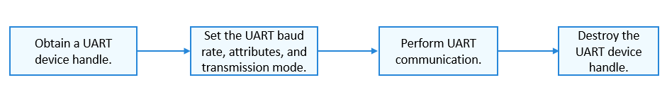

UART Usage Guidelines
=====================

How to Use
----------

`Figure 1 <#fig1852173020185>`__ shows the process of using a UART
device.

**Figure 1** Process of using a UART device

|image1|

Obtaining a UART Device Handle
------------------------------

Before performing UART communication, call **UartOpen** to obtain a UART
device handle. This function returns the pointer to the UART device
handle with a specified port number.

struct DevHandle \*UartOpen(uint32_t port);

**Table 1** Description of **UartOpen**

.. raw:: html

   <table>

.. raw:: html

   <thead align="left">

.. raw:: html

   <tr id="row1022175133111">

.. raw:: html

   <th class="cellrowborder" valign="top" width="50%" id="mcps1.2.3.1.1">

.. raw:: html

   

Parameter

.. raw:: html

   

.. raw:: html

   </th>

.. raw:: html

   <th class="cellrowborder" valign="top" width="50%" id="mcps1.2.3.1.2">

.. raw:: html

   

Description

.. raw:: html

   

.. raw:: html

   </th>

.. raw:: html

   </tr>

.. raw:: html

   </thead>

.. raw:: html

   <tbody>

.. raw:: html

   <tr id="row6222451133114">

.. raw:: html

   <td class="cellrowborder" valign="top" width="50%" headers="mcps1.2.3.1.1 ">

.. raw:: html

   

port

.. raw:: html

   

.. raw:: html

   </td>

.. raw:: html

   <td class="cellrowborder" valign="top" width="50%" headers="mcps1.2.3.1.2 ">

.. raw:: html

   

UART port number.

.. raw:: html

   

.. raw:: html

   </td>

.. raw:: html

   </tr>

.. raw:: html

   <tr id="row1122245153112">

.. raw:: html

   <td class="cellrowborder" valign="top" width="50%" headers="mcps1.2.3.1.1 ">

.. raw:: html

   

Return Value

.. raw:: html

   

.. raw:: html

   </td>

.. raw:: html

   <td class="cellrowborder" valign="top" width="50%" headers="mcps1.2.3.1.2 ">

.. raw:: html

   

Description

.. raw:: html

   

.. raw:: html

   </td>

.. raw:: html

   </tr>

.. raw:: html

   <tr id="row522275114317">

.. raw:: html

   <td class="cellrowborder" valign="top" width="50%" headers="mcps1.2.3.1.1 ">

.. raw:: html

   

NULL

.. raw:: html

   

.. raw:: html

   </td>

.. raw:: html

   <td class="cellrowborder" valign="top" width="50%" headers="mcps1.2.3.1.2 ">

.. raw:: html

   

Failed to obtain the UART device handle.

.. raw:: html

   

.. raw:: html

   </td>

.. raw:: html

   </tr>

.. raw:: html

   <tr id="row1222212513311">

.. raw:: html

   <td class="cellrowborder" valign="top" width="50%" headers="mcps1.2.3.1.1 ">

.. raw:: html

   

Device handle

.. raw:: html

   

.. raw:: html

   </td>

.. raw:: html

   <td class="cellrowborder" valign="top" width="50%" headers="mcps1.2.3.1.2 ">

.. raw:: html

   

Pointer to the UART device handle.

.. raw:: html

   

.. raw:: html

   </td>

.. raw:: html

   </tr>

.. raw:: html

   </tbody>

.. raw:: html

   </table>

The following example shows how to obtain a UART device handle based on
the assumption that the UART port number is **3**:

::

   struct DevHandle *handle = NULL;    /* Pointer to the UART device handle */
   uint32_t port = 3;                  /* UART port number */
   handle = UartOpen(port);
   if (handle == NULL) {
       HDF_LOGE("UartOpen: failed!\n");
       return;
   }

Setting the UART Baud Rate
--------------------------

After obtaining the UART device handle, set the UART baud rate by
calling the following function:

int32_t UartSetBaud(struct DevHandle \*handle, uint32_t baudRate);

**Table 2** Description of **UartSetBaud**

.. raw:: html

   <table>

.. raw:: html

   <thead align="left">

.. raw:: html

   <tr id="row15391205311323">

.. raw:: html

   <th class="cellrowborder" valign="top" width="50%" id="mcps1.2.3.1.1">

.. raw:: html

   

Parameter

.. raw:: html

   

.. raw:: html

   </th>

.. raw:: html

   <th class="cellrowborder" valign="top" width="50%" id="mcps1.2.3.1.2">

.. raw:: html

   

Description

.. raw:: html

   

.. raw:: html

   </th>

.. raw:: html

   </tr>

.. raw:: html

   </thead>

.. raw:: html

   <tbody>

.. raw:: html

   <tr id="row2039115373216">

.. raw:: html

   <td class="cellrowborder" valign="top" width="50%" headers="mcps1.2.3.1.1 ">

.. raw:: html

   

handle

.. raw:: html

   

.. raw:: html

   </td>

.. raw:: html

   <td class="cellrowborder" valign="top" width="50%" headers="mcps1.2.3.1.2 ">

.. raw:: html

   

Pointer to the UART device handle.

.. raw:: html

   

.. raw:: html

   </td>

.. raw:: html

   </tr>

.. raw:: html

   <tr id="row163911753143214">

.. raw:: html

   <td class="cellrowborder" valign="top" width="50%" headers="mcps1.2.3.1.1 ">

.. raw:: html

   

baudRate

.. raw:: html

   

.. raw:: html

   </td>

.. raw:: html

   <td class="cellrowborder" valign="top" width="50%" headers="mcps1.2.3.1.2 ">

.. raw:: html

   

Baud rate of the UART to set.

.. raw:: html

   

.. raw:: html

   </td>

.. raw:: html

   </tr>

.. raw:: html

   <tr id="row539155343218">

.. raw:: html

   <td class="cellrowborder" valign="top" width="50%" headers="mcps1.2.3.1.1 ">

.. raw:: html

   

Return Value

.. raw:: html

   

.. raw:: html

   </td>

.. raw:: html

   <td class="cellrowborder" valign="top" width="50%" headers="mcps1.2.3.1.2 ">

.. raw:: html

   

Description

.. raw:: html

   

.. raw:: html

   </td>

.. raw:: html

   </tr>

.. raw:: html

   <tr id="row2391853153218">

.. raw:: html

   <td class="cellrowborder" valign="top" width="50%" headers="mcps1.2.3.1.1 ">

.. raw:: html

   

0

.. raw:: html

   

.. raw:: html

   </td>

.. raw:: html

   <td class="cellrowborder" valign="top" width="50%" headers="mcps1.2.3.1.2 ">

.. raw:: html

   

Succeeded in setting the UART baud rate.

.. raw:: html

   

.. raw:: html

   </td>

.. raw:: html

   </tr>

.. raw:: html

   <tr id="row23912053143211">

.. raw:: html

   <td class="cellrowborder" valign="top" width="50%" headers="mcps1.2.3.1.1 ">

.. raw:: html

   

Negative value

.. raw:: html

   

.. raw:: html

   </td>

.. raw:: html

   <td class="cellrowborder" valign="top" width="50%" headers="mcps1.2.3.1.2 ">

.. raw:: html

   

Failed to set the UART baud rate.

.. raw:: html

   

.. raw:: html

   </td>

.. raw:: html

   </tr>

.. raw:: html

   </tbody>

.. raw:: html

   </table>

The following example shows how to set the UART baud rate to **9600**:

::

   int32_t ret;
   /* Set the UART baud rate to 9600. */
   ret = UartSetBaud(handle, 9600);
   if (ret != 0) {
       HDF_LOGE("UartSetBaud: failed, ret %d\n", ret);
   }

Obtaining the UART Baud Rate
----------------------------

After setting the UART baud rate, obtain the current baud rate by
calling the following function:

int32_t UartGetBaud(struct DevHandle \*handle, uint32_t \*baudRate);

**Table 3** Description of **UartGetBaud**

.. raw:: html

   <table>

.. raw:: html

   <thead align="left">

.. raw:: html

   <tr id="row19392653123215">

.. raw:: html

   <th class="cellrowborder" valign="top" width="50%" id="mcps1.2.3.1.1">

.. raw:: html

   

Parameter

.. raw:: html

   

.. raw:: html

   </th>

.. raw:: html

   <th class="cellrowborder" valign="top" width="50%" id="mcps1.2.3.1.2">

.. raw:: html

   

Description

.. raw:: html

   

.. raw:: html

   </th>

.. raw:: html

   </tr>

.. raw:: html

   </thead>

.. raw:: html

   <tbody>

.. raw:: html

   <tr id="row103921553103211">

.. raw:: html

   <td class="cellrowborder" valign="top" width="50%" headers="mcps1.2.3.1.1 ">

.. raw:: html

   

handle

.. raw:: html

   

.. raw:: html

   </td>

.. raw:: html

   <td class="cellrowborder" valign="top" width="50%" headers="mcps1.2.3.1.2 ">

.. raw:: html

   

Pointer to the UART device handle.

.. raw:: html

   

.. raw:: html

   </td>

.. raw:: html

   </tr>

.. raw:: html

   <tr id="row1539211532322">

.. raw:: html

   <td class="cellrowborder" valign="top" width="50%" headers="mcps1.2.3.1.1 ">

.. raw:: html

   

baudRate

.. raw:: html

   

.. raw:: html

   </td>

.. raw:: html

   <td class="cellrowborder" valign="top" width="50%" headers="mcps1.2.3.1.2 ">

.. raw:: html

   

Pointer to the UART baud rate.

.. raw:: html

   

.. raw:: html

   </td>

.. raw:: html

   </tr>

.. raw:: html

   <tr id="row1239318531326">

.. raw:: html

   <td class="cellrowborder" valign="top" width="50%" headers="mcps1.2.3.1.1 ">

.. raw:: html

   

Return Value

.. raw:: html

   

.. raw:: html

   </td>

.. raw:: html

   <td class="cellrowborder" valign="top" width="50%" headers="mcps1.2.3.1.2 ">

.. raw:: html

   

Description

.. raw:: html

   

.. raw:: html

   </td>

.. raw:: html

   </tr>

.. raw:: html

   <tr id="row143939531328">

.. raw:: html

   <td class="cellrowborder" valign="top" width="50%" headers="mcps1.2.3.1.1 ">

.. raw:: html

   

0

.. raw:: html

   

.. raw:: html

   </td>

.. raw:: html

   <td class="cellrowborder" valign="top" width="50%" headers="mcps1.2.3.1.2 ">

.. raw:: html

   

Succeeded in obtaining the UART baud rate.

.. raw:: html

   

.. raw:: html

   </td>

.. raw:: html

   </tr>

.. raw:: html

   <tr id="row5393105363210">

.. raw:: html

   <td class="cellrowborder" valign="top" width="50%" headers="mcps1.2.3.1.1 ">

.. raw:: html

   

Negative value

.. raw:: html

   

.. raw:: html

   </td>

.. raw:: html

   <td class="cellrowborder" valign="top" width="50%" headers="mcps1.2.3.1.2 ">

.. raw:: html

   

Failed to obtain the UART baud rate.

.. raw:: html

   

.. raw:: html

   </td>

.. raw:: html

   </tr>

.. raw:: html

   </tbody>

.. raw:: html

   </table>

The following example shows how to obtain the UART baud rate:

::

   int32_t ret;
   uint32_t baudRate;
   /* Obtain the UART baud rate. */
   ret = UartGetBaud(handle, &baudRate);
   if (ret != 0) {
       HDF_LOGE("UartGetBaud: failed, ret %d\n", ret);
   }

Setting the UART Device Attributes
----------------------------------

Before performing UART communication, set the UART device attributes by
calling the following function:

int32_t UartSetAttribute(struct DevHandle \*handle, struct UartAttribute
\*attribute);

**Table 4** Description of **UartSetAttribute**

.. raw:: html

   <table>

.. raw:: html

   <thead align="left">

.. raw:: html

   <tr id="row3530433103416">

.. raw:: html

   <th class="cellrowborder" valign="top" width="49.980000000000004%" id="mcps1.2.3.1.1">

.. raw:: html

   

Parameter

.. raw:: html

   

.. raw:: html

   </th>

.. raw:: html

   <th class="cellrowborder" valign="top" width="50.019999999999996%" id="mcps1.2.3.1.2">

.. raw:: html

   

Description

.. raw:: html

   

.. raw:: html

   </th>

.. raw:: html

   </tr>

.. raw:: html

   </thead>

.. raw:: html

   <tbody>

.. raw:: html

   <tr id="row55303331347">

.. raw:: html

   <td class="cellrowborder" valign="top" width="49.980000000000004%" headers="mcps1.2.3.1.1 ">

.. raw:: html

   

handle

.. raw:: html

   

.. raw:: html

   </td>

.. raw:: html

   <td class="cellrowborder" valign="top" width="50.019999999999996%" headers="mcps1.2.3.1.2 ">

.. raw:: html

   

Pointer to the UART device handle.

.. raw:: html

   

.. raw:: html

   </td>

.. raw:: html

   </tr>

.. raw:: html

   <tr id="row45309337342">

.. raw:: html

   <td class="cellrowborder" valign="top" width="49.980000000000004%" headers="mcps1.2.3.1.1 ">

.. raw:: html

   

attribute

.. raw:: html

   

.. raw:: html

   </td>

.. raw:: html

   <td class="cellrowborder" valign="top" width="50.019999999999996%" headers="mcps1.2.3.1.2 ">

.. raw:: html

   

Pointer to the UART device attributes to set.

.. raw:: html

   

.. raw:: html

   </td>

.. raw:: html

   </tr>

.. raw:: html

   <tr id="row12530833103415">

.. raw:: html

   <td class="cellrowborder" valign="top" width="49.980000000000004%" headers="mcps1.2.3.1.1 ">

.. raw:: html

   

Return Value

.. raw:: html

   

.. raw:: html

   </td>

.. raw:: html

   <td class="cellrowborder" valign="top" width="50.019999999999996%" headers="mcps1.2.3.1.2 ">

.. raw:: html

   

Description

.. raw:: html

   

.. raw:: html

   </td>

.. raw:: html

   </tr>

.. raw:: html

   <tr id="row14530203310348">

.. raw:: html

   <td class="cellrowborder" valign="top" width="49.980000000000004%" headers="mcps1.2.3.1.1 ">

.. raw:: html

   

0

.. raw:: html

   

.. raw:: html

   </td>

.. raw:: html

   <td class="cellrowborder" valign="top" width="50.019999999999996%" headers="mcps1.2.3.1.2 ">

.. raw:: html

   

Succeeded in setting the UART device attributes.

.. raw:: html

   

.. raw:: html

   </td>

.. raw:: html

   </tr>

.. raw:: html

   <tr id="row6531163373412">

.. raw:: html

   <td class="cellrowborder" valign="top" width="49.980000000000004%" headers="mcps1.2.3.1.1 ">

.. raw:: html

   

Negative value

.. raw:: html

   

.. raw:: html

   </td>

.. raw:: html

   <td class="cellrowborder" valign="top" width="50.019999999999996%" headers="mcps1.2.3.1.2 ">

.. raw:: html

   

Failed to set the UART device attributes.

.. raw:: html

   

.. raw:: html

   </td>

.. raw:: html

   </tr>

.. raw:: html

   </tbody>

.. raw:: html

   </table>

The following example shows how to set the UART device attributes:

::

   int32_t ret;
   struct UartAttribute attribute;
   attribute.dataBits = UART_ATTR_DATABIT_7;   /* Set the number of data bits to 7. */
   attribute.parity = UART_ATTR_PARITY_NONE;   /* Set the parity bit to no parity. */
   attribute.stopBits = UART_ATTR_STOPBIT_1;   /* Set the stop bit to 1. */
   attribute.rts = UART_ATTR_RTS_DIS;          /* Disable the RTS signal. */
   attribute.cts = UART_ATTR_CTS_DIS;          /* Disable the CTS signal. */
   attribute.fifoRxEn = UART_ATTR_RX_FIFO_EN;  /* Enable RX FIFO. */
   attribute.fifoTxEn = UART_ATTR_TX_FIFO_EN;  /* Enable TX FIFO. */
   /* Set the UART device attributes. */
   ret = UartSetAttribute(handle, &attribute);
   if (ret != 0) {
       HDF_LOGE("UartSetAttribute: failed, ret %d\n", ret);
   }

Obtaining UART Device Attributes
--------------------------------

After setting the UART device attributes, obtain the current device
attributes by calling the following function:

int32_t UartGetAttribute(struct DevHandle \*handle, struct UartAttribute
\*attribute);

**Table 5** Description of **UartGetAttribute**

.. raw:: html

   <table>

.. raw:: html

   <thead align="left">

.. raw:: html

   <tr id="row18531193383420">

.. raw:: html

   <th class="cellrowborder" valign="top" width="50%" id="mcps1.2.3.1.1">

.. raw:: html

   

Parameter

.. raw:: html

   

.. raw:: html

   </th>

.. raw:: html

   <th class="cellrowborder" valign="top" width="50%" id="mcps1.2.3.1.2">

.. raw:: html

   

Description

.. raw:: html

   

.. raw:: html

   </th>

.. raw:: html

   </tr>

.. raw:: html

   </thead>

.. raw:: html

   <tbody>

.. raw:: html

   <tr id="row35311533153413">

.. raw:: html

   <td class="cellrowborder" valign="top" width="50%" headers="mcps1.2.3.1.1 ">

.. raw:: html

   

handle

.. raw:: html

   

.. raw:: html

   </td>

.. raw:: html

   <td class="cellrowborder" valign="top" width="50%" headers="mcps1.2.3.1.2 ">

.. raw:: html

   

Pointer to the UART device handle.

.. raw:: html

   

.. raw:: html

   </td>

.. raw:: html

   </tr>

.. raw:: html

   <tr id="row1953103315344">

.. raw:: html

   <td class="cellrowborder" valign="top" width="50%" headers="mcps1.2.3.1.1 ">

.. raw:: html

   

attribute

.. raw:: html

   

.. raw:: html

   </td>

.. raw:: html

   <td class="cellrowborder" valign="top" width="50%" headers="mcps1.2.3.1.2 ">

.. raw:: html

   

Pointer to the UART device attributes.

.. raw:: html

   

.. raw:: html

   </td>

.. raw:: html

   </tr>

.. raw:: html

   <tr id="row45321433143415">

.. raw:: html

   <td class="cellrowborder" valign="top" width="50%" headers="mcps1.2.3.1.1 ">

.. raw:: html

   

Return Value

.. raw:: html

   

.. raw:: html

   </td>

.. raw:: html

   <td class="cellrowborder" valign="top" width="50%" headers="mcps1.2.3.1.2 ">

.. raw:: html

   

Description

.. raw:: html

   

.. raw:: html

   </td>

.. raw:: html

   </tr>

.. raw:: html

   <tr id="row175320339342">

.. raw:: html

   <td class="cellrowborder" valign="top" width="50%" headers="mcps1.2.3.1.1 ">

.. raw:: html

   

0

.. raw:: html

   

.. raw:: html

   </td>

.. raw:: html

   <td class="cellrowborder" valign="top" width="50%" headers="mcps1.2.3.1.2 ">

.. raw:: html

   

Succeeded in obtaining the UART device attributes.

.. raw:: html

   

.. raw:: html

   </td>

.. raw:: html

   </tr>

.. raw:: html

   <tr id="row125327337340">

.. raw:: html

   <td class="cellrowborder" valign="top" width="50%" headers="mcps1.2.3.1.1 ">

.. raw:: html

   

Negative value

.. raw:: html

   

.. raw:: html

   </td>

.. raw:: html

   <td class="cellrowborder" valign="top" width="50%" headers="mcps1.2.3.1.2 ">

.. raw:: html

   

Failed to obtain the UART device attributes.

.. raw:: html

   

.. raw:: html

   </td>

.. raw:: html

   </tr>

.. raw:: html

   </tbody>

.. raw:: html

   </table>

The following example shows how to obtain the UART device attributes:

::

   int32_t ret;
   struct UartAttribute attribute;
   /* Obtain the UART attributes. */
   ret = UartGetAttribute(handle, &attribute);
   if (ret != 0) {
       HDF_LOGE("UartGetAttribute: failed, ret %d\n", ret);
   }

Setting the UART Transmission Mode
----------------------------------

Before performing UART communication, set the UART transmission mode by
calling the following function:

int32_t UartSetTransMode(struct DevHandle \*handle, enum UartTransMode
mode);

**Table 6** Description of **UartSetTransMode**

.. raw:: html

   <table>

.. raw:: html

   <thead align="left">

.. raw:: html

   <tr id="row018922615318">

.. raw:: html

   <th class="cellrowborder" valign="top" width="49.980000000000004%" id="mcps1.2.3.1.1">

.. raw:: html

   

Parameter

.. raw:: html

   

.. raw:: html

   </th>

.. raw:: html

   <th class="cellrowborder" valign="top" width="50.019999999999996%" id="mcps1.2.3.1.2">

.. raw:: html

   

Description

.. raw:: html

   

.. raw:: html

   </th>

.. raw:: html

   </tr>

.. raw:: html

   </thead>

.. raw:: html

   <tbody>

.. raw:: html

   <tr id="row11893261734">

.. raw:: html

   <td class="cellrowborder" valign="top" width="49.980000000000004%" headers="mcps1.2.3.1.1 ">

.. raw:: html

   

handle

.. raw:: html

   

.. raw:: html

   </td>

.. raw:: html

   <td class="cellrowborder" valign="top" width="50.019999999999996%" headers="mcps1.2.3.1.2 ">

.. raw:: html

   

Pointer to the UART device handle.

.. raw:: html

   

.. raw:: html

   </td>

.. raw:: html

   </tr>

.. raw:: html

   <tr id="row1119082615317">

.. raw:: html

   <td class="cellrowborder" valign="top" width="49.980000000000004%" headers="mcps1.2.3.1.1 ">

.. raw:: html

   

mode

.. raw:: html

   

.. raw:: html

   </td>

.. raw:: html

   <td class="cellrowborder" valign="top" width="50.019999999999996%" headers="mcps1.2.3.1.2 ">

.. raw:: html

   

UART transmission mode to set.

.. raw:: html

   

.. raw:: html

   </td>

.. raw:: html

   </tr>

.. raw:: html

   <tr id="row19190152612317">

.. raw:: html

   <td class="cellrowborder" valign="top" width="49.980000000000004%" headers="mcps1.2.3.1.1 ">

.. raw:: html

   

Return Value

.. raw:: html

   

.. raw:: html

   </td>

.. raw:: html

   <td class="cellrowborder" valign="top" width="50.019999999999996%" headers="mcps1.2.3.1.2 ">

.. raw:: html

   

Description

.. raw:: html

   

.. raw:: html

   </td>

.. raw:: html

   </tr>

.. raw:: html

   <tr id="row919016261932">

.. raw:: html

   <td class="cellrowborder" valign="top" width="49.980000000000004%" headers="mcps1.2.3.1.1 ">

.. raw:: html

   

0

.. raw:: html

   

.. raw:: html

   </td>

.. raw:: html

   <td class="cellrowborder" valign="top" width="50.019999999999996%" headers="mcps1.2.3.1.2 ">

.. raw:: html

   

Succeeded in setting the UART transmission mode.

.. raw:: html

   

.. raw:: html

   </td>

.. raw:: html

   </tr>

.. raw:: html

   <tr id="row1219017262313">

.. raw:: html

   <td class="cellrowborder" valign="top" width="49.980000000000004%" headers="mcps1.2.3.1.1 ">

.. raw:: html

   

Negative value

.. raw:: html

   

.. raw:: html

   </td>

.. raw:: html

   <td class="cellrowborder" valign="top" width="50.019999999999996%" headers="mcps1.2.3.1.2 ">

.. raw:: html

   

Failed to set the UART transmission mode.

.. raw:: html

   

.. raw:: html

   </td>

.. raw:: html

   </tr>

.. raw:: html

   </tbody>

.. raw:: html

   </table>

The following example shows how to set the transmission mode to
**UART_MODE_RD_BLOCK**:

::

   int32_t ret;
   /* Set the UART transmission mode. */
   ret = UartSetTransMode(handle, UART_MODE_RD_BLOCK);
   if (ret != 0) {
       HDF_LOGE("UartSetTransMode: failed, ret %d\n", ret);
   }

Writing Data of a Specified Length into a UART Device
-----------------------------------------------------

To write data into a UART device, call the following function:

int32_t UartWrite(struct DevHandle \*handle, uint8_t \*data, uint32_t
size);

**Table 7** Description of **UartWrite**

.. raw:: html

   <table>

.. raw:: html

   <thead align="left">

.. raw:: html

   <tr id="row1578171123619">

.. raw:: html

   <th class="cellrowborder" valign="top" width="50%" id="mcps1.2.3.1.1">

.. raw:: html

   

Parameter

.. raw:: html

   

.. raw:: html

   </th>

.. raw:: html

   <th class="cellrowborder" valign="top" width="50%" id="mcps1.2.3.1.2">

.. raw:: html

   

Description

.. raw:: html

   

.. raw:: html

   </th>

.. raw:: html

   </tr>

.. raw:: html

   </thead>

.. raw:: html

   <tbody>

.. raw:: html

   <tr id="row1878291143611">

.. raw:: html

   <td class="cellrowborder" valign="top" width="50%" headers="mcps1.2.3.1.1 ">

.. raw:: html

   

handle

.. raw:: html

   

.. raw:: html

   </td>

.. raw:: html

   <td class="cellrowborder" valign="top" width="50%" headers="mcps1.2.3.1.2 ">

.. raw:: html

   

Pointer to the UART device handle.

.. raw:: html

   

.. raw:: html

   </td>

.. raw:: html

   </tr>

.. raw:: html

   <tr id="row7782811123614">

.. raw:: html

   <td class="cellrowborder" valign="top" width="50%" headers="mcps1.2.3.1.1 ">

.. raw:: html

   

data

.. raw:: html

   

.. raw:: html

   </td>

.. raw:: html

   <td class="cellrowborder" valign="top" width="50%" headers="mcps1.2.3.1.2 ">

.. raw:: html

   

Pointer to the data to write.

.. raw:: html

   

.. raw:: html

   </td>

.. raw:: html

   </tr>

.. raw:: html

   <tr id="row1578251112367">

.. raw:: html

   <td class="cellrowborder" valign="top" width="50%" headers="mcps1.2.3.1.1 ">

.. raw:: html

   

size

.. raw:: html

   

.. raw:: html

   </td>

.. raw:: html

   <td class="cellrowborder" valign="top" width="50%" headers="mcps1.2.3.1.2 ">

.. raw:: html

   

Length of the data to write.

.. raw:: html

   

.. raw:: html

   </td>

.. raw:: html

   </tr>

.. raw:: html

   <tr id="row1378281113363">

.. raw:: html

   <td class="cellrowborder" valign="top" width="50%" headers="mcps1.2.3.1.1 ">

.. raw:: html

   

Return Value

.. raw:: html

   

.. raw:: html

   </td>

.. raw:: html

   <td class="cellrowborder" valign="top" width="50%" headers="mcps1.2.3.1.2 ">

.. raw:: html

   

Description

.. raw:: html

   

.. raw:: html

   </td>

.. raw:: html

   </tr>

.. raw:: html

   <tr id="row47822112365">

.. raw:: html

   <td class="cellrowborder" valign="top" width="50%" headers="mcps1.2.3.1.1 ">

.. raw:: html

   

0

.. raw:: html

   

.. raw:: html

   </td>

.. raw:: html

   <td class="cellrowborder" valign="top" width="50%" headers="mcps1.2.3.1.2 ">

.. raw:: html

   

Succeeded in writing data into the UART device.

.. raw:: html

   

.. raw:: html

   </td>

.. raw:: html

   </tr>

.. raw:: html

   <tr id="row11782911113611">

.. raw:: html

   <td class="cellrowborder" valign="top" width="50%" headers="mcps1.2.3.1.1 ">

.. raw:: html

   

Negative value

.. raw:: html

   

.. raw:: html

   </td>

.. raw:: html

   <td class="cellrowborder" valign="top" width="50%" headers="mcps1.2.3.1.2 ">

.. raw:: html

   

Failed to write data into the UART device.

.. raw:: html

   

.. raw:: html

   </td>

.. raw:: html

   </tr>

.. raw:: html

   </tbody>

.. raw:: html

   </table>

The following example shows how to write data of a specified length into
the UART device:

::

   int32_t ret;
   uint8_t wbuff[5] = {1, 2, 3, 4, 5};
   /* Write 5-byte data into the UART device. */
   ret = UartWrite(handle, wbuff, 5);
   if (ret != 0) {
       HDF_LOGE("UartWrite: failed, ret %d\n", ret);
   }

Reading Data of a Specified Length from a UART Device
-----------------------------------------------------

To read data from a UART device, call the following function:

int32_t UartRead(struct DevHandle \*handle, uint8_t \*data, uint32_t
size);

**Table 8** Description of **UartRead**

.. raw:: html

   <table>

.. raw:: html

   <thead align="left">

.. raw:: html

   <tr id="row023313171377">

.. raw:: html

   <th class="cellrowborder" valign="top" width="50%" id="mcps1.2.3.1.1">

.. raw:: html

   

Parameter

.. raw:: html

   

.. raw:: html

   </th>

.. raw:: html

   <th class="cellrowborder" valign="top" width="50%" id="mcps1.2.3.1.2">

.. raw:: html

   

Description

.. raw:: html

   

.. raw:: html

   </th>

.. raw:: html

   </tr>

.. raw:: html

   </thead>

.. raw:: html

   <tbody>

.. raw:: html

   <tr id="row6234417133712">

.. raw:: html

   <td class="cellrowborder" valign="top" width="50%" headers="mcps1.2.3.1.1 ">

.. raw:: html

   

handle

.. raw:: html

   

.. raw:: html

   </td>

.. raw:: html

   <td class="cellrowborder" valign="top" width="50%" headers="mcps1.2.3.1.2 ">

.. raw:: html

   

Pointer to the UART device handle.

.. raw:: html

   

.. raw:: html

   </td>

.. raw:: html

   </tr>

.. raw:: html

   <tr id="row18234151718372">

.. raw:: html

   <td class="cellrowborder" valign="top" width="50%" headers="mcps1.2.3.1.1 ">

.. raw:: html

   

data

.. raw:: html

   

.. raw:: html

   </td>

.. raw:: html

   <td class="cellrowborder" valign="top" width="50%" headers="mcps1.2.3.1.2 ">

.. raw:: html

   

Pointer to the buffer for receiving the data.

.. raw:: html

   

.. raw:: html

   </td>

.. raw:: html

   </tr>

.. raw:: html

   <tr id="row82341017193711">

.. raw:: html

   <td class="cellrowborder" valign="top" width="50%" headers="mcps1.2.3.1.1 ">

.. raw:: html

   

size

.. raw:: html

   

.. raw:: html

   </td>

.. raw:: html

   <td class="cellrowborder" valign="top" width="50%" headers="mcps1.2.3.1.2 ">

.. raw:: html

   

Length of the data to read.

.. raw:: html

   

.. raw:: html

   </td>

.. raw:: html

   </tr>

.. raw:: html

   <tr id="row102341617123717">

.. raw:: html

   <td class="cellrowborder" valign="top" width="50%" headers="mcps1.2.3.1.1 ">

.. raw:: html

   

Return Value

.. raw:: html

   

.. raw:: html

   </td>

.. raw:: html

   <td class="cellrowborder" valign="top" width="50%" headers="mcps1.2.3.1.2 ">

.. raw:: html

   

Description

.. raw:: html

   

.. raw:: html

   </td>

.. raw:: html

   </tr>

.. raw:: html

   <tr id="row4234151719372">

.. raw:: html

   <td class="cellrowborder" valign="top" width="50%" headers="mcps1.2.3.1.1 ">

.. raw:: html

   

Non-negative value

.. raw:: html

   

.. raw:: html

   </td>

.. raw:: html

   <td class="cellrowborder" valign="top" width="50%" headers="mcps1.2.3.1.2 ">

.. raw:: html

   

Length of the data read from the UART device.

.. raw:: html

   

.. raw:: html

   </td>

.. raw:: html

   </tr>

.. raw:: html

   <tr id="row112340173378">

.. raw:: html

   <td class="cellrowborder" valign="top" width="50%" headers="mcps1.2.3.1.1 ">

.. raw:: html

   

Negative value

.. raw:: html

   

.. raw:: html

   </td>

.. raw:: html

   <td class="cellrowborder" valign="top" width="50%" headers="mcps1.2.3.1.2 ">

.. raw:: html

   

Failed to read data from the UART device.

.. raw:: html

   

.. raw:: html

   </td>

.. raw:: html

   </tr>

.. raw:: html

   </tbody>

.. raw:: html

   </table>

The following example shows how to read data of a specified length from
the UART device:

::

   int32_t ret;
   uint8_t rbuff[5] = {0};
   /* Read 5-byte data from the UART device. */
   ret = UartRead(handle, rbuff, 5);
   if (ret < 0) {
       HDF_LOGE("UartRead: failed, ret %d\n", ret);
   }

..

   |image2| **CAUTION:** Data is successfully read from the UART device
   if a non-negative value is returned. If the return value is **0**, no
   valid data can be read from the UART device. If the return value is
   greater than **0**, the return value is the length of the data
   actually read from the UART device. The length is less than or equal
   to the value of **size** and does not exceed the maximum length of
   data to read at a time specified by the UART controller in use.

Destroying the UART Device Handle
---------------------------------

After the UART communication, destroy the UART device handle by calling
the following function:

void UartClose(struct DevHandle \*handle);

This function will release the resources previously obtained.

**Table 9** Description of **UartClose**

.. raw:: html

   <table>

.. raw:: html

   <thead align="left">

.. raw:: html

   <tr id="row15334837351">

.. raw:: html

   <th class="cellrowborder" valign="top" width="50%" id="mcps1.2.3.1.1">

.. raw:: html

   

Parameter

.. raw:: html

   

.. raw:: html

   </th>

.. raw:: html

   <th class="cellrowborder" valign="top" width="50%" id="mcps1.2.3.1.2">

.. raw:: html

   

Description

.. raw:: html

   

.. raw:: html

   </th>

.. raw:: html

   </tr>

.. raw:: html

   </thead>

.. raw:: html

   <tbody>

.. raw:: html

   <tr id="row733483103513">

.. raw:: html

   <td class="cellrowborder" valign="top" width="50%" headers="mcps1.2.3.1.1 ">

.. raw:: html

   

handle

.. raw:: html

   

.. raw:: html

   </td>

.. raw:: html

   <td class="cellrowborder" valign="top" width="50%" headers="mcps1.2.3.1.2 ">

.. raw:: html

   

Pointer to the UART device handle

.. raw:: html

   

.. raw:: html

   </td>

.. raw:: html

   </tr>

.. raw:: html

   </tbody>

.. raw:: html

   </table>

The following example shows how to destroy the UART device handle:

::

   UartClose(handle); /* Destroy the UART device handle. */

.. |image2| image:: public_sys-resources/icon-caution.gif
