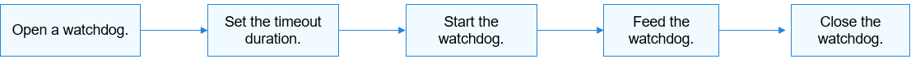

Watchdog Usage Guidelines
=========================

How to Use
----------

`Figure 1 <#fig19134125410189>`__ illustrates the process of using a
watchdog.

**Figure 1** Process of using a watchdog

|image1|

Opening a Watchdog
------------------

Use **WatchdogOpen** to open a watchdog. A system may have multiple
watchdogs. You can open a specified watchdog by using the ID.

int32_t WatchdogOpen(int16_t wdtId);

**Table 1** Description of WatchdogOpen

.. raw:: html

   <table>

.. raw:: html

   <thead align="left">

.. raw:: html

   <tr id="row131371325142819">

.. raw:: html

   <th class="cellrowborder" valign="top" width="44.99%" id="mcps1.2.3.1.1">

.. raw:: html

   

Parameter

.. raw:: html

   

.. raw:: html

   </th>

.. raw:: html

   <th class="cellrowborder" valign="top" width="55.010000000000005%" id="mcps1.2.3.1.2">

.. raw:: html

   

Description

.. raw:: html

   

.. raw:: html

   </th>

.. raw:: html

   </tr>

.. raw:: html

   </thead>

.. raw:: html

   <tbody>

.. raw:: html

   <tr id="row813812259282">

.. raw:: html

   <td class="cellrowborder" valign="top" width="44.99%" headers="mcps1.2.3.1.1 ">

.. raw:: html

   

wdtId

.. raw:: html

   

.. raw:: html

   </td>

.. raw:: html

   <td class="cellrowborder" valign="top" width="55.010000000000005%" headers="mcps1.2.3.1.2 ">

.. raw:: html

   

Watchdog ID.

.. raw:: html

   

.. raw:: html

   </td>

.. raw:: html

   </tr>

.. raw:: html

   <tr id="row2138202515281">

.. raw:: html

   <td class="cellrowborder" valign="top" width="44.99%" headers="mcps1.2.3.1.1 ">

.. raw:: html

   

Return Value

.. raw:: html

   

.. raw:: html

   </td>

.. raw:: html

   <td class="cellrowborder" valign="top" width="55.010000000000005%" headers="mcps1.2.3.1.2 ">

.. raw:: html

   

Description

.. raw:: html

   

.. raw:: html

   </td>

.. raw:: html

   </tr>

.. raw:: html

   <tr id="row9138182519287">

.. raw:: html

   <td class="cellrowborder" valign="top" width="44.99%" headers="mcps1.2.3.1.1 ">

.. raw:: html

   

NULL

.. raw:: html

   

.. raw:: html

   </td>

.. raw:: html

   <td class="cellrowborder" valign="top" width="55.010000000000005%" headers="mcps1.2.3.1.2 ">

.. raw:: html

   

Failed to open the watchdog.

.. raw:: html

   

.. raw:: html

   </td>

.. raw:: html

   </tr>

.. raw:: html

   <tr id="row15138192518283">

.. raw:: html

   <td class="cellrowborder" valign="top" width="44.99%" headers="mcps1.2.3.1.1 ">

.. raw:: html

   

struct DevHandle pointer

.. raw:: html

   

.. raw:: html

   </td>

.. raw:: html

   <td class="cellrowborder" valign="top" width="55.010000000000005%" headers="mcps1.2.3.1.2 ">

.. raw:: html

   

Pointer to the watchdog handle.

.. raw:: html

   

.. raw:: html

   </td>

.. raw:: html

   </tr>

.. raw:: html

   </tbody>

.. raw:: html

   </table>

::

   struct DevHandle *handle = NULL;
   handle = WatchdogOpen(0); /* Open watchdog 0.*/
   if (handle == NULL) {
       HDF_LOGE("WatchdogOpen: failed, ret %d\n", ret);
       return;
   }

Obtaining the Watchdog Status
-----------------------------

int32_t WatchdogGetStatus(struct DevHandle \*handle, int32_t \*status);

**Table 2** Description of WatchdogGetStatus

.. raw:: html

   <table>

.. raw:: html

   <thead align="left">

.. raw:: html

   <tr id="row31848013417">

.. raw:: html

   <th class="cellrowborder" valign="top" width="44.99%" id="mcps1.2.3.1.1">

.. raw:: html

   

Parameter

.. raw:: html

   

.. raw:: html

   </th>

.. raw:: html

   <th class="cellrowborder" valign="top" width="55.010000000000005%" id="mcps1.2.3.1.2">

.. raw:: html

   

Description

.. raw:: html

   

.. raw:: html

   </th>

.. raw:: html

   </tr>

.. raw:: html

   </thead>

.. raw:: html

   <tbody>

.. raw:: html

   <tr id="row3264122711222">

.. raw:: html

   <td class="cellrowborder" valign="top" width="44.99%" headers="mcps1.2.3.1.1 ">

.. raw:: html

   

handle

.. raw:: html

   

.. raw:: html

   </td>

.. raw:: html

   <td class="cellrowborder" valign="top" width="55.010000000000005%" headers="mcps1.2.3.1.2 ">

.. raw:: html

   

Watchdog handle.

.. raw:: html

   

.. raw:: html

   </td>

.. raw:: html

   </tr>

.. raw:: html

   <tr id="row928111518418">

.. raw:: html

   <td class="cellrowborder" valign="top" width="44.99%" headers="mcps1.2.3.1.1 ">

.. raw:: html

   

status

.. raw:: html

   

.. raw:: html

   </td>

.. raw:: html

   <td class="cellrowborder" valign="top" width="55.010000000000005%" headers="mcps1.2.3.1.2 ">

.. raw:: html

   

Pointer to the watchdog status.

.. raw:: html

   

.. raw:: html

   </td>

.. raw:: html

   </tr>

.. raw:: html

   <tr id="row17393154515328">

.. raw:: html

   <td class="cellrowborder" valign="top" width="44.99%" headers="mcps1.2.3.1.1 ">

.. raw:: html

   

Return Value

.. raw:: html

   

.. raw:: html

   </td>

.. raw:: html

   <td class="cellrowborder" valign="top" width="55.010000000000005%" headers="mcps1.2.3.1.2 ">

.. raw:: html

   

Description

.. raw:: html

   

.. raw:: html

   </td>

.. raw:: html

   </tr>

.. raw:: html

   <tr id="row339324593215">

.. raw:: html

   <td class="cellrowborder" valign="top" width="44.99%" headers="mcps1.2.3.1.1 ">

.. raw:: html

   

0

.. raw:: html

   

.. raw:: html

   </td>

.. raw:: html

   <td class="cellrowborder" valign="top" width="55.010000000000005%" headers="mcps1.2.3.1.2 ">

.. raw:: html

   

The watchdog status is obtained.

.. raw:: html

   

.. raw:: html

   </td>

.. raw:: html

   </tr>

.. raw:: html

   <tr id="row15393184519323">

.. raw:: html

   <td class="cellrowborder" valign="top" width="44.99%" headers="mcps1.2.3.1.1 ">

.. raw:: html

   

Negative value

.. raw:: html

   

.. raw:: html

   </td>

.. raw:: html

   <td class="cellrowborder" valign="top" width="55.010000000000005%" headers="mcps1.2.3.1.2 ">

.. raw:: html

   

Failed to obtain the watchdog status.

.. raw:: html

   

.. raw:: html

   </td>

.. raw:: html

   </tr>

.. raw:: html

   </tbody>

.. raw:: html

   </table>

::

   int32_t ret;
   int32_t status;
   /* Obtain the watchdog status. */
   ret = WatchdogGetStatus(handle, &status);
   if (ret != 0) {
       HDF_LOGE("WatchdogGetStatus: failed, ret %d\n", ret);
       return;
   }

Setting the Timeout Duration
----------------------------

int32_t WatchdogSetTimeout(PalHandle \*handle, uint32_t seconds);

**Table 3** Description of WatchdogSetTimeout

.. raw:: html

   <table>

.. raw:: html

   <thead align="left">

.. raw:: html

   <tr id="row1216012212212">

.. raw:: html

   <th class="cellrowborder" valign="top" width="44.99%" id="mcps1.2.3.1.1">

.. raw:: html

   

Parameter

.. raw:: html

   

.. raw:: html

   </th>

.. raw:: html

   <th class="cellrowborder" valign="top" width="55.010000000000005%" id="mcps1.2.3.1.2">

.. raw:: html

   

Description

.. raw:: html

   

.. raw:: html

   </th>

.. raw:: html

   </tr>

.. raw:: html

   </thead>

.. raw:: html

   <tbody>

.. raw:: html

   <tr id="row199536232314">

.. raw:: html

   <td class="cellrowborder" valign="top" width="44.99%" headers="mcps1.2.3.1.1 ">

.. raw:: html

   

handle

.. raw:: html

   

.. raw:: html

   </td>

.. raw:: html

   <td class="cellrowborder" valign="top" width="55.010000000000005%" headers="mcps1.2.3.1.2 ">

.. raw:: html

   

Watchdog handle.

.. raw:: html

   

.. raw:: html

   </td>

.. raw:: html

   </tr>

.. raw:: html

   <tr id="row141601729228">

.. raw:: html

   <td class="cellrowborder" valign="top" width="44.99%" headers="mcps1.2.3.1.1 ">

.. raw:: html

   

seconds

.. raw:: html

   

.. raw:: html

   </td>

.. raw:: html

   <td class="cellrowborder" valign="top" width="55.010000000000005%" headers="mcps1.2.3.1.2 ">

.. raw:: html

   

Timeout duration, in seconds.

.. raw:: html

   

.. raw:: html

   </td>

.. raw:: html

   </tr>

.. raw:: html

   <tr id="row18160192172212">

.. raw:: html

   <td class="cellrowborder" valign="top" width="44.99%" headers="mcps1.2.3.1.1 ">

.. raw:: html

   

Return Value

.. raw:: html

   

.. raw:: html

   </td>

.. raw:: html

   <td class="cellrowborder" valign="top" width="55.010000000000005%" headers="mcps1.2.3.1.2 ">

.. raw:: html

   

Description

.. raw:: html

   

.. raw:: html

   </td>

.. raw:: html

   </tr>

.. raw:: html

   <tr id="row171600202220">

.. raw:: html

   <td class="cellrowborder" valign="top" width="44.99%" headers="mcps1.2.3.1.1 ">

.. raw:: html

   

0

.. raw:: html

   

.. raw:: html

   </td>

.. raw:: html

   <td class="cellrowborder" valign="top" width="55.010000000000005%" headers="mcps1.2.3.1.2 ">

.. raw:: html

   

The setting is successful.

.. raw:: html

   

.. raw:: html

   </td>

.. raw:: html

   </tr>

.. raw:: html

   <tr id="row916012252211">

.. raw:: html

   <td class="cellrowborder" valign="top" width="44.99%" headers="mcps1.2.3.1.1 ">

.. raw:: html

   

Negative value

.. raw:: html

   

.. raw:: html

   </td>

.. raw:: html

   <td class="cellrowborder" valign="top" width="55.010000000000005%" headers="mcps1.2.3.1.2 ">

.. raw:: html

   

Setting failed.

.. raw:: html

   

.. raw:: html

   </td>

.. raw:: html

   </tr>

.. raw:: html

   </tbody>

.. raw:: html

   </table>

::

   int32_t ret;
   uint32_t timeOut = 60;
   /* Set the timeout duration, in seconds. */
   ret = WatchdogSetTimeout(handle, timeOut);
   if (ret != 0) {
       HDF_LOGE("WatchdogSetTimeout: failed, ret %d\n", ret);
       return;
   }

Obtaining the Timeout Duration
------------------------------

int32_t WatchdogGetTimeout(PalHandle \*handle, uint32_t \*seconds);

**Table 4** Description of WatchdogGetTimeout

.. raw:: html

   <table>

.. raw:: html

   <thead align="left">

.. raw:: html

   <tr id="row14147848142313">

.. raw:: html

   <th class="cellrowborder" valign="top" width="44.99%" id="mcps1.2.3.1.1">

.. raw:: html

   

Parameter

.. raw:: html

   

.. raw:: html

   </th>

.. raw:: html

   <th class="cellrowborder" valign="top" width="55.010000000000005%" id="mcps1.2.3.1.2">

.. raw:: html

   

Description

.. raw:: html

   

.. raw:: html

   </th>

.. raw:: html

   </tr>

.. raw:: html

   </thead>

.. raw:: html

   <tbody>

.. raw:: html

   <tr id="row8147124819230">

.. raw:: html

   <td class="cellrowborder" valign="top" width="44.99%" headers="mcps1.2.3.1.1 ">

.. raw:: html

   

handle

.. raw:: html

   

.. raw:: html

   </td>

.. raw:: html

   <td class="cellrowborder" valign="top" width="55.010000000000005%" headers="mcps1.2.3.1.2 ">

.. raw:: html

   

Watchdog handle.

.. raw:: html

   

.. raw:: html

   </td>

.. raw:: html

   </tr>

.. raw:: html

   <tr id="row514754818232">

.. raw:: html

   <td class="cellrowborder" valign="top" width="44.99%" headers="mcps1.2.3.1.1 ">

.. raw:: html

   

seconds

.. raw:: html

   

.. raw:: html

   </td>

.. raw:: html

   <td class="cellrowborder" valign="top" width="55.010000000000005%" headers="mcps1.2.3.1.2 ">

.. raw:: html

   

Pointer to the timeout duration, in seconds.

.. raw:: html

   

.. raw:: html

   </td>

.. raw:: html

   </tr>

.. raw:: html

   <tr id="row214784814239">

.. raw:: html

   <td class="cellrowborder" valign="top" width="44.99%" headers="mcps1.2.3.1.1 ">

.. raw:: html

   

Return Value

.. raw:: html

   

.. raw:: html

   </td>

.. raw:: html

   <td class="cellrowborder" valign="top" width="55.010000000000005%" headers="mcps1.2.3.1.2 ">

.. raw:: html

   

Description

.. raw:: html

   

.. raw:: html

   </td>

.. raw:: html

   </tr>

.. raw:: html

   <tr id="row714744892312">

.. raw:: html

   <td class="cellrowborder" valign="top" width="44.99%" headers="mcps1.2.3.1.1 ">

.. raw:: html

   

0

.. raw:: html

   

.. raw:: html

   </td>

.. raw:: html

   <td class="cellrowborder" valign="top" width="55.010000000000005%" headers="mcps1.2.3.1.2 ">

.. raw:: html

   

The timeout duration is obtained.

.. raw:: html

   

.. raw:: html

   </td>

.. raw:: html

   </tr>

.. raw:: html

   <tr id="row1514884815230">

.. raw:: html

   <td class="cellrowborder" valign="top" width="44.99%" headers="mcps1.2.3.1.1 ">

.. raw:: html

   

Negative value

.. raw:: html

   

.. raw:: html

   </td>

.. raw:: html

   <td class="cellrowborder" valign="top" width="55.010000000000005%" headers="mcps1.2.3.1.2 ">

.. raw:: html

   

Failed to obtain the watchdog status.

.. raw:: html

   

.. raw:: html

   </td>

.. raw:: html

   </tr>

.. raw:: html

   </tbody>

.. raw:: html

   </table>

::

   int32_t ret;
   uint32_t timeOut;
   /* Obtain the timeout duration, in seconds. */
   ret = WatchdogGetTimeout(handle, &timeOut);
   if (ret != 0) {
       HDF_LOGE("WatchdogGetTimeout: failed, ret %d\n", ret);
       return;
   }

Starting a Watchdog
-------------------

int32_t WatchdogStart(struct DevHandle \*handle);

**Table 5** Description of WatchdogStart

.. raw:: html

   <table>

.. raw:: html

   <thead align="left">

.. raw:: html

   <tr id="row92915122513">

.. raw:: html

   <th class="cellrowborder" valign="top" width="44.99%" id="mcps1.2.3.1.1">

.. raw:: html

   

Parameter

.. raw:: html

   

.. raw:: html

   </th>

.. raw:: html

   <th class="cellrowborder" valign="top" width="55.010000000000005%" id="mcps1.2.3.1.2">

.. raw:: html

   

Description

.. raw:: html

   

.. raw:: html

   </th>

.. raw:: html

   </tr>

.. raw:: html

   </thead>

.. raw:: html

   <tbody>

.. raw:: html

   <tr id="row629852250">

.. raw:: html

   <td class="cellrowborder" valign="top" width="44.99%" headers="mcps1.2.3.1.1 ">

.. raw:: html

   

handle

.. raw:: html

   

.. raw:: html

   </td>

.. raw:: html

   <td class="cellrowborder" valign="top" width="55.010000000000005%" headers="mcps1.2.3.1.2 ">

.. raw:: html

   

Watchdog handle.

.. raw:: html

   

.. raw:: html

   </td>

.. raw:: html

   </tr>

.. raw:: html

   <tr id="row183035162514">

.. raw:: html

   <td class="cellrowborder" valign="top" width="44.99%" headers="mcps1.2.3.1.1 ">

.. raw:: html

   

Return Value

.. raw:: html

   

.. raw:: html

   </td>

.. raw:: html

   <td class="cellrowborder" valign="top" width="55.010000000000005%" headers="mcps1.2.3.1.2 ">

.. raw:: html

   

Description

.. raw:: html

   

.. raw:: html

   </td>

.. raw:: html

   </tr>

.. raw:: html

   <tr id="row12305552510">

.. raw:: html

   <td class="cellrowborder" valign="top" width="44.99%" headers="mcps1.2.3.1.1 ">

.. raw:: html

   

0

.. raw:: html

   

.. raw:: html

   </td>

.. raw:: html

   <td class="cellrowborder" valign="top" width="55.010000000000005%" headers="mcps1.2.3.1.2 ">

.. raw:: html

   

The watchdog is started.

.. raw:: html

   

.. raw:: html

   </td>

.. raw:: html

   </tr>

.. raw:: html

   <tr id="row4306516252">

.. raw:: html

   <td class="cellrowborder" valign="top" width="44.99%" headers="mcps1.2.3.1.1 ">

.. raw:: html

   

Negative value

.. raw:: html

   

.. raw:: html

   </td>

.. raw:: html

   <td class="cellrowborder" valign="top" width="55.010000000000005%" headers="mcps1.2.3.1.2 ">

.. raw:: html

   

Failed to start the watchdog.

.. raw:: html

   

.. raw:: html

   </td>

.. raw:: html

   </tr>

.. raw:: html

   </tbody>

.. raw:: html

   </table>

::

   int32_t ret;
   /* Start the watchdog. */
   ret = WatchdogStart(handle);
   if (ret != 0) {
       HDF_LOGE("WatchdogStart: failed, ret %d\n", ret);
       return;
   }

Feeding a Watchdog
------------------

int32_t WatchdogFeed(struct DevHandle \*handle);

**Table 6** Description of WatchdogFeed

.. raw:: html

   <table>

.. raw:: html

   <thead align="left">

.. raw:: html

   <tr id="row891133515393">

.. raw:: html

   <th class="cellrowborder" valign="top" width="44.99%" id="mcps1.2.3.1.1">

.. raw:: html

   

Parameter

.. raw:: html

   

.. raw:: html

   </th>

.. raw:: html

   <th class="cellrowborder" valign="top" width="55.010000000000005%" id="mcps1.2.3.1.2">

.. raw:: html

   

Description

.. raw:: html

   

.. raw:: html

   </th>

.. raw:: html

   </tr>

.. raw:: html

   </thead>

.. raw:: html

   <tbody>

.. raw:: html

   <tr id="row189111635143918">

.. raw:: html

   <td class="cellrowborder" valign="top" width="44.99%" headers="mcps1.2.3.1.1 ">

.. raw:: html

   

handle

.. raw:: html

   

.. raw:: html

   </td>

.. raw:: html

   <td class="cellrowborder" valign="top" width="55.010000000000005%" headers="mcps1.2.3.1.2 ">

.. raw:: html

   

Watchdog handle.

.. raw:: html

   

.. raw:: html

   </td>

.. raw:: html

   </tr>

.. raw:: html

   <tr id="row15911835173916">

.. raw:: html

   <td class="cellrowborder" valign="top" width="44.99%" headers="mcps1.2.3.1.1 ">

.. raw:: html

   

Return Value

.. raw:: html

   

.. raw:: html

   </td>

.. raw:: html

   <td class="cellrowborder" valign="top" width="55.010000000000005%" headers="mcps1.2.3.1.2 ">

.. raw:: html

   

Description

.. raw:: html

   

.. raw:: html

   </td>

.. raw:: html

   </tr>

.. raw:: html

   <tr id="row189119352393">

.. raw:: html

   <td class="cellrowborder" valign="top" width="44.99%" headers="mcps1.2.3.1.1 ">

.. raw:: html

   

0

.. raw:: html

   

.. raw:: html

   </td>

.. raw:: html

   <td class="cellrowborder" valign="top" width="55.010000000000005%" headers="mcps1.2.3.1.2 ">

.. raw:: html

   

The watchdog is fed.

.. raw:: html

   

.. raw:: html

   </td>

.. raw:: html

   </tr>

.. raw:: html

   <tr id="row5911123520392">

.. raw:: html

   <td class="cellrowborder" valign="top" width="44.99%" headers="mcps1.2.3.1.1 ">

.. raw:: html

   

Negative value

.. raw:: html

   

.. raw:: html

   </td>

.. raw:: html

   <td class="cellrowborder" valign="top" width="55.010000000000005%" headers="mcps1.2.3.1.2 ">

.. raw:: html

   

Failed to feed the watchdog.

.. raw:: html

   

.. raw:: html

   </td>

.. raw:: html

   </tr>

.. raw:: html

   </tbody>

.. raw:: html

   </table>

::

   int32_t ret;
   /* Feed the watchdog. */
   ret = WatchdogFeed(handle);
   if (ret != 0) {
       HDF_LOGE("WatchdogFeed: failed, ret %d\n", ret);
       return;
   }

Stopping a Watchdog
-------------------

int32_t WatchdogStop(struct DevHandle \*handle);

**Table 7** Description of WatchdogStop

.. raw:: html

   <table>

.. raw:: html

   <thead align="left">

.. raw:: html

   <tr id="row28687517259">

.. raw:: html

   <th class="cellrowborder" valign="top" width="44.99%" id="mcps1.2.3.1.1">

.. raw:: html

   

Parameter

.. raw:: html

   

.. raw:: html

   </th>

.. raw:: html

   <th class="cellrowborder" valign="top" width="55.010000000000005%" id="mcps1.2.3.1.2">

.. raw:: html

   

Description

.. raw:: html

   

.. raw:: html

   </th>

.. raw:: html

   </tr>

.. raw:: html

   </thead>

.. raw:: html

   <tbody>

.. raw:: html

   <tr id="row1868165114256">

.. raw:: html

   <td class="cellrowborder" valign="top" width="44.99%" headers="mcps1.2.3.1.1 ">

.. raw:: html

   

handle

.. raw:: html

   

.. raw:: html

   </td>

.. raw:: html

   <td class="cellrowborder" valign="top" width="55.010000000000005%" headers="mcps1.2.3.1.2 ">

.. raw:: html

   

Watchdog handle.

.. raw:: html

   

.. raw:: html

   </td>

.. raw:: html

   </tr>

.. raw:: html

   <tr id="row68696510259">

.. raw:: html

   <td class="cellrowborder" valign="top" width="44.99%" headers="mcps1.2.3.1.1 ">

.. raw:: html

   

Return Value

.. raw:: html

   

.. raw:: html

   </td>

.. raw:: html

   <td class="cellrowborder" valign="top" width="55.010000000000005%" headers="mcps1.2.3.1.2 ">

.. raw:: html

   

Description

.. raw:: html

   

.. raw:: html

   </td>

.. raw:: html

   </tr>

.. raw:: html

   <tr id="row9869851192516">

.. raw:: html

   <td class="cellrowborder" valign="top" width="44.99%" headers="mcps1.2.3.1.1 ">

.. raw:: html

   

0

.. raw:: html

   

.. raw:: html

   </td>

.. raw:: html

   <td class="cellrowborder" valign="top" width="55.010000000000005%" headers="mcps1.2.3.1.2 ">

.. raw:: html

   

The watchdog is stopped.

.. raw:: html

   

.. raw:: html

   </td>

.. raw:: html

   </tr>

.. raw:: html

   <tr id="row15869951122519">

.. raw:: html

   <td class="cellrowborder" valign="top" width="44.99%" headers="mcps1.2.3.1.1 ">

.. raw:: html

   

Negative value

.. raw:: html

   

.. raw:: html

   </td>

.. raw:: html

   <td class="cellrowborder" valign="top" width="55.010000000000005%" headers="mcps1.2.3.1.2 ">

.. raw:: html

   

Stopping the watchdog failed.

.. raw:: html

   

.. raw:: html

   </td>

.. raw:: html

   </tr>

.. raw:: html

   </tbody>

.. raw:: html

   </table>

::

   int32_t ret;
   /* Stop the watchdog. */
   ret = WatchdogStop(handle);
   if (ret != 0) {
       HDF_LOGE("WatchdogStop: failed, ret %d\n", ret);
       return;
   }

Closing a Watchdog
------------------

If the watchdog is no longer required, call **WatchdogClose** to close
the watchdog handle.

void WatchdogClose(struct DevHandle \*handle);

**Table 8** Description of WatchdogClose

.. raw:: html

   <table>

.. raw:: html

   <thead align="left">

.. raw:: html

   <tr id="row417314182327">

.. raw:: html

   <th class="cellrowborder" valign="top" width="44.99%" id="mcps1.2.3.1.1">

.. raw:: html

   

Parameter

.. raw:: html

   

.. raw:: html

   </th>

.. raw:: html

   <th class="cellrowborder" valign="top" width="55.010000000000005%" id="mcps1.2.3.1.2">

.. raw:: html

   

Description

.. raw:: html

   

.. raw:: html

   </th>

.. raw:: html

   </tr>

.. raw:: html

   </thead>

.. raw:: html

   <tbody>

.. raw:: html

   <tr id="row1617331823211">

.. raw:: html

   <td class="cellrowborder" valign="top" width="44.99%" headers="mcps1.2.3.1.1 ">

.. raw:: html

   

handle

.. raw:: html

   

.. raw:: html

   </td>

.. raw:: html

   <td class="cellrowborder" valign="top" width="55.010000000000005%" headers="mcps1.2.3.1.2 ">

.. raw:: html

   

Watchdog handle.

.. raw:: html

   

.. raw:: html

   </td>

.. raw:: html

   </tr>

.. raw:: html

   </tbody>

.. raw:: html

   </table>

::

   /* Close the watchdog. */
   ret = WatchdogClose(handle);

