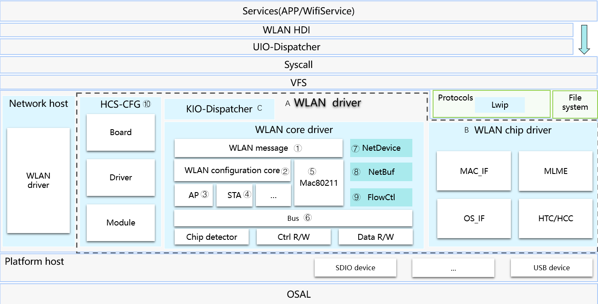
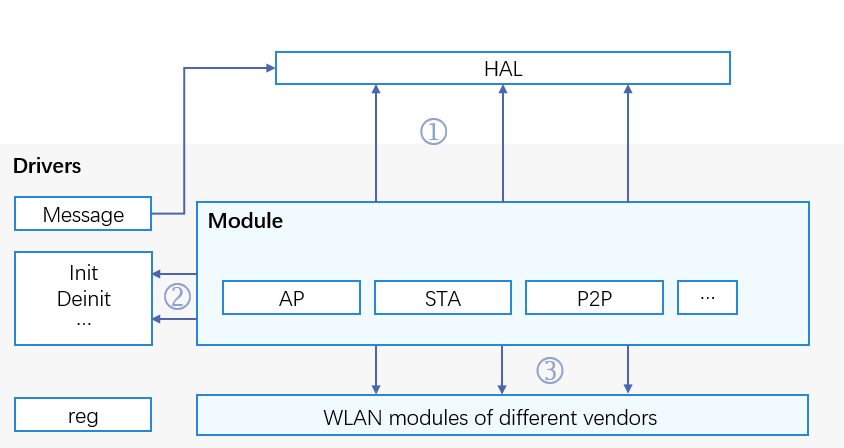

WLAN Overview
=============

Introduction
------------

The WLAN module is developed based on the OpenHarmony Driver Foundation.
It supports cross-OS migration, component adaptation, and modular
assembly and compilation. Based on the unified APIs provided by the WLAN
module, driver developers of WLAN vendors can adapt their driver code
and developers of the hardware abstraction layer (HAL) are capable of
creating, disabling, scanning, and connecting to WLAN hotspots. The
following figure shows the framework of the WLAN module:

**Figure 1** WLAN framework

|image1|

WLAN Driver API Architecture
----------------------------

The WLAN module provides the following three types of APIs:

-  APIs for HAL developers
-  APIs that can be called directly by driver developers
-  APIs for driver developers of different vendors to implement

This document provides guidelines on how to initialize a WLAN module.

**Figure 2** Available APIs of the WLAN module

|image2|

Available APIs
--------------

The WLAN driver module provides APIs for HAL developers, such as
creating, disabling, scanning, connecting to or disconnecting from WLAN
hotpots.

The WLAN driver module provides APIs that can be directly called by
driver developers, such as creating/releasing a **WifiModule**,
connecting to/disconnecting from a WLAN hotspot, applying for/releasing
a network data buffer, and converting between the **pbuf** structure of
Lightweight TCP/IP Stack (lwIP) and a network data buffer.

Table 1 describes some APIs.

**Table 1** APIs that can be directly called by driver developers

.. raw:: html

   <table>

.. raw:: html

   <thead align="left">

.. raw:: html

   <tr id="row121519334474">

.. raw:: html

   <th class="cellrowborder" valign="top" width="15.079999999999998%" id="mcps1.2.4.1.1">

.. raw:: html

   

File

.. raw:: html

   

.. raw:: html

   </th>

.. raw:: html

   <th class="cellrowborder" valign="top" width="60.33%" id="mcps1.2.4.1.2">

.. raw:: html

   

Function

.. raw:: html

   

.. raw:: html

   </th>

.. raw:: html

   <th class="cellrowborder" valign="top" width="24.59%" id="mcps1.2.4.1.3">

.. raw:: html

   

Description

.. raw:: html

   

.. raw:: html

   </th>

.. raw:: html

   </tr>

.. raw:: html

   </thead>

.. raw:: html

   <tbody>

.. raw:: html

   <tr id="row112150333476">

.. raw:: html

   <td class="cellrowborder" rowspan="4" valign="top" width="15.079999999999998%" headers="mcps1.2.4.1.1 ">

.. raw:: html

   

wifi_module.h

.. raw:: html

   

.. raw:: html

   

.. raw:: html

   

.. raw:: html

   </td>

.. raw:: html

   <td class="cellrowborder" valign="top" width="60.33%" headers="mcps1.2.4.1.2 ">

.. raw:: html

   

struct WifiModule *WifiModuleCreate(const struct
HdfConfigWifiModuleConfig*\ config);

.. raw:: html

   

.. raw:: html

   </td>

.. raw:: html

   <td class="cellrowborder" valign="top" width="24.59%" headers="mcps1.2.4.1.3 ">

.. raw:: html

   

Creates a WifiModule.

.. raw:: html

   

.. raw:: html

   </td>

.. raw:: html

   </tr>

.. raw:: html

   <tr id="row112151233194714">

.. raw:: html

   <td class="cellrowborder" valign="top" headers="mcps1.2.4.1.1 ">

.. raw:: html

   

void WifiModuleDelete(struct WifiModule \*module);

.. raw:: html

   

.. raw:: html

   </td>

.. raw:: html

   <td class="cellrowborder" valign="top" headers="mcps1.2.4.1.2 ">

.. raw:: html

   

Deletes and releases data of a WifiModule.

.. raw:: html

   

.. raw:: html

   </td>

.. raw:: html

   </tr>

.. raw:: html

   <tr id="row1121533316475">

.. raw:: html

   <td class="cellrowborder" valign="top" headers="mcps1.2.4.1.1 ">

.. raw:: html

   

int32_t DelFeature(struct WifiModule \*module, uint16_t featureType);

.. raw:: html

   

.. raw:: html

   </td>

.. raw:: html

   <td class="cellrowborder" valign="top" headers="mcps1.2.4.1.2 ">

.. raw:: html

   

Deletes a feature from a WifiModule.

.. raw:: html

   

.. raw:: html

   </td>

.. raw:: html

   </tr>

.. raw:: html

   <tr id="row172153335473">

.. raw:: html

   <td class="cellrowborder" valign="top" headers="mcps1.2.4.1.1 ">

.. raw:: html

   

int32_t AddFeature(struct WifiModule *module, uint16_t featureType,
struct WifiFeature*\ featureData);

.. raw:: html

   

.. raw:: html

   </td>

.. raw:: html

   <td class="cellrowborder" valign="top" headers="mcps1.2.4.1.2 ">

.. raw:: html

   

Adds a feature to a WifiModule.

.. raw:: html

   

.. raw:: html

   </td>

.. raw:: html

   </tr>

.. raw:: html

   <tr id="row451796205011">

.. raw:: html

   <td class="cellrowborder" rowspan="4" valign="top" width="15.079999999999998%" headers="mcps1.2.4.1.1 ">

.. raw:: html

   

wifi_mac80211_ops.h

.. raw:: html

   

.. raw:: html

   </td>

.. raw:: html

   <td class="cellrowborder" valign="top" width="60.33%" headers="mcps1.2.4.1.2 ">

.. raw:: html

   

int32_t (*startAp)(NetDevice*\ netDev);

.. raw:: html

   

.. raw:: html

   </td>

.. raw:: html

   <td class="cellrowborder" valign="top" width="24.59%" headers="mcps1.2.4.1.3 ">

.. raw:: html

   

Starts an AP.

.. raw:: html

   

.. raw:: html

   </td>

.. raw:: html

   </tr>

.. raw:: html

   <tr id="row5518663503">

.. raw:: html

   <td class="cellrowborder" valign="top" headers="mcps1.2.4.1.1 ">

.. raw:: html

   

int32_t (*stopAp)(NetDevice*\ netDev);

.. raw:: html

   

.. raw:: html

   </td>

.. raw:: html

   <td class="cellrowborder" valign="top" headers="mcps1.2.4.1.2 ">

.. raw:: html

   

Stops an AP.

.. raw:: html

   

.. raw:: html

   </td>

.. raw:: html

   </tr>

.. raw:: html

   <tr id="row851915617503">

.. raw:: html

   <td class="cellrowborder" valign="top" headers="mcps1.2.4.1.1 ">

.. raw:: html

   

int32_t (*connect)(NetDevice*\ netDev, WifiConnectParams \*param);

.. raw:: html

   

.. raw:: html

   </td>

.. raw:: html

   <td class="cellrowborder" valign="top" headers="mcps1.2.4.1.2 ">

.. raw:: html

   

Starts a connection.

.. raw:: html

   

.. raw:: html

   </td>

.. raw:: html

   </tr>

.. raw:: html

   <tr id="row18519136185016">

.. raw:: html

   <td class="cellrowborder" valign="top" headers="mcps1.2.4.1.1 ">

.. raw:: html

   

int32_t (*disconnect)(NetDevice*\ netDev, uint16_t reasonCode);

.. raw:: html

   

.. raw:: html

   </td>

.. raw:: html

   <td class="cellrowborder" valign="top" headers="mcps1.2.4.1.2 ">

.. raw:: html

   

Cancels a connection.

.. raw:: html

   

.. raw:: html

   </td>

.. raw:: html

   </tr>

.. raw:: html

   <tr id="row176421942125016">

.. raw:: html

   <td class="cellrowborder" rowspan="5" valign="top" width="15.079999999999998%" headers="mcps1.2.4.1.1 ">

.. raw:: html

   

hdf_netbuf.h

.. raw:: html

   

.. raw:: html

   </td>

.. raw:: html

   <td class="cellrowborder" valign="top" width="60.33%" headers="mcps1.2.4.1.2 ">

.. raw:: html

   

static inline void NetBufQueueInit(struct NetBufQueue \*q);

.. raw:: html

   

.. raw:: html

   </td>

.. raw:: html

   <td class="cellrowborder" valign="top" width="24.59%" headers="mcps1.2.4.1.3 ">

.. raw:: html

   

Initializes a network data buffer queue.

.. raw:: html

   

.. raw:: html

   </td>

.. raw:: html

   </tr>

.. raw:: html

   <tr id="row664264225020">

.. raw:: html

   <td class="cellrowborder" valign="top" headers="mcps1.2.4.1.1 ">

.. raw:: html

   

struct NetBuf \*NetBufAlloc(uint32_t size);

.. raw:: html

   

.. raw:: html

   </td>

.. raw:: html

   <td class="cellrowborder" valign="top" headers="mcps1.2.4.1.2 ">

.. raw:: html

   

Applies for a network data buffer.

.. raw:: html

   

.. raw:: html

   </td>

.. raw:: html

   </tr>

.. raw:: html

   <tr id="row19642134215018">

.. raw:: html

   <td class="cellrowborder" valign="top" headers="mcps1.2.4.1.1 ">

.. raw:: html

   

void NetBufFree(struct NetBuf \*nb);

.. raw:: html

   

.. raw:: html

   </td>

.. raw:: html

   <td class="cellrowborder" valign="top" headers="mcps1.2.4.1.2 ">

.. raw:: html

   

Releases a network data buffer.

.. raw:: html

   

.. raw:: html

   </td>

.. raw:: html

   </tr>

.. raw:: html

   <tr id="row7643194215013">

.. raw:: html

   <td class="cellrowborder" valign="top" headers="mcps1.2.4.1.1 ">

.. raw:: html

   

struct NetBuf *Pbuf2NetBuf(const struct NetDevice*\ netdev, struct pbuf
\*lwipBuf);

.. raw:: html

   

.. raw:: html

   </td>

.. raw:: html

   <td class="cellrowborder" valign="top" headers="mcps1.2.4.1.2 ">

.. raw:: html

   

Converts the pbuf structure of lwIP to a network data buffer.

.. raw:: html

   

.. raw:: html

   </td>

.. raw:: html

   </tr>

.. raw:: html

   <tr id="row7657132317518">

.. raw:: html

   <td class="cellrowborder" valign="top" headers="mcps1.2.4.1.1 ">

.. raw:: html

   

struct pbuf *NetBuf2Pbuf(const struct NetBuf*\ nb);

.. raw:: html

   

.. raw:: html

   </td>

.. raw:: html

   <td class="cellrowborder" valign="top" headers="mcps1.2.4.1.2 ">

.. raw:: html

   

Converts a network data buffer to the pbuf structure of lwIP.

.. raw:: html

   

.. raw:: html

   </td>

.. raw:: html

   </tr>

.. raw:: html

   </tbody>

.. raw:: html

   </table>

The WLAN driver module provides APIs for driver developers to implement
capabilities, such as initializing/deregistering, opening/stopping a
network device, and obtaining the state of a network device.

Table 2 describes some APIs.

**Table 2** APIs for driver developers of WLAN vendors to implement

.. raw:: html

   <table>

.. raw:: html

   <thead align="left">

.. raw:: html

   <tr id="row194625016476">

.. raw:: html

   <th class="cellrowborder" valign="top" width="20.75%" id="mcps1.2.4.1.1">

.. raw:: html

   

File

.. raw:: html

   

.. raw:: html

   </th>

.. raw:: html

   <th class="cellrowborder" valign="top" width="52.75%" id="mcps1.2.4.1.2">

.. raw:: html

   

Function

.. raw:: html

   

.. raw:: html

   </th>

.. raw:: html

   <th class="cellrowborder" valign="top" width="26.5%" id="mcps1.2.4.1.3">

.. raw:: html

   

Description

.. raw:: html

   

.. raw:: html

   </th>

.. raw:: html

   </tr>

.. raw:: html

   </thead>

.. raw:: html

   <tbody>

.. raw:: html

   <tr id="row04616509472">

.. raw:: html

   <td class="cellrowborder" rowspan="6" valign="top" width="20.75%" headers="mcps1.2.4.1.1 ">

.. raw:: html

   

net_device.h

.. raw:: html

   

.. raw:: html

   </td>

.. raw:: html

   <td class="cellrowborder" valign="top" width="52.75%" headers="mcps1.2.4.1.2 ">

.. raw:: html

   

int32_t (*init)(struct NetDevice*\ netDev);

.. raw:: html

   

.. raw:: html

   </td>

.. raw:: html

   <td class="cellrowborder" valign="top" width="26.5%" headers="mcps1.2.4.1.3 ">

.. raw:: html

   

Initializes a network device.

.. raw:: html

   

.. raw:: html

   </td>

.. raw:: html

   </tr>

.. raw:: html

   <tr id="row1546250114713">

.. raw:: html

   <td class="cellrowborder" valign="top" headers="mcps1.2.4.1.1 ">

.. raw:: html

   

struct NetDevStats *(*\ getStats)(struct NetDevice \*netDev);

.. raw:: html

   

.. raw:: html

   </td>

.. raw:: html

   <td class="cellrowborder" valign="top" headers="mcps1.2.4.1.2 ">

.. raw:: html

   

Obtains the state of a network device.

.. raw:: html

   

.. raw:: html

   </td>

.. raw:: html

   </tr>

.. raw:: html

   <tr id="row1646165010470">

.. raw:: html

   <td class="cellrowborder" valign="top" headers="mcps1.2.4.1.1 ">

.. raw:: html

   

int32_t (*setMacAddr)(struct NetDevice*\ netDev, void \*addr);

.. raw:: html

   

.. raw:: html

   </td>

.. raw:: html

   <td class="cellrowborder" valign="top" headers="mcps1.2.4.1.2 ">

.. raw:: html

   

Sets the MAC address.

.. raw:: html

   

.. raw:: html

   </td>

.. raw:: html

   </tr>

.. raw:: html

   <tr id="row12471250184711">

.. raw:: html

   <td class="cellrowborder" valign="top" headers="mcps1.2.4.1.1 ">

.. raw:: html

   

void (*deInit)(struct NetDevice*\ netDev);

.. raw:: html

   

.. raw:: html

   </td>

.. raw:: html

   <td class="cellrowborder" valign="top" headers="mcps1.2.4.1.2 ">

.. raw:: html

   

Deinitializes a network device.

.. raw:: html

   

.. raw:: html

   </td>

.. raw:: html

   </tr>

.. raw:: html

   <tr id="row13471050104719">

.. raw:: html

   <td class="cellrowborder" valign="top" headers="mcps1.2.4.1.1 ">

.. raw:: html

   

int32_t (*open)(struct NetDevice*\ netDev);

.. raw:: html

   

.. raw:: html

   </td>

.. raw:: html

   <td class="cellrowborder" valign="top" headers="mcps1.2.4.1.2 ">

.. raw:: html

   

Opens a network device.

.. raw:: html

   

.. raw:: html

   </td>

.. raw:: html

   </tr>

.. raw:: html

   <tr id="row1747125054714">

.. raw:: html

   <td class="cellrowborder" valign="top" headers="mcps1.2.4.1.1 ">

.. raw:: html

   

int32_t (*stop)(struct NetDevice*\ netDev);

.. raw:: html

   

.. raw:: html

   </td>

.. raw:: html

   <td class="cellrowborder" valign="top" headers="mcps1.2.4.1.2 ">

.. raw:: html

   

Stops a network device.

.. raw:: html

   

.. raw:: html

   </td>

.. raw:: html

   </tr>

.. raw:: html

   </tbody>

.. raw:: html

   </table>

