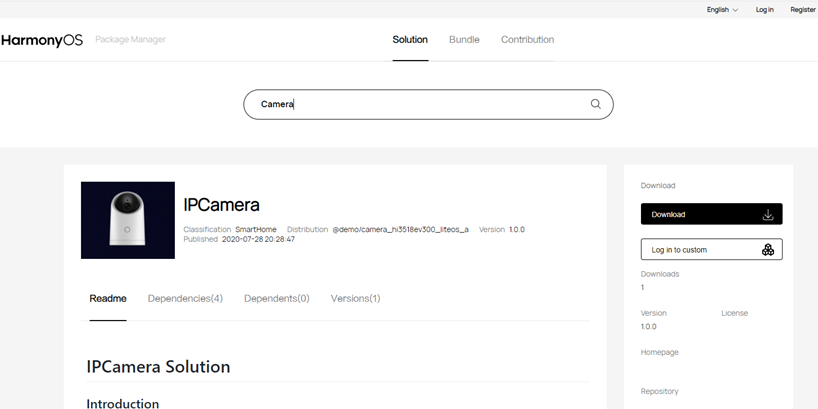

Source Code Acquisition
=======================

About OpenHarmony
-----------------

OpenHarmony is an open-source version of HarmonyOS. It is donated by
Huawei to OpenAtom Foundation. The first open-source version can run on
128 KB to 128 MB devices. You are welcomed to join the open-source
community for continuous improvement.

Access code repositories at https://openharmony.gitee.com.

Overview of Source Code Acquisition
-----------------------------------

This document describes how to acquire OpenHarmony source code and
provides its directory structure. The OpenHarmony code is open to you as
`bundles <../bundles/overview-0.rst>`__, which can be obtained in any of
the following ways:

-  **Method 1 (recommended)**: Download compressed files from an image
   site.
-  **Method 2**: Visit the HarmonyOS Package Manager
   (`HPM <https://hpm.harmonyos.com/#/en/home>`__) platform, search for
   your desired solution, select or exclude bundles from the solution,
   and download it.
-  **Method 3**: Use an hpm-cli tool available on the
   `HPM <https://hpm.harmonyos.com/#/en/home>`__ platform, and run
   related HPM commands to download your desired code.
-  **Method 4**: Use the **repo** or **git** tool to download your
   desired code from the code repository.

Method 1: Acquiring Source Code from Image Sites
------------------------------------------------

You can download the source code or the corresponding solutions from the
image library at the sites listed below.

**Table 1** Acquiring source code from image sites

.. raw:: html

   <table>

.. raw:: html

   <thead align="left">

.. raw:: html

   <tr id="row5928133152512">

.. raw:: html

   <th class="cellrowborder" valign="top" width="25%" id="mcps1.2.5.1.1">

.. raw:: html

   

Content

.. raw:: html

   

.. raw:: html

   </th>

.. raw:: html

   <th class="cellrowborder" valign="top" width="16.14%" id="mcps1.2.5.1.2">

.. raw:: html

   

Version Information

.. raw:: html

   

.. raw:: html

   </th>

.. raw:: html

   <th class="cellrowborder" valign="top" width="24.759999999999998%" id="mcps1.2.5.1.3">

.. raw:: html

   

Site

.. raw:: html

   

.. raw:: html

   </th>

.. raw:: html

   <th class="cellrowborder" valign="top" width="34.1%" id="mcps1.2.5.1.4">

.. raw:: html

   

SHA-256 Verification Code

.. raw:: html

   

.. raw:: html

   </th>

.. raw:: html

   </tr>

.. raw:: html

   </thead>

.. raw:: html

   <tbody>

.. raw:: html

   <tr id="row492963182513">

.. raw:: html

   <td class="cellrowborder" valign="top" width="25%" headers="mcps1.2.5.1.1 ">

.. raw:: html

   

OpenHarmony full code base

.. raw:: html

   

.. raw:: html

   </td>

.. raw:: html

   <td class="cellrowborder" valign="top" width="16.14%" headers="mcps1.2.5.1.2 ">

.. raw:: html

   

1.0

.. raw:: html

   

.. raw:: html

   </td>

.. raw:: html

   <td class="cellrowborder" valign="top" width="24.759999999999998%" headers="mcps1.2.5.1.3 ">

.. raw:: html

   

Site

.. raw:: html

   

.. raw:: html

   </td>

.. raw:: html

   <td class="cellrowborder" valign="top" width="34.1%" headers="mcps1.2.5.1.4 ">

.. raw:: html

   

SHA-256 Verification Code

.. raw:: html

   

.. raw:: html

   </td>

.. raw:: html

   </tr>

.. raw:: html

   <tr id="row6929934252">

.. raw:: html

   <td class="cellrowborder" valign="top" width="25%" headers="mcps1.2.5.1.1 ">

.. raw:: html

   

Hi3861 solutions (binary)

.. raw:: html

   

.. raw:: html

   </td>

.. raw:: html

   <td class="cellrowborder" valign="top" width="16.14%" headers="mcps1.2.5.1.2 ">

.. raw:: html

   

1.0

.. raw:: html

   

.. raw:: html

   </td>

.. raw:: html

   <td class="cellrowborder" valign="top" width="24.759999999999998%" headers="mcps1.2.5.1.3 ">

.. raw:: html

   

Site

.. raw:: html

   

.. raw:: html

   </td>

.. raw:: html

   <td class="cellrowborder" valign="top" width="34.1%" headers="mcps1.2.5.1.4 ">

.. raw:: html

   

SHA-256 Verification Code

.. raw:: html

   

.. raw:: html

   </td>

.. raw:: html

   </tr>

.. raw:: html

   <tr id="row1293014352510">

.. raw:: html

   <td class="cellrowborder" valign="top" width="25%" headers="mcps1.2.5.1.1 ">

.. raw:: html

   

Hi3518 solutions (binary)

.. raw:: html

   

.. raw:: html

   </td>

.. raw:: html

   <td class="cellrowborder" valign="top" width="16.14%" headers="mcps1.2.5.1.2 ">

.. raw:: html

   

1.0

.. raw:: html

   

.. raw:: html

   </td>

.. raw:: html

   <td class="cellrowborder" valign="top" width="24.759999999999998%" headers="mcps1.2.5.1.3 ">

.. raw:: html

   

Site

.. raw:: html

   

.. raw:: html

   </td>

.. raw:: html

   <td class="cellrowborder" valign="top" width="34.1%" headers="mcps1.2.5.1.4 ">

.. raw:: html

   

SHA-256 Verification Code

.. raw:: html

   

.. raw:: html

   </td>

.. raw:: html

   </tr>

.. raw:: html

   <tr id="row199306317255">

.. raw:: html

   <td class="cellrowborder" valign="top" width="25%" headers="mcps1.2.5.1.1 ">

.. raw:: html

   

Hi3516 solutions (binary)

.. raw:: html

   

.. raw:: html

   </td>

.. raw:: html

   <td class="cellrowborder" valign="top" width="16.14%" headers="mcps1.2.5.1.2 ">

.. raw:: html

   

1.0

.. raw:: html

   

.. raw:: html

   </td>

.. raw:: html

   <td class="cellrowborder" valign="top" width="24.759999999999998%" headers="mcps1.2.5.1.3 ">

.. raw:: html

   

Site

.. raw:: html

   

.. raw:: html

   </td>

.. raw:: html

   <td class="cellrowborder" valign="top" width="34.1%" headers="mcps1.2.5.1.4 ">

.. raw:: html

   

SHA-256 Verification Code

.. raw:: html

   

.. raw:: html

   </td>

.. raw:: html

   </tr>

.. raw:: html

   <tr id="row13795111119551">

.. raw:: html

   <td class="cellrowborder" valign="top" width="25%" headers="mcps1.2.5.1.1 ">

.. raw:: html

   

RELEASE-NOTES

.. raw:: html

   

.. raw:: html

   </td>

.. raw:: html

   <td class="cellrowborder" valign="top" width="16.14%" headers="mcps1.2.5.1.2 ">

.. raw:: html

   

1.0

.. raw:: html

   

.. raw:: html

   </td>

.. raw:: html

   <td class="cellrowborder" valign="top" width="24.759999999999998%" headers="mcps1.2.5.1.3 ">

.. raw:: html

   

Site

.. raw:: html

   

.. raw:: html

   </td>

.. raw:: html

   <td class="cellrowborder" valign="top" width="34.1%" headers="mcps1.2.5.1.4 ">

.. raw:: html

   

-

.. raw:: html

   

.. raw:: html

   </td>

.. raw:: html

   </tr>

.. raw:: html

   </tbody>

.. raw:: html

   </table>

Method 2: Acquiring Source Code from the Bundle-specific HPM
------------------------------------------------------------

When to Use
-----------

If OpenHarmony is new to you, sample solutions are helpful to your
development. The `HPM <https://hpm.harmonyos.com/#/en/home>`__ platform
provides a recommended solution. You can add or exclude bundles to
quickly customize your system.

How to Use
----------

1. Search for a proper solution.

   1. Access the `HPM <https://hpm.harmonyos.com/#/en/home>`__ page, and
      click the **Solution** tab, as shown in the following figure.

   2. Enter a keyword (“camera” as an example) in the search box. All
      matched solutions are found.

   3. Specify filter criteria, such as the bundle type (example: **Board
      support** and **Kernel support**), to further filter the
      solutions.

   4. Click the solution you need to view its details.

      **Figure 1** HPM page

      |image1|

2. Customize the solution.

   1. Read the information under **Readme** to learn about the solution
      (application scenarios, features, usage, and customization), as
      shown in the following figure.
   2. Click **Download** to download the solution to your local PC.
   3. Click **Log in to custom** to customize the bundles for the
      solution.

   **Figure 2** Solution example

   |image2|

3. Customize bundles.

   1. Access the **Custom solution** page, as shown in the following
      figure.
   2. Set the toggle switch next to a specific optional bundle to
      exclude it from the solution, or click **Add bundle** to add new
      bundles.
   3. Enter the basic information about your project, including the
      bundle name, version, and description, on the right pane.
   4. Click **Download**. The system then generates the OpenHarmony code
      structure file (for example, **name.zip**) and saves it to your
      local PC.

      -  The downloaded compressed package does not contain the original
         file of source code. You can import the package to the IDE,
         decompress it, and run the **hpm install** command to download
         all required bundles.

      -  The downloaded bundles are stored in the **ohos_bundles**
         folder in the project directory.

         **Figure 3** Customizing bundles

         |image3|

Method 3: Acquiring Source Code with a hpm-cli Tool
---------------------------------------------------

.. _when-to-use-1:

When to Use
-----------

-  You have obtained bundle-specific source code from the HPM website,
   and want to independently upgrade one or more bundles in the source
   code.
-  You are familiar with OpenHarmony development and **hpm-cli** tools.

Preparations
------------

You need to install the **Node.js** and hpm-cli tool as follows:

1. Install **Node.js**.

   Download **Node.js** from its official website and install it on your
   local PC.

   You are advised to install `Node.js <https://nodejs.org/>`__ 12.x
   (including npm 6.14.4) or a later version (12.13.0 or later is
   recommended).

2. Install the hpm-cli tool using **npm** delivered with **Node.js**.

   Open the CMD window and run the following command:

   ::

      npm install -g @ohos/hpm-cli

3. Run the following command to check whether the installation is
   successful. If the HPM version is displayed, the installation is
   successful.

   ::

      hpm -V or hpm --version

4. Run the following command to upgrade the HPM version:

   ::

      npm update -g @ohos/hpm-cli

Operations
----------

Add the bundle (**@ohos/demo** as an example) to your project as
follows:

1. Go to the development directory and run the following command to
   create a development project using the default template:

   ::

      hpm init -t default

2. Run the following command to install the bundle (**@ohos/demo** as an
   example):

   ::

      hpm install @ohos/demo

3. Verify that the **hpm-cli** tool automatically downloads all
   dependent bundles from the server. If the download is successful, the
   message “Install successfully!” is displayed.

   ::

      $ hpm install @ohos/demo
      Requesting: https://url.foo.bar/hpm/registry/api/bundles/@ohos/demo
      downloading @ohos/demo
      Requesting: https://lfcontentcenterdev....../bMAlLrYISLqdUTFFFCdgzA.tgz
      extract D:\demo\ohos_bundles\@ohos\demo\@ohos-demo-1.0.7.tgz
      Install successfully!

Method 4: Acquiring Source Code from a Code Repository
------------------------------------------------------

.. _when-to-use-2:

When to Use
-----------

-  You want to establish a baseline based on stable OpenHarmony releases
   and distribute the baseline to your customers.

-  You have interconnected your software with OpenHarmony and need
   official certification from OpenHarmony.

-  You want to contribute code to the OpenHarmony ecosystem after chips,
   modules, and applications are certified by OpenHarmony.

-  You need to address OpenHarmony issues.

-  You want to learn OpenHarmony source code.

.. _preparations-1:

Preparations
------------

1. Register your account with gitee.

2. Register an SSH public key.

3. Install the git client and configure basic information.

   ::

      git config --global user.name "yourname"
      git config --global user.email "your-email-address"
      git config --global credential.helper store

4. Run the following commands to install the **repo** tool:

   ::

      curl https://gitee.com/oschina/repo/raw/fork_flow/repo-py3 > /usr/local/bin/repo
      chmod a+x /usr/local/bin/repo
      pip install -i https://pypi.tuna.tsinghua.edu.cn/simple requests

.. _operations-1:

Operations
----------

Method 1 (recommended): Use the **repo** tool to download source code.

::

   repo init -u https://gitee.com/openharmony/manifest.git -b master --no-repo-verify
   repo sync -c

Method 2: Run the **git clone** command to clone a single code
repository.

Go to https://gitee.com/openharmony, select the code repository to be
cloned, and run the following command:

::

   git clone https://gitee.com/openharmony/manifest.git -b master

Source Code Directories
-----------------------

The following table describes the OpenHarmony source code directories.

**Table 2** Directory description

.. raw:: html

   <table>

.. raw:: html

   <thead align="left">

.. raw:: html

   <tr id="row198162047192810">

.. raw:: html

   <th class="cellrowborder" valign="top" width="50%" id="mcps1.2.3.1.1">

.. raw:: html

   

Name

.. raw:: html

   

.. raw:: html

   </th>

.. raw:: html

   <th class="cellrowborder" valign="top" width="50%" id="mcps1.2.3.1.2">

.. raw:: html

   

Description

.. raw:: html

   

.. raw:: html

   </th>

.. raw:: html

   </tr>

.. raw:: html

   </thead>

.. raw:: html

   <tbody>

.. raw:: html

   <tr id="row1981674719280">

.. raw:: html

   <td class="cellrowborder" valign="top" width="50%" headers="mcps1.2.3.1.1 ">

.. raw:: html

   

applications

.. raw:: html

   

.. raw:: html

   </td>

.. raw:: html

   <td class="cellrowborder" valign="top" width="50%" headers="mcps1.2.3.1.2 ">

.. raw:: html

   

Application samples, including wifi-iot and ip-camera

.. raw:: html

   

.. raw:: html

   </td>

.. raw:: html

   </tr>

.. raw:: html

   <tr id="row5816747132817">

.. raw:: html

   <td class="cellrowborder" valign="top" width="50%" headers="mcps1.2.3.1.1 ">

.. raw:: html

   

base

.. raw:: html

   

.. raw:: html

   </td>

.. raw:: html

   <td class="cellrowborder" valign="top" width="50%" headers="mcps1.2.3.1.2 ">

.. raw:: html

   

Basic software service subsystem set and hardware service subsystem set

.. raw:: html

   

.. raw:: html

   </td>

.. raw:: html

   </tr>

.. raw:: html

   <tr id="row1134218692910">

.. raw:: html

   <td class="cellrowborder" valign="top" width="50%" headers="mcps1.2.3.1.1 ">

.. raw:: html

   

build

.. raw:: html

   

.. raw:: html

   </td>

.. raw:: html

   <td class="cellrowborder" valign="top" width="50%" headers="mcps1.2.3.1.2 ">

.. raw:: html

   

Bundle-based compilation, building, and configuration scripts

.. raw:: html

   

.. raw:: html

   </td>

.. raw:: html

   </tr>

.. raw:: html

   <tr id="row1841618902919">

.. raw:: html

   <td class="cellrowborder" valign="top" width="50%" headers="mcps1.2.3.1.1 ">

.. raw:: html

   

domains

.. raw:: html

   

.. raw:: html

   </td>

.. raw:: html

   <td class="cellrowborder" valign="top" width="50%" headers="mcps1.2.3.1.2 ">

.. raw:: html

   

Enhanced software service subsystem set

.. raw:: html

   

.. raw:: html

   </td>

.. raw:: html

   </tr>

.. raw:: html

   <tr id="row841620912298">

.. raw:: html

   <td class="cellrowborder" valign="top" width="50%" headers="mcps1.2.3.1.1 ">

.. raw:: html

   

drivers

.. raw:: html

   

.. raw:: html

   </td>

.. raw:: html

   <td class="cellrowborder" valign="top" width="50%" headers="mcps1.2.3.1.2 ">

.. raw:: html

   

Driver subsystem

.. raw:: html

   

.. raw:: html

   </td>

.. raw:: html

   </tr>

.. raw:: html

   <tr id="row164164992915">

.. raw:: html

   <td class="cellrowborder" valign="top" width="50%" headers="mcps1.2.3.1.1 ">

.. raw:: html

   

foundation

.. raw:: html

   

.. raw:: html

   </td>

.. raw:: html

   <td class="cellrowborder" valign="top" width="50%" headers="mcps1.2.3.1.2 ">

.. raw:: html

   

Basic system capability subsystem set

.. raw:: html

   

.. raw:: html

   </td>

.. raw:: html

   </tr>

.. raw:: html

   <tr id="row1441610922915">

.. raw:: html

   <td class="cellrowborder" valign="top" width="50%" headers="mcps1.2.3.1.1 ">

.. raw:: html

   

kernel

.. raw:: html

   

.. raw:: html

   </td>

.. raw:: html

   <td class="cellrowborder" valign="top" width="50%" headers="mcps1.2.3.1.2 ">

.. raw:: html

   

Kernel subsystem

.. raw:: html

   

.. raw:: html

   </td>

.. raw:: html

   </tr>

.. raw:: html

   <tr id="row194175972917">

.. raw:: html

   <td class="cellrowborder" valign="top" width="50%" headers="mcps1.2.3.1.1 ">

.. raw:: html

   

prebuilts

.. raw:: html

   

.. raw:: html

   </td>

.. raw:: html

   <td class="cellrowborder" valign="top" width="50%" headers="mcps1.2.3.1.2 ">

.. raw:: html

   

Compiler and tool chain subsystem

.. raw:: html

   

.. raw:: html

   </td>

.. raw:: html

   </tr>

.. raw:: html

   <tr id="row841718942913">

.. raw:: html

   <td class="cellrowborder" valign="top" width="50%" headers="mcps1.2.3.1.1 ">

.. raw:: html

   

test

.. raw:: html

   

.. raw:: html

   </td>

.. raw:: html

   <td class="cellrowborder" valign="top" width="50%" headers="mcps1.2.3.1.2 ">

.. raw:: html

   

Testing subsystem

.. raw:: html

   

.. raw:: html

   </td>

.. raw:: html

   </tr>

.. raw:: html

   <tr id="row24175915294">

.. raw:: html

   <td class="cellrowborder" valign="top" width="50%" headers="mcps1.2.3.1.1 ">

.. raw:: html

   

third_party

.. raw:: html

   

.. raw:: html

   </td>

.. raw:: html

   <td class="cellrowborder" valign="top" width="50%" headers="mcps1.2.3.1.2 ">

.. raw:: html

   

Open-source third-party software

.. raw:: html

   

.. raw:: html

   </td>

.. raw:: html

   </tr>

.. raw:: html

   <tr id="row334210652914">

.. raw:: html

   <td class="cellrowborder" valign="top" width="50%" headers="mcps1.2.3.1.1 ">

.. raw:: html

   

utils

.. raw:: html

   

.. raw:: html

   </td>

.. raw:: html

   <td class="cellrowborder" valign="top" width="50%" headers="mcps1.2.3.1.2 ">

.. raw:: html

   

Commonly used development tools

.. raw:: html

   

.. raw:: html

   </td>

.. raw:: html

   </tr>

.. raw:: html

   <tr id="row73421664298">

.. raw:: html

   <td class="cellrowborder" valign="top" width="50%" headers="mcps1.2.3.1.1 ">

.. raw:: html

   

vendor

.. raw:: html

   

.. raw:: html

   </td>

.. raw:: html

   <td class="cellrowborder" valign="top" width="50%" headers="mcps1.2.3.1.2 ">

.. raw:: html

   

Vendor-provided software

.. raw:: html

   

.. raw:: html

   </td>

.. raw:: html

   </tr>

.. raw:: html

   <tr id="row734319617292">

.. raw:: html

   <td class="cellrowborder" valign="top" width="50%" headers="mcps1.2.3.1.1 ">

.. raw:: html

   

build.py

.. raw:: html

   

.. raw:: html

   </td>

.. raw:: html

   <td class="cellrowborder" valign="top" width="50%" headers="mcps1.2.3.1.2 ">

.. raw:: html

   

Compilation script file

.. raw:: html

   

.. raw:: html

   </td>

.. raw:: html

   </tr>

.. raw:: html

   </tbody>

.. raw:: html

   </table>

