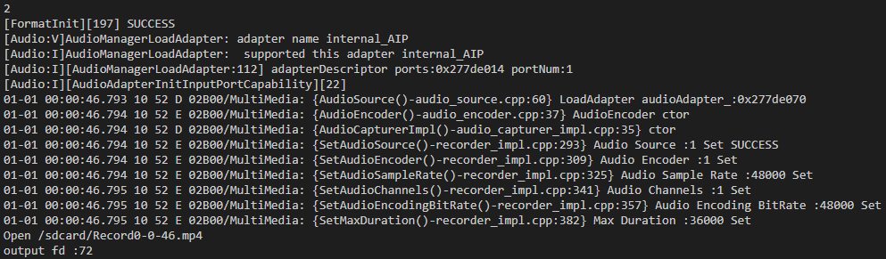
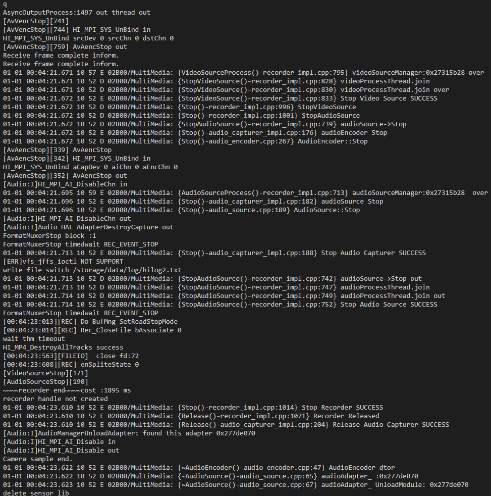

Use Case
========

-  For details about the development board, compilation, burning, and
   image running process, see `Getting Started with
   Hi3516 <../quick-start/introduction-to-the-hi3516-development-board.rst>`__.
   The compilation results include that of the **camera_sample**
   program.

-  The sample code for camera development is stored in
   **applications/sample/camera/media/camera_sample.cpp**.

      |image1| **NOTICE:** You should insert a TF card (maximum
      capacity: 128 GB) for photographing and video recording functions.
      After the system is started, the TF card is automatically mounted
      to the **/sdcard** directory. If the TF card is inserted after the
      system is started, you have to manually mount the TF card. To view
      the photos and videos in the TF card, copy the content to a
      computer. The preview function does not require a TF card.

1. Start the **camera_sample** program.

   | **Figure 1** Starting camera_sample
   | |image2|

   The control commands are displayed as shown in the preceding figure.
   Press **S** to stop the current operation (including video recording
   and preview), and press **Q** to exit the program.

2. Press **1** to take a photo in JPG format. The photo is saved in the
   **/sdcard** directory and named **Capture\***.

   | **Figure 2** Serial port logs displayed after the photographing
     command is executed
   | |image3|

   To view the saved file, exit the program and enter the file system.
   To start the program again, return to `Step 1 <#li15116103915513>`__.

   | **Figure 3** Saved files
   | |image4|

3. Press **2** to start recording. The video file is in MP4 format and
   saved in the **/sdcard** directory with the name **Record\***. Press
   **S** to stop recording.

   | **Figure 4** Serial port logs displayed after the recording command
     is executed
   | |image5|

4. Press **3** to start preview. The preview is displayed on the screen.
   Press **S** to stop preview.

   | **Figure 5** Serial port logs displayed after the preview command
     is executed
   | |image6|

   The following figure shows the preview.

   | **Figure 6** Preview effect
   | |image7|

5. Press **Q** to exit.

   | **Figure 7** Serial port logs displayed after the exit command is
     executed
   | |image8|

.. |image1| image:: public_sys-resources/icon-notice.gif

