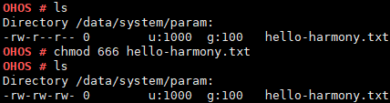

chmod
=====

Command Function
----------------

This command is used to change the file operation permission.

Syntax
------

chmod [*mode*] [*pathname*]

Parameter Description
---------------------

**Table 1** Parameters

.. raw:: html

   <table>

.. raw:: html

   <thead align="left">

.. raw:: html

   <tr id="row1055mcpsimp">

.. raw:: html

   <th class="cellrowborder" valign="top" width="21%" id="mcps1.2.4.1.1">

.. raw:: html

   

Parameter

.. raw:: html

   

.. raw:: html

   </th>

.. raw:: html

   <th class="cellrowborder" valign="top" width="52%" id="mcps1.2.4.1.2">

.. raw:: html

   

Description

.. raw:: html

   

.. raw:: html

   </th>

.. raw:: html

   <th class="cellrowborder" valign="top" width="27%" id="mcps1.2.4.1.3">

.. raw:: html

   

Value Range

.. raw:: html

   

.. raw:: html

   </th>

.. raw:: html

   </tr>

.. raw:: html

   </thead>

.. raw:: html

   <tbody>

.. raw:: html

   <tr id="row1062mcpsimp">

.. raw:: html

   <td class="cellrowborder" valign="top" width="21%" headers="mcps1.2.4.1.1 ">

.. raw:: html

   

mode

.. raw:: html

   

.. raw:: html

   </td>

.. raw:: html

   <td class="cellrowborder" valign="top" width="52%" headers="mcps1.2.4.1.2 ">

.. raw:: html

   

Indicates the permission for a file or directory. The value is an octal
number, representing the permission of User (owner), Group (group), or
Other (other groups).

.. raw:: html

   

.. raw:: html

   </td>

.. raw:: html

   <td class="cellrowborder" valign="top" width="27%" headers="mcps1.2.4.1.3 ">

.. raw:: html

   

[0, 777]

.. raw:: html

   

.. raw:: html

   </td>

.. raw:: html

   </tr>

.. raw:: html

   <tr id="row172161126124218">

.. raw:: html

   <td class="cellrowborder" valign="top" width="21%" headers="mcps1.2.4.1.1 ">

.. raw:: html

   

pathname

.. raw:: html

   

.. raw:: html

   </td>

.. raw:: html

   <td class="cellrowborder" valign="top" width="52%" headers="mcps1.2.4.1.2 ">

.. raw:: html

   

Indicates the file path.

.. raw:: html

   

.. raw:: html

   </td>

.. raw:: html

   <td class="cellrowborder" valign="top" width="27%" headers="mcps1.2.4.1.3 ">

.. raw:: html

   

An existing file

.. raw:: html

   

.. raw:: html

   </td>

.. raw:: html

   </tr>

.. raw:: html

   </tbody>

.. raw:: html

   </table>

Usage
-----

By specifying the **mode** parameter before the file name, you can
change the permission for this file.

Example
-------

Enter **chmod 666 hello-harmony.txt**.

Output
------

| **Figure 1** Changing the permission on the **hello-harmony.txt** file
  to **666**\ 
| |image1|

