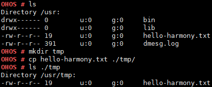

cp
==

Command Function
----------------

This command is used to create a copy for a file.

Syntax
------

cp [*SOURCEFILE*] [*DESTFILE*]

Parameter Description
---------------------

**Table 1** Parameters

.. raw:: html

   <table>

.. raw:: html

   <thead align="left">

.. raw:: html

   <tr id="row1136mcpsimp">

.. raw:: html

   <th class="cellrowborder" valign="top" width="21%" id="mcps1.2.4.1.1">

.. raw:: html

   

Parameter

.. raw:: html

   

.. raw:: html

   </th>

.. raw:: html

   <th class="cellrowborder" valign="top" width="52%" id="mcps1.2.4.1.2">

.. raw:: html

   

Description

.. raw:: html

   

.. raw:: html

   </th>

.. raw:: html

   <th class="cellrowborder" valign="top" width="27%" id="mcps1.2.4.1.3">

.. raw:: html

   

Value Range

.. raw:: html

   

.. raw:: html

   </th>

.. raw:: html

   </tr>

.. raw:: html

   </thead>

.. raw:: html

   <tbody>

.. raw:: html

   <tr id="row1143mcpsimp">

.. raw:: html

   <td class="cellrowborder" valign="top" width="21%" headers="mcps1.2.4.1.1 ">

.. raw:: html

   

SOURCEFILE

.. raw:: html

   

.. raw:: html

   </td>

.. raw:: html

   <td class="cellrowborder" valign="top" width="52%" headers="mcps1.2.4.1.2 ">

.. raw:: html

   

Indicates the path to the source file.

.. raw:: html

   

.. raw:: html

   </td>

.. raw:: html

   <td class="cellrowborder" valign="top" width="27%" headers="mcps1.2.4.1.3 ">

.. raw:: html

   

Currently, only files are supported. Directories are not supported.

.. raw:: html

   

.. raw:: html

   </td>

.. raw:: html

   </tr>

.. raw:: html

   <tr id="row1150mcpsimp">

.. raw:: html

   <td class="cellrowborder" valign="top" width="21%" headers="mcps1.2.4.1.1 ">

.. raw:: html

   

DESTFILE

.. raw:: html

   

.. raw:: html

   </td>

.. raw:: html

   <td class="cellrowborder" valign="top" width="52%" headers="mcps1.2.4.1.2 ">

.. raw:: html

   

Indicates the path to the destination file.

.. raw:: html

   

.. raw:: html

   </td>

.. raw:: html

   <td class="cellrowborder" valign="top" width="27%" headers="mcps1.2.4.1.3 ">

.. raw:: html

   

Both directories and files are supported.

.. raw:: html

   

.. raw:: html

   </td>

.. raw:: html

   </tr>

.. raw:: html

   </tbody>

.. raw:: html

   </table>

Usage
-----

-  The name of the source file cannot be the same as that of the
   destination file in the same path.
-  The source file must exist and cannot be a directory.
-  The source file path supports wildcards: asterisks (*) and question
   marks (?). The asterisk (*) indicates any number of characters, and
   the question mark (?) represents a single character. The destination
   file path does not support wildcards. If the specified source file
   path matches multiple files, the destination file path must be a
   directory.
-  If the destination file path is a directory, this directory must
   exist. In this case, the destination file is named after the source
   file.
-  If the destination file path is a file, the directory for this file
   must exist. In this case, the file copy is renamed.
-  Currently, this command can be used to copy only one file. If more
   than two parameters are specified, only the first two parameters take
   effect.
-  If the destination file does not exist, a new file is created. If the
   destination file already exists, the existing file is overwritten.

When important system resources are copied, unexpected results such as a
system breakdown may occur. For example, when the **/dev/uartdev-0**
file is copied, the system may stop responding.

Example
-------

Enter **cp hello-harmony.txt ./tmp/**.

Output
------

| **Figure 1** File copying result
| |image1|

