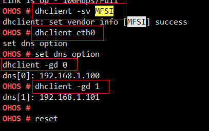

dhclient
========

Command Function
----------------

This command is used to set and view **dhclient** parameters.

Syntax
------

dhclient <*netif name*>

dhclient -x <*netif name*>

dhclient -gb <*netif name*>

dhclient -sv <*vendor*>

dhclient -gv

dhclient -gd <*index*>

dhclient -sd <*dns_ip*>

Parameter Description
---------------------

**Table 1** Parameters

.. raw:: html

   <table>

.. raw:: html

   <thead align="left">

.. raw:: html

   <tr id="row444mcpsimp">

.. raw:: html

   <th class="cellrowborder" valign="top" width="21%" id="mcps1.2.4.1.1">

.. raw:: html

   

Parameter

.. raw:: html

   

.. raw:: html

   </th>

.. raw:: html

   <th class="cellrowborder" valign="top" width="52%" id="mcps1.2.4.1.2">

.. raw:: html

   

Description

.. raw:: html

   

.. raw:: html

   </th>

.. raw:: html

   <th class="cellrowborder" valign="top" width="27%" id="mcps1.2.4.1.3">

.. raw:: html

   

Value Range

.. raw:: html

   

.. raw:: html

   </th>

.. raw:: html

   </tr>

.. raw:: html

   </thead>

.. raw:: html

   <tbody>

.. raw:: html

   <tr id="row451mcpsimp">

.. raw:: html

   <td class="cellrowborder" valign="top" width="21%" headers="mcps1.2.4.1.1 ">

.. raw:: html

   

<netif name>

.. raw:: html

   

.. raw:: html

   </td>

.. raw:: html

   <td class="cellrowborder" valign="top" width="52%" headers="mcps1.2.4.1.2 ">

.. raw:: html

   

Starts the DHCP request of the network interface card (NIC).

.. raw:: html

   

.. raw:: html

   </td>

.. raw:: html

   <td class="cellrowborder" valign="top" width="27%" headers="mcps1.2.4.1.3 ">

.. raw:: html

   

NIC name, eth0

.. raw:: html

   

.. raw:: html

   </td>

.. raw:: html

   </tr>

.. raw:: html

   <tr id="row1110416513817">

.. raw:: html

   <td class="cellrowborder" valign="top" width="21%" headers="mcps1.2.4.1.1 ">

.. raw:: html

   

-x <netif name>

.. raw:: html

   

.. raw:: html

   </td>

.. raw:: html

   <td class="cellrowborder" valign="top" width="52%" headers="mcps1.2.4.1.2 ">

.. raw:: html

   

Disables the DHCP function for the NIC.

.. raw:: html

   

.. raw:: html

   </td>

.. raw:: html

   <td class="cellrowborder" valign="top" width="27%" headers="mcps1.2.4.1.3 ">

.. raw:: html

   

NIC name, eth0

.. raw:: html

   

.. raw:: html

   </td>

.. raw:: html

   </tr>

.. raw:: html

   <tr id="row8809123074012">

.. raw:: html

   <td class="cellrowborder" valign="top" width="21%" headers="mcps1.2.4.1.1 ">

.. raw:: html

   

-gb <netif name>

.. raw:: html

   

.. raw:: html

   </td>

.. raw:: html

   <td class="cellrowborder" valign="top" width="52%" headers="mcps1.2.4.1.2 ">

.. raw:: html

   

Checks whether the DHCP request of the NIC is complete.

.. raw:: html

   

.. raw:: html

   </td>

.. raw:: html

   <td class="cellrowborder" valign="top" width="27%" headers="mcps1.2.4.1.3 ">

.. raw:: html

   

NIC name, eth0

.. raw:: html

   

.. raw:: html

   </td>

.. raw:: html

   </tr>

.. raw:: html

   <tr id="row46581611174117">

.. raw:: html

   <td class="cellrowborder" valign="top" width="21%" headers="mcps1.2.4.1.1 ">

.. raw:: html

   

-sv <vendor>

.. raw:: html

   

.. raw:: html

   </td>

.. raw:: html

   <td class="cellrowborder" valign="top" width="52%" headers="mcps1.2.4.1.2 ">

.. raw:: html

   

Sets the vendor information of a DHCP request.

.. raw:: html

   

.. raw:: html

   </td>

.. raw:: html

   <td class="cellrowborder" valign="top" width="27%" headers="mcps1.2.4.1.3 ">

.. raw:: html

   

Vendor information (The value is a string of 32 characters.)

.. raw:: html

   

.. raw:: html

   </td>

.. raw:: html

   </tr>

.. raw:: html

   <tr id="row14729211134217">

.. raw:: html

   <td class="cellrowborder" valign="top" width="21%" headers="mcps1.2.4.1.1 ">

.. raw:: html

   

-gv

.. raw:: html

   

.. raw:: html

   </td>

.. raw:: html

   <td class="cellrowborder" valign="top" width="52%" headers="mcps1.2.4.1.2 ">

.. raw:: html

   

Displays the vendor information in a DHCP request.

.. raw:: html

   

.. raw:: html

   </td>

.. raw:: html

   <td class="cellrowborder" valign="top" width="27%" headers="mcps1.2.4.1.3 ">

.. raw:: html

   

N/A

.. raw:: html

   

.. raw:: html

   </td>

.. raw:: html

   </tr>

.. raw:: html

   <tr id="row4940853114219">

.. raw:: html

   <td class="cellrowborder" valign="top" width="21%" headers="mcps1.2.4.1.1 ">

.. raw:: html

   

-gd <index>

.. raw:: html

   

.. raw:: html

   </td>

.. raw:: html

   <td class="cellrowborder" valign="top" width="52%" headers="mcps1.2.4.1.2 ">

.. raw:: html

   

Obtains information about the DNS server at the specified index.

.. raw:: html

   

.. raw:: html

   </td>

.. raw:: html

   <td class="cellrowborder" valign="top" width="27%" headers="mcps1.2.4.1.3 ">

.. raw:: html

   

Index, 0 or 1

.. raw:: html

   

.. raw:: html

   </td>

.. raw:: html

   </tr>

.. raw:: html

   <tr id="row196815382432">

.. raw:: html

   <td class="cellrowborder" valign="top" width="21%" headers="mcps1.2.4.1.1 ">

.. raw:: html

   

-sd <dns_ip>

.. raw:: html

   

.. raw:: html

   </td>

.. raw:: html

   <td class="cellrowborder" valign="top" width="52%" headers="mcps1.2.4.1.2 ">

.. raw:: html

   

Indicates the IP address of the active DNS server.

.. raw:: html

   

.. raw:: html

   </td>

.. raw:: html

   <td class="cellrowborder" valign="top" width="27%" headers="mcps1.2.4.1.3 ">

.. raw:: html

   

IP address of the DNS server

.. raw:: html

   

.. raw:: html

   </td>

.. raw:: html

   </tr>

.. raw:: html

   </tbody>

.. raw:: html

   </table>

Usage
-----

dhclient eth0

dhclient -x eth0

dhclient -gb eth0

dhclient -sv MFSI

dhclient -gv

dhclient -gd 0

dhclient -sd 8.8.8.8

Example
-------

|image1|

Output
------

**Table 2** Output description

.. raw:: html

   <table>

.. raw:: html

   <thead align="left">

.. raw:: html

   <tr id="row492mcpsimp">

.. raw:: html

   <th class="cellrowborder" valign="top" width="50%" id="mcps1.2.3.1.1">

.. raw:: html

   

Parameter

.. raw:: html

   

.. raw:: html

   </th>

.. raw:: html

   <th class="cellrowborder" valign="top" width="50%" id="mcps1.2.3.1.2">

.. raw:: html

   

Description

.. raw:: html

   

.. raw:: html

   </th>

.. raw:: html

   </tr>

.. raw:: html

   </thead>

.. raw:: html

   <tbody>

.. raw:: html

   <tr id="row502mcpsimp">

.. raw:: html

   <td class="cellrowborder" valign="top" width="50%" headers="mcps1.2.3.1.1 ">

.. raw:: html

   

dhclient: set vendor info [MFSI] success

.. raw:: html

   

.. raw:: html

   </td>

.. raw:: html

   <td class="cellrowborder" valign="top" width="50%" headers="mcps1.2.3.1.2 ">

.. raw:: html

   

Indicates that the MFSI information is successfully set.

.. raw:: html

   

.. raw:: html

   </td>

.. raw:: html

   </tr>

.. raw:: html

   <tr id="row1990234224612">

.. raw:: html

   <td class="cellrowborder" valign="top" width="50%" headers="mcps1.2.3.1.1 ">

.. raw:: html

   

dns[0]: 192.168.1.100

.. raw:: html

   

.. raw:: html

   </td>

.. raw:: html

   <td class="cellrowborder" valign="top" width="50%" headers="mcps1.2.3.1.2 ">

.. raw:: html

   

Indicates that the IP address of the DNS server is 192.168.1.100.

.. raw:: html

   

.. raw:: html

   </td>

.. raw:: html

   </tr>

.. raw:: html

   </tbody>

.. raw:: html

   </table>

