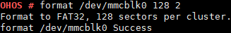

format
======

Command Function
----------------

This command is used to format a disk.

Syntax
------

format <*dev_inodename*> <*sectors*> <*option*> [*label*]

Parameter Description
---------------------

**Table 1** Parameters

.. raw:: html

   <table>

.. raw:: html

   <thead align="left">

.. raw:: html

   <tr id="row1188mcpsimp">

.. raw:: html

   <th class="cellrowborder" valign="top" width="34%" id="mcps1.2.3.1.1">

.. raw:: html

   

Parameter

.. raw:: html

   

.. raw:: html

   </th>

.. raw:: html

   <th class="cellrowborder" valign="top" width="66%" id="mcps1.2.3.1.2">

.. raw:: html

   

Description

.. raw:: html

   

.. raw:: html

   </th>

.. raw:: html

   </tr>

.. raw:: html

   </thead>

.. raw:: html

   <tbody>

.. raw:: html

   <tr id="row1193mcpsimp">

.. raw:: html

   <td class="cellrowborder" valign="top" width="34%" headers="mcps1.2.3.1.1 ">

.. raw:: html

   

dev_inodename

.. raw:: html

   

.. raw:: html

   </td>

.. raw:: html

   <td class="cellrowborder" valign="top" width="66%" headers="mcps1.2.3.1.2 ">

.. raw:: html

   

Indicates the device name.

.. raw:: html

   

.. raw:: html

   </td>

.. raw:: html

   </tr>

.. raw:: html

   <tr id="row1203mcpsimp">

.. raw:: html

   <td class="cellrowborder" valign="top" width="34%" headers="mcps1.2.3.1.1 ">

.. raw:: html

   

sectors

.. raw:: html

   

.. raw:: html

   </td>

.. raw:: html

   <td class="cellrowborder" valign="top" width="66%" headers="mcps1.2.3.1.2 ">

.. raw:: html

   

Indicates the size of the allocated memory unit or sector. The value 0
indicates that the parameter is null. (The value must be 0 or a power of
2. For FAT32, the maximum value is 128. If the parameter is set to 0, a
proper cluster size is automatically selected. The available cluster
size range varies depending on the partition size. If the cluster size
is incorrectly specified, the formatting may fail.)

.. raw:: html

   

.. raw:: html

   </td>

.. raw:: html

   </tr>

.. raw:: html

   <tr id="row1208mcpsimp">

.. raw:: html

   <td class="cellrowborder" valign="top" width="34%" headers="mcps1.2.3.1.1 ">

.. raw:: html

   

option

.. raw:: html

   

.. raw:: html

   </td>

.. raw:: html

   <td class="cellrowborder" valign="top" width="66%" headers="mcps1.2.3.1.2 ">

.. container:: p
   :name: p1212mcpsimp

   Indicates the formatting option for selecting the file system type.
   The options are as follows:

   .. raw:: html

      <ul id="ul10971366369">

   .. raw:: html

      <li>

   0x01: FMT_FAT

   .. raw:: html

      </li>

   .. raw:: html

      <li>

   0x02: FMT_FAT32

   .. raw:: html

      </li>

   .. raw:: html

      <li>

   0x07: FMT_ANY

   .. raw:: html

      </li>

   .. raw:: html

      <li>

   0x08: FMT_ERASE (not supported by the USB flash drive)

   .. raw:: html

      </li>

   .. raw:: html

      </ul>

.. raw:: html

   

Other values are invalid. The system will automatically select the
formatting mode. If the low-level formatting bit is 1 during the
formatting of a USB flash drive, an error message is printed.

.. raw:: html

   

.. raw:: html

   </td>

.. raw:: html

   </tr>

.. raw:: html

   <tr id="row1213mcpsimp">

.. raw:: html

   <td class="cellrowborder" valign="top" width="34%" headers="mcps1.2.3.1.1 ">

.. raw:: html

   

label

.. raw:: html

   

.. raw:: html

   </td>

.. raw:: html

   <td class="cellrowborder" valign="top" width="66%" headers="mcps1.2.3.1.2 ">

.. raw:: html

   

Indicates the volume label name. This parameter is optional, and the
value is a string. If null is specified for this parameter, the
previously set volume label name is cleared.

.. raw:: html

   

.. raw:: html

   </td>

.. raw:: html

   </tr>

.. raw:: html

   </tbody>

.. raw:: html

   </table>

Usage
-----

-  The **format** command is used to format a disk. You can find the
   device name in the **dev** directory. A storage card must be
   installed before the formatting.
-  This command can be used to format only the USB flash drive, SD card,
   and MMC, but not the NAND flash and NOR flash.
-  The **sectors** parameter must be set to a valid value. An invalid
   value may cause exceptions.

Example
-------

Enter **format /dev/mmcblk0 128 2**.

Output
------

Formatting result

|image1|

