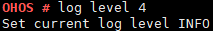

log
===

Command Function
----------------

This command is used to modify and query log configurations.

Syntax
------

log level [*levelNum*]

Parameter Description
---------------------

**Table 1** Parameters

.. raw:: html

   <table>

.. raw:: html

   <thead align="left">

.. raw:: html

   <tr id="row243mcpsimp">

.. raw:: html

   <th class="cellrowborder" valign="top" width="21%" id="mcps1.2.4.1.1">

.. raw:: html

   

Parameter

.. raw:: html

   

.. raw:: html

   </th>

.. raw:: html

   <th class="cellrowborder" valign="top" width="52%" id="mcps1.2.4.1.2">

.. raw:: html

   

Description

.. raw:: html

   

.. raw:: html

   </th>

.. raw:: html

   <th class="cellrowborder" valign="top" width="27%" id="mcps1.2.4.1.3">

.. raw:: html

   

Value Range

.. raw:: html

   

.. raw:: html

   </th>

.. raw:: html

   </tr>

.. raw:: html

   </thead>

.. raw:: html

   <tbody>

.. raw:: html

   <tr id="row250mcpsimp">

.. raw:: html

   <td class="cellrowborder" valign="top" width="21%" headers="mcps1.2.4.1.1 ">

.. raw:: html

   

levelNum

.. raw:: html

   

.. raw:: html

   </td>

.. raw:: html

   <td class="cellrowborder" valign="top" width="52%" headers="mcps1.2.4.1.2 ">

.. raw:: html

   

Indicates the print level of configuration logs.

.. raw:: html

   

.. raw:: html

   </td>

.. raw:: html

   <td class="cellrowborder" valign="top" width="27%" headers="mcps1.2.4.1.3 ">

.. raw:: html

   

[0x0, 0x5]

.. raw:: html

   

.. raw:: html

   </td>

.. raw:: html

   </tr>

.. raw:: html

   </tbody>

.. raw:: html

   </table>

Usage
-----

-  This command depends on **LOSCFG_SHELL_LK**. Before running this
   command, enable the **Enable Shell lk** configuration item using
   **menuconfig**.

   Debug —> Enable a Debug Version —> Enable Shell —> Enable Shell lK

-  The **log level** command is used to configure log levels, which can
   be:

   TRACE_EMG = 0,

   TRACE_COMMON = 1,

   TRACE_ERROR = 2,

   TRACE_WARN = 3,

   TRACE_INFO = 4,

   TRACE_DEBUG = 5

   If the level is not within the valid range, a message is printed.

-  If the **[levelNum]** parameter is not specified, the current log
   level and its usage are printed by default.

Example
-------

Enter **log level 4**.

Output
------

|image1|

