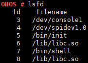

lsfd
====

Command Function
----------------

This command is used to display the file descriptors and names of
currently opened files.

Syntax
------

lsfd

Usage
-----

Run the **lsfd** command to view file descriptors and names of the
opened files.

Example
-------

Enter **lsfd**.

Output
------

| **Figure 1** Command output
| |image1|

