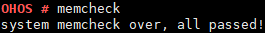
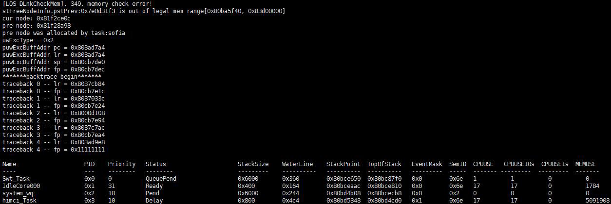

memcheck
========

Command Function
----------------

This command is used to check whether the dynamically requested memory
block is complete and whether nodes in the memory pool are damaged due
to out-of-bounds memory access.

Syntax
------

memcheck

Parameter Description
---------------------

None

Usage
-----

-  If all nodes in the memory pool are complete, “system memcheck over,
   all passed!” is displayed.
-  If a node in the memory pool is incomplete, information about the
   memory block of the damaged node is displayed.

Example
-------

Enter **memcheck**.

Output
------

| **Figure 1** No out-of-bounds memory access
| |image1|

| **Figure 2** Out-of-bounds memory access
| |image2|

