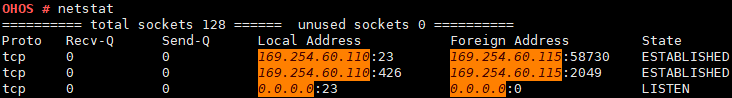

netstat
=======

Command Function
----------------

The **netstat** command is a console command and is used for monitoring
the TCP/IP network. It can display the actual network connections and
the status of each network interface device. It is used to display the
statistics related to the TCP and UDP protocols and check the network
connection to each port on the device (board).

Syntax
------

netstat

Parameter Description
---------------------

None

Usage
-----

Run the command directly.

Example
-------

Enter **netstat**.

| **Figure 1** Output information
| |image1|

Output
------

**Table 1** Output description

.. raw:: html

   <table>

.. raw:: html

   <thead align="left">

.. raw:: html

   <tr id="row2531mcpsimp">

.. raw:: html

   <th class="cellrowborder" valign="top" width="50%" id="mcps1.2.3.1.1">

.. raw:: html

   

Parameter

.. raw:: html

   

.. raw:: html

   </th>

.. raw:: html

   <th class="cellrowborder" valign="top" width="50%" id="mcps1.2.3.1.2">

.. raw:: html

   

Description

.. raw:: html

   

.. raw:: html

   </th>

.. raw:: html

   </tr>

.. raw:: html

   </thead>

.. raw:: html

   <tbody>

.. raw:: html

   <tr id="row2536mcpsimp">

.. raw:: html

   <td class="cellrowborder" valign="top" width="50%" headers="mcps1.2.3.1.1 ">

.. raw:: html

   

Proto

.. raw:: html

   

.. raw:: html

   </td>

.. raw:: html

   <td class="cellrowborder" valign="top" width="50%" headers="mcps1.2.3.1.2 ">

.. raw:: html

   

Indicates the protocol type.

.. raw:: html

   

.. raw:: html

   </td>

.. raw:: html

   </tr>

.. raw:: html

   <tr id="row2546mcpsimp">

.. raw:: html

   <td class="cellrowborder" valign="top" width="50%" headers="mcps1.2.3.1.1 ">

.. raw:: html

   

Recv-Q

.. raw:: html

   

.. raw:: html

   </td>

.. raw:: html

   <td class="cellrowborder" valign="top" width="50%" headers="mcps1.2.3.1.2 ">

.. raw:: html

   

Indicates the amount of data that is not read by the user.

.. raw:: html

   

.. raw:: html

   

For Listen TCP, the value indicates the number of TCP connections that
have completed three-way handshake but are not accepted by users.

.. raw:: html

   

.. raw:: html

   </td>

.. raw:: html

   </tr>

.. raw:: html

   <tr id="row2553mcpsimp">

.. raw:: html

   <td class="cellrowborder" valign="top" width="50%" headers="mcps1.2.3.1.1 ">

.. raw:: html

   

Send-Q

.. raw:: html

   

.. raw:: html

   </td>

.. raw:: html

   <td class="cellrowborder" valign="top" width="50%" headers="mcps1.2.3.1.2 ">

.. raw:: html

   

For a TCP connection, this value indicates the amount of data that has
been sent but not acknowledged.

.. raw:: html

   

.. raw:: html

   

For a UDP connection, this value indicates the amount of data buffered
before IP address resolution is complete.

.. raw:: html

   

.. raw:: html

   </td>

.. raw:: html

   </tr>

.. raw:: html

   <tr id="row2558mcpsimp">

.. raw:: html

   <td class="cellrowborder" valign="top" width="50%" headers="mcps1.2.3.1.1 ">

.. raw:: html

   

Local Address

.. raw:: html

   

.. raw:: html

   </td>

.. raw:: html

   <td class="cellrowborder" valign="top" width="50%" headers="mcps1.2.3.1.2 ">

.. raw:: html

   

Indicates the local IP address and port number.

.. raw:: html

   

.. raw:: html

   </td>

.. raw:: html

   </tr>

.. raw:: html

   <tr id="row2563mcpsimp">

.. raw:: html

   <td class="cellrowborder" valign="top" width="50%" headers="mcps1.2.3.1.1 ">

.. raw:: html

   

Foreign Address

.. raw:: html

   

.. raw:: html

   </td>

.. raw:: html

   <td class="cellrowborder" valign="top" width="50%" headers="mcps1.2.3.1.2 ">

.. raw:: html

   

Indicates the remote IP address and port number.

.. raw:: html

   

.. raw:: html

   </td>

.. raw:: html

   </tr>

.. raw:: html

   <tr id="row2568mcpsimp">

.. raw:: html

   <td class="cellrowborder" valign="top" width="50%" headers="mcps1.2.3.1.1 ">

.. raw:: html

   

State

.. raw:: html

   

.. raw:: html

   </td>

.. raw:: html

   <td class="cellrowborder" valign="top" width="50%" headers="mcps1.2.3.1.2 ">

.. raw:: html

   

Indicates the TCP connection status. This parameter is meaningless for
UDP.

.. raw:: html

   

.. raw:: html

   </td>

.. raw:: html

   </tr>

.. raw:: html

   </tbody>

.. raw:: html

   </table>

..

   |image2| **NOTE:** The command output like “========== total sockets
   32 ====== unused sockets 22 BootTime 27 s ==========” indicates that
   there are 32 sockets in total, 22 sockets are not used, and it has
   been 27 seconds since the system starts.

.. |image2| image:: public_sys-resources/icon-note.gif
