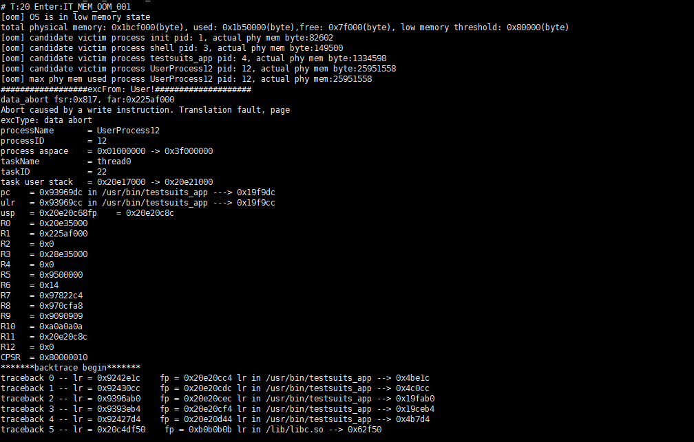

oom
===

Command Function
----------------

This command is used to query and set the low memory threshold and the
page cache reclaim threshold.

Syntax
------

oom

oom -i [*interval*]

oom -m [*mem byte*]

oom -r [*mem byte*]

oom -h \| –help

Parameter Description
---------------------

**Table 1** Parameters

.. raw:: html

   <table>

.. raw:: html

   <thead align="left">

.. raw:: html

   <tr id="row444mcpsimp">

.. raw:: html

   <th class="cellrowborder" valign="top" width="21%" id="mcps1.2.4.1.1">

.. raw:: html

   

Parameter

.. raw:: html

   

.. raw:: html

   </th>

.. raw:: html

   <th class="cellrowborder" valign="top" width="52%" id="mcps1.2.4.1.2">

.. raw:: html

   

Description

.. raw:: html

   

.. raw:: html

   </th>

.. raw:: html

   <th class="cellrowborder" valign="top" width="27%" id="mcps1.2.4.1.3">

.. raw:: html

   

Value Range

.. raw:: html

   

.. raw:: html

   </th>

.. raw:: html

   </tr>

.. raw:: html

   </thead>

.. raw:: html

   <tbody>

.. raw:: html

   <tr id="row451mcpsimp">

.. raw:: html

   <td class="cellrowborder" valign="top" width="21%" headers="mcps1.2.4.1.1 ">

.. raw:: html

   

-i [interval]

.. raw:: html

   

.. raw:: html

   </td>

.. raw:: html

   <td class="cellrowborder" valign="top" width="52%" headers="mcps1.2.4.1.2 ">

.. raw:: html

   

Sets the interval for checking the Out Of Memory (OOM) thread task.

.. raw:: html

   

.. raw:: html

   </td>

.. raw:: html

   <td class="cellrowborder" valign="top" width="27%" headers="mcps1.2.4.1.3 ">

.. raw:: html

   

100 ms – 10000 ms

.. raw:: html

   

.. raw:: html

   </td>

.. raw:: html

   </tr>

.. raw:: html

   <tr id="row18583553793">

.. raw:: html

   <td class="cellrowborder" valign="top" width="21%" headers="mcps1.2.4.1.1 ">

.. raw:: html

   

-m [mem byte]

.. raw:: html

   

.. raw:: html

   </td>

.. raw:: html

   <td class="cellrowborder" valign="top" width="52%" headers="mcps1.2.4.1.2 ">

.. raw:: html

   

Sets the low memory threshold.

.. raw:: html

   

.. raw:: html

   </td>

.. raw:: html

   <td class="cellrowborder" valign="top" width="27%" headers="mcps1.2.4.1.3 ">

.. raw:: html

   

0 MB (does not check for low memory) – 1 MB

.. raw:: html

   

.. raw:: html

   </td>

.. raw:: html

   </tr>

.. raw:: html

   <tr id="row17926124131218">

.. raw:: html

   <td class="cellrowborder" valign="top" width="21%" headers="mcps1.2.4.1.1 ">

.. raw:: html

   

-r [mem byte]

.. raw:: html

   

.. raw:: html

   </td>

.. raw:: html

   <td class="cellrowborder" valign="top" width="52%" headers="mcps1.2.4.1.2 ">

.. raw:: html

   

Sets the page cache reclaim threshold.

.. raw:: html

   

.. raw:: html

   </td>

.. raw:: html

   <td class="cellrowborder" valign="top" width="27%" headers="mcps1.2.4.1.3 ">

.. raw:: html

   

Ranging from the low memory threshold to the maximum available system
memory

.. raw:: html

   

.. raw:: html

   </td>

.. raw:: html

   </tr>

.. raw:: html

   <tr id="row1176110379557">

.. raw:: html

   <td class="cellrowborder" valign="top" width="21%" headers="mcps1.2.4.1.1 ">

.. raw:: html

   

-h \| –help

.. raw:: html

   

.. raw:: html

   </td>

.. raw:: html

   <td class="cellrowborder" valign="top" width="52%" headers="mcps1.2.4.1.2 ">

.. raw:: html

   

Uses the help.

.. raw:: html

   

.. raw:: html

   </td>

.. raw:: html

   <td class="cellrowborder" valign="top" width="27%" headers="mcps1.2.4.1.3 ">

.. raw:: html

   

N/A

.. raw:: html

   

.. raw:: html

   </td>

.. raw:: html

   </tr>

.. raw:: html

   </tbody>

.. raw:: html

   </table>

Usage
-----

-  If no parameter is specified, the current configurations of the OOM
   function are displayed.

Example
-------

When the system memory is insufficient, the system displays a message
indicating the insufficiency.

Output
------

|image1|

**Table 2** Output description

.. raw:: html

   <table>

.. raw:: html

   <thead align="left">

.. raw:: html

   <tr id="row492mcpsimp">

.. raw:: html

   <th class="cellrowborder" valign="top" width="50%" id="mcps1.2.3.1.1">

.. raw:: html

   

Parameter

.. raw:: html

   

.. raw:: html

   </th>

.. raw:: html

   <th class="cellrowborder" valign="top" width="50%" id="mcps1.2.3.1.2">

.. raw:: html

   

Description

.. raw:: html

   

.. raw:: html

   </th>

.. raw:: html

   </tr>

.. raw:: html

   </thead>

.. raw:: html

   <tbody>

.. raw:: html

   <tr id="row502mcpsimp">

.. raw:: html

   <td class="cellrowborder" valign="top" width="50%" headers="mcps1.2.3.1.1 ">

.. raw:: html

   

[oom] OS is in low memory state

.. raw:: html

   

.. raw:: html

   

total physical memory: 0x1bcf000(byte), used: 0x1b50000(byte), free:
0x7f000(byte), low memory threshold: 0x80000(byte)

.. raw:: html

   

.. raw:: html

   </td>

.. raw:: html

   <td class="cellrowborder" valign="top" width="50%" headers="mcps1.2.3.1.2 ">

.. raw:: html

   

The memory usage of the OS is low.

.. raw:: html

   

.. raw:: html

   

The available physical memory in the entire OS is 0x1bcf000 bytes,
0x1b50000 bytes have been used, and 0x7f000 bytes are available. The
current low memory threshold is 0x80000 bytes.

.. raw:: html

   

.. raw:: html

   </td>

.. raw:: html

   </tr>

.. raw:: html

   <tr id="row1990234224612">

.. raw:: html

   <td class="cellrowborder" valign="top" width="50%" headers="mcps1.2.3.1.1 ">

.. raw:: html

   

[oom] candidate victim process init pid: 1, actual phy mem byte: 82602

.. raw:: html

   

.. raw:: html

   </td>

.. raw:: html

   <td class="cellrowborder" valign="top" width="50%" headers="mcps1.2.3.1.2 ">

.. raw:: html

   

The memory usage of each process is printed. The init process actually
uses 82602 bytes, and the shared memory is calculated based on the
proportion.

.. raw:: html

   

.. raw:: html

   </td>

.. raw:: html

   </tr>

.. raw:: html

   <tr id="row520212272335">

.. raw:: html

   <td class="cellrowborder" valign="top" width="50%" headers="mcps1.2.3.1.1 ">

.. raw:: html

   

[oom] candidate victim process UserProcess12 pid: 12, actual phy mem
byte: 25951558

.. raw:: html

   

.. raw:: html

   </td>

.. raw:: html

   <td class="cellrowborder" valign="top" width="50%" headers="mcps1.2.3.1.2 ">

.. raw:: html

   

The actual memory used by the UserProcess12 process is 25951558 bytes.

.. raw:: html

   

.. raw:: html

   </td>

.. raw:: html

   </tr>

.. raw:: html

   <tr id="row3273195033416">

.. raw:: html

   <td class="cellrowborder" valign="top" width="50%" headers="mcps1.2.3.1.1 ">

.. raw:: html

   

[oom] max phy mem used process UserProcess12 pid: 12, actual phy mem:
25951558

.. raw:: html

   

.. raw:: html

   </td>

.. raw:: html

   <td class="cellrowborder" valign="top" width="50%" headers="mcps1.2.3.1.2 ">

.. raw:: html

   

The process that uses the most memory currently is UserProcess12.

.. raw:: html

   

.. raw:: html

   </td>

.. raw:: html

   </tr>

.. raw:: html

   <tr id="row16442089365">

.. raw:: html

   <td class="cellrowborder" valign="top" width="50%" headers="mcps1.2.3.1.1 ">

.. raw:: html

   

excFrom: User!

.. raw:: html

   

.. raw:: html

   </td>

.. raw:: html

   <td class="cellrowborder" valign="top" width="50%" headers="mcps1.2.3.1.2 ">

.. raw:: html

   

When the system memory is low, the UserProcess12 process fails to apply
for memory and exits as a result.

.. raw:: html

   

.. raw:: html

   </td>

.. raw:: html

   </tr>

.. raw:: html

   </tbody>

.. raw:: html

   </table>

