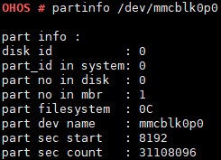

partinfo
========

Command Function
----------------

This command is used to query information about multiple partitions of a
hard disk or SD card identified by the system.

Syntax
------

partinfo <*dev_inodename*>

Parameter Description
---------------------

**Table 1** Parameters

.. raw:: html

   <table>

.. raw:: html

   <thead align="left">

.. raw:: html

   <tr id="row1396mcpsimp">

.. raw:: html

   <th class="cellrowborder" valign="top" width="22%" id="mcps1.2.4.1.1">

.. raw:: html

   

Parameter

.. raw:: html

   

.. raw:: html

   </th>

.. raw:: html

   <th class="cellrowborder" valign="top" width="51%" id="mcps1.2.4.1.2">

.. raw:: html

   

Description

.. raw:: html

   

.. raw:: html

   </th>

.. raw:: html

   <th class="cellrowborder" valign="top" width="27%" id="mcps1.2.4.1.3">

.. raw:: html

   

Value Range

.. raw:: html

   

.. raw:: html

   </th>

.. raw:: html

   </tr>

.. raw:: html

   </thead>

.. raw:: html

   <tbody>

.. raw:: html

   <tr id="row1403mcpsimp">

.. raw:: html

   <td class="cellrowborder" valign="top" width="22%" headers="mcps1.2.4.1.1 ">

.. raw:: html

   

dev_inodename

.. raw:: html

   

.. raw:: html

   </td>

.. raw:: html

   <td class="cellrowborder" valign="top" width="51%" headers="mcps1.2.4.1.2 ">

.. raw:: html

   

Indicates the name of the partition to be queried.

.. raw:: html

   

.. raw:: html

   </td>

.. raw:: html

   <td class="cellrowborder" valign="top" width="27%" headers="mcps1.2.4.1.3 ">

.. raw:: html

   

A valid partition name

.. raw:: html

   

.. raw:: html

   </td>

.. raw:: html

   </tr>

.. raw:: html

   </tbody>

.. raw:: html

   </table>

Usage
-----

None

Example
-------

Enter **partinfo /dev/mmcblk0p0**.

Output
------

|image1|

