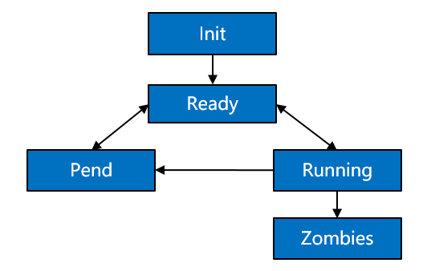

Process
=======

Basic Concepts
--------------

Processes are resource management units in the OS. They can use or wait
to use CPUs and use system resources such as memory. They run
independently from one another.

The OpenHarmony kernel allows multiple processes to run simultaneously,
switch, and communicate, facilitating your management over service
programs. In this regard, you will have more time to devote to the
implementation of service functionalities.

Processes in the OpenHarmony kernel use the preemptive scheduling
mechanism, either round-robin (RR) scheduling or First In First Out
(FIFO) scheduling.

These processes are assigned 32 priorities (**0** to **31**). Among
them, user processes can be configured with 22 priorities from **10**
(highest) to **31** (lowest).

A high-priority process can preempt the resources of a low-priority
process. The low-priority process can be scheduled only after the
high-priority process is blocked or terminated.

Each user-space process has its own memory space, which is invisible to
other processes. In this way, processes are isolated from each other.

The user-space root process init is started by the kernel. Then other
user-space processes are created by the init process via the **fork**
call.

**A process may have the following states:**

-  **Init**: The process is being created.

-  **Ready**: The process is in the ready list and waits for being
   scheduled by the CPU.

-  **Running**: The process is running.

-  **Pend**: The process is blocked and suspended. When all threads in a
   process are blocked, the process is blocked and suspended.

-  **Zombies**: The process stops running and waits for the parent
   process to reclaim its control block resources.

**Figure 1** State transition of a process

|image1|

**Description of the process state transition:**

-  Init→Ready:

   When a process is created, the process enters the **Init** state to
   start initialization after obtaining the process control block. After
   the process is initialized, the process is inserted into the
   scheduling queue and therefore enters the **Ready** state.

-  Ready→Running:

   When a process switchover is triggered, the process with the highest
   priority in the ready list is executed and enters the **Running**
   state. If this process has no thread in the **Ready** state, the
   process is deleted from the ready list and resides only in the
   **Running** state. However, if it has threads in the **Ready** state,
   the process still stays in the ready list. In this case, the process
   is in both the **Ready** and **Running** states.

-  Running→Pend:

   If all threads in a process are entering the **Pend** state, the
   process will enter the **Pend** state together with its last thread.
   Then, a process switchover is triggered.

-  Pend→Ready/Pend→Running:

   When any thread in a **Pend** process restores to the **Ready**
   state, the process is added to the ready list and changes to the
   **Ready** state. If a process switchover occurs at this time, the
   process state changes from the **Ready** state to the **Running**
   state.

-  Ready→Pend:

   When the last ready thread in a process enters the **Pend** state,
   the process is deleted from the ready list, and the process changes
   from the **Ready** state to the **Pend** state.

-  Running→Ready:

   A process may change from the **Running** state to the **Ready**
   state in either of the following scenarios:

   1. After a process with a higher priority is created or restored,
      processes will be scheduled. The process with the highest priority
      in the ready list will change to the **Running** state, and the
      originally running process will change from the **Running** state
      to the **Ready** state.
   2. If a process has the **SCHED_RR** scheduling policy and shares the
      same priority with another process in the **Ready** state, this
      process will change from the **Running** state to the **Ready**
      state after its time slices are used up, and the other process
      with the same priority will change from the **Ready** state to the
      **Running** state.

-  Running→Zombies:

   After the main thread or all threads of a process are stopped, the
   process changes from the **Running** state to the **Zombies** state
   and waits for the parent process to reclaim resources.

When to Use
-----------

After processes are created, you can operate the resources only in your
own process space, except shared resources. In user space, processes can
be suspended, restored, and delayed. In addition, you can set and obtain
the scheduling priority and scheduling policy of processes. When a
process is terminated, it proactively releases its resources. However,
the PID resources of the process are reclaimed by the parent process via
**wait**/**waitpid** or when the parent process exits.

Available APIs
--------------

The following table describes the APIs provided by the process
management module of the OpenHarmony kernel.

**Table 1** APIs provided by the process management module

.. raw:: html

   <table>

.. raw:: html

   <thead align="left">

.. raw:: html

   <tr id="row630210427446">

.. raw:: html

   <th class="cellrowborder" valign="top" width="13.020000000000001%" id="mcps1.2.5.1.1">

.. raw:: html

   

Category

.. raw:: html

   

.. raw:: html

   </th>

.. raw:: html

   <th class="cellrowborder" valign="top" width="23.150000000000002%" id="mcps1.2.5.1.2">

.. raw:: html

   

Function

.. raw:: html

   

.. raw:: html

   </th>

.. raw:: html

   <th class="cellrowborder" valign="top" width="28.93%" id="mcps1.2.5.1.3">

.. raw:: html

   

Description

.. raw:: html

   

.. raw:: html

   </th>

.. raw:: html

   <th class="cellrowborder" valign="top" width="34.9%" id="mcps1.2.5.1.4">

.. raw:: html

   

Remarks

.. raw:: html

   

.. raw:: html

   </th>

.. raw:: html

   </tr>

.. raw:: html

   </thead>

.. raw:: html

   <tbody>

.. raw:: html

   <tr id="row12302642134414">

.. raw:: html

   <td class="cellrowborder" rowspan="13" valign="top" width="13.020000000000001%" headers="mcps1.2.5.1.1 ">

.. raw:: html

   

Process

.. raw:: html

   

.. raw:: html

   </td>

.. raw:: html

   <td class="cellrowborder" valign="top" width="23.150000000000002%" headers="mcps1.2.5.1.2 ">

.. raw:: html

   

fork

.. raw:: html

   

.. raw:: html

   </td>

.. raw:: html

   <td class="cellrowborder" valign="top" width="28.93%" headers="mcps1.2.5.1.3 ">

.. raw:: html

   

Creates a new process.

.. raw:: html

   

.. raw:: html

   </td>

.. raw:: html

   <td class="cellrowborder" valign="top" width="34.9%" headers="mcps1.2.5.1.4 ">

.. raw:: html

   

N/A

.. raw:: html

   

.. raw:: html

   </td>

.. raw:: html

   </tr>

.. raw:: html

   <tr id="row20302154218442">

.. raw:: html

   <td class="cellrowborder" valign="top" headers="mcps1.2.5.1.1 ">

.. raw:: html

   

exit

.. raw:: html

   

.. raw:: html

   </td>

.. raw:: html

   <td class="cellrowborder" valign="top" headers="mcps1.2.5.1.2 ">

.. raw:: html

   

Exits the process.

.. raw:: html

   

.. raw:: html

   </td>

.. raw:: html

   <td class="cellrowborder" valign="top" headers="mcps1.2.5.1.3 ">

.. raw:: html

   

N/A

.. raw:: html

   

.. raw:: html

   </td>

.. raw:: html

   </tr>

.. raw:: html

   <tr id="row930314421443">

.. raw:: html

   <td class="cellrowborder" valign="top" headers="mcps1.2.5.1.1 ">

.. raw:: html

   

atexit

.. raw:: html

   

.. raw:: html

   </td>

.. raw:: html

   <td class="cellrowborder" valign="top" headers="mcps1.2.5.1.2 ">

.. raw:: html

   

Registers the callback that will be called when the process is
terminated normally.

.. raw:: html

   

.. raw:: html

   </td>

.. raw:: html

   <td class="cellrowborder" valign="top" headers="mcps1.2.5.1.3 ">

.. raw:: html

   

N/A

.. raw:: html

   

.. raw:: html

   </td>

.. raw:: html

   </tr>

.. raw:: html

   <tr id="row113039426449">

.. raw:: html

   <td class="cellrowborder" valign="top" headers="mcps1.2.5.1.1 ">

.. raw:: html

   

abort

.. raw:: html

   

.. raw:: html

   </td>

.. raw:: html

   <td class="cellrowborder" valign="top" headers="mcps1.2.5.1.2 ">

.. raw:: html

   

Terminates the process.

.. raw:: html

   

.. raw:: html

   </td>

.. raw:: html

   <td class="cellrowborder" valign="top" headers="mcps1.2.5.1.3 ">

.. raw:: html

   

N/A

.. raw:: html

   

.. raw:: html

   </td>

.. raw:: html

   </tr>

.. raw:: html

   <tr id="row1330317422445">

.. raw:: html

   <td class="cellrowborder" valign="top" headers="mcps1.2.5.1.1 ">

.. raw:: html

   

getpid

.. raw:: html

   

.. raw:: html

   </td>

.. raw:: html

   <td class="cellrowborder" valign="top" headers="mcps1.2.5.1.2 ">

.. raw:: html

   

Obtains the process ID.

.. raw:: html

   

.. raw:: html

   </td>

.. raw:: html

   <td class="cellrowborder" valign="top" headers="mcps1.2.5.1.3 ">

.. raw:: html

   

N/A

.. raw:: html

   

.. raw:: html

   </td>

.. raw:: html

   </tr>

.. raw:: html

   <tr id="row3304204254412">

.. raw:: html

   <td class="cellrowborder" valign="top" headers="mcps1.2.5.1.1 ">

.. raw:: html

   

getppid

.. raw:: html

   

.. raw:: html

   </td>

.. raw:: html

   <td class="cellrowborder" valign="top" headers="mcps1.2.5.1.2 ">

.. raw:: html

   

Obtains the parent process ID.

.. raw:: html

   

.. raw:: html

   </td>

.. raw:: html

   <td class="cellrowborder" valign="top" headers="mcps1.2.5.1.3 ">

.. raw:: html

   

N/A

.. raw:: html

   

.. raw:: html

   </td>

.. raw:: html

   </tr>

.. raw:: html

   <tr id="row610863618327">

.. raw:: html

   <td class="cellrowborder" valign="top" headers="mcps1.2.5.1.1 ">

.. raw:: html

   

getpgrp

.. raw:: html

   

.. raw:: html

   </td>

.. raw:: html

   <td class="cellrowborder" valign="top" headers="mcps1.2.5.1.2 ">

.. raw:: html

   

Obtains the ID of the process group of the calling process.

.. raw:: html

   

.. raw:: html

   </td>

.. raw:: html

   <td class="cellrowborder" valign="top" headers="mcps1.2.5.1.3 ">

.. raw:: html

   

N/A

.. raw:: html

   

.. raw:: html

   </td>

.. raw:: html

   </tr>

.. raw:: html

   <tr id="row2379940183217">

.. raw:: html

   <td class="cellrowborder" valign="top" headers="mcps1.2.5.1.1 ">

.. raw:: html

   

getpgid

.. raw:: html

   

.. raw:: html

   </td>

.. raw:: html

   <td class="cellrowborder" valign="top" headers="mcps1.2.5.1.2 ">

.. raw:: html

   

Obtains the process group ID of the process identified by pid.

.. raw:: html

   

.. raw:: html

   </td>

.. raw:: html

   <td class="cellrowborder" valign="top" headers="mcps1.2.5.1.3 ">

.. raw:: html

   

N/A

.. raw:: html

   

.. raw:: html

   </td>

.. raw:: html

   </tr>

.. raw:: html

   <tr id="row1981395963412">

.. raw:: html

   <td class="cellrowborder" valign="top" headers="mcps1.2.5.1.1 ">

.. raw:: html

   

setpgrp

.. raw:: html

   

.. raw:: html

   </td>

.. raw:: html

   <td class="cellrowborder" valign="top" headers="mcps1.2.5.1.2 ">

.. raw:: html

   

Sets the process group ID of the calling process.

.. raw:: html

   

.. raw:: html

   </td>

.. raw:: html

   <td class="cellrowborder" valign="top" headers="mcps1.2.5.1.3 ">

.. raw:: html

   

N/A

.. raw:: html

   

.. raw:: html

   </td>

.. raw:: html

   </tr>

.. raw:: html

   <tr id="row194862793516">

.. raw:: html

   <td class="cellrowborder" valign="top" headers="mcps1.2.5.1.1 ">

.. raw:: html

   

setpgid

.. raw:: html

   

.. raw:: html

   </td>

.. raw:: html

   <td class="cellrowborder" valign="top" headers="mcps1.2.5.1.2 ">

.. raw:: html

   

Sets the process group ID of the process identified by pid.

.. raw:: html

   

.. raw:: html

   </td>

.. raw:: html

   <td class="cellrowborder" valign="top" headers="mcps1.2.5.1.3 ">

.. raw:: html

   

N/A

.. raw:: html

   

.. raw:: html

   </td>

.. raw:: html

   </tr>

.. raw:: html

   <tr id="row10304742114410">

.. raw:: html

   <td class="cellrowborder" valign="top" headers="mcps1.2.5.1.1 ">

.. raw:: html

   

kill

.. raw:: html

   

.. raw:: html

   </td>

.. raw:: html

   <td class="cellrowborder" valign="top" headers="mcps1.2.5.1.2 ">

.. raw:: html

   

Sends a signal to a specified process.

.. raw:: html

   

.. raw:: html

   </td>

.. raw:: html

   <td class="cellrowborder" valign="top" headers="mcps1.2.5.1.3 ">

.. raw:: html

   <ul id="ul949915272011">

.. raw:: html

   <li>

Only signals 1 to 30 can be sent.

.. raw:: html

   </li>

.. raw:: html

   <li>

The default behavior for signals does not include STOP and CONTINUE and
terminates the process without a core dump.

.. raw:: html

   </li>

.. raw:: html

   <li>

SIGSTOP, SIGKILL, and SIGCONT cannot be masked.

.. raw:: html

   </li>

.. raw:: html

   <li>

After an asynchronous signal is sent to a process, the signal callback
is invoked only after the process is scheduled. For the sake of
security, the process can be killed only by itself, and the kernel
cannot forcibly kill the process by sending signals.

.. raw:: html

   </li>

.. raw:: html

   <li>

After the process is killed, SIGCHLD is sent to its parent process. The
sending action cannot be canceled.

.. raw:: html

   </li>

.. raw:: html

   <li>

A sleeping process cannot be woken up by a signal.

.. raw:: html

   </li>

.. raw:: html

   </ul>

.. raw:: html

   </td>

.. raw:: html

   </tr>

.. raw:: html

   <tr id="row1430454210446">

.. raw:: html

   <td class="cellrowborder" valign="top" headers="mcps1.2.5.1.1 ">

.. raw:: html

   

wait

.. raw:: html

   

.. raw:: html

   </td>

.. raw:: html

   <td class="cellrowborder" valign="top" headers="mcps1.2.5.1.2 ">

.. raw:: html

   

Waits for any child process to terminate and reclaims its resources.

.. raw:: html

   

.. raw:: html

   </td>

.. raw:: html

   <td class="cellrowborder" valign="top" headers="mcps1.2.5.1.3 ">

.. raw:: html

   

The status value is defined by the following macros:

.. raw:: html

   

.. raw:: html

   <ul id="ul13349201524417">

.. raw:: html

   <li>

WIFEXITED(status): If the child process terminates normally, true is
returned. Otherwise, false is returned.

.. raw:: html

   </li>

.. raw:: html

   <li>

WEXITSTATUS(status): If WIFEXITED(status) is true, this macro can be
used to obtain the exit code that the child process passed to exit().

.. raw:: html

   </li>

.. raw:: html

   <li>

WTERMSIG(status): If a child process terminates abnormally, the child
process exit code obtained by the parent process through WTERMSIG is
always SIGUSR2. This is the only case supported.

.. raw:: html

   </li>

.. raw:: html

   <li>

The following operations are not supported: WIFSTOPPED, WSTOPSIG,
WCOREDUMP, and WIFCONTINUED.

.. raw:: html

   </li>

.. raw:: html

   </ul>

.. raw:: html

   </td>

.. raw:: html

   </tr>

.. raw:: html

   <tr id="row13041742134416">

.. raw:: html

   <td class="cellrowborder" valign="top" headers="mcps1.2.5.1.1 ">

.. raw:: html

   

waitpid

.. raw:: html

   

.. raw:: html

   </td>

.. raw:: html

   <td class="cellrowborder" valign="top" headers="mcps1.2.5.1.2 ">

.. raw:: html

   

Waits for a specified child process to terminate and reclaims its
resources.

.. raw:: html

   

.. raw:: html

   </td>

.. raw:: html

   <td class="cellrowborder" valign="top" headers="mcps1.2.5.1.3 ">

.. raw:: html

   

The options to control the function behavior do not support WUNTRACED
and WCONTINUED.

.. raw:: html

   

.. raw:: html

   

The status value is defined by the following macros:

.. raw:: html

   

.. raw:: html

   <ul id="ul7243133164416">

.. raw:: html

   <li>

WIFEXITED(status): If the child process terminates normally, true is
returned. Otherwise, false is returned.

.. raw:: html

   </li>

.. raw:: html

   <li>

WEXITSTATUS(status): If WIFEXITED(status) is true, this macro can be
used to obtain the exit code that the child process passed to exit().

.. raw:: html

   </li>

.. raw:: html

   <li>

WTERMSIG(status): If a child process terminates abnormally, the child
process exit code obtained by the parent process through WTERMSIG is
always SIGUSR2. This is the only case supported.

.. raw:: html

   </li>

.. raw:: html

   <li>

The following operations are not supported: WIFSTOPPED, WSTOPSIG,
WCOREDUMP, and WIFCONTINUED.

.. raw:: html

   </li>

.. raw:: html

   </ul>

.. raw:: html

   </td>

.. raw:: html

   </tr>

.. raw:: html

   <tr id="row4305194294417">

.. raw:: html

   <td class="cellrowborder" rowspan="10" valign="top" width="13.020000000000001%" headers="mcps1.2.5.1.1 ">

.. raw:: html

   

Scheduling

.. raw:: html

   

.. raw:: html

   </td>

.. raw:: html

   <td class="cellrowborder" valign="top" width="23.150000000000002%" headers="mcps1.2.5.1.2 ">

.. raw:: html

   

getpriority

.. raw:: html

   

.. raw:: html

   </td>

.. raw:: html

   <td class="cellrowborder" valign="top" width="28.93%" headers="mcps1.2.5.1.3 ">

.. raw:: html

   

Obtains the static priority of a specified ID.

.. raw:: html

   

.. raw:: html

   </td>

.. raw:: html

   <td class="cellrowborder" rowspan="2" valign="top" width="34.9%" headers="mcps1.2.5.1.4 ">

.. raw:: html

   <ul id="ul185518513478">

.. raw:: html

   <li>

PRIO_PGRP and PRIO_USER are not supported.

.. raw:: html

   </li>

.. raw:: html

   </ul>

.. raw:: html

   <ul id="ul85091358174711">

.. raw:: html

   <li>

The priority to obtain and set refers to the static priority. The
dynamic priority is not involved.

.. raw:: html

   </li>

.. raw:: html

   </ul>

.. raw:: html

   </td>

.. raw:: html

   </tr>

.. raw:: html

   <tr id="row930511425448">

.. raw:: html

   <td class="cellrowborder" valign="top" headers="mcps1.2.5.1.1 ">

.. raw:: html

   

setpriority

.. raw:: html

   

.. raw:: html

   </td>

.. raw:: html

   <td class="cellrowborder" valign="top" headers="mcps1.2.5.1.2 ">

.. raw:: html

   

Sets the static priority of a specified ID.

.. raw:: html

   

.. raw:: html

   </td>

.. raw:: html

   </tr>

.. raw:: html

   <tr id="row2305174216445">

.. raw:: html

   <td class="cellrowborder" valign="top" headers="mcps1.2.5.1.1 ">

.. raw:: html

   

sched_rr_get_interval

.. raw:: html

   

.. raw:: html

   </td>

.. raw:: html

   <td class="cellrowborder" valign="top" headers="mcps1.2.5.1.2 ">

.. raw:: html

   

Obtains the execution time limit of a process.

.. raw:: html

   

.. raw:: html

   </td>

.. raw:: html

   <td class="cellrowborder" valign="top" headers="mcps1.2.5.1.3 ">

.. raw:: html

   

N/A

.. raw:: html

   

.. raw:: html

   </td>

.. raw:: html

   </tr>

.. raw:: html

   <tr id="row33061042104416">

.. raw:: html

   <td class="cellrowborder" valign="top" headers="mcps1.2.5.1.1 ">

.. raw:: html

   

sched_yield

.. raw:: html

   

.. raw:: html

   </td>

.. raw:: html

   <td class="cellrowborder" valign="top" headers="mcps1.2.5.1.2 ">

.. raw:: html

   

Yields the running process.

.. raw:: html

   

.. raw:: html

   </td>

.. raw:: html

   <td class="cellrowborder" valign="top" headers="mcps1.2.5.1.3 ">

.. raw:: html

   

N/A

.. raw:: html

   

.. raw:: html

   </td>

.. raw:: html

   </tr>

.. raw:: html

   <tr id="row11306134234417">

.. raw:: html

   <td class="cellrowborder" valign="top" headers="mcps1.2.5.1.1 ">

.. raw:: html

   

sched_get_priority_max

.. raw:: html

   

.. raw:: html

   </td>

.. raw:: html

   <td class="cellrowborder" valign="top" headers="mcps1.2.5.1.2 ">

.. raw:: html

   

Obtains the maximum static priority that can be used for a process.

.. raw:: html

   

.. raw:: html

   </td>

.. raw:: html

   <td class="cellrowborder" rowspan="4" valign="top" headers="mcps1.2.5.1.3 ">

.. raw:: html

   

The scheduling policy can only be SCHED_FIFO or SCHED_RR.

.. raw:: html

   

.. raw:: html

   </td>

.. raw:: html

   </tr>

.. raw:: html

   <tr id="row15306242124413">

.. raw:: html

   <td class="cellrowborder" valign="top" headers="mcps1.2.5.1.1 ">

.. raw:: html

   

sched_get_priority_min

.. raw:: html

   

.. raw:: html

   </td>

.. raw:: html

   <td class="cellrowborder" valign="top" headers="mcps1.2.5.1.2 ">

.. raw:: html

   

Obtains the minimum static priority that can be used for a process.

.. raw:: html

   

.. raw:: html

   </td>

.. raw:: html

   </tr>

.. raw:: html

   <tr id="row730610428448">

.. raw:: html

   <td class="cellrowborder" valign="top" headers="mcps1.2.5.1.1 ">

.. raw:: html

   

sched_getscheduler

.. raw:: html

   

.. raw:: html

   </td>

.. raw:: html

   <td class="cellrowborder" valign="top" headers="mcps1.2.5.1.2 ">

.. raw:: html

   

Obtains the scheduling policy of a process.

.. raw:: html

   

.. raw:: html

   </td>

.. raw:: html

   </tr>

.. raw:: html

   <tr id="row630764215441">

.. raw:: html

   <td class="cellrowborder" valign="top" headers="mcps1.2.5.1.1 ">

.. raw:: html

   

sched_setscheduler

.. raw:: html

   

.. raw:: html

   </td>

.. raw:: html

   <td class="cellrowborder" valign="top" headers="mcps1.2.5.1.2 ">

.. raw:: html

   

Sets a scheduling policy for a process.

.. raw:: html

   

.. raw:: html

   </td>

.. raw:: html

   </tr>

.. raw:: html

   <tr id="row3307184274411">

.. raw:: html

   <td class="cellrowborder" valign="top" headers="mcps1.2.5.1.1 ">

.. raw:: html

   

sched_getparam

.. raw:: html

   

.. raw:: html

   </td>

.. raw:: html

   <td class="cellrowborder" valign="top" headers="mcps1.2.5.1.2 ">

.. raw:: html

   

Obtains scheduling parameters of a process.

.. raw:: html

   

.. raw:: html

   </td>

.. raw:: html

   <td class="cellrowborder" valign="top" headers="mcps1.2.5.1.3 ">

.. raw:: html

   

N/A

.. raw:: html

   

.. raw:: html

   </td>

.. raw:: html

   </tr>

.. raw:: html

   <tr id="row18307104210449">

.. raw:: html

   <td class="cellrowborder" valign="top" headers="mcps1.2.5.1.1 ">

.. raw:: html

   

sched_setparam

.. raw:: html

   

.. raw:: html

   </td>

.. raw:: html

   <td class="cellrowborder" valign="top" headers="mcps1.2.5.1.2 ">

.. raw:: html

   

Sets scheduling parameters related to a scheduling policy for a process.

.. raw:: html

   

.. raw:: html

   </td>

.. raw:: html

   <td class="cellrowborder" valign="top" headers="mcps1.2.5.1.3 ">

.. raw:: html

   

N/A

.. raw:: html

   

.. raw:: html

   </td>

.. raw:: html

   </tr>

.. raw:: html

   <tr id="row17412918306">

.. raw:: html

   <td class="cellrowborder" rowspan="6" valign="top" width="13.020000000000001%" headers="mcps1.2.5.1.1 ">

.. raw:: html

   

exec

.. raw:: html

   

.. raw:: html

   </td>

.. raw:: html

   <td class="cellrowborder" valign="top" width="23.150000000000002%" headers="mcps1.2.5.1.2 ">

.. raw:: html

   

execl

.. raw:: html

   

.. raw:: html

   </td>

.. raw:: html

   <td class="cellrowborder" valign="top" width="28.93%" headers="mcps1.2.5.1.3 ">

.. raw:: html

   

Executes a specified user program file in ELF format.

.. raw:: html

   

.. raw:: html

   </td>

.. raw:: html

   <td class="cellrowborder" valign="top" width="34.9%" headers="mcps1.2.5.1.4 ">

.. raw:: html

   

N/A

.. raw:: html

   

.. raw:: html

   </td>

.. raw:: html

   </tr>

.. raw:: html

   <tr id="row16964151163015">

.. raw:: html

   <td class="cellrowborder" valign="top" headers="mcps1.2.5.1.1 ">

.. raw:: html

   

execle

.. raw:: html

   

.. raw:: html

   </td>

.. raw:: html

   <td class="cellrowborder" valign="top" headers="mcps1.2.5.1.2 ">

.. raw:: html

   

Executes a specified user program file in ELF format.

.. raw:: html

   

.. raw:: html

   </td>

.. raw:: html

   <td class="cellrowborder" valign="top" headers="mcps1.2.5.1.3 ">

.. raw:: html

   

N/A

.. raw:: html

   

.. raw:: html

   </td>

.. raw:: html

   </tr>

.. raw:: html

   <tr id="row9418101418309">

.. raw:: html

   <td class="cellrowborder" valign="top" headers="mcps1.2.5.1.1 ">

.. raw:: html

   

execlp

.. raw:: html

   

.. raw:: html

   </td>

.. raw:: html

   <td class="cellrowborder" valign="top" headers="mcps1.2.5.1.2 ">

.. raw:: html

   

Executes a specified user program file in ELF format.

.. raw:: html

   

.. raw:: html

   </td>

.. raw:: html

   <td class="cellrowborder" valign="top" headers="mcps1.2.5.1.3 ">

.. raw:: html

   

N/A

.. raw:: html

   

.. raw:: html

   </td>

.. raw:: html

   </tr>

.. raw:: html

   <tr id="row2058611176305">

.. raw:: html

   <td class="cellrowborder" valign="top" headers="mcps1.2.5.1.1 ">

.. raw:: html

   

execv

.. raw:: html

   

.. raw:: html

   </td>

.. raw:: html

   <td class="cellrowborder" valign="top" headers="mcps1.2.5.1.2 ">

.. raw:: html

   

Executes a specified user program file in ELF format.

.. raw:: html

   

.. raw:: html

   </td>

.. raw:: html

   <td class="cellrowborder" valign="top" headers="mcps1.2.5.1.3 ">

.. raw:: html

   

N/A

.. raw:: html

   

.. raw:: html

   </td>

.. raw:: html

   </tr>

.. raw:: html

   <tr id="row182359476306">

.. raw:: html

   <td class="cellrowborder" valign="top" headers="mcps1.2.5.1.1 ">

.. raw:: html

   

execve

.. raw:: html

   

.. raw:: html

   </td>

.. raw:: html

   <td class="cellrowborder" valign="top" headers="mcps1.2.5.1.2 ">

.. raw:: html

   

Executes a specified user program file in ELF format.

.. raw:: html

   

.. raw:: html

   </td>

.. raw:: html

   <td class="cellrowborder" valign="top" headers="mcps1.2.5.1.3 ">

.. raw:: html

   

N/A

.. raw:: html

   

.. raw:: html

   </td>

.. raw:: html

   </tr>

.. raw:: html

   <tr id="row14242145013304">

.. raw:: html

   <td class="cellrowborder" valign="top" headers="mcps1.2.5.1.1 ">

.. raw:: html

   

execvp

.. raw:: html

   

.. raw:: html

   </td>

.. raw:: html

   <td class="cellrowborder" valign="top" headers="mcps1.2.5.1.2 ">

.. raw:: html

   

Executes a specified user program file in ELF format.

.. raw:: html

   

.. raw:: html

   </td>

.. raw:: html

   <td class="cellrowborder" valign="top" headers="mcps1.2.5.1.3 ">

.. raw:: html

   

N/A

.. raw:: html

   

.. raw:: html

   </td>

.. raw:: html

   </tr>

.. raw:: html

   </tbody>

.. raw:: html

   </table>

