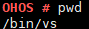

pwd
===

Command Function
----------------

This command is used to display the current path.

Syntax
------

pwd

Parameter Description
---------------------

None

Usage
-----

The **pwd** command writes the full path name of the current directory
(from the root directory) to the standard output. All directories are
separated by slashes (/). The directory following the first slash (/)
indicates the root directory, and the last directory is the current
directory.

Example
-------

Enter **pwd**.

Output
------

| **Figure 1** Querying the current path
| |image1|

