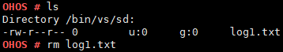
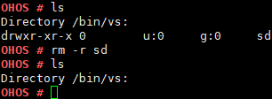

rm
==

Command Function
----------------

This command is used to delete a file or folder.

Syntax
------

rm [*-r*] [*dirname / filename*]

Parameter Description
---------------------

**Table 1** Parameters

.. raw:: html

   <table>

.. raw:: html

   <thead align="left">

.. raw:: html

   <tr id="row1513mcpsimp">

.. raw:: html

   <th class="cellrowborder" valign="top" width="22.220000000000002%" id="mcps1.2.4.1.1">

.. raw:: html

   

Parameter

.. raw:: html

   

.. raw:: html

   </th>

.. raw:: html

   <th class="cellrowborder" valign="top" width="51.519999999999996%" id="mcps1.2.4.1.2">

.. raw:: html

   

Description

.. raw:: html

   

.. raw:: html

   </th>

.. raw:: html

   <th class="cellrowborder" valign="top" width="26.26%" id="mcps1.2.4.1.3">

.. raw:: html

   

Value Range

.. raw:: html

   

.. raw:: html

   </th>

.. raw:: html

   </tr>

.. raw:: html

   </thead>

.. raw:: html

   <tbody>

.. raw:: html

   <tr id="row1520mcpsimp">

.. raw:: html

   <td class="cellrowborder" valign="top" width="22.220000000000002%" headers="mcps1.2.4.1.1 ">

.. raw:: html

   

-r

.. raw:: html

   

.. raw:: html

   </td>

.. raw:: html

   <td class="cellrowborder" valign="top" width="51.519999999999996%" headers="mcps1.2.4.1.2 ">

.. raw:: html

   

Deletes a directory. This parameter is optional. It is required if a
directory is to be deleted.

.. raw:: html

   

.. raw:: html

   </td>

.. raw:: html

   <td class="cellrowborder" valign="top" width="26.26%" headers="mcps1.2.4.1.3 ">

.. raw:: html

   

N/A

.. raw:: html

   

.. raw:: html

   </td>

.. raw:: html

   </tr>

.. raw:: html

   <tr id="row1527mcpsimp">

.. raw:: html

   <td class="cellrowborder" valign="top" width="22.220000000000002%" headers="mcps1.2.4.1.1 ">

.. raw:: html

   

dirname/filename

.. raw:: html

   

.. raw:: html

   </td>

.. raw:: html

   <td class="cellrowborder" valign="top" width="51.519999999999996%" headers="mcps1.2.4.1.2 ">

.. raw:: html

   

Indicates the name of the file or directory to be deleted. The value can
be a path.

.. raw:: html

   

.. raw:: html

   </td>

.. raw:: html

   <td class="cellrowborder" valign="top" width="26.26%" headers="mcps1.2.4.1.3 ">

.. raw:: html

   

N/A

.. raw:: html

   

.. raw:: html

   </td>

.. raw:: html

   </tr>

.. raw:: html

   </tbody>

.. raw:: html

   </table>

Usage
-----

-  The **rm** command deletes only one file or directory at a time.
-  The **rm -r** command can be used to delete a non-empty directory.

Example
-------

Example:

1. Enter **rm log1.txt**.
2. Enter **rm -r sd**.

Output
------

| **Figure 1** Deleting the **log1.txt** file
| |image1|

| **Figure 2** Deleting the **sd** directory
| |image2|

