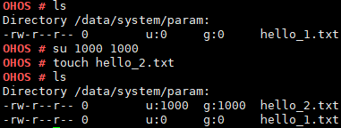

su
==

Command Function
----------------

This command is used to switch the user.

Syntax
------

su [*uid*] [*gid*]

Parameter Description
---------------------

**Table 1** Parameters

.. raw:: html

   <table>

.. raw:: html

   <thead align="left">

.. raw:: html

   <tr id="row1055mcpsimp">

.. raw:: html

   <th class="cellrowborder" valign="top" width="21%" id="mcps1.2.4.1.1">

.. raw:: html

   

Parameter

.. raw:: html

   

.. raw:: html

   </th>

.. raw:: html

   <th class="cellrowborder" valign="top" width="51.93%" id="mcps1.2.4.1.2">

.. raw:: html

   

Description

.. raw:: html

   

.. raw:: html

   </th>

.. raw:: html

   <th class="cellrowborder" valign="top" width="27.07%" id="mcps1.2.4.1.3">

.. raw:: html

   

Value Range

.. raw:: html

   

.. raw:: html

   </th>

.. raw:: html

   </tr>

.. raw:: html

   </thead>

.. raw:: html

   <tbody>

.. raw:: html

   <tr id="row1062mcpsimp">

.. raw:: html

   <td class="cellrowborder" valign="top" width="21%" headers="mcps1.2.4.1.1 ">

.. raw:: html

   

uid

.. raw:: html

   

.. raw:: html

   </td>

.. raw:: html

   <td class="cellrowborder" valign="top" width="51.93%" headers="mcps1.2.4.1.2 ">

.. raw:: html

   

Indicates the ID of the target user.

.. raw:: html

   

.. raw:: html

   </td>

.. raw:: html

   <td class="cellrowborder" valign="top" width="27.07%" headers="mcps1.2.4.1.3 ">

.. raw:: html

   <ul id="ul14151675449">

.. raw:: html

   <li>

Left blank

.. raw:: html

   </li>

.. raw:: html

   <li>

[0, 60000]

.. raw:: html

   </li>

.. raw:: html

   </ul>

.. raw:: html

   </td>

.. raw:: html

   </tr>

.. raw:: html

   <tr id="row172161126124218">

.. raw:: html

   <td class="cellrowborder" valign="top" width="21%" headers="mcps1.2.4.1.1 ">

.. raw:: html

   

gid

.. raw:: html

   

.. raw:: html

   </td>

.. raw:: html

   <td class="cellrowborder" valign="top" width="51.93%" headers="mcps1.2.4.1.2 ">

.. raw:: html

   

Indicates the ID of the target user group.

.. raw:: html

   

.. raw:: html

   </td>

.. raw:: html

   <td class="cellrowborder" valign="top" width="27.07%" headers="mcps1.2.4.1.3 ">

.. raw:: html

   <ul id="ul10433713134417">

.. raw:: html

   <li>

Left blank

.. raw:: html

   </li>

.. raw:: html

   <li>

[0, 60000]

.. raw:: html

   </li>

.. raw:: html

   </ul>

.. raw:: html

   </td>

.. raw:: html

   </tr>

.. raw:: html

   </tbody>

.. raw:: html

   </table>

Usage
-----

-  The **su** command is used to switch to user **root** by default. The
   default value for both **uid** and **gid** is **0**.
-  If the **uid** and **gid** parameters are specified, this command can
   switch to the user with the specified **uid** and **gid**.
-  If the input parameter is out of the range, an error message is
   printed.

Example
-------

Enter **su 1000 1000**.

Output
------

| **Figure 1** Switching to the user whose **uid** and **gid** are both
  **1000**\ 
| |image1|

