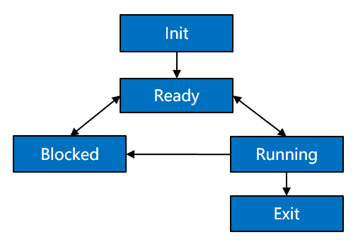

Thread
======

Basic Concepts
--------------

Threads are the minimum running units that compete for system resources.
They can use or wait to use CPUs and use system resources such as
memory. They run independently from one another.

Threads in each process of the OpenHarmony kernel run and are scheduled
independently. The scheduling of threads in a process is not affected by
threads in other processes.

Threads in the OpenHarmony kernel use the preemptive scheduling
mechanism, either round-robin (RR) scheduling or First In First Out
(FIFO) scheduling.

Threads in the OpenHarmony kernel are assigned 32 priorities, ranging
from **0** (highest) to **31** (lowest).

A high-priority thread in a process can preempt the resources of a
low-priority thread in this process. The low-priority thread can be
scheduled only after the high-priority thread is blocked or terminated.

**A thread may have the following states:**

-  **Init**: The thread is being created.

-  **Ready**: The thread is in the ready list and waits for being
   scheduled by the CPU.

-  **Running**: The thread is running.

-  **Blocked**: The thread is blocked and suspended. The **Blocked**
   states include **pend** (blocked due to lock, event, or semaphore
   issues), **suspend** (active pending), **delay** (blocked due to
   delays), and **pendtime** (blocked by waiting timeout of locks,
   events, or semaphores).

-  **Exit**: The thread stops running and waits for the parent thread to
   reclaim its control block resources.

**Figure 1** State transition of a thread

|image1|

**Description of the thread state transition:**

-  Init→Ready:

   When a thread is created, the thread enters the **Init** state to
   start initialization after obtaining the control block. After the
   thread is initialized, the thread is inserted into the scheduling
   queue and therefore enters the **Ready** state.

-  Ready→Running:

   When a thread switchover is triggered, the thread with the highest
   priority in the ready list is executed and enters the **Running**
   state. This thread will be deleted from the ready list.

-  Running→Blocked:

   When a running thread is blocked (for example, is pended, delayed, or
   reading semaphores), the thread is deleted from the ready list, and
   its state changes from **Running** to **Blocked**. Then, a thread
   switchover is triggered to run the thread with the highest priority
   in the ready list.

-  Blocked→Ready/Blocked→Running:

   After the blocked thread is restored (for example, the thread is
   restored, the delay times out, the semaphore reading times out, or
   semaphores have been read), the thread is added to the ready list and
   changes from the **Blocked** state to the **Ready** state. In this
   case, if the priority of the restored thread is higher than that of
   the running thread, a thread switchover occurs to run the restored
   thread, and therefore the restored thread changes from the **Ready**
   state to the **Running** state.

-  Ready→Blocked:

   A thread may also be blocked (suspended) in the **Ready** state. The
   blocked thread will change from the **Ready** state to the
   **Blocked** state and is deleted from the ready list. In this case,
   the thread will not be scheduled until it is restored.

-  Running→Ready:

   After a thread with a higher priority is created or restored, threads
   will be scheduled. The thread with the highest priority in the ready
   list will change to the **Running** state. The originally running
   thread will change from the **Running** state to the **Ready** state
   and be added to the ready list.

-  Running→Exit:

   When a running thread is terminated, its state changes from
   **Running** to **Exit**. The thread without the
   **PTHREAD_CREATE_DETACHED** attribute will present the **Exit** state
   after being terminated.

-  Blocked→Exit:

   If an API is called to delete a blocked thread, the thread changes
   from the **Blocked** state to the **Exit** state.

When to Use
-----------

After a thread is created, it can be scheduled, suspended, restored, and
delayed in user space. In addition, you can set and obtain the
scheduling priority and scheduling policy of the thread.

Available APIs
--------------

The following table describes the APIs provided by the thread management
module of the OpenHarmony kernel.

**Table 1** APIs provided by the thread management module

.. raw:: html

   <table>

.. raw:: html

   <thead align="left">

.. raw:: html

   <tr id="row16880122144619">

.. raw:: html

   <th class="cellrowborder" valign="top" width="14.29%" id="mcps1.2.5.1.1">

.. raw:: html

   

Header File

.. raw:: html

   

.. raw:: html

   </th>

.. raw:: html

   <th class="cellrowborder" valign="top" width="28.57%" id="mcps1.2.5.1.2">

.. raw:: html

   

Function

.. raw:: html

   

.. raw:: html

   </th>

.. raw:: html

   <th class="cellrowborder" valign="top" width="22.45%" id="mcps1.2.5.1.3">

.. raw:: html

   

Description

.. raw:: html

   

.. raw:: html

   </th>

.. raw:: html

   <th class="cellrowborder" valign="top" width="34.69%" id="mcps1.2.5.1.4">

.. raw:: html

   

Remarks

.. raw:: html

   

.. raw:: html

   </th>

.. raw:: html

   </tr>

.. raw:: html

   </thead>

.. raw:: html

   <tbody>

.. raw:: html

   <tr id="row1188092104619">

.. raw:: html

   <td class="cellrowborder" valign="top" width="14.29%" headers="mcps1.2.5.1.1 ">

.. raw:: html

   

pthread.h

.. raw:: html

   

.. raw:: html

   </td>

.. raw:: html

   <td class="cellrowborder" valign="top" width="28.57%" headers="mcps1.2.5.1.2 ">

.. raw:: html

   

pthread_attr_destroy

.. raw:: html

   

.. raw:: html

   </td>

.. raw:: html

   <td class="cellrowborder" valign="top" width="22.45%" headers="mcps1.2.5.1.3 ">

.. raw:: html

   

Destroys a thread attribute object.

.. raw:: html

   

.. raw:: html

   </td>

.. raw:: html

   <td class="cellrowborder" valign="top" width="34.69%" headers="mcps1.2.5.1.4 ">

.. raw:: html

   

N/A

.. raw:: html

   

.. raw:: html

   </td>

.. raw:: html

   </tr>

.. raw:: html

   <tr id="row28802274616">

.. raw:: html

   <td class="cellrowborder" valign="top" width="14.29%" headers="mcps1.2.5.1.1 ">

.. raw:: html

   

pthread.h

.. raw:: html

   

.. raw:: html

   </td>

.. raw:: html

   <td class="cellrowborder" valign="top" width="28.57%" headers="mcps1.2.5.1.2 ">

.. raw:: html

   

pthread_attr_getinheritsched

.. raw:: html

   

.. raw:: html

   </td>

.. raw:: html

   <td class="cellrowborder" valign="top" width="22.45%" headers="mcps1.2.5.1.3 ">

.. raw:: html

   

Obtains inherit scheduler attributes of a thread attribute object.

.. raw:: html

   

.. raw:: html

   </td>

.. raw:: html

   <td class="cellrowborder" valign="top" width="34.69%" headers="mcps1.2.5.1.4 ">

.. raw:: html

   

N/A

.. raw:: html

   

.. raw:: html

   </td>

.. raw:: html

   </tr>

.. raw:: html

   <tr id="row1888132164611">

.. raw:: html

   <td class="cellrowborder" valign="top" width="14.29%" headers="mcps1.2.5.1.1 ">

.. raw:: html

   

pthread.h

.. raw:: html

   

.. raw:: html

   </td>

.. raw:: html

   <td class="cellrowborder" valign="top" width="28.57%" headers="mcps1.2.5.1.2 ">

.. raw:: html

   

pthread_attr_getschedparam

.. raw:: html

   

.. raw:: html

   </td>

.. raw:: html

   <td class="cellrowborder" valign="top" width="22.45%" headers="mcps1.2.5.1.3 ">

.. raw:: html

   

Obtains scheduling parameter attributes of a thread attribute object.

.. raw:: html

   

.. raw:: html

   </td>

.. raw:: html

   <td class="cellrowborder" valign="top" width="34.69%" headers="mcps1.2.5.1.4 ">

.. raw:: html

   

N/A

.. raw:: html

   

.. raw:: html

   </td>

.. raw:: html

   </tr>

.. raw:: html

   <tr id="row788102134613">

.. raw:: html

   <td class="cellrowborder" valign="top" width="14.29%" headers="mcps1.2.5.1.1 ">

.. raw:: html

   

pthread.h

.. raw:: html

   

.. raw:: html

   </td>

.. raw:: html

   <td class="cellrowborder" valign="top" width="28.57%" headers="mcps1.2.5.1.2 ">

.. raw:: html

   

pthread_attr_getschedpolicy

.. raw:: html

   

.. raw:: html

   </td>

.. raw:: html

   <td class="cellrowborder" valign="top" width="22.45%" headers="mcps1.2.5.1.3 ">

.. raw:: html

   

Obtains scheduling policy attributes of a thread attribute object.

.. raw:: html

   

.. raw:: html

   </td>

.. raw:: html

   <td class="cellrowborder" valign="top" width="34.69%" headers="mcps1.2.5.1.4 ">

.. raw:: html

   

OpenHarmony supports the SCHED_FIFO and SCHED_RR scheduling policies.

.. raw:: html

   

.. raw:: html

   </td>

.. raw:: html

   </tr>

.. raw:: html

   <tr id="row14881423468">

.. raw:: html

   <td class="cellrowborder" valign="top" width="14.29%" headers="mcps1.2.5.1.1 ">

.. raw:: html

   

pthread.h

.. raw:: html

   

.. raw:: html

   </td>

.. raw:: html

   <td class="cellrowborder" valign="top" width="28.57%" headers="mcps1.2.5.1.2 ">

.. raw:: html

   

pthread_attr_getstacksize

.. raw:: html

   

.. raw:: html

   </td>

.. raw:: html

   <td class="cellrowborder" valign="top" width="22.45%" headers="mcps1.2.5.1.3 ">

.. raw:: html

   

Obtains the stack size of a thread attribute object.

.. raw:: html

   

.. raw:: html

   </td>

.. raw:: html

   <td class="cellrowborder" valign="top" width="34.69%" headers="mcps1.2.5.1.4 ">

.. raw:: html

   

N/A

.. raw:: html

   

.. raw:: html

   </td>

.. raw:: html

   </tr>

.. raw:: html

   <tr id="row088212144619">

.. raw:: html

   <td class="cellrowborder" valign="top" width="14.29%" headers="mcps1.2.5.1.1 ">

.. raw:: html

   

pthread.h

.. raw:: html

   

.. raw:: html

   </td>

.. raw:: html

   <td class="cellrowborder" valign="top" width="28.57%" headers="mcps1.2.5.1.2 ">

.. raw:: html

   

pthread_attr_init

.. raw:: html

   

.. raw:: html

   </td>

.. raw:: html

   <td class="cellrowborder" valign="top" width="22.45%" headers="mcps1.2.5.1.3 ">

.. raw:: html

   

Initializes a thread attribute object.

.. raw:: html

   

.. raw:: html

   </td>

.. raw:: html

   <td class="cellrowborder" valign="top" width="34.69%" headers="mcps1.2.5.1.4 ">

.. raw:: html

   

N/A

.. raw:: html

   

.. raw:: html

   </td>

.. raw:: html

   </tr>

.. raw:: html

   <tr id="row1788214210462">

.. raw:: html

   <td class="cellrowborder" valign="top" width="14.29%" headers="mcps1.2.5.1.1 ">

.. raw:: html

   

pthread.h

.. raw:: html

   

.. raw:: html

   </td>

.. raw:: html

   <td class="cellrowborder" valign="top" width="28.57%" headers="mcps1.2.5.1.2 ">

.. raw:: html

   

pthread_attr_setdetachstate

.. raw:: html

   

.. raw:: html

   </td>

.. raw:: html

   <td class="cellrowborder" valign="top" width="22.45%" headers="mcps1.2.5.1.3 ">

.. raw:: html

   

Sets the detach state for a thread attribute object.

.. raw:: html

   

.. raw:: html

   </td>

.. raw:: html

   <td class="cellrowborder" valign="top" width="34.69%" headers="mcps1.2.5.1.4 ">

.. raw:: html

   

N/A

.. raw:: html

   

.. raw:: html

   </td>

.. raw:: html

   </tr>

.. raw:: html

   <tr id="row188829211469">

.. raw:: html

   <td class="cellrowborder" valign="top" width="14.29%" headers="mcps1.2.5.1.1 ">

.. raw:: html

   

pthread.h

.. raw:: html

   

.. raw:: html

   </td>

.. raw:: html

   <td class="cellrowborder" valign="top" width="28.57%" headers="mcps1.2.5.1.2 ">

.. raw:: html

   

pthread_attr_setinheritsched

.. raw:: html

   

.. raw:: html

   </td>

.. raw:: html

   <td class="cellrowborder" valign="top" width="22.45%" headers="mcps1.2.5.1.3 ">

.. raw:: html

   

Sets inherit scheduler attributes for a thread attribute object.

.. raw:: html

   

.. raw:: html

   </td>

.. raw:: html

   <td class="cellrowborder" valign="top" width="34.69%" headers="mcps1.2.5.1.4 ">

.. raw:: html

   

N/A

.. raw:: html

   

.. raw:: html

   </td>

.. raw:: html

   </tr>

.. raw:: html

   <tr id="row1588310244610">

.. raw:: html

   <td class="cellrowborder" valign="top" width="14.29%" headers="mcps1.2.5.1.1 ">

.. raw:: html

   

pthread.h

.. raw:: html

   

.. raw:: html

   </td>

.. raw:: html

   <td class="cellrowborder" valign="top" width="28.57%" headers="mcps1.2.5.1.2 ">

.. raw:: html

   

pthread_attr_setschedparam

.. raw:: html

   

.. raw:: html

   </td>

.. raw:: html

   <td class="cellrowborder" valign="top" width="22.45%" headers="mcps1.2.5.1.3 ">

.. raw:: html

   

Sets scheduling parameter attributes for a thread attribute object.

.. raw:: html

   

.. raw:: html

   </td>

.. raw:: html

   <td class="cellrowborder" valign="top" width="34.69%" headers="mcps1.2.5.1.4 ">

.. raw:: html

   

A larger value represents a higher priority of the thread in the system.

.. raw:: html

   

.. raw:: html

   

Note: The inheritsched field of the pthread_attr_t attribute must be set
to PTHREAD_EXPLICIT_SCHED. Otherwise, the configured thread scheduling
priority does not take effect. The default value is
PTHREAD_INHERIT_SCHED.

.. raw:: html

   

.. raw:: html

   </td>

.. raw:: html

   </tr>

.. raw:: html

   <tr id="row118831264610">

.. raw:: html

   <td class="cellrowborder" valign="top" width="14.29%" headers="mcps1.2.5.1.1 ">

.. raw:: html

   

pthread.h

.. raw:: html

   

.. raw:: html

   </td>

.. raw:: html

   <td class="cellrowborder" valign="top" width="28.57%" headers="mcps1.2.5.1.2 ">

.. raw:: html

   

pthread_attr_setschedpolicy

.. raw:: html

   

.. raw:: html

   </td>

.. raw:: html

   <td class="cellrowborder" valign="top" width="22.45%" headers="mcps1.2.5.1.3 ">

.. raw:: html

   

Sets scheduling policy attributes for a thread attribute object.

.. raw:: html

   

.. raw:: html

   </td>

.. raw:: html

   <td class="cellrowborder" valign="top" width="34.69%" headers="mcps1.2.5.1.4 ">

.. raw:: html

   

OpenHarmony supports the SCHED_FIFO and SCHED_RR scheduling policies.

.. raw:: html

   

.. raw:: html

   </td>

.. raw:: html

   </tr>

.. raw:: html

   <tr id="row888320244618">

.. raw:: html

   <td class="cellrowborder" valign="top" width="14.29%" headers="mcps1.2.5.1.1 ">

.. raw:: html

   

pthread.h

.. raw:: html

   

.. raw:: html

   </td>

.. raw:: html

   <td class="cellrowborder" valign="top" width="28.57%" headers="mcps1.2.5.1.2 ">

.. raw:: html

   

pthread_attr_setstacksize

.. raw:: html

   

.. raw:: html

   </td>

.. raw:: html

   <td class="cellrowborder" valign="top" width="22.45%" headers="mcps1.2.5.1.3 ">

.. raw:: html

   

Sets the stack size for a thread attribute object.

.. raw:: html

   

.. raw:: html

   </td>

.. raw:: html

   <td class="cellrowborder" valign="top" width="34.69%" headers="mcps1.2.5.1.4 ">

.. raw:: html

   

N/A

.. raw:: html

   

.. raw:: html

   </td>

.. raw:: html

   </tr>

.. raw:: html

   <tr id="row168841629468">

.. raw:: html

   <td class="cellrowborder" valign="top" width="14.29%" headers="mcps1.2.5.1.1 ">

.. raw:: html

   

pthread.h

.. raw:: html

   

.. raw:: html

   </td>

.. raw:: html

   <td class="cellrowborder" valign="top" width="28.57%" headers="mcps1.2.5.1.2 ">

.. raw:: html

   

pthread_getattr_np

.. raw:: html

   

.. raw:: html

   </td>

.. raw:: html

   <td class="cellrowborder" valign="top" width="22.45%" headers="mcps1.2.5.1.3 ">

.. raw:: html

   

Obtains the attributes of a created thread.

.. raw:: html

   

.. raw:: html

   </td>

.. raw:: html

   <td class="cellrowborder" valign="top" width="34.69%" headers="mcps1.2.5.1.4 ">

.. raw:: html

   

N/A

.. raw:: html

   

.. raw:: html

   </td>

.. raw:: html

   </tr>

.. raw:: html

   <tr id="row28842029469">

.. raw:: html

   <td class="cellrowborder" valign="top" width="14.29%" headers="mcps1.2.5.1.1 ">

.. raw:: html

   

pthread.h

.. raw:: html

   

.. raw:: html

   </td>

.. raw:: html

   <td class="cellrowborder" valign="top" width="28.57%" headers="mcps1.2.5.1.2 ">

.. raw:: html

   

pthread_cancel

.. raw:: html

   

.. raw:: html

   </td>

.. raw:: html

   <td class="cellrowborder" valign="top" width="22.45%" headers="mcps1.2.5.1.3 ">

.. raw:: html

   

Sends a cancellation request to a thread.

.. raw:: html

   

.. raw:: html

   </td>

.. raw:: html

   <td class="cellrowborder" valign="top" width="34.69%" headers="mcps1.2.5.1.4 ">

.. raw:: html

   

N/A

.. raw:: html

   

.. raw:: html

   </td>

.. raw:: html

   </tr>

.. raw:: html

   <tr id="row788418214464">

.. raw:: html

   <td class="cellrowborder" valign="top" width="14.29%" headers="mcps1.2.5.1.1 ">

.. raw:: html

   

pthread.h

.. raw:: html

   

.. raw:: html

   </td>

.. raw:: html

   <td class="cellrowborder" valign="top" width="28.57%" headers="mcps1.2.5.1.2 ">

.. raw:: html

   

pthread_testcancel

.. raw:: html

   

.. raw:: html

   </td>

.. raw:: html

   <td class="cellrowborder" valign="top" width="22.45%" headers="mcps1.2.5.1.3 ">

.. raw:: html

   

Requests delivery of any pending cancellation request.

.. raw:: html

   

.. raw:: html

   </td>

.. raw:: html

   <td class="cellrowborder" valign="top" width="34.69%" headers="mcps1.2.5.1.4 ">

.. raw:: html

   

N/A

.. raw:: html

   

.. raw:: html

   </td>

.. raw:: html

   </tr>

.. raw:: html

   <tr id="row98857211461">

.. raw:: html

   <td class="cellrowborder" valign="top" width="14.29%" headers="mcps1.2.5.1.1 ">

.. raw:: html

   

pthread.h

.. raw:: html

   

.. raw:: html

   </td>

.. raw:: html

   <td class="cellrowborder" valign="top" width="28.57%" headers="mcps1.2.5.1.2 ">

.. raw:: html

   

pthread_setcanceltype

.. raw:: html

   

.. raw:: html

   </td>

.. raw:: html

   <td class="cellrowborder" valign="top" width="22.45%" headers="mcps1.2.5.1.3 ">

.. raw:: html

   

Sets the cancelability type for the calling thread.

.. raw:: html

   

.. raw:: html

   </td>

.. raw:: html

   <td class="cellrowborder" valign="top" width="34.69%" headers="mcps1.2.5.1.4 ">

.. raw:: html

   

N/A

.. raw:: html

   

.. raw:: html

   </td>

.. raw:: html

   </tr>

.. raw:: html

   <tr id="row1988516211466">

.. raw:: html

   <td class="cellrowborder" valign="top" width="14.29%" headers="mcps1.2.5.1.1 ">

.. raw:: html

   

pthread.h

.. raw:: html

   

.. raw:: html

   </td>

.. raw:: html

   <td class="cellrowborder" valign="top" width="28.57%" headers="mcps1.2.5.1.2 ">

.. raw:: html

   

pthread_setcancelstate

.. raw:: html

   

.. raw:: html

   </td>

.. raw:: html

   <td class="cellrowborder" valign="top" width="22.45%" headers="mcps1.2.5.1.3 ">

.. raw:: html

   

Sets the cancelability state for the calling thread.

.. raw:: html

   

.. raw:: html

   </td>

.. raw:: html

   <td class="cellrowborder" valign="top" width="34.69%" headers="mcps1.2.5.1.4 ">

.. raw:: html

   

N/A

.. raw:: html

   

.. raw:: html

   </td>

.. raw:: html

   </tr>

.. raw:: html

   <tr id="row1288520284619">

.. raw:: html

   <td class="cellrowborder" valign="top" width="14.29%" headers="mcps1.2.5.1.1 ">

.. raw:: html

   

pthread.h

.. raw:: html

   

.. raw:: html

   </td>

.. raw:: html

   <td class="cellrowborder" valign="top" width="28.57%" headers="mcps1.2.5.1.2 ">

.. raw:: html

   

pthread_create

.. raw:: html

   

.. raw:: html

   </td>

.. raw:: html

   <td class="cellrowborder" valign="top" width="22.45%" headers="mcps1.2.5.1.3 ">

.. raw:: html

   

Creates a thread.

.. raw:: html

   

.. raw:: html

   </td>

.. raw:: html

   <td class="cellrowborder" valign="top" width="34.69%" headers="mcps1.2.5.1.4 ">

.. raw:: html

   

N/A

.. raw:: html

   

.. raw:: html

   </td>

.. raw:: html

   </tr>

.. raw:: html

   <tr id="row1288614204611">

.. raw:: html

   <td class="cellrowborder" valign="top" width="14.29%" headers="mcps1.2.5.1.1 ">

.. raw:: html

   

pthread.h

.. raw:: html

   

.. raw:: html

   </td>

.. raw:: html

   <td class="cellrowborder" valign="top" width="28.57%" headers="mcps1.2.5.1.2 ">

.. raw:: html

   

pthread_detach

.. raw:: html

   

.. raw:: html

   </td>

.. raw:: html

   <td class="cellrowborder" valign="top" width="22.45%" headers="mcps1.2.5.1.3 ">

.. raw:: html

   

Detaches a thread.

.. raw:: html

   

.. raw:: html

   </td>

.. raw:: html

   <td class="cellrowborder" valign="top" width="34.69%" headers="mcps1.2.5.1.4 ">

.. raw:: html

   

N/A

.. raw:: html

   

.. raw:: html

   </td>

.. raw:: html

   </tr>

.. raw:: html

   <tr id="row188614213467">

.. raw:: html

   <td class="cellrowborder" valign="top" width="14.29%" headers="mcps1.2.5.1.1 ">

.. raw:: html

   

pthread.h

.. raw:: html

   

.. raw:: html

   </td>

.. raw:: html

   <td class="cellrowborder" valign="top" width="28.57%" headers="mcps1.2.5.1.2 ">

.. raw:: html

   

pthread_equal

.. raw:: html

   

.. raw:: html

   </td>

.. raw:: html

   <td class="cellrowborder" valign="top" width="22.45%" headers="mcps1.2.5.1.3 ">

.. raw:: html

   

Compares whether two thread IDs are equal.

.. raw:: html

   

.. raw:: html

   </td>

.. raw:: html

   <td class="cellrowborder" valign="top" width="34.69%" headers="mcps1.2.5.1.4 ">

.. raw:: html

   

N/A

.. raw:: html

   

.. raw:: html

   </td>

.. raw:: html

   </tr>

.. raw:: html

   <tr id="row1488619294613">

.. raw:: html

   <td class="cellrowborder" valign="top" width="14.29%" headers="mcps1.2.5.1.1 ">

.. raw:: html

   

pthread.h

.. raw:: html

   

.. raw:: html

   </td>

.. raw:: html

   <td class="cellrowborder" valign="top" width="28.57%" headers="mcps1.2.5.1.2 ">

.. raw:: html

   

pthread_exit

.. raw:: html

   

.. raw:: html

   </td>

.. raw:: html

   <td class="cellrowborder" valign="top" width="22.45%" headers="mcps1.2.5.1.3 ">

.. raw:: html

   

Terminates the calling thread.

.. raw:: html

   

.. raw:: html

   </td>

.. raw:: html

   <td class="cellrowborder" valign="top" width="34.69%" headers="mcps1.2.5.1.4 ">

.. raw:: html

   

N/A

.. raw:: html

   

.. raw:: html

   </td>

.. raw:: html

   </tr>

.. raw:: html

   <tr id="row88871220467">

.. raw:: html

   <td class="cellrowborder" valign="top" width="14.29%" headers="mcps1.2.5.1.1 ">

.. raw:: html

   

pthread.h

.. raw:: html

   

.. raw:: html

   </td>

.. raw:: html

   <td class="cellrowborder" valign="top" width="28.57%" headers="mcps1.2.5.1.2 ">

.. raw:: html

   

pthread_getschedparam

.. raw:: html

   

.. raw:: html

   </td>

.. raw:: html

   <td class="cellrowborder" valign="top" width="22.45%" headers="mcps1.2.5.1.3 ">

.. raw:: html

   

Obtains the scheduling policy and parameters of a thread.

.. raw:: html

   

.. raw:: html

   </td>

.. raw:: html

   <td class="cellrowborder" valign="top" width="34.69%" headers="mcps1.2.5.1.4 ">

.. raw:: html

   

OpenHarmony supports the SCHED_FIFO and SCHED_RR scheduling policies.

.. raw:: html

   

.. raw:: html

   </td>

.. raw:: html

   </tr>

.. raw:: html

   <tr id="row198871527462">

.. raw:: html

   <td class="cellrowborder" valign="top" width="14.29%" headers="mcps1.2.5.1.1 ">

.. raw:: html

   

pthread.h

.. raw:: html

   

.. raw:: html

   </td>

.. raw:: html

   <td class="cellrowborder" valign="top" width="28.57%" headers="mcps1.2.5.1.2 ">

.. raw:: html

   

pthread_join

.. raw:: html

   

.. raw:: html

   </td>

.. raw:: html

   <td class="cellrowborder" valign="top" width="22.45%" headers="mcps1.2.5.1.3 ">

.. raw:: html

   

Waits for a thread to terminate.

.. raw:: html

   

.. raw:: html

   </td>

.. raw:: html

   <td class="cellrowborder" valign="top" width="34.69%" headers="mcps1.2.5.1.4 ">

.. raw:: html

   

N/A

.. raw:: html

   

.. raw:: html

   </td>

.. raw:: html

   </tr>

.. raw:: html

   <tr id="row13888142184617">

.. raw:: html

   <td class="cellrowborder" valign="top" width="14.29%" headers="mcps1.2.5.1.1 ">

.. raw:: html

   

pthread.h

.. raw:: html

   

.. raw:: html

   </td>

.. raw:: html

   <td class="cellrowborder" valign="top" width="28.57%" headers="mcps1.2.5.1.2 ">

.. raw:: html

   

pthread_self

.. raw:: html

   

.. raw:: html

   </td>

.. raw:: html

   <td class="cellrowborder" valign="top" width="22.45%" headers="mcps1.2.5.1.3 ">

.. raw:: html

   

Obtains the ID of the calling thread.

.. raw:: html

   

.. raw:: html

   </td>

.. raw:: html

   <td class="cellrowborder" valign="top" width="34.69%" headers="mcps1.2.5.1.4 ">

.. raw:: html

   

N/A

.. raw:: html

   

.. raw:: html

   </td>

.. raw:: html

   </tr>

.. raw:: html

   <tr id="row15888132124614">

.. raw:: html

   <td class="cellrowborder" valign="top" width="14.29%" headers="mcps1.2.5.1.1 ">

.. raw:: html

   

pthread.h

.. raw:: html

   

.. raw:: html

   </td>

.. raw:: html

   <td class="cellrowborder" valign="top" width="28.57%" headers="mcps1.2.5.1.2 ">

.. raw:: html

   

pthread_setschedprio

.. raw:: html

   

.. raw:: html

   </td>

.. raw:: html

   <td class="cellrowborder" valign="top" width="22.45%" headers="mcps1.2.5.1.3 ">

.. raw:: html

   

Sets a static scheduling priority for a thread.

.. raw:: html

   

.. raw:: html

   </td>

.. raw:: html

   <td class="cellrowborder" valign="top" width="34.69%" headers="mcps1.2.5.1.4 ">

.. raw:: html

   

N/A

.. raw:: html

   

.. raw:: html

   </td>

.. raw:: html

   </tr>

.. raw:: html

   <tr id="row12889142194616">

.. raw:: html

   <td class="cellrowborder" valign="top" width="14.29%" headers="mcps1.2.5.1.1 ">

.. raw:: html

   

pthread.h

.. raw:: html

   

.. raw:: html

   </td>

.. raw:: html

   <td class="cellrowborder" valign="top" width="28.57%" headers="mcps1.2.5.1.2 ">

.. raw:: html

   

pthread_kill

.. raw:: html

   

.. raw:: html

   </td>

.. raw:: html

   <td class="cellrowborder" valign="top" width="22.45%" headers="mcps1.2.5.1.3 ">

.. raw:: html

   

Sends a signal to a thread.

.. raw:: html

   

.. raw:: html

   </td>

.. raw:: html

   <td class="cellrowborder" valign="top" width="34.69%" headers="mcps1.2.5.1.4 ">

.. raw:: html

   

N/A

.. raw:: html

   

.. raw:: html

   </td>

.. raw:: html

   </tr>

.. raw:: html

   <tr id="row19889624465">

.. raw:: html

   <td class="cellrowborder" valign="top" width="14.29%" headers="mcps1.2.5.1.1 ">

.. raw:: html

   

pthread.h

.. raw:: html

   

.. raw:: html

   </td>

.. raw:: html

   <td class="cellrowborder" valign="top" width="28.57%" headers="mcps1.2.5.1.2 ">

.. raw:: html

   

pthread_once

.. raw:: html

   

.. raw:: html

   </td>

.. raw:: html

   <td class="cellrowborder" valign="top" width="22.45%" headers="mcps1.2.5.1.3 ">

.. raw:: html

   

Enables the initialization function to be called only once.

.. raw:: html

   

.. raw:: html

   </td>

.. raw:: html

   <td class="cellrowborder" valign="top" width="34.69%" headers="mcps1.2.5.1.4 ">

.. raw:: html

   

N/A

.. raw:: html

   

.. raw:: html

   </td>

.. raw:: html

   </tr>

.. raw:: html

   <tr id="row288917219462">

.. raw:: html

   <td class="cellrowborder" valign="top" width="14.29%" headers="mcps1.2.5.1.1 ">

.. raw:: html

   

pthread.h

.. raw:: html

   

.. raw:: html

   </td>

.. raw:: html

   <td class="cellrowborder" valign="top" width="28.57%" headers="mcps1.2.5.1.2 ">

.. raw:: html

   

pthread_atfork

.. raw:: html

   

.. raw:: html

   </td>

.. raw:: html

   <td class="cellrowborder" valign="top" width="22.45%" headers="mcps1.2.5.1.3 ">

.. raw:: html

   

Registers a fork handler to be called before and after fork().

.. raw:: html

   

.. raw:: html

   </td>

.. raw:: html

   <td class="cellrowborder" valign="top" width="34.69%" headers="mcps1.2.5.1.4 ">

.. raw:: html

   

N/A

.. raw:: html

   

.. raw:: html

   </td>

.. raw:: html

   </tr>

.. raw:: html

   <tr id="row988922114611">

.. raw:: html

   <td class="cellrowborder" valign="top" width="14.29%" headers="mcps1.2.5.1.1 ">

.. raw:: html

   

pthread.h

.. raw:: html

   

.. raw:: html

   </td>

.. raw:: html

   <td class="cellrowborder" valign="top" width="28.57%" headers="mcps1.2.5.1.2 ">

.. raw:: html

   

pthread_cleanup_pop

.. raw:: html

   

.. raw:: html

   </td>

.. raw:: html

   <td class="cellrowborder" valign="top" width="22.45%" headers="mcps1.2.5.1.3 ">

.. raw:: html

   

Removes the routine at the top of the clean-up handler stack.

.. raw:: html

   

.. raw:: html

   </td>

.. raw:: html

   <td class="cellrowborder" valign="top" width="34.69%" headers="mcps1.2.5.1.4 ">

.. raw:: html

   

N/A

.. raw:: html

   

.. raw:: html

   </td>

.. raw:: html

   </tr>

.. raw:: html

   <tr id="row188906284610">

.. raw:: html

   <td class="cellrowborder" valign="top" width="14.29%" headers="mcps1.2.5.1.1 ">

.. raw:: html

   

pthread.h

.. raw:: html

   

.. raw:: html

   </td>

.. raw:: html

   <td class="cellrowborder" valign="top" width="28.57%" headers="mcps1.2.5.1.2 ">

.. raw:: html

   

pthread_cleanup_push

.. raw:: html

   

.. raw:: html

   </td>

.. raw:: html

   <td class="cellrowborder" valign="top" width="22.45%" headers="mcps1.2.5.1.3 ">

.. raw:: html

   

Pushes the routine to the top of the clean-up handler stack.

.. raw:: html

   

.. raw:: html

   </td>

.. raw:: html

   <td class="cellrowborder" valign="top" width="34.69%" headers="mcps1.2.5.1.4 ">

.. raw:: html

   

N/A

.. raw:: html

   

.. raw:: html

   </td>

.. raw:: html

   </tr>

.. raw:: html

   <tr id="row189012284618">

.. raw:: html

   <td class="cellrowborder" valign="top" width="14.29%" headers="mcps1.2.5.1.1 ">

.. raw:: html

   

pthread.h

.. raw:: html

   

.. raw:: html

   </td>

.. raw:: html

   <td class="cellrowborder" valign="top" width="28.57%" headers="mcps1.2.5.1.2 ">

.. raw:: html

   

pthread_barrier_destroy

.. raw:: html

   

.. raw:: html

   </td>

.. raw:: html

   <td class="cellrowborder" valign="top" width="22.45%" headers="mcps1.2.5.1.3 ">

.. raw:: html

   

Destroys a barrier (an advanced real-time thread).

.. raw:: html

   

.. raw:: html

   </td>

.. raw:: html

   <td class="cellrowborder" valign="top" width="34.69%" headers="mcps1.2.5.1.4 ">

.. raw:: html

   

N/A

.. raw:: html

   

.. raw:: html

   </td>

.. raw:: html

   </tr>

.. raw:: html

   <tr id="row089015218467">

.. raw:: html

   <td class="cellrowborder" valign="top" width="14.29%" headers="mcps1.2.5.1.1 ">

.. raw:: html

   

pthread.h

.. raw:: html

   

.. raw:: html

   </td>

.. raw:: html

   <td class="cellrowborder" valign="top" width="28.57%" headers="mcps1.2.5.1.2 ">

.. raw:: html

   

pthread_barrier_init

.. raw:: html

   

.. raw:: html

   </td>

.. raw:: html

   <td class="cellrowborder" valign="top" width="22.45%" headers="mcps1.2.5.1.3 ">

.. raw:: html

   

Initializes a barrier (an advanced real-time thread).

.. raw:: html

   

.. raw:: html

   </td>

.. raw:: html

   <td class="cellrowborder" valign="top" width="34.69%" headers="mcps1.2.5.1.4 ">

.. raw:: html

   

N/A

.. raw:: html

   

.. raw:: html

   </td>

.. raw:: html

   </tr>

.. raw:: html

   <tr id="row8890182114615">

.. raw:: html

   <td class="cellrowborder" valign="top" width="14.29%" headers="mcps1.2.5.1.1 ">

.. raw:: html

   

pthread.h

.. raw:: html

   

.. raw:: html

   </td>

.. raw:: html

   <td class="cellrowborder" valign="top" width="28.57%" headers="mcps1.2.5.1.2 ">

.. raw:: html

   

pthread_barrier_wait

.. raw:: html

   

.. raw:: html

   </td>

.. raw:: html

   <td class="cellrowborder" valign="top" width="22.45%" headers="mcps1.2.5.1.3 ">

.. raw:: html

   

Synchronizes participating threads at a barrier.

.. raw:: html

   

.. raw:: html

   </td>

.. raw:: html

   <td class="cellrowborder" valign="top" width="34.69%" headers="mcps1.2.5.1.4 ">

.. raw:: html

   

N/A

.. raw:: html

   

.. raw:: html

   </td>

.. raw:: html

   </tr>

.. raw:: html

   <tr id="row589110216461">

.. raw:: html

   <td class="cellrowborder" valign="top" width="14.29%" headers="mcps1.2.5.1.1 ">

.. raw:: html

   

pthread.h

.. raw:: html

   

.. raw:: html

   </td>

.. raw:: html

   <td class="cellrowborder" valign="top" width="28.57%" headers="mcps1.2.5.1.2 ">

.. raw:: html

   

pthread_barrierattr_destroy

.. raw:: html

   

.. raw:: html

   </td>

.. raw:: html

   <td class="cellrowborder" valign="top" width="22.45%" headers="mcps1.2.5.1.3 ">

.. raw:: html

   

Destroys a barrier attribute object.

.. raw:: html

   

.. raw:: html

   </td>

.. raw:: html

   <td class="cellrowborder" valign="top" width="34.69%" headers="mcps1.2.5.1.4 ">

.. raw:: html

   

N/A

.. raw:: html

   

.. raw:: html

   </td>

.. raw:: html

   </tr>

.. raw:: html

   <tr id="row9891624468">

.. raw:: html

   <td class="cellrowborder" valign="top" width="14.29%" headers="mcps1.2.5.1.1 ">

.. raw:: html

   

pthread.h

.. raw:: html

   

.. raw:: html

   </td>

.. raw:: html

   <td class="cellrowborder" valign="top" width="28.57%" headers="mcps1.2.5.1.2 ">

.. raw:: html

   

pthread_barrierattr_init

.. raw:: html

   

.. raw:: html

   </td>

.. raw:: html

   <td class="cellrowborder" valign="top" width="22.45%" headers="mcps1.2.5.1.3 ">

.. raw:: html

   

Initializes a barrier attribute object.

.. raw:: html

   

.. raw:: html

   </td>

.. raw:: html

   <td class="cellrowborder" valign="top" width="34.69%" headers="mcps1.2.5.1.4 ">

.. raw:: html

   

N/A

.. raw:: html

   

.. raw:: html

   </td>

.. raw:: html

   </tr>

.. raw:: html

   <tr id="row118914214464">

.. raw:: html

   <td class="cellrowborder" valign="top" width="14.29%" headers="mcps1.2.5.1.1 ">

.. raw:: html

   

pthread.h

.. raw:: html

   

.. raw:: html

   </td>

.. raw:: html

   <td class="cellrowborder" valign="top" width="28.57%" headers="mcps1.2.5.1.2 ">

.. raw:: html

   

pthread_mutex_destroy

.. raw:: html

   

.. raw:: html

   </td>

.. raw:: html

   <td class="cellrowborder" valign="top" width="22.45%" headers="mcps1.2.5.1.3 ">

.. raw:: html

   

Destroys a mutex.

.. raw:: html

   

.. raw:: html

   </td>

.. raw:: html

   <td class="cellrowborder" valign="top" width="34.69%" headers="mcps1.2.5.1.4 ">

.. raw:: html

   

N/A

.. raw:: html

   

.. raw:: html

   </td>

.. raw:: html

   </tr>

.. raw:: html

   <tr id="row18891326468">

.. raw:: html

   <td class="cellrowborder" valign="top" width="14.29%" headers="mcps1.2.5.1.1 ">

.. raw:: html

   

pthread.h

.. raw:: html

   

.. raw:: html

   </td>

.. raw:: html

   <td class="cellrowborder" valign="top" width="28.57%" headers="mcps1.2.5.1.2 ">

.. raw:: html

   

pthread_mutex_init

.. raw:: html

   

.. raw:: html

   </td>

.. raw:: html

   <td class="cellrowborder" valign="top" width="22.45%" headers="mcps1.2.5.1.3 ">

.. raw:: html

   

Initializes a mutex.

.. raw:: html

   

.. raw:: html

   </td>

.. raw:: html

   <td class="cellrowborder" valign="top" width="34.69%" headers="mcps1.2.5.1.4 ">

.. raw:: html

   

N/A

.. raw:: html

   

.. raw:: html

   </td>

.. raw:: html

   </tr>

.. raw:: html

   <tr id="row1689213216461">

.. raw:: html

   <td class="cellrowborder" valign="top" width="14.29%" headers="mcps1.2.5.1.1 ">

.. raw:: html

   

pthread.h

.. raw:: html

   

.. raw:: html

   </td>

.. raw:: html

   <td class="cellrowborder" valign="top" width="28.57%" headers="mcps1.2.5.1.2 ">

.. raw:: html

   

pthread_mutex_lock

.. raw:: html

   

.. raw:: html

   </td>

.. raw:: html

   <td class="cellrowborder" valign="top" width="22.45%" headers="mcps1.2.5.1.3 ">

.. raw:: html

   

Locks a mutex.

.. raw:: html

   

.. raw:: html

   </td>

.. raw:: html

   <td class="cellrowborder" valign="top" width="34.69%" headers="mcps1.2.5.1.4 ">

.. raw:: html

   

N/A

.. raw:: html

   

.. raw:: html

   </td>

.. raw:: html

   </tr>

.. raw:: html

   <tr id="row989214284614">

.. raw:: html

   <td class="cellrowborder" valign="top" width="14.29%" headers="mcps1.2.5.1.1 ">

.. raw:: html

   

pthread.h

.. raw:: html

   

.. raw:: html

   </td>

.. raw:: html

   <td class="cellrowborder" valign="top" width="28.57%" headers="mcps1.2.5.1.2 ">

.. raw:: html

   

pthread_mutex_trylock

.. raw:: html

   

.. raw:: html

   </td>

.. raw:: html

   <td class="cellrowborder" valign="top" width="22.45%" headers="mcps1.2.5.1.3 ">

.. raw:: html

   

Attempts to lock a mutex.

.. raw:: html

   

.. raw:: html

   </td>

.. raw:: html

   <td class="cellrowborder" valign="top" width="34.69%" headers="mcps1.2.5.1.4 ">

.. raw:: html

   

N/A

.. raw:: html

   

.. raw:: html

   </td>

.. raw:: html

   </tr>

.. raw:: html

   <tr id="row1989218264610">

.. raw:: html

   <td class="cellrowborder" valign="top" width="14.29%" headers="mcps1.2.5.1.1 ">

.. raw:: html

   

pthread.h

.. raw:: html

   

.. raw:: html

   </td>

.. raw:: html

   <td class="cellrowborder" valign="top" width="28.57%" headers="mcps1.2.5.1.2 ">

.. raw:: html

   

pthread_mutex_unlock

.. raw:: html

   

.. raw:: html

   </td>

.. raw:: html

   <td class="cellrowborder" valign="top" width="22.45%" headers="mcps1.2.5.1.3 ">

.. raw:: html

   

Unlocks a mutex.

.. raw:: html

   

.. raw:: html

   </td>

.. raw:: html

   <td class="cellrowborder" valign="top" width="34.69%" headers="mcps1.2.5.1.4 ">

.. raw:: html

   

N/A

.. raw:: html

   

.. raw:: html

   </td>

.. raw:: html

   </tr>

.. raw:: html

   <tr id="row10893192194614">

.. raw:: html

   <td class="cellrowborder" valign="top" width="14.29%" headers="mcps1.2.5.1.1 ">

.. raw:: html

   

pthread.h

.. raw:: html

   

.. raw:: html

   </td>

.. raw:: html

   <td class="cellrowborder" valign="top" width="28.57%" headers="mcps1.2.5.1.2 ">

.. raw:: html

   

pthread_mutexattr_destroy

.. raw:: html

   

.. raw:: html

   </td>

.. raw:: html

   <td class="cellrowborder" valign="top" width="22.45%" headers="mcps1.2.5.1.3 ">

.. raw:: html

   

Destroys a mutex attribute object.

.. raw:: html

   

.. raw:: html

   </td>

.. raw:: html

   <td class="cellrowborder" valign="top" width="34.69%" headers="mcps1.2.5.1.4 ">

.. raw:: html

   

N/A

.. raw:: html

   

.. raw:: html

   </td>

.. raw:: html

   </tr>

.. raw:: html

   <tr id="row7893523465">

.. raw:: html

   <td class="cellrowborder" valign="top" width="14.29%" headers="mcps1.2.5.1.1 ">

.. raw:: html

   

pthread.h

.. raw:: html

   

.. raw:: html

   </td>

.. raw:: html

   <td class="cellrowborder" valign="top" width="28.57%" headers="mcps1.2.5.1.2 ">

.. raw:: html

   

pthread_mutexattr_gettype

.. raw:: html

   

.. raw:: html

   </td>

.. raw:: html

   <td class="cellrowborder" valign="top" width="22.45%" headers="mcps1.2.5.1.3 ">

.. raw:: html

   

Obtains the mutex type attribute.

.. raw:: html

   

.. raw:: html

   </td>

.. raw:: html

   <td class="cellrowborder" valign="top" width="34.69%" headers="mcps1.2.5.1.4 ">

.. raw:: html

   

N/A

.. raw:: html

   

.. raw:: html

   </td>

.. raw:: html

   </tr>

.. raw:: html

   <tr id="row15893526464">

.. raw:: html

   <td class="cellrowborder" valign="top" width="14.29%" headers="mcps1.2.5.1.1 ">

.. raw:: html

   

pthread.h

.. raw:: html

   

.. raw:: html

   </td>

.. raw:: html

   <td class="cellrowborder" valign="top" width="28.57%" headers="mcps1.2.5.1.2 ">

.. raw:: html

   

pthread_mutexattr_init

.. raw:: html

   

.. raw:: html

   </td>

.. raw:: html

   <td class="cellrowborder" valign="top" width="22.45%" headers="mcps1.2.5.1.3 ">

.. raw:: html

   

Initializes a mutex attribute object.

.. raw:: html

   

.. raw:: html

   </td>

.. raw:: html

   <td class="cellrowborder" valign="top" width="34.69%" headers="mcps1.2.5.1.4 ">

.. raw:: html

   

N/A

.. raw:: html

   

.. raw:: html

   </td>

.. raw:: html

   </tr>

.. raw:: html

   <tr id="row1894102194616">

.. raw:: html

   <td class="cellrowborder" valign="top" width="14.29%" headers="mcps1.2.5.1.1 ">

.. raw:: html

   

pthread.h

.. raw:: html

   

.. raw:: html

   </td>

.. raw:: html

   <td class="cellrowborder" valign="top" width="28.57%" headers="mcps1.2.5.1.2 ">

.. raw:: html

   

pthread_mutexattr_settype

.. raw:: html

   

.. raw:: html

   </td>

.. raw:: html

   <td class="cellrowborder" valign="top" width="22.45%" headers="mcps1.2.5.1.3 ">

.. raw:: html

   

Sets the mutex type attribute.

.. raw:: html

   

.. raw:: html

   </td>

.. raw:: html

   <td class="cellrowborder" valign="top" width="34.69%" headers="mcps1.2.5.1.4 ">

.. raw:: html

   

N/A

.. raw:: html

   

.. raw:: html

   </td>

.. raw:: html

   </tr>

.. raw:: html

   <tr id="row48942215466">

.. raw:: html

   <td class="cellrowborder" valign="top" width="14.29%" headers="mcps1.2.5.1.1 ">

.. raw:: html

   

pthread.h

.. raw:: html

   

.. raw:: html

   </td>

.. raw:: html

   <td class="cellrowborder" valign="top" width="28.57%" headers="mcps1.2.5.1.2 ">

.. raw:: html

   

pthread_mutex_timedlock

.. raw:: html

   

.. raw:: html

   </td>

.. raw:: html

   <td class="cellrowborder" valign="top" width="22.45%" headers="mcps1.2.5.1.3 ">

.. raw:: html

   

Blocks the calling thread to lock a mutex.

.. raw:: html

   

.. raw:: html

   </td>

.. raw:: html

   <td class="cellrowborder" valign="top" width="34.69%" headers="mcps1.2.5.1.4 ">

.. raw:: html

   

N/A

.. raw:: html

   

.. raw:: html

   </td>

.. raw:: html

   </tr>

.. raw:: html

   <tr id="row1894122134612">

.. raw:: html

   <td class="cellrowborder" valign="top" width="14.29%" headers="mcps1.2.5.1.1 ">

.. raw:: html

   

pthread.h

.. raw:: html

   

.. raw:: html

   </td>

.. raw:: html

   <td class="cellrowborder" valign="top" width="28.57%" headers="mcps1.2.5.1.2 ">

.. raw:: html

   

pthread_rwlock_destroy

.. raw:: html

   

.. raw:: html

   </td>

.. raw:: html

   <td class="cellrowborder" valign="top" width="22.45%" headers="mcps1.2.5.1.3 ">

.. raw:: html

   

Destroys a read-write lock.

.. raw:: html

   

.. raw:: html

   </td>

.. raw:: html

   <td class="cellrowborder" valign="top" width="34.69%" headers="mcps1.2.5.1.4 ">

.. raw:: html

   

N/A

.. raw:: html

   

.. raw:: html

   </td>

.. raw:: html

   </tr>

.. raw:: html

   <tr id="row989562144613">

.. raw:: html

   <td class="cellrowborder" valign="top" width="14.29%" headers="mcps1.2.5.1.1 ">

.. raw:: html

   

pthread.h

.. raw:: html

   

.. raw:: html

   </td>

.. raw:: html

   <td class="cellrowborder" valign="top" width="28.57%" headers="mcps1.2.5.1.2 ">

.. raw:: html

   

pthread_rwlock_init

.. raw:: html

   

.. raw:: html

   </td>

.. raw:: html

   <td class="cellrowborder" valign="top" width="22.45%" headers="mcps1.2.5.1.3 ">

.. raw:: html

   

Initializes a read-write lock.

.. raw:: html

   

.. raw:: html

   </td>

.. raw:: html

   <td class="cellrowborder" valign="top" width="34.69%" headers="mcps1.2.5.1.4 ">

.. raw:: html

   

N/A

.. raw:: html

   

.. raw:: html

   </td>

.. raw:: html

   </tr>

.. raw:: html

   <tr id="row118953217461">

.. raw:: html

   <td class="cellrowborder" valign="top" width="14.29%" headers="mcps1.2.5.1.1 ">

.. raw:: html

   

pthread.h

.. raw:: html

   

.. raw:: html

   </td>

.. raw:: html

   <td class="cellrowborder" valign="top" width="28.57%" headers="mcps1.2.5.1.2 ">

.. raw:: html

   

pthread_rwlock_rdlock

.. raw:: html

   

.. raw:: html

   </td>

.. raw:: html

   <td class="cellrowborder" valign="top" width="22.45%" headers="mcps1.2.5.1.3 ">

.. raw:: html

   

Applies a read lock to a read-write lock.

.. raw:: html

   

.. raw:: html

   </td>

.. raw:: html

   <td class="cellrowborder" valign="top" width="34.69%" headers="mcps1.2.5.1.4 ">

.. raw:: html

   

N/A

.. raw:: html

   

.. raw:: html

   </td>

.. raw:: html

   </tr>

.. raw:: html

   <tr id="row689515218467">

.. raw:: html

   <td class="cellrowborder" valign="top" width="14.29%" headers="mcps1.2.5.1.1 ">

.. raw:: html

   

pthread.h

.. raw:: html

   

.. raw:: html

   </td>

.. raw:: html

   <td class="cellrowborder" valign="top" width="28.57%" headers="mcps1.2.5.1.2 ">

.. raw:: html

   

pthread_rwlock_timedrdlock

.. raw:: html

   

.. raw:: html

   </td>

.. raw:: html

   <td class="cellrowborder" valign="top" width="22.45%" headers="mcps1.2.5.1.3 ">

.. raw:: html

   

Blocks the calling thread to lock a read-write lock for reading.

.. raw:: html

   

.. raw:: html

   </td>

.. raw:: html

   <td class="cellrowborder" valign="top" width="34.69%" headers="mcps1.2.5.1.4 ">

.. raw:: html

   

N/A

.. raw:: html

   

.. raw:: html

   </td>

.. raw:: html

   </tr>

.. raw:: html

   <tr id="row789615254618">

.. raw:: html

   <td class="cellrowborder" valign="top" width="14.29%" headers="mcps1.2.5.1.1 ">

.. raw:: html

   

pthread.h

.. raw:: html

   

.. raw:: html

   </td>

.. raw:: html

   <td class="cellrowborder" valign="top" width="28.57%" headers="mcps1.2.5.1.2 ">

.. raw:: html

   

pthread_rwlock_timedwrlock

.. raw:: html

   

.. raw:: html

   </td>

.. raw:: html

   <td class="cellrowborder" valign="top" width="22.45%" headers="mcps1.2.5.1.3 ">

.. raw:: html

   

Blocks the calling thread to lock a read-write lock for writing.

.. raw:: html

   

.. raw:: html

   </td>

.. raw:: html

   <td class="cellrowborder" valign="top" width="34.69%" headers="mcps1.2.5.1.4 ">

.. raw:: html

   

N/A

.. raw:: html

   

.. raw:: html

   </td>

.. raw:: html

   </tr>

.. raw:: html

   <tr id="row38966284617">

.. raw:: html

   <td class="cellrowborder" valign="top" width="14.29%" headers="mcps1.2.5.1.1 ">

.. raw:: html

   

pthread.h

.. raw:: html

   

.. raw:: html

   </td>

.. raw:: html

   <td class="cellrowborder" valign="top" width="28.57%" headers="mcps1.2.5.1.2 ">

.. raw:: html

   

pthread_rwlock_tryrdlock

.. raw:: html

   

.. raw:: html

   </td>

.. raw:: html

   <td class="cellrowborder" valign="top" width="22.45%" headers="mcps1.2.5.1.3 ">

.. raw:: html

   

Attempts to apply a read lock to a read-write lock.

.. raw:: html

   

.. raw:: html

   </td>

.. raw:: html

   <td class="cellrowborder" valign="top" width="34.69%" headers="mcps1.2.5.1.4 ">

.. raw:: html

   

N/A

.. raw:: html

   

.. raw:: html

   </td>

.. raw:: html

   </tr>

.. raw:: html

   <tr id="row20896142154616">

.. raw:: html

   <td class="cellrowborder" valign="top" width="14.29%" headers="mcps1.2.5.1.1 ">

.. raw:: html

   

pthread.h

.. raw:: html

   

.. raw:: html

   </td>

.. raw:: html

   <td class="cellrowborder" valign="top" width="28.57%" headers="mcps1.2.5.1.2 ">

.. raw:: html

   

pthread_rwlock_trywrlock

.. raw:: html

   

.. raw:: html

   </td>

.. raw:: html

   <td class="cellrowborder" valign="top" width="22.45%" headers="mcps1.2.5.1.3 ">

.. raw:: html

   

Attempts to apply a write lock to a read-write lock.

.. raw:: html

   

.. raw:: html

   </td>

.. raw:: html

   <td class="cellrowborder" valign="top" width="34.69%" headers="mcps1.2.5.1.4 ">

.. raw:: html

   

N/A

.. raw:: html

   

.. raw:: html

   </td>

.. raw:: html

   </tr>

.. raw:: html

   <tr id="row489815210461">

.. raw:: html

   <td class="cellrowborder" valign="top" width="14.29%" headers="mcps1.2.5.1.1 ">

.. raw:: html

   

pthread.h

.. raw:: html

   

.. raw:: html

   </td>

.. raw:: html

   <td class="cellrowborder" valign="top" width="28.57%" headers="mcps1.2.5.1.2 ">

.. raw:: html

   

pthread_rwlock_unlock

.. raw:: html

   

.. raw:: html

   </td>

.. raw:: html

   <td class="cellrowborder" valign="top" width="22.45%" headers="mcps1.2.5.1.3 ">

.. raw:: html

   

Unlocks a read-write lock.

.. raw:: html

   

.. raw:: html

   </td>

.. raw:: html

   <td class="cellrowborder" valign="top" width="34.69%" headers="mcps1.2.5.1.4 ">

.. raw:: html

   

N/A

.. raw:: html

   

.. raw:: html

   </td>

.. raw:: html

   </tr>

.. raw:: html

   <tr id="row1890032124612">

.. raw:: html

   <td class="cellrowborder" valign="top" width="14.29%" headers="mcps1.2.5.1.1 ">

.. raw:: html

   

pthread.h

.. raw:: html

   

.. raw:: html

   </td>

.. raw:: html

   <td class="cellrowborder" valign="top" width="28.57%" headers="mcps1.2.5.1.2 ">

.. raw:: html

   

pthread_rwlock_wrlock

.. raw:: html

   

.. raw:: html

   </td>

.. raw:: html

   <td class="cellrowborder" valign="top" width="22.45%" headers="mcps1.2.5.1.3 ">

.. raw:: html

   

Applies a write lock to a read-write lock.

.. raw:: html

   

.. raw:: html

   </td>

.. raw:: html

   <td class="cellrowborder" valign="top" width="34.69%" headers="mcps1.2.5.1.4 ">

.. raw:: html

   

N/A

.. raw:: html

   

.. raw:: html

   </td>

.. raw:: html

   </tr>

.. raw:: html

   <tr id="row590032124613">

.. raw:: html

   <td class="cellrowborder" valign="top" width="14.29%" headers="mcps1.2.5.1.1 ">

.. raw:: html

   

pthread.h

.. raw:: html

   

.. raw:: html

   </td>

.. raw:: html

   <td class="cellrowborder" valign="top" width="28.57%" headers="mcps1.2.5.1.2 ">

.. raw:: html

   

pthread_rwlockattr_destroy

.. raw:: html

   

.. raw:: html

   </td>

.. raw:: html

   <td class="cellrowborder" valign="top" width="22.45%" headers="mcps1.2.5.1.3 ">

.. raw:: html

   

Destroys a read-write lock attribute object.

.. raw:: html

   

.. raw:: html

   </td>

.. raw:: html

   <td class="cellrowborder" valign="top" width="34.69%" headers="mcps1.2.5.1.4 ">

.. raw:: html

   

N/A

.. raw:: html

   

.. raw:: html

   </td>

.. raw:: html

   </tr>

.. raw:: html

   <tr id="row190042174617">

.. raw:: html

   <td class="cellrowborder" valign="top" width="14.29%" headers="mcps1.2.5.1.1 ">

.. raw:: html

   

pthread.h

.. raw:: html

   

.. raw:: html

   </td>

.. raw:: html

   <td class="cellrowborder" valign="top" width="28.57%" headers="mcps1.2.5.1.2 ">

.. raw:: html

   

pthread_rwlockattr_init

.. raw:: html

   

.. raw:: html

   </td>

.. raw:: html

   <td class="cellrowborder" valign="top" width="22.45%" headers="mcps1.2.5.1.3 ">

.. raw:: html

   

Initializes a read-write lock attribute object.

.. raw:: html

   

.. raw:: html

   </td>

.. raw:: html

   <td class="cellrowborder" valign="top" width="34.69%" headers="mcps1.2.5.1.4 ">

.. raw:: html

   

N/A

.. raw:: html

   

.. raw:: html

   </td>

.. raw:: html

   </tr>

.. raw:: html

   <tr id="row10900320461">

.. raw:: html

   <td class="cellrowborder" valign="top" width="14.29%" headers="mcps1.2.5.1.1 ">

.. raw:: html

   

pthread.h

.. raw:: html

   

.. raw:: html

   </td>

.. raw:: html

   <td class="cellrowborder" valign="top" width="28.57%" headers="mcps1.2.5.1.2 ">

.. raw:: html

   

pthread_cond_broadcast

.. raw:: html

   

.. raw:: html

   </td>

.. raw:: html

   <td class="cellrowborder" valign="top" width="22.45%" headers="mcps1.2.5.1.3 ">

.. raw:: html

   

Unblocks all threads that are currently blocked on the condition
variable cond.

.. raw:: html

   

.. raw:: html

   </td>

.. raw:: html

   <td class="cellrowborder" valign="top" width="34.69%" headers="mcps1.2.5.1.4 ">

.. raw:: html

   

N/A

.. raw:: html

   

.. raw:: html

   </td>

.. raw:: html

   </tr>

.. raw:: html

   <tr id="row590115234620">

.. raw:: html

   <td class="cellrowborder" valign="top" width="14.29%" headers="mcps1.2.5.1.1 ">

.. raw:: html

   

pthread.h

.. raw:: html

   

.. raw:: html

   </td>

.. raw:: html

   <td class="cellrowborder" valign="top" width="28.57%" headers="mcps1.2.5.1.2 ">

.. raw:: html

   

pthread_cond_destroy

.. raw:: html

   

.. raw:: html

   </td>

.. raw:: html

   <td class="cellrowborder" valign="top" width="22.45%" headers="mcps1.2.5.1.3 ">

.. raw:: html

   

Destroys a condition variable.

.. raw:: html

   

.. raw:: html

   </td>

.. raw:: html

   <td class="cellrowborder" valign="top" width="34.69%" headers="mcps1.2.5.1.4 ">

.. raw:: html

   

N/A

.. raw:: html

   

.. raw:: html

   </td>

.. raw:: html

   </tr>

.. raw:: html

   <tr id="row1890192164611">

.. raw:: html

   <td class="cellrowborder" valign="top" width="14.29%" headers="mcps1.2.5.1.1 ">

.. raw:: html

   

pthread.h

.. raw:: html

   

.. raw:: html

   </td>

.. raw:: html

   <td class="cellrowborder" valign="top" width="28.57%" headers="mcps1.2.5.1.2 ">

.. raw:: html

   

pthread_cond_init

.. raw:: html

   

.. raw:: html

   </td>

.. raw:: html

   <td class="cellrowborder" valign="top" width="22.45%" headers="mcps1.2.5.1.3 ">

.. raw:: html

   

Initializes a condition variable.

.. raw:: html

   

.. raw:: html

   </td>

.. raw:: html

   <td class="cellrowborder" valign="top" width="34.69%" headers="mcps1.2.5.1.4 ">

.. raw:: html

   

N/A

.. raw:: html

   

.. raw:: html

   </td>

.. raw:: html

   </tr>

.. raw:: html

   <tr id="row129011214615">

.. raw:: html

   <td class="cellrowborder" valign="top" width="14.29%" headers="mcps1.2.5.1.1 ">

.. raw:: html

   

pthread.h

.. raw:: html

   

.. raw:: html

   </td>

.. raw:: html

   <td class="cellrowborder" valign="top" width="28.57%" headers="mcps1.2.5.1.2 ">

.. raw:: html

   

pthread_cond_signal

.. raw:: html

   

.. raw:: html

   </td>

.. raw:: html

   <td class="cellrowborder" valign="top" width="22.45%" headers="mcps1.2.5.1.3 ">

.. raw:: html

   

Unblocks a thread.

.. raw:: html

   

.. raw:: html

   </td>

.. raw:: html

   <td class="cellrowborder" valign="top" width="34.69%" headers="mcps1.2.5.1.4 ">

.. raw:: html

   

N/A

.. raw:: html

   

.. raw:: html

   </td>

.. raw:: html

   </tr>

.. raw:: html

   <tr id="row13902423461">

.. raw:: html

   <td class="cellrowborder" valign="top" width="14.29%" headers="mcps1.2.5.1.1 ">

.. raw:: html

   

pthread.h

.. raw:: html

   

.. raw:: html

   </td>

.. raw:: html

   <td class="cellrowborder" valign="top" width="28.57%" headers="mcps1.2.5.1.2 ">

.. raw:: html

   

pthread_cond_timedwait

.. raw:: html

   

.. raw:: html

   </td>

.. raw:: html

   <td class="cellrowborder" valign="top" width="22.45%" headers="mcps1.2.5.1.3 ">

.. raw:: html

   

Blocks the calling thread to wait for the condition set by
pthread_con_signal() for a period of time specified by ts.

.. raw:: html

   

.. raw:: html

   </td>

.. raw:: html

   <td class="cellrowborder" valign="top" width="34.69%" headers="mcps1.2.5.1.4 ">

.. raw:: html

   

N/A

.. raw:: html

   

.. raw:: html

   </td>

.. raw:: html

   </tr>

.. raw:: html

   <tr id="row189022218464">

.. raw:: html

   <td class="cellrowborder" valign="top" width="14.29%" headers="mcps1.2.5.1.1 ">

.. raw:: html

   

pthread.h

.. raw:: html

   

.. raw:: html

   </td>

.. raw:: html

   <td class="cellrowborder" valign="top" width="28.57%" headers="mcps1.2.5.1.2 ">

.. raw:: html

   

pthread_cond_wait

.. raw:: html

   

.. raw:: html

   </td>

.. raw:: html

   <td class="cellrowborder" valign="top" width="22.45%" headers="mcps1.2.5.1.3 ">

.. raw:: html

   

Blocks the calling thread to wait for the condition set by
pthread_con_signal().

.. raw:: html

   

.. raw:: html

   </td>

.. raw:: html

   <td class="cellrowborder" valign="top" width="34.69%" headers="mcps1.2.5.1.4 ">

.. raw:: html

   

N/A

.. raw:: html

   

.. raw:: html

   </td>

.. raw:: html

   </tr>

.. raw:: html

   <tr id="row159027218467">

.. raw:: html

   <td class="cellrowborder" valign="top" width="14.29%" headers="mcps1.2.5.1.1 ">

.. raw:: html

   

semaphore.h

.. raw:: html

   

.. raw:: html

   </td>

.. raw:: html

   <td class="cellrowborder" valign="top" width="28.57%" headers="mcps1.2.5.1.2 ">

.. raw:: html

   

sem_destroy

.. raw:: html

   

.. raw:: html

   </td>

.. raw:: html

   <td class="cellrowborder" valign="top" width="22.45%" headers="mcps1.2.5.1.3 ">

.. raw:: html

   

Destroys a specified anonymous semaphore that is no longer used.

.. raw:: html

   

.. raw:: html

   </td>

.. raw:: html

   <td class="cellrowborder" valign="top" width="34.69%" headers="mcps1.2.5.1.4 ">

.. raw:: html

   

N/A

.. raw:: html

   

.. raw:: html

   </td>

.. raw:: html

   </tr>

.. raw:: html

   <tr id="row1690342194611">

.. raw:: html

   <td class="cellrowborder" valign="top" width="14.29%" headers="mcps1.2.5.1.1 ">

.. raw:: html

   

semaphore.h

.. raw:: html

   

.. raw:: html

   </td>

.. raw:: html

   <td class="cellrowborder" valign="top" width="28.57%" headers="mcps1.2.5.1.2 ">

.. raw:: html

   

sem_getvalue

.. raw:: html

   

.. raw:: html

   </td>

.. raw:: html

   <td class="cellrowborder" valign="top" width="22.45%" headers="mcps1.2.5.1.3 ">

.. raw:: html

   

Obtains the count value of a specified semaphore.

.. raw:: html

   

.. raw:: html

   </td>

.. raw:: html

   <td class="cellrowborder" valign="top" width="34.69%" headers="mcps1.2.5.1.4 ">

.. raw:: html

   

N/A

.. raw:: html

   

.. raw:: html

   </td>

.. raw:: html

   </tr>

.. raw:: html

   <tr id="row1490312214464">

.. raw:: html

   <td class="cellrowborder" valign="top" width="14.29%" headers="mcps1.2.5.1.1 ">

.. raw:: html

   

semaphore.h

.. raw:: html

   

.. raw:: html

   </td>

.. raw:: html

   <td class="cellrowborder" valign="top" width="28.57%" headers="mcps1.2.5.1.2 ">

.. raw:: html

   

sem_init

.. raw:: html

   

.. raw:: html

   </td>

.. raw:: html

   <td class="cellrowborder" valign="top" width="22.45%" headers="mcps1.2.5.1.3 ">

.. raw:: html

   

Creates and initializes an anonymous semaphore.

.. raw:: html

   

.. raw:: html

   </td>

.. raw:: html

   <td class="cellrowborder" valign="top" width="34.69%" headers="mcps1.2.5.1.4 ">

.. raw:: html

   

N/A

.. raw:: html

   

.. raw:: html

   </td>

.. raw:: html

   </tr>

.. raw:: html

   <tr id="row1490416211462">

.. raw:: html

   <td class="cellrowborder" valign="top" width="14.29%" headers="mcps1.2.5.1.1 ">

.. raw:: html

   

semaphore.h

.. raw:: html

   

.. raw:: html

   </td>

.. raw:: html

   <td class="cellrowborder" valign="top" width="28.57%" headers="mcps1.2.5.1.2 ">

.. raw:: html

   

sem_post

.. raw:: html

   

.. raw:: html

   </td>

.. raw:: html

   <td class="cellrowborder" valign="top" width="22.45%" headers="mcps1.2.5.1.3 ">

.. raw:: html

   

Increments the semaphore count by 1.

.. raw:: html

   

.. raw:: html

   </td>

.. raw:: html

   <td class="cellrowborder" valign="top" width="34.69%" headers="mcps1.2.5.1.4 ">

.. raw:: html

   

N/A

.. raw:: html

   

.. raw:: html

   </td>

.. raw:: html

   </tr>

.. raw:: html

   <tr id="row14904162164618">

.. raw:: html

   <td class="cellrowborder" valign="top" width="14.29%" headers="mcps1.2.5.1.1 ">

.. raw:: html

   

semaphore.h

.. raw:: html

   

.. raw:: html

   </td>

.. raw:: html

   <td class="cellrowborder" valign="top" width="28.57%" headers="mcps1.2.5.1.2 ">

.. raw:: html

   

sem_timedwait

.. raw:: html

   

.. raw:: html

   </td>

.. raw:: html

   <td class="cellrowborder" valign="top" width="22.45%" headers="mcps1.2.5.1.3 ">

.. raw:: html

   

Obtains the semaphore, with a timeout period specified.

.. raw:: html

   

.. raw:: html

   </td>

.. raw:: html

   <td class="cellrowborder" valign="top" width="34.69%" headers="mcps1.2.5.1.4 ">

.. raw:: html

   

N/A

.. raw:: html

   

.. raw:: html

   </td>

.. raw:: html

   </tr>

.. raw:: html

   <tr id="row390411211468">

.. raw:: html

   <td class="cellrowborder" valign="top" width="14.29%" headers="mcps1.2.5.1.1 ">

.. raw:: html

   

semaphore.h

.. raw:: html

   

.. raw:: html

   </td>

.. raw:: html

   <td class="cellrowborder" valign="top" width="28.57%" headers="mcps1.2.5.1.2 ">

.. raw:: html

   

sem_trywait

.. raw:: html

   

.. raw:: html

   </td>

.. raw:: html

   <td class="cellrowborder" valign="top" width="22.45%" headers="mcps1.2.5.1.3 ">

.. raw:: html

   

Attempts to obtain the semaphore.

.. raw:: html

   

.. raw:: html

   </td>

.. raw:: html

   <td class="cellrowborder" valign="top" width="34.69%" headers="mcps1.2.5.1.4 ">

.. raw:: html

   

N/A

.. raw:: html

   

.. raw:: html

   </td>

.. raw:: html

   </tr>

.. raw:: html

   <tr id="row3905152174616">

.. raw:: html

   <td class="cellrowborder" valign="top" width="14.29%" headers="mcps1.2.5.1.1 ">

.. raw:: html

   

semaphore.h

.. raw:: html

   

.. raw:: html

   </td>

.. raw:: html

   <td class="cellrowborder" valign="top" width="28.57%" headers="mcps1.2.5.1.2 ">

.. raw:: html

   

sem_wait

.. raw:: html

   

.. raw:: html

   </td>

.. raw:: html

   <td class="cellrowborder" valign="top" width="22.45%" headers="mcps1.2.5.1.3 ">

.. raw:: html

   

Obtains the semaphore.

.. raw:: html

   

.. raw:: html

   </td>

.. raw:: html

   <td class="cellrowborder" valign="top" width="34.69%" headers="mcps1.2.5.1.4 ">

.. raw:: html

   

N/A

.. raw:: html

   

.. raw:: html

   </td>

.. raw:: html

   </tr>

.. raw:: html

   </tbody>

.. raw:: html

   </table>

