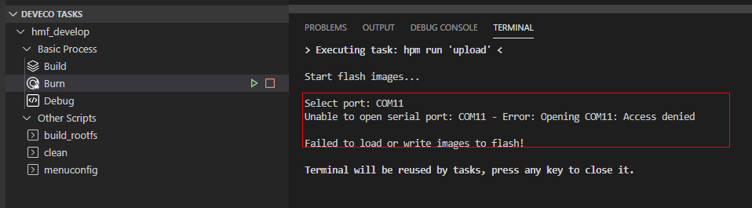
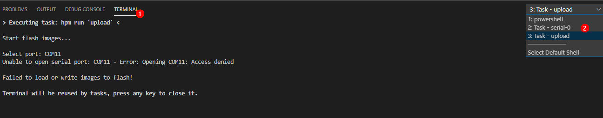
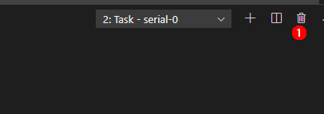
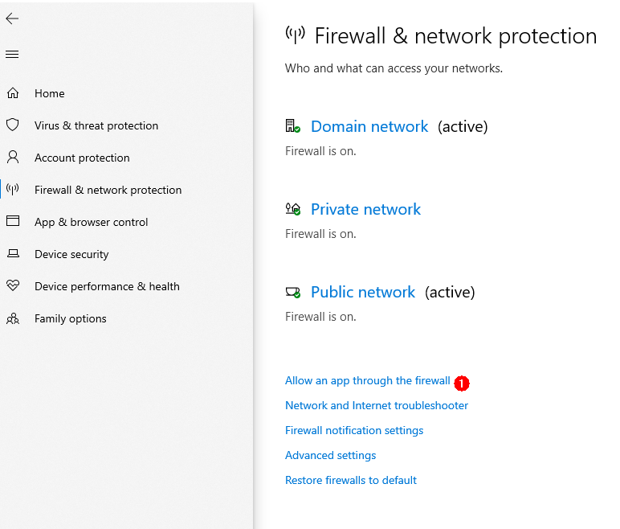
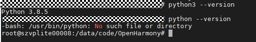
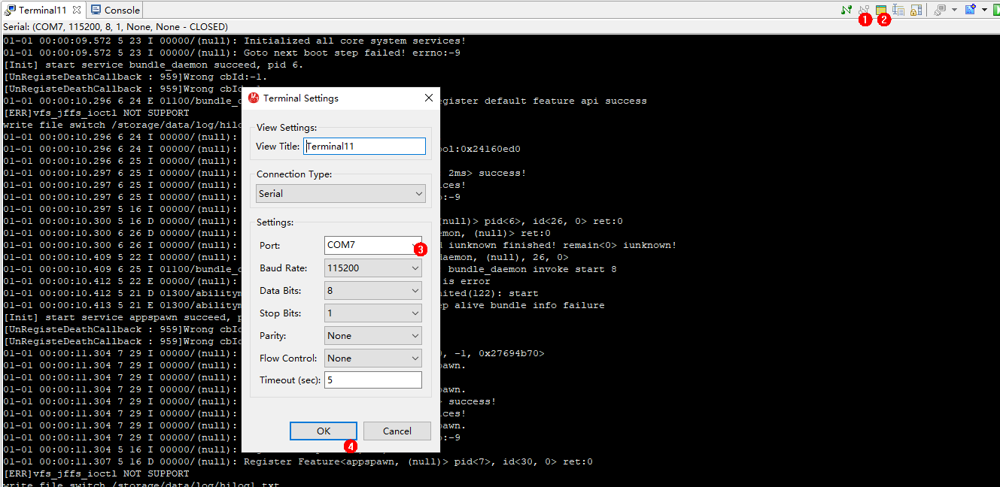

FAQs
====

1. What should I do when the images failed to be burnt over the selected
   serial port?

   -  **Symptom**

      **Error: Opening COMxx: Access denied** is displayed after
      clicking **Burn** and selecting a serial port.

      | **Figure 1** Failed to open the serial port
      | |image1|

   -  **Possible Causes**

      The serial port has been used.

   -  **Solutions**

2. Search for the terminal using serial-xx from the drop-down list in
   the **TERMINAL** panel.

   | **Figure 2** Checking whether the serial port is used
   | |image2|

3. Click the dustbin icon as shown in the following figure to disable
   the terminal using the serial port.

   | **Figure 3** Disabling the terminal using the serial port
   | |image3|

4. Click **Burn**, select the serial port, and start burning images
   again.

   | **Figure 4** Restarting burning
   | |image4|

5. What should I do when Windows-based PC failed to be connected to the
   board?

-  **Symptom**

   The file image cannot be obtained after clicking **Burn** and
   selecting a serial port.

   | **Figure 5** Failed to obtain the image file due to unavailable
     connection
   | |image5|

-  **Possible Causes**

   The board is disconnected from the Windows-based PC.

   Windows Firewall does not allow Visual Studio Code to access the
   network.

-  **Solutions**

1. Check whether the network cable is properly connected.

2. Click **Windows Firewall**.

   | **Figure 6** Network and firewall setting
   | |image6|

3. Click **Firewall & network protection**, and on the displayed page,
   click **Allow applications to communicate through Windows Firewall**.

   | **Figure 7** Firewall and network protection
   | |image7|

4. Select the Visual Studio Code application

   | **Figure 8** Selecting the Visual Studio Code application
   | |image8|

5. Select the **Private** and **Public** network access rights for the
   Visual Studio Code application.

   | **Figure 9** Allowing the Visual Studio Code application to access
     the network
   | |image9|

6. What should I do when the image failed to be burnt?

-  **Symptom**

   The burning status is not displayed after clicking **Burn** and
   selecting a serial port.

-  **Possible Causes**

   The IDE is not restarted after the DevEco plug-in is installed.

-  **Solutions**

   Restart the IDE.

4. What should I do when the message indicating Python cannot be found
   is displayed during compilation and building?

-  **Symptom**

   |image10|

-  **Possible Cause 1**: Python is not installed.

-  **Solutions**

   Install the Python environment by referring to `Installing a Python
   Environment <setting-up-a-development-environment.md#section126831816258>`__.

-  **Possible Cause 2:**\ The soft link that points to the Python does
   not exist in the usr/bin directory.

   |image11|

-  **Solutions**

   Run the following commands:

   ::

      # cd /usr/bin/
      # which python3
      # ln -s /usr/local/bin/python3 python
      # python --version

   Example:

   |image12|

5. What should I do when no command output is displayed?

-  **Symptom**

   The serial port shows that the connection has been established. After
   the board is restarted, nothing is displayed when you press
   **Enter**.

-  **Possible Cause 1**

   The serial port is connected incorrectly.

-  **Solutions**

   Change the serial port number.

   Start **Device Manager** to check whether the serial port connected
   to the board is the same as that connected to the terminal device. If
   not, perform the following steps to change the serial port number.

   | **Figure 10** Procedure for changing the serial port number
   | |image13|

1. Disconnect from the current serial port.
2. Click **Settings**.
3. Change the serial port number in the dialog box and click **OK**.
4. Press **Enter** in the dialog box to check whether any command output
   is displayed after the connection is established.

-  **Possible Cause 2**

   The U-boot of the board is damaged.

-  **Solutions**

   Burn the U-boot.

   If the fault persists after you perform the preceding operations, the
   U-boot of the board may be damaged. You can burn the U-boot by
   performing the following steps:

1. Obtain the U-boot file.

      |image14| **NOTICE:** The U-boot file of the board can be obtained
      from
      **vendor\hisi\hi35xx\hi3516dv300\uboot\out\boot\u-boot-hi3516dv300.bin**
      in the open-source package.

2. Use HiTool to burn the U-boot.

   **Figure 11** Procedure for burning the U-boot using HiTool

   |image15|

   1. Select the COM7 serial port.
   2. Select **Serial** for **Transfer Mode**.
   3. Select **Burn Fastboot**.
   4. Select **spi nor** for **Flash Type**.
   5. Click **Browse** and select the corresponding U-boot file.
   6. Click **Burn** to start burning.

3. Power off the board and then power it on. Connect the serial port
   after the burning is complete. Serial ports shown in the following
   figure are displayed after the U-boot is burnt.

   | **Figure 12** Serial port displayed after the U-boot is burnt
   | |image16|

.. |image4| image:: figures/restarting-burning.png

.. |image14| image:: public_sys-resources/icon-notice.gif

