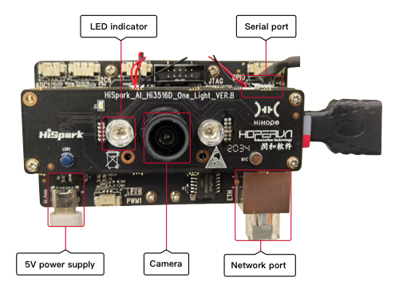

Introduction to the Hi3516 Development Board
============================================

Hi3516
------

Hi3516DV300 is a next-generation system on chip (SoC) designed for the
industry-dedicated smart HD IP camera. It introduces a next-generation
image signal processor (ISP), the latest H.265 video compression
encoder, and a high-performance NNIE engine, leading the industry in
terms of low bit rate, high image quality, intelligent processing and
analysis, and low power consumption.

| **Figure 1** Front view of the Hi3516 board
| |image1|

Development Board Specifications
--------------------------------

**Table 1** Specifications of the Hi3516 development board

.. raw:: html

   <table>

.. raw:: html

   <thead align="left">

.. raw:: html

   <tr id="row10171198194310">

.. raw:: html

   <th class="cellrowborder" valign="top" width="14.77%" id="mcps1.2.3.1.1">

.. raw:: html

   

Type

.. raw:: html

   

.. raw:: html

   </th>

.. raw:: html

   <th class="cellrowborder" valign="top" width="85.22999999999999%" id="mcps1.2.3.1.2">

.. raw:: html

   

Specification

.. raw:: html

   

.. raw:: html

   </th>

.. raw:: html

   </tr>

.. raw:: html

   </thead>

.. raw:: html

   <tbody>

.. raw:: html

   <tr id="row0171168114311">

.. raw:: html

   <td class="cellrowborder" valign="top" width="14.77%" headers="mcps1.2.3.1.1 ">

.. raw:: html

   

Processor and internal memory

.. raw:: html

   

.. raw:: html

   </td>

.. raw:: html

   <td class="cellrowborder" valign="top" width="85.22999999999999%" headers="mcps1.2.3.1.2 ">

.. raw:: html

   <ul id="ul1147113537186">

.. raw:: html

   <li>

Hi3516DV300

.. raw:: html

   </li>

.. raw:: html

   <li>

DDR3 1GB

.. raw:: html

   </li>

.. raw:: html

   <li>

8 GB eMMC4.5

.. raw:: html

   </li>

.. raw:: html

   </ul>

.. raw:: html

   </td>

.. raw:: html

   </tr>

.. raw:: html

   <tr id="row21721687435">

.. raw:: html

   <td class="cellrowborder" valign="top" width="14.77%" headers="mcps1.2.3.1.1 ">

.. raw:: html

   

External components

.. raw:: html

   

.. raw:: html

   </td>

.. raw:: html

   <td class="cellrowborder" valign="top" width="85.22999999999999%" headers="mcps1.2.3.1.2 ">

.. raw:: html

   <ul id="ul179543016208">

.. raw:: html

   <li>

Ethernet port

.. raw:: html

   </li>

.. raw:: html

   <li>

Audio and video

.. raw:: html

   <ul id="ul5941311869">

.. raw:: html

   <li>

One voice input

.. raw:: html

   </li>

.. raw:: html

   <li>

One mono (AC_L) output, connected to a 3 W power amplifier (LM4871)

.. raw:: html

   </li>

.. raw:: html

   <li>

MicroHDMI (one HDMI 1.4)

.. raw:: html

   </li>

.. raw:: html

   </ul>

.. raw:: html

   </li>

.. raw:: html

   <li>

Camera

.. raw:: html

   <ul id="ul924263620">

.. raw:: html

   <li>

Sensor IMX335

.. raw:: html

   </li>

.. raw:: html

   <li>

M12 lens with a focal length of 4 mm and an aperture of 1.8

.. raw:: html

   </li>

.. raw:: html

   </ul>

.. raw:: html

   </li>

.. raw:: html

   <li>

Display

.. raw:: html

   <ul id="ul101471711667">

.. raw:: html

   <li>

2.35-inch LCD connector

.. raw:: html

   </li>

.. raw:: html

   <li>

5.5-inch LCD connector

.. raw:: html

   </li>

.. raw:: html

   </ul>

.. raw:: html

   </li>

.. raw:: html

   <li>

External components and interfaces

.. raw:: html

   <ul id="ul089255556">

.. raw:: html

   <li>

microSD card interface

.. raw:: html

   </li>

.. raw:: html

   <li>

JTAG/I2S interface

.. raw:: html

   </li>

.. raw:: html

   <li>

ADC interface

.. raw:: html

   </li>

.. raw:: html

   <li>

Steer gear interface

.. raw:: html

   </li>

.. raw:: html

   <li>

Grove connector

.. raw:: html

   </li>

.. raw:: html

   <li>

USB2.0(Type C)

.. raw:: html

   </li>

.. raw:: html

   <li>

Three function keys: two custom keys and one update key

.. raw:: html

   </li>

.. raw:: html

   <li>

LED indicator (including green and red)

.. raw:: html

   </li>

.. raw:: html

   </ul>

.. raw:: html

   </li>

.. raw:: html

   </ul>

.. raw:: html

   </td>

.. raw:: html

   </tr>

.. raw:: html

   </tbody>

.. raw:: html

   </table>

