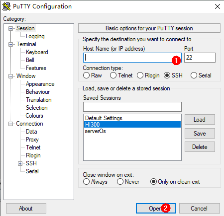

Setting Up a Development Environment
====================================

Environment Requirements
------------------------

Hardware
--------

-  Linux server

-  Windows workstation (host computer)

-  Hi3518EV300 IoT camera development board

-  USB cable and network cable (The Windows workstation is connected to
   Hi3518EV300 development board through the USB cable and network
   cable.)

   `Figure 1 <#fig8211468392>`__ shows the hardware connections.

| **Figure 1** Hardware connections
| |image1|

Software
--------

**Table 1** Platforms required for the Hi3518EV300 development board

.. raw:: html

   <table>

.. raw:: html

   <thead align="left">

.. raw:: html

   <tr id="row196634713405">

.. raw:: html

   <th class="cellrowborder" valign="top" width="8.53%" id="mcps1.2.5.1.1">

.. raw:: html

   

Hardware

.. raw:: html

   

.. raw:: html

   </th>

.. raw:: html

   <th class="cellrowborder" valign="top" width="11.66%" id="mcps1.2.5.1.2">

.. raw:: html

   

Software

.. raw:: html

   

.. raw:: html

   </th>

.. raw:: html

   <th class="cellrowborder" valign="top" width="66%" id="mcps1.2.5.1.3">

.. raw:: html

   

Description

.. raw:: html

   

.. raw:: html

   </th>

.. raw:: html

   <th class="cellrowborder" valign="top" width="13.81%" id="mcps1.2.5.1.4">

.. raw:: html

   

Remarks

.. raw:: html

   

.. raw:: html

   </th>

.. raw:: html

   </tr>

.. raw:: html

   </thead>

.. raw:: html

   <tbody>

.. raw:: html

   <tr id="row066315717402">

.. raw:: html

   <td class="cellrowborder" valign="top" width="8.53%" headers="mcps1.2.5.1.1 ">

.. raw:: html

   

Linux compile server

.. raw:: html

   

.. raw:: html

   </td>

.. raw:: html

   <td class="cellrowborder" valign="top" width="11.66%" headers="mcps1.2.5.1.2 ">

.. raw:: html

   

Operating system

.. raw:: html

   

.. raw:: html

   </td>

.. raw:: html

   <td class="cellrowborder" valign="top" width="66%" headers="mcps1.2.5.1.3 ">

.. raw:: html

   

Ubuntu 16.04 64-bit or later is used for the Linux OS, and bash is used
as the shell.

.. raw:: html

   

.. note::
   :name: note196631578401

   NOTE:

   .. container:: notebody

      .. raw:: html

         

      Common software such as samba and vim is installed in the OS by
      default. Adaptation is required to support Linux file sharing.

      .. raw:: html

         

.. raw:: html

   </td>

.. raw:: html

   <td class="cellrowborder" rowspan="2" valign="top" width="13.81%" headers="mcps1.2.5.1.4 ">

.. raw:: html

   

You can develop programs on the Windows workstation or on the Linux
server through remote login.

.. raw:: html

   

.. raw:: html

   </td>

.. raw:: html

   </tr>

.. raw:: html

   <tr id="row19664272408">

.. raw:: html

   <td class="cellrowborder" valign="top" headers="mcps1.2.5.1.1 ">

.. raw:: html

   

Windows workstation

.. raw:: html

   

.. raw:: html

   </td>

.. raw:: html

   <td class="cellrowborder" valign="top" headers="mcps1.2.5.1.2 ">

.. raw:: html

   

Operating system

.. raw:: html

   

.. raw:: html

   </td>

.. raw:: html

   <td class="cellrowborder" valign="top" headers="mcps1.2.5.1.3 ">

.. raw:: html

   

Windows XP/Windows7/Windows10

.. raw:: html

   

.. raw:: html

   </td>

.. raw:: html

   </tr>

.. raw:: html

   </tbody>

.. raw:: html

   </table>

Build Tools for Linux
---------------------

The following table describes the common tools required for Linux and
how to obtain them.

**Table 2** Development tools and obtaining methods

.. raw:: html

   <table>

.. raw:: html

   <thead align="left">

.. raw:: html

   <tr id="en-us_topic_0000001054501981_row122993276512">

.. raw:: html

   <th class="cellrowborder" valign="top" width="13.081308130813083%" id="mcps1.2.4.1.1">

.. raw:: html

   

Development Tool

.. raw:: html

   

.. raw:: html

   </th>

.. raw:: html

   <th class="cellrowborder" valign="top" width="19.921992199219922%" id="mcps1.2.4.1.2">

.. raw:: html

   

Description

.. raw:: html

   

.. raw:: html

   </th>

.. raw:: html

   <th class="cellrowborder" valign="top" width="66.996699669967%" id="mcps1.2.4.1.3">

.. raw:: html

   

How to Obtain

.. raw:: html

   

.. raw:: html

   </th>

.. raw:: html

   </tr>

.. raw:: html

   </thead>

.. raw:: html

   <tbody>

.. raw:: html

   <tr id="en-us_topic_0000001054501981_row430016273514">

.. raw:: html

   <td class="cellrowborder" valign="top" width="13.081308130813083%" headers="mcps1.2.4.1.1 ">

.. raw:: html

   

Python3.7+

.. raw:: html

   

.. raw:: html

   </td>

.. raw:: html

   <td class="cellrowborder" valign="top" width="19.921992199219922%" headers="mcps1.2.4.1.2 ">

.. raw:: html

   

Runs the compilation scripts.

.. raw:: html

   

.. raw:: html

   </td>

.. raw:: html

   <td class="cellrowborder" valign="top" width="66.996699669967%" headers="mcps1.2.4.1.3 ">

.. raw:: html

   

https://www.python.org/ftp/python/3.8.5/Python-3.8.5.tgz

.. raw:: html

   

.. raw:: html

   </td>

.. raw:: html

   </tr>

.. raw:: html

   <tr id="en-us_topic_0000001054501981_row42668197206">

.. raw:: html

   <td class="cellrowborder" valign="top" width="13.081308130813083%" headers="mcps1.2.4.1.1 ">

.. raw:: html

   

bash

.. raw:: html

   

.. raw:: html

   </td>

.. raw:: html

   <td class="cellrowborder" valign="top" width="19.921992199219922%" headers="mcps1.2.4.1.2 ">

.. raw:: html

   

Executes commands.

.. raw:: html

   

.. raw:: html

   </td>

.. raw:: html

   <td class="cellrowborder" valign="top" width="66.996699669967%" headers="mcps1.2.4.1.3 ">

.. raw:: html

   

Internet

.. raw:: html

   

.. raw:: html

   </td>

.. raw:: html

   </tr>

.. raw:: html

   <tr id="en-us_topic_0000001054501981_row1711946154018">

.. raw:: html

   <td class="cellrowborder" valign="top" width="13.081308130813083%" headers="mcps1.2.4.1.1 ">

.. raw:: html

   

gn

.. raw:: html

   

.. raw:: html

   </td>

.. raw:: html

   <td class="cellrowborder" valign="top" width="19.921992199219922%" headers="mcps1.2.4.1.2 ">

.. raw:: html

   

Generates ninja compilation scripts.

.. raw:: html

   

.. raw:: html

   </td>

.. raw:: html

   <td class="cellrowborder" valign="top" width="66.996699669967%" headers="mcps1.2.4.1.3 ">

.. raw:: html

   

https://repo.huaweicloud.com/harmonyos/compiler/gn/1523/linux/gn.1523.tar

.. raw:: html

   

.. raw:: html

   </td>

.. raw:: html

   </tr>

.. raw:: html

   <tr id="en-us_topic_0000001054501981_row16990164213404">

.. raw:: html

   <td class="cellrowborder" valign="top" width="13.081308130813083%" headers="mcps1.2.4.1.1 ">

.. raw:: html

   

ninja

.. raw:: html

   

.. raw:: html

   </td>

.. raw:: html

   <td class="cellrowborder" valign="top" width="19.921992199219922%" headers="mcps1.2.4.1.2 ">

.. raw:: html

   

Executes ninja compilation scripts.

.. raw:: html

   

.. raw:: html

   </td>

.. raw:: html

   <td class="cellrowborder" valign="top" width="66.996699669967%" headers="mcps1.2.4.1.3 ">

.. raw:: html

   

https://repo.huaweicloud.com/harmonyos/compiler/ninja/1.9.0/linux/ninja.1.9.0.tar

.. raw:: html

   

.. raw:: html

   </td>

.. raw:: html

   </tr>

.. raw:: html

   <tr id="en-us_topic_0000001054501981_row192161027104010">

.. raw:: html

   <td class="cellrowborder" valign="top" width="13.081308130813083%" headers="mcps1.2.4.1.1 ">

.. raw:: html

   

LLVM

.. raw:: html

   

.. raw:: html

   </td>

.. raw:: html

   <td class="cellrowborder" valign="top" width="19.921992199219922%" headers="mcps1.2.4.1.2 ">

.. raw:: html

   

Functions as the compiler toolchain.

.. raw:: html

   

.. raw:: html

   </td>

.. raw:: html

   <td class="cellrowborder" valign="top" width="66.996699669967%" headers="mcps1.2.4.1.3 ">

.. raw:: html

   

https://repo.huaweicloud.com/harmonyos/compiler/clang/9.0.0-34042/linux/llvm-linux-9.0.0-34042.tar

.. raw:: html

   

.. raw:: html

   </td>

.. raw:: html

   </tr>

.. raw:: html

   <tr id="en-us_topic_0000001054501981_row18516509507">

.. raw:: html

   <td class="cellrowborder" valign="top" width="13.081308130813083%" headers="mcps1.2.4.1.1 ">

.. raw:: html

   

hc-gen

.. raw:: html

   

.. raw:: html

   </td>

.. raw:: html

   <td class="cellrowborder" valign="top" width="19.921992199219922%" headers="mcps1.2.4.1.2 ">

.. raw:: html

   

Configures and compiles files.

.. raw:: html

   

.. raw:: html

   </td>

.. raw:: html

   <td class="cellrowborder" valign="top" width="66.996699669967%" headers="mcps1.2.4.1.3 ">

.. raw:: html

   

https://repo.huaweicloud.com/harmonyos/compiler/hc-gen/0.65/linux/hc-gen-0.65-linux.tar

.. raw:: html

   

.. raw:: html

   </td>

.. raw:: html

   </tr>

.. raw:: html

   <tr id="en-us_topic_0000001054501981_row105773499422">

.. raw:: html

   <td class="cellrowborder" valign="top" width="13.081308130813083%" headers="mcps1.2.4.1.1 ">

.. raw:: html

   

IPOP, PuTTY, or other HyperTerminal software

.. raw:: html

   

.. raw:: html

   </td>

.. raw:: html

   <td class="cellrowborder" valign="top" width="19.921992199219922%" headers="mcps1.2.4.1.2 ">

.. raw:: html

   

Connects to the Linux server (choose one of the terminals).

.. raw:: html

   

.. raw:: html

   </td>

.. raw:: html

   <td class="cellrowborder" valign="top" width="66.996699669967%" headers="mcps1.2.4.1.3 ">

.. raw:: html

   

Internet (for example, https://www.putty.org/)

.. raw:: html

   

.. raw:: html

   </td>

.. raw:: html

   </tr>

.. raw:: html

   </tbody>

.. raw:: html

   </table>

Development Tools for Windows
-----------------------------

**Table 3** Development tools for the Windows workstation

.. raw:: html

   <table>

.. raw:: html

   <thead align="left">

.. raw:: html

   <tr id="row3133133312711">

.. raw:: html

   <th class="cellrowborder" valign="top" width="16.371637163716375%" id="mcps1.2.4.1.1">

.. raw:: html

   

Development Tool

.. raw:: html

   

.. raw:: html

   </th>

.. raw:: html

   <th class="cellrowborder" valign="top" width="37.04370437043704%" id="mcps1.2.4.1.2">

.. raw:: html

   

Description

.. raw:: html

   

.. raw:: html

   </th>

.. raw:: html

   <th class="cellrowborder" valign="top" width="46.58465846584659%" id="mcps1.2.4.1.3">

.. raw:: html

   

How to Obtain

.. raw:: html

   

.. raw:: html

   </th>

.. raw:: html

   </tr>

.. raw:: html

   </thead>

.. raw:: html

   <tbody>

.. raw:: html

   <tr id="row13697410143219">

.. raw:: html

   <td class="cellrowborder" valign="top" width="16.371637163716375%" headers="mcps1.2.4.1.1 ">

.. raw:: html

   

Visual Studio Code

.. raw:: html

   

.. raw:: html

   </td>

.. raw:: html

   <td class="cellrowborder" valign="top" width="37.04370437043704%" headers="mcps1.2.4.1.2 ">

.. raw:: html

   

Edits code.

.. raw:: html

   

.. raw:: html

   </td>

.. raw:: html

   <td class="cellrowborder" valign="top" width="46.58465846584659%" headers="mcps1.2.4.1.3 ">

.. raw:: html

   

https://code.visualstudio.com/

.. raw:: html

   

.. raw:: html

   </td>

.. raw:: html

   </tr>

.. raw:: html

   <tr id="row12133123315277">

.. raw:: html

   <td class="cellrowborder" valign="top" width="16.371637163716375%" headers="mcps1.2.4.1.1 ">

.. raw:: html

   

HiTool

.. raw:: html

   

.. raw:: html

   </td>

.. raw:: html

   <td class="cellrowborder" valign="top" width="37.04370437043704%" headers="mcps1.2.4.1.2 ">

.. raw:: html

   

Burns the images and the U-boot.

.. raw:: html

   

.. raw:: html

   </td>

.. raw:: html

   <td class="cellrowborder" valign="top" width="46.58465846584659%" headers="mcps1.2.4.1.3 ">

.. raw:: html

   

http://www.hihope.org/download/AllDocuments

.. raw:: html

   

.. raw:: html

   

Tool package: Hi3516-Hitool.zip

.. raw:: html

   

.. raw:: html

   </td>

.. raw:: html

   </tr>

.. raw:: html

   </tbody>

.. raw:: html

   </table>

Installing the Basic Compilation Environment
--------------------------------------------

Connecting to a Linux Server
----------------------------

Using PuTTY to log in to a Linux server from a PC running Windows

1. Open `PuTTY <https://www.putty.org/>`__, enter the IP address of the
   Linux server, and click **Open**.

   | **Figure 2** PuTTY configuration
   | |image2|

2. Click **Yes** in the PuTTY **Security Alert** dialog box.

3. Enter the account and password.

   | **Figure 3** Login
   | |image3|

4. The login is successful.

   | **Figure 4** Successful login
   | |image4|

Changing Linux Shell to Bash
----------------------------

Run the following command to check whether bash is used as the shell:

::

   ls -l /bin/sh

If **/bin/sh -> bash** is not displayed, do as follows to change shell
to bash.

**Method 1:** Run the following command on the device and then click
**No**.

::

   sudo dpkg-reconfigure dash

**Method 2:** Run the **rm -rf /bin/sh** command to delete sh and then
run the sudo **ln -s /bin/bash /bin/sh** command to create a new soft
link.

::

   sudo rm -rf /bin/sh
   sudo ln -s /bin/bash /bin/sh

Installing a Python Environment
-------------------------------

1. Start a Linux server.

2. Run the following command to check the Python version (Python 3.7 or
   later is required):

   ::

      python3 --version

   Do as follows to install Python, for example, Python 3.8.

   1. Run the following command to check the Ubuntu version:

   ::

      cat /etc/issue

   1. Install Python based on the Ubuntu version.

      -  If the Ubuntu version is 18 or later, run the following
         command:

         ::

            sudo apt-get install python3.8

      -  If the Ubuntu version is 16, download the installation package
         and install Python.

         1. Run the following command to install Python environment
            dependencies (gcc, g++, make, zlib, libffi):

         ::

            sudo apt-get install gcc && sudo apt-get install g++ && sudo apt-get install make && sudo apt-get install zlib* && sudo apt-get install libffi-dev

         1. Obtain the `Python3.8.5 installation
            package <https://www.python.org/ftp/python/3.8.5/Python-3.8.5.tgz>`__,
            save it to the Linux server, and run the following command:

         ::

            tar -xvzf Python-3.8.5.tgz && cd Python-3.8.5 && sudo ./configure && sudo make && sudo make install

3. After Python is installed, run the following command to link the
   Python path to **/usr/bin/python**:

   ::

      which python3.8
      cd /usr/bin && sudo rm python && sudo ln -s /usr/local/bin/python3.8 python && python --version

4. Install and upgrade the Python package management tool (pip3) using
   either of the following methods:

   -  **Command line:**

      ::

         sudo apt-get install python3-setuptools python3-pip -y
         sudo pip3 install --upgrade pip

   -  **Installation package:**

      ::

         curl https://bootstrap.pypa.io/get-pip.py -o get-pip.py
         python get-pip.py

5. Run the following command to install setuptools:

   ::

      pip3 install setuptools

6. Install the GUI menuconfig tool (Kconfiglib). You are advised to
   install Kconfiglib 13.2.0 or later.

   -  **Command line:**

      ::

         sudo pip3 install kconfiglib

   -  **Installation package:**

      1. Download the .whl file (for example,
         **kconfiglib-13.2.0-py2.py3-none-any.whl**).

         Download path: https://pypi.org/project/kconfiglib#files

      2. Run the following command to install the .whl file:

         ::

            sudo pip3 install kconfiglib-13.2.0-py2.py3-none-any.whl

Installing a File Packing Tool
------------------------------

1. Start a Linux server.

2. Run the following command to install **dosfstools**.

   ::

      sudo apt-get install dosfstools

3. Run the following command to install **mtools**.

   ::

      sudo apt-get install mtools

Installing Compilation Tools
----------------------------

   |image5| **NOTICE:** - If you obtain the source code using an HPM
   component or HPM CLI tool, compilation tools like **gn**, **ninja**,
   **LLVM**, and **hc-gen** are not required. - (Recommended) If you
   obtain the source code through an image site or a code repository,
   compilation tools like **gn**, **ninja**, **LLVM**, and **hc-gen**
   need to be installed. When installing **gn**, **ninja**, **LLVM**,
   and **hc-gen**, ensure that the environment variable paths of the
   compilation tools are unique.

Installing gn
-------------

1. Start a Linux server.

2. Download
   `gn <https://repo.huaweicloud.com/harmonyos/compiler/gn/1523/linux/gn.1523.tar>`__.

3. Run the following command to decompress the gn installation package
   to **~/gn**.

   ::

      tar -xvf gn.1523.tar -C ~/

4. Set an environment variable by performing the following steps. Open
   the **~/.bashrc** file in Vim first.

   ::

      vim ~/.bashrc

   Copy the following command to the last line of the **.bashrc** file,
   save the file, and exit.

   ::

      export PATH=~/gn:$PATH

5. Run the following command to validate the environment variable.

   ::

      source ~/.bashrc

Installing ninjah
-----------------

1. Start a Linux server.

2. Download
   `ninja <https://repo.huaweicloud.com/harmonyos/compiler/ninja/1.9.0/linux/ninja.1.9.0.tar>`__.

3. Run the following command to decompress the ninja installation
   package to **~/ninja**.

   ::

      tar -xvf ninja.1.9.0.tar -C ~/

4. Set an environment variable by performing the following steps. Open
   the **~/.bashrc** file in Vim first.

   ::

      vim ~/.bashrc

   Copy the following command to the last line of the **.bashrc** file,
   save the file, and exit.

   ::

      export PATH=~/ninja:$PATH

5. Run the following command to validate the environment variable.

   ::

      source ~/.bashrc

Installing the LLVM Toolchain
-----------------------------

1. Start a Linux server.

2. Download
   `LLVM <http://tools.harmonyos.com/mirrors/clang/9.0.0-34042/linux/llvm-linux-9.0.0-34042.tar>`__.

3. Run the following command to decompress the LLVM installation package
   to **~/llvm**.

   ::

      tar -xvf llvm-linux-9.0.0-34042.tar -C ~/

4. Set an environment variable by performing the following steps. Open
   the **~/.bashrc** file in Vim first.

   ::

      vim ~/.bashrc

   Copy the following command to the last line of the **.bashrc** file,
   save the file, and exit.

   ::

      export PATH=~/llvm/bin:$PATH

5. Run the following command to validate the environment variable.

   ::

      source ~/.bashrc

Installing hc-gen
-----------------

1. Start a Linux server.

2. Download
   `hc-gen <https://repo.huaweicloud.com/harmonyos/compiler/hc-gen/0.65/linux/hc-gen-0.65-linux.tar>`__.

3. Run the following command to decompress the hc-gen installation
   package to **~/hc-gen** on the Linux server.

   ::

      tar -xvf hc-gen-0.65-linux.tar -C ~/

4. Set an environment variable by performing the following steps. Open
   the **~/.bashrc** file in Vim first.

   ::

      vim ~/.bashrc

   Copy the following command to the last line of the **.bashrc** file,
   save the file, and exit.

   ::

      export PATH=~/hc-gen:$PATH

5. Run the following command to validate the environment variable.

   ::

      source ~/.bashrc

.. |image3| image:: figures/login.png

.. |image5| image:: public_sys-resources/icon-notice.gif
