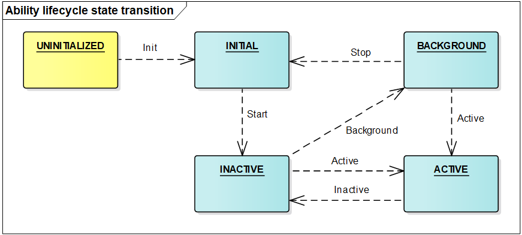
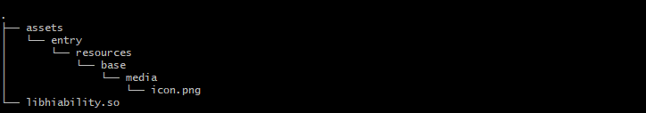

Application Framework
=====================

Overview
--------

The application framework of OpenHarmony consists of two modules:
**ability management framework** and **bundle management framework**.

**1. Ability management framework**: This framework is provided by
OpenHarmony for you to develop OpenHarmony applications. The following
figure shows the modules in the ability management framework.

| **Figure 1** Architecture of the Ability management framework
| |image1|

-  **AbilityKit** is a development kit provided by the ability
   management framework. You can use this kit to develop applications
   based on the **Ability** component. There are two types of
   applications developed based on the **Ability** component: **JS
   Ability** developed using the JavaScript language and **Native
   Ability** developed using the C/C++ language. The **JS application
   development framework** encapsulates JavaScript UI components on the
   basis of the AbilityKit and is used to help you quickly develop JS
   Ability-based applications.

-  **Ability** is the minimum unit for the system to schedule
   applications. It is a component that can implement an independent
   functionality. An application can contain one or more **Ability**
   instances. There are two types of templates that you can use to
   create an **Ability** instance: Page and Service.

   -  An **Ability using the Page template** (Page ability for short)
      provides a UI for interacting with users.
   -  An **Ability using the Service template** does not have a UI and
      is used for running background tasks.

-  An **AbilitySlice** represents a single screen and its control logic.
   It is specific to Page abilities. A Page ability may contain one
   ability slice or multiple ability slices that provide highly relevant
   capabilities. The following figure shows the relationship between a
   Page ability and its ability slices.

   | **Figure 2** Relationship between a Page ability and its ability
     slices
   | |image2|

-  **Lifecycle** is a general term for all states of an ability,
   including **UNINITIALIZED**, **INITIAL**, **INACTIVE**, **ACTIVE**,
   and **BACKGROUND**. The following figure shows the lifecycle state
   transition of an ability.

   | **Figure 3** Lifecycle state transition of a Page ability
   | |image3|

   Description of ability lifecycle states:

   -  **UNINITIALIZED**: The ability is not initialized. This state is a
      temporary state. An ability changes directly to the **INITIAL**
      state upon its creation.

   -  **INITIAL**: This state refers to the initial or stopped state.
      The ability in this state is not running. The ability enters the
      **INACTIVE** state after it is started.

   -  **INACTIVE**: The ability is visible but does not gain focus. This
      state is the same as the **ACTIVE** state because the concept of
      window focus is not supported currently.

   -  **ACTIVE**: The ability is in the foreground and has focus. The
      ability changes from the **ACTIVE** state to the **INACTIVE**
      state before returning to the background.

   -  **BACKGROUND**: The ability returns to the background. After being
      re-activated, the ability enters the **ACTIVE** state. After being
      destroyed, the ability enters the **INITIAL** state.

-  **AbilityLoader** is used to register and load **Ability** classes.
   After creating an **Ability** class, you should first call the
   registration API defined in **AbilityLoader** to register the
   **Ability** class name with the ability management framework so that
   this **Ability** can be instantiated when being started.

-  **AbilityManager** enables inter-process communication (IPC) between
   the AbilityKit and Ability Manager Service.

-  **EventHandler** is provided by the AbilityKit to enable inter-thread
   communication between abilities.

-  The **Ability Manager Service** is a system service used to
   coordinate the running relationships and lifecycle states of
   **Ability** instances. It consists of the following modules:

   -  The **service startup module** starts and registers the Ability
      Manager Service.
   -  The **service interface management module** manages external
      capabilities provided by the Ability Manager Service.
   -  The **process management module** starts and destroys processes
      where **Ability** instances are running, and maintains the process
      information.
   -  The **ability stack management module** maintains the presentation
      sequence of abilities in the stack.
   -  The **lifecycle scheduling module** changes an ability to a
      particular state based on the current operation of the system.
   -  The **connection management module** manages connections to
      Service abilities.

-  The **AppSpawn** is a system service used to create the process for
   running an ability. This service has high permissions. It sets
   permissions for **Ability** instances and pre-loads some common
   modules to accelerate application startup.

**2. Bundle management framework**: This framework is provided by
OpenHarmony for you to manage application bundles. The following figure
shows the modules in the bundle management framework.

| **Figure 4** Architecture of the bundle management framework
| |image4|

-  **BundleKit**: includes external APIs provided by the Bundle Manager
   Service, including the APIs for application installation and
   uninstallation, bundle information query, and bundle state change
   listeners.

-  **Bundle scanning module**: parses pre-installed or installed bundles
   on the local device and extracts information from them for the bundle
   management module to manage and make the information persistent for
   storage.

-  **Bundle installation module**: installs, uninstalls, and updates a
   bundle. The **Bundle installation service** is an independent process
   used to create or delete installation directories and has high
   permissions.

-  **Bundle management module**: manages information related to
   application bundles and stores persistent bundle information.

-  **Bundle security management module**: verifies signatures, and
   grants and manages permissions.

Directory Structure
-------------------

The following table describes the source code directory structure of the
application framework.

**Table 1** Source code directory structure of the application framework

.. raw:: html

   <table>

.. raw:: html

   <thead align="left">

.. raw:: html

   <tr id="row7977610131417">

.. raw:: html

   <th class="cellrowborder" valign="top" width="36.18%" id="mcps1.2.3.1.1">

.. raw:: html

   

Directory

.. raw:: html

   

.. raw:: html

   </th>

.. raw:: html

   <th class="cellrowborder" valign="top" width="63.82%" id="mcps1.2.3.1.2">

.. raw:: html

   

Description

.. raw:: html

   

.. raw:: html

   </th>

.. raw:: html

   </tr>

.. raw:: html

   </thead>

.. raw:: html

   <tbody>

.. raw:: html

   <tr id="row17977171010144">

.. raw:: html

   <td class="cellrowborder" valign="top" width="36.18%" headers="mcps1.2.3.1.1 ">

.. raw:: html

   

foundation/aafwk/frameworks/ability_lite

.. raw:: html

   

.. raw:: html

   </td>

.. raw:: html

   <td class="cellrowborder" valign="top" width="63.82%" headers="mcps1.2.3.1.2 ">

.. raw:: html

   

Core code for AbilityKit

.. raw:: html

   

.. raw:: html

   </td>

.. raw:: html

   </tr>

.. raw:: html

   <tr id="row6978161091412">

.. raw:: html

   <td class="cellrowborder" valign="top" width="36.18%" headers="mcps1.2.3.1.1 ">

.. raw:: html

   

foundation/aafwk/frameworks/abilitymgr_lite

.. raw:: html

   

.. raw:: html

   </td>

.. raw:: html

   <td class="cellrowborder" valign="top" width="63.82%" headers="mcps1.2.3.1.2 ">

.. raw:: html

   

Client code for managing the communication between the AbilityKit and
Ability Manager Service

.. raw:: html

   

.. raw:: html

   </td>

.. raw:: html

   </tr>

.. raw:: html

   <tr id="row6978201031415">

.. raw:: html

   <td class="cellrowborder" valign="top" width="36.18%" headers="mcps1.2.3.1.1 ">

.. raw:: html

   

foundation/aafwk/frameworks/want_lite

.. raw:: html

   

.. raw:: html

   </td>

.. raw:: html

   <td class="cellrowborder" valign="top" width="63.82%" headers="mcps1.2.3.1.2 ">

.. raw:: html

   

Implementation code of the information carrier used for interaction
between abilities

.. raw:: html

   

.. raw:: html

   </td>

.. raw:: html

   </tr>

.. raw:: html

   <tr id="row1897841071415">

.. raw:: html

   <td class="cellrowborder" valign="top" width="36.18%" headers="mcps1.2.3.1.1 ">

.. raw:: html

   

foundation/aafwk/interfaces/kits/abilitykit_lite

.. raw:: html

   

.. raw:: html

   </td>

.. raw:: html

   <td class="cellrowborder" valign="top" width="63.82%" headers="mcps1.2.3.1.2 ">

.. raw:: html

   

APIs provided by AbilityKit for developers

.. raw:: html

   

.. raw:: html

   </td>

.. raw:: html

   </tr>

.. raw:: html

   <tr id="row965423512587">

.. raw:: html

   <td class="cellrowborder" valign="top" width="36.18%" headers="mcps1.2.3.1.1 ">

.. raw:: html

   

foundation/aafwk/interfaces/innerkits/abilitymgr_lite

.. raw:: html

   

.. raw:: html

   </td>

.. raw:: html

   <td class="cellrowborder" valign="top" width="63.82%" headers="mcps1.2.3.1.2 ">

.. raw:: html

   

APIs provided by the Ability Manager Service for other subsystems

.. raw:: html

   

.. raw:: html

   </td>

.. raw:: html

   </tr>

.. raw:: html

   <tr id="row673463115813">

.. raw:: html

   <td class="cellrowborder" valign="top" width="36.18%" headers="mcps1.2.3.1.1 ">

.. raw:: html

   

foundation/aafwk/interfaces/kits/want_lite

.. raw:: html

   

.. raw:: html

   </td>

.. raw:: html

   <td class="cellrowborder" valign="top" width="63.82%" headers="mcps1.2.3.1.2 ">

.. raw:: html

   

External APIs of the information carrier used for interaction between
abilities

.. raw:: html

   

.. raw:: html

   </td>

.. raw:: html

   </tr>

.. raw:: html

   <tr id="row164593855812">

.. raw:: html

   <td class="cellrowborder" valign="top" width="36.18%" headers="mcps1.2.3.1.1 ">

.. raw:: html

   

foundation/aafwk/services/abilitymgr_lite

.. raw:: html

   

.. raw:: html

   </td>

.. raw:: html

   <td class="cellrowborder" valign="top" width="63.82%" headers="mcps1.2.3.1.2 ">

.. raw:: html

   

Implementation code of the Ability Manager Service

.. raw:: html

   

.. raw:: html

   </td>

.. raw:: html

   </tr>

.. raw:: html

   <tr id="row1869744111581">

.. raw:: html

   <td class="cellrowborder" valign="top" width="36.18%" headers="mcps1.2.3.1.1 ">

.. raw:: html

   

foundation/appexecfwk/interfaces/kits/bundle_lite

.. raw:: html

   

.. raw:: html

   </td>

.. raw:: html

   <td class="cellrowborder" valign="top" width="63.82%" headers="mcps1.2.3.1.2 ">

.. raw:: html

   

APIs provided by BundleKit for developers

.. raw:: html

   

.. raw:: html

   </td>

.. raw:: html

   </tr>

.. raw:: html

   <tr id="row106931420217">

.. raw:: html

   <td class="cellrowborder" valign="top" width="36.18%" headers="mcps1.2.3.1.1 ">

.. raw:: html

   

foundation/appexecfwk/interfaces/innerkits/bundlemgr_lite

.. raw:: html

   

.. raw:: html

   </td>

.. raw:: html

   <td class="cellrowborder" valign="top" width="63.82%" headers="mcps1.2.3.1.2 ">

.. raw:: html

   

Core code for AbilityKit and APIs provided by the Bundle Manager Service
for other subsystems

.. raw:: html

   

.. raw:: html

   </td>

.. raw:: html

   </tr>

.. raw:: html

   <tr id="row58381913213">

.. raw:: html

   <td class="cellrowborder" valign="top" width="36.18%" headers="mcps1.2.3.1.1 ">

.. raw:: html

   

foundation/appexecfwk/frameworks/bundle_lite

.. raw:: html

   

.. raw:: html

   </td>

.. raw:: html

   <td class="cellrowborder" valign="top" width="63.82%" headers="mcps1.2.3.1.2 ">

.. raw:: html

   

Client code for managing the communication between the BundleKit and
Bundle Manager Service

.. raw:: html

   

.. raw:: html

   </td>

.. raw:: html

   </tr>

.. raw:: html

   <tr id="row1786831216357">

.. raw:: html

   <td class="cellrowborder" valign="top" width="36.18%" headers="mcps1.2.3.1.1 ">

.. raw:: html

   

foundation/appexecfwk/utils/bundle_lite

.. raw:: html

   

.. raw:: html

   </td>

.. raw:: html

   <td class="cellrowborder" valign="top" width="63.82%" headers="mcps1.2.3.1.2 ">

.. raw:: html

   

Tool code used in the implementation of the Bundle Manager Service

.. raw:: html

   

.. raw:: html

   </td>

.. raw:: html

   </tr>

.. raw:: html

   <tr id="row841015115218">

.. raw:: html

   <td class="cellrowborder" valign="top" width="36.18%" headers="mcps1.2.3.1.1 ">

.. raw:: html

   

foundation/appexecfwk/services/bundlemgr_lite

.. raw:: html

   

.. raw:: html

   </td>

.. raw:: html

   <td class="cellrowborder" valign="top" width="63.82%" headers="mcps1.2.3.1.2 ">

.. raw:: html

   

Implementation code of the Bundle Manager Service

.. raw:: html

   

.. raw:: html

   </td>

.. raw:: html

   </tr>

.. raw:: html

   </tbody>

.. raw:: html

   </table>

Constraints
-----------

-  Language version

   -  C++11 or later

-  The specifications of the application framework vary depending on the
   System-on-a-Chip (SoC) and underlying OS capabilities.

   -  Cortex-M RAM and ROM

      -  RAM: greater than 20 KB (recommended)
      -  ROM: greater than 300 KB (for the JS application development
         framework and related subsystems, such as UIKit and engine)

   -  Cortex-A RAM and ROM

      -  RAM: greater than 2 MB (recommended)
      -  ROM: greater than 2 MB (for the JS application development
         framework and related subsystems, such as UIKit and engine)

Compiling the Application Framework
-----------------------------------

-  Add the configuration for application framework compilation. The
   following section uses **hi3516dv300_liteos_a** as an example:

   -  Add the configuration of **appexecfwk** and **aafwk** under the
      **subsystems** field in the
      **build/lite/platform/hi3516dv300_liteos_a/platform.json** file.
      The sample code is as follows:

   ::

      {
        "subsystem": "aafwk",
        "components": [
          {
            "component": "ability",
            "optional": "true",
            "dirs": [
              "foundation/aafwk"
            ],
            "targets": [
              "//foundation/aafwk/frameworks/ability_lite:aafwk_abilitykit_lite",
              "//foundation/aafwk/frameworks/ability_lite:aafwk_abilityMain_lite",
              "//foundation/aafwk/frameworks/abilitymgr_lite:aafwk_abilityManager_lite",
              "//foundation/aafwk/services/abilitymgr_lite:aafwk_services_lite"
            ],
            "features": [
              {"enable_ohos_appexecfwk_feature_ability": "true"}
            ],
            "deps": {
              "components": [
                "hilog_a",
                "bundle_mgr",
                "system_ability_manager",
                "distributed_schedule",
                "graphic",
                "utils",
                "ipc"
              ],
              "third_party": [
                "cjson",
                "bounds_checking_function"
              ]
            }
          }
        ]
      },

      {
        "subsystem": "appexecfwk",
        "components": [
          {
            "component": "bundle_mgr",
            "optional": "true",
            "dirs": [
              "foundation/appexecfwk"
            ],
            "targets": [
              "//foundation/appexecfwk/services/bundlemgr_lite:appexecfwk_services_lite",
              "//foundation/appexecfwk/frameworks/bundle_lite:appexecfwk_kits_lite"
            ],
            "features": [],
            "deps": {
              "components": [
                "iam",
                "app_verify",
                "hilog_a",
                "system_ability_manager",
                "global_resource_manager",
                "graphic",
                "utils"
              ],
              "third_party": [
                "cjson",
                "zlib"
              ]
            }
          }
        ]
      },

   -  Add the configuration of particular application framework
      components for compilation in
      **build/lite/config/subsystem/aafwk/BUILD.gn** and
      **/build/lite/config/subsystem/appexecfwk/BUILD.gn**. The sample
      code is as follows:

   ::

      import("//build/lite/config/subsystem/lite_subsystem.gni")

      lite_subsystem("aafwk") {
          subsystem_components = [
              "//foundation/aafwk/frameworks/ability_lite:aafwk_abilitykit_lite",
              "//foundation/aafwk/frameworks/abilitymgr_lite:aafwk_abilityManager_lite",
              "//foundation/aafwk/services/abilitymgr_lite:aafwk_services_lite",
          ]
      }

   ::

      import("//build/lite/config/subsystem/lite_subsystem.gni")

      lite_subsystem("appexecfwk") {
          subsystem_components = [
              "//foundation/appexecfwk/kits/appkit_lite:appexecfwk_kit_lite",
              "//foundation/appexecfwk/services/bundlemgr_lite:appexecfwk_services_lite",
          ]
      }

   -  Add the configuration of service modules for compilation in
      **foundation/aafwk** and **foundation/appexecfwk**. Each module
      has its own **BUILD.gn** file.

-  After the preceding configurations are complete, run the following
   command to compile the entire system:

   ::

      python build.py ipcamera_hi3516dv300 -b debug

Running the Two Services in the Application Framework
-----------------------------------------------------

-  The application framework has two system services **Ability Manager
   Service** and **Bundle Manager Service**. They are running in the
   foundation process.

-  **Ability Manager Service** and **Bundle Manager Service** are
   registered with **sa_manager**. **sa_manager** runs in the foundation
   process and sets up a thread runtime environment for the two
   services. For details about how to create and use **Ability Manager
   Service** and **Bundle Manager Service**, see `Service
   Framework <en-us_topic_0000001051589563..rst>`__.

-  Add the configuration of **abilityms** and **bundlems** for
   compilation in
   **foundation/distributedschedule/services/safwk_lite/BUILD.gn**. The
   sample code is as follows:

   ::

      deps = [
          "...",
      ]
      if (ohos_kernel_type == "liteos_a") {
          deps += [
              "...",
              "//foundation/aafwk/services/abilitymgr_lite:abilityms",
              "//foundation/appexecfwk/services/bundlemgr_lite:bundlems",
              "...",
          ]
      }

Running an Ability Developed Based on AbilityKit
------------------------------------------------

-  The demo code of the ability developed based on AbilityKit is stored
   in the **foundation/aafwk/frameworks/ability_lite/example**
   directory. If you need to modify the functionality, modify the code
   in the **entry/src/main/cpp** files or add a new code file, and
   update the configuration in **BUILD.gn** accordingly.

-  Add the configuration for the ability demo for compilation in the
   **build/lite/config/subsystem/aafwk/BUILD.gn** file.

   ::

      import("//build/lite/config/subsystem/lite_subsystem.gni")

      lite_subsystem("aafwk") {
          subsystem_components = [
              "......",
              "//foundation/aafwk/frameworks/ability_lite/example:hiability",
              "......",
          ]
      }

-  Run the following command in the shell to compile the demo. After the
   compilation is successful, the **libhiability.so** file is generated
   in **out/ipcamera_hi3516dv300_liteos_a/dev_tools/example**.

   ::

      python build.py ipcamera_hi3516dv300 -b debug

-  Compile the **config.json** file. For details, see the
   **config.json** file in the
   **foundation/aafwk/frameworks/ability_lite/example** directory. The
   file content is as follows:

   ::

      {
          "app": {
              "bundleName": "com.huawei.hiability",
              "vendor": "huawei",
              "version": {
                  "code": 1,
                  "name": "1.0"
              },
             "apiVersion": {
                "compatible": 3,
                "target": 3
             }
          },
          "deviceConfig": {
              "default": {
                  "keepAlive": false
              },
          },
          "module": {
              "deviceType": [
                  "smartVision"
              ], 
              "distro": {
                  "deliveryWithInstall": true, 
                  "moduleName": "hiability", 
                  "moduleType": "entry"
              },
              "abilities": [{
                  "name": "MainAbility",
                  "icon": "assets/entry/resources/base/media/icon.png",
                  "label": "test app 1", 
                  "launchType": "standard",
                  "type": "page",
                  "visible": true
              },
              {
                  "name": "SecondAbility",
                  "icon": "",
                  "label": "test app 2", 
                  "launchType": "standard",
                  "type": "page",
                  "visible": true
              },
              {
                  "name": "ServiceAbility",
                  "icon": "",
                  "label": "test app 2", 
                  "launchType": "standard",
                  "type": "service",
                  "visible": true
              }
              ]
          }
      }

-  Generate a HAP.

   -  Add resource files to the **assets/entry/resources/base/media**
      directory based on the following directory structure.

      |image5|

   -  Compress the preceding files into a ZIP package and change the
      file name extension to **.hap**, for example, **hiability.hap**.

-  Install the HAP.

   -  Place the preceding HAP file in a particular directory
      (**/nfs/hap/** in this example).
   -  Run the following command to install the HAP:

   ::

      ./bin/bm install -p /nfs/hap/hiability.hap

-  After the installation is complete, run the following command to run
   the demo:

   ::

      ./bin/aa start -p com.huawei.hiability -n MainAbility

Repositories Involved
---------------------

aafwk_frameworks_kits_ability_lite

aafwk_interfaces_innerkits_abilitykit_lite

aafwk_frameworks_kits_content_lite

aafwk_interfaces_innerkits_abilitymgr_lite

aafwk_interfaces_innerkits_intent_lite

aafwk_interfaces_kits_ability_lite

aafwk_services_abilitymgr_lite

appexecfwk_frameworks_bundle_lite

appexecfwk_interfaces_innerkits_bundlemgr_lite

appexecfwk_interfaces_innerkits_appexecfwk_lite

appexecfwk_services_bundlemgr_lite

appexecfwk_kits_appkit_lite

.. |image2| image:: figures/relationship-between-a-page-ability-and-its-ability-slices.gif

