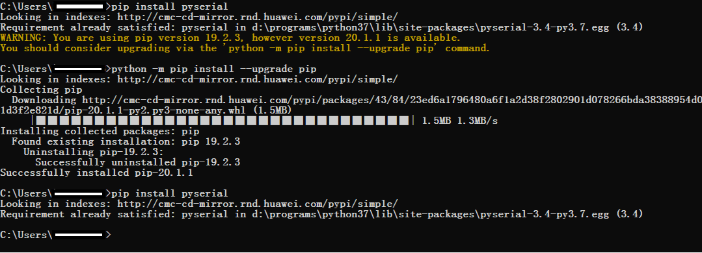

Testing Subsystem
=================

Overview
--------

The test-driven development mode is used during the development process.
You can develop new cases or modify existing cases to test new or
enhanced system features. The test helps you develop high-quality code
in the development phase.

Directory Structure
-------------------

**Table 1** Directory structure of the source code for test tools

.. raw:: html

   <table>

.. raw:: html

   <thead align="left">

.. raw:: html

   <tr id="row7977610131417">

.. raw:: html

   <th class="cellrowborder" valign="top" width="33.879999999999995%" id="mcps1.2.3.1.1">

.. raw:: html

   

Name

.. raw:: html

   

.. raw:: html

   </th>

.. raw:: html

   <th class="cellrowborder" valign="top" width="66.12%" id="mcps1.2.3.1.2">

.. raw:: html

   

Description

.. raw:: html

   

.. raw:: html

   </th>

.. raw:: html

   </tr>

.. raw:: html

   </thead>

.. raw:: html

   <tbody>

.. raw:: html

   <tr id="row17977171010144">

.. raw:: html

   <td class="cellrowborder" valign="top" width="33.879999999999995%" headers="mcps1.2.3.1.1 ">

.. raw:: html

   

developertest

.. raw:: html

   

.. raw:: html

   </td>

.. raw:: html

   <td class="cellrowborder" valign="top" width="66.12%" headers="mcps1.2.3.1.2 ">

.. raw:: html

   

Development test framework

.. raw:: html

   

.. raw:: html

   </td>

.. raw:: html

   </tr>

.. raw:: html

   <tr id="row259142201312">

.. raw:: html

   <td class="cellrowborder" valign="top" width="33.879999999999995%" headers="mcps1.2.3.1.1 ">

.. raw:: html

   

developertest/src

.. raw:: html

   

.. raw:: html

   </td>

.. raw:: html

   <td class="cellrowborder" valign="top" width="66.12%" headers="mcps1.2.3.1.2 ">

.. raw:: html

   

Test framework source code

.. raw:: html

   

.. raw:: html

   </td>

.. raw:: html

   </tr>

.. raw:: html

   <tr id="row1188919458130">

.. raw:: html

   <td class="cellrowborder" valign="top" width="33.879999999999995%" headers="mcps1.2.3.1.1 ">

.. raw:: html

   

developertest/src/core

.. raw:: html

   

.. raw:: html

   </td>

.. raw:: html

   <td class="cellrowborder" valign="top" width="66.12%" headers="mcps1.2.3.1.2 ">

.. raw:: html

   

Test executor

.. raw:: html

   

.. raw:: html

   </td>

.. raw:: html

   </tr>

.. raw:: html

   <tr id="row6978161091412">

.. raw:: html

   <td class="cellrowborder" valign="top" width="33.879999999999995%" headers="mcps1.2.3.1.1 ">

.. raw:: html

   

developertest/src/core/build

.. raw:: html

   

.. raw:: html

   </td>

.. raw:: html

   <td class="cellrowborder" valign="top" width="66.12%" headers="mcps1.2.3.1.2 ">

.. raw:: html

   

Test case compilation

.. raw:: html

   

.. raw:: html

   </td>

.. raw:: html

   </tr>

.. raw:: html

   <tr id="row6978201031415">

.. raw:: html

   <td class="cellrowborder" valign="top" width="33.879999999999995%" headers="mcps1.2.3.1.1 ">

.. raw:: html

   

developertest/src/core/command

.. raw:: html

   

.. raw:: html

   </td>

.. raw:: html

   <td class="cellrowborder" valign="top" width="66.12%" headers="mcps1.2.3.1.2 ">

.. raw:: html

   

Processing of command lines entered by users

.. raw:: html

   

.. raw:: html

   </td>

.. raw:: html

   </tr>

.. raw:: html

   <tr id="row1596814581415">

.. raw:: html

   <td class="cellrowborder" valign="top" width="33.879999999999995%" headers="mcps1.2.3.1.1 ">

.. raw:: html

   

developertest/src/core/config

.. raw:: html

   

.. raw:: html

   </td>

.. raw:: html

   <td class="cellrowborder" valign="top" width="66.12%" headers="mcps1.2.3.1.2 ">

.. raw:: html

   

Test framework configuration management

.. raw:: html

   

.. raw:: html

   </td>

.. raw:: html

   </tr>

.. raw:: html

   <tr id="row175618551244">

.. raw:: html

   <td class="cellrowborder" valign="top" width="33.879999999999995%" headers="mcps1.2.3.1.1 ">

.. raw:: html

   

developertest/src/core/driver

.. raw:: html

   

.. raw:: html

   </td>

.. raw:: html

   <td class="cellrowborder" valign="top" width="66.12%" headers="mcps1.2.3.1.2 ">

.. raw:: html

   

Test framework driver executor

.. raw:: html

   

.. raw:: html

   </td>

.. raw:: html

   </tr>

.. raw:: html

   <tr id="row114431614115">

.. raw:: html

   <td class="cellrowborder" valign="top" width="33.879999999999995%" headers="mcps1.2.3.1.1 ">

.. raw:: html

   

developertest/src/core/resource

.. raw:: html

   

.. raw:: html

   </td>

.. raw:: html

   <td class="cellrowborder" valign="top" width="66.12%" headers="mcps1.2.3.1.2 ">

.. raw:: html

   

Test framework configuration file

.. raw:: html

   

.. raw:: html

   </td>

.. raw:: html

   </tr>

.. raw:: html

   <tr id="row16289143217239">

.. raw:: html

   <td class="cellrowborder" valign="top" width="33.879999999999995%" headers="mcps1.2.3.1.1 ">

.. raw:: html

   

developertest/src/core/testcase

.. raw:: html

   

.. raw:: html

   </td>

.. raw:: html

   <td class="cellrowborder" valign="top" width="66.12%" headers="mcps1.2.3.1.2 ">

.. raw:: html

   

Test case management

.. raw:: html

   

.. raw:: html

   </td>

.. raw:: html

   </tr>

.. raw:: html

   <tr id="row1403172313113">

.. raw:: html

   <td class="cellrowborder" valign="top" width="33.879999999999995%" headers="mcps1.2.3.1.1 ">

.. raw:: html

   

developertest/src/core/common.py

.. raw:: html

   

.. raw:: html

   </td>

.. raw:: html

   <td class="cellrowborder" valign="top" width="66.12%" headers="mcps1.2.3.1.2 ">

.. raw:: html

   

Common operations on the test framework

.. raw:: html

   

.. raw:: html

   </td>

.. raw:: html

   </tr>

.. raw:: html

   <tr id="row1688681821114">

.. raw:: html

   <td class="cellrowborder" valign="top" width="33.879999999999995%" headers="mcps1.2.3.1.1 ">

.. raw:: html

   

developertest/src/core/constants.py

.. raw:: html

   

.. raw:: html

   </td>

.. raw:: html

   <td class="cellrowborder" valign="top" width="66.12%" headers="mcps1.2.3.1.2 ">

.. raw:: html

   

Global constants of the test framework

.. raw:: html

   

.. raw:: html

   </td>

.. raw:: html

   </tr>

.. raw:: html

   <tr id="row13247163492">

.. raw:: html

   <td class="cellrowborder" valign="top" width="33.879999999999995%" headers="mcps1.2.3.1.1 ">

.. raw:: html

   

developertest/src/core/exception.py

.. raw:: html

   

.. raw:: html

   </td>

.. raw:: html

   <td class="cellrowborder" valign="top" width="66.12%" headers="mcps1.2.3.1.2 ">

.. raw:: html

   

Test framework exceptions

.. raw:: html

   

.. raw:: html

   </td>

.. raw:: html

   </tr>

.. raw:: html

   <tr id="row1392104161718">

.. raw:: html

   <td class="cellrowborder" valign="top" width="33.879999999999995%" headers="mcps1.2.3.1.1 ">

.. raw:: html

   

developertest/src/core/utils.py

.. raw:: html

   

.. raw:: html

   </td>

.. raw:: html

   <td class="cellrowborder" valign="top" width="66.12%" headers="mcps1.2.3.1.2 ">

.. raw:: html

   

Test framework tools and methods

.. raw:: html

   

.. raw:: html

   </td>

.. raw:: html

   </tr>

.. raw:: html

   <tr id="row43471438181714">

.. raw:: html

   <td class="cellrowborder" valign="top" width="33.879999999999995%" headers="mcps1.2.3.1.1 ">

.. raw:: html

   

developertest/src/main

.. raw:: html

   

.. raw:: html

   </td>

.. raw:: html

   <td class="cellrowborder" valign="top" width="66.12%" headers="mcps1.2.3.1.2 ">

.. raw:: html

   

Test framework platform

.. raw:: html

   

.. raw:: html

   </td>

.. raw:: html

   </tr>

.. raw:: html

   <tr id="row144751036111712">

.. raw:: html

   <td class="cellrowborder" valign="top" width="33.879999999999995%" headers="mcps1.2.3.1.1 ">

.. raw:: html

   

developertest/src/main/**main**.py

.. raw:: html

   

.. raw:: html

   </td>

.. raw:: html

   <td class="cellrowborder" valign="top" width="66.12%" headers="mcps1.2.3.1.2 ">

.. raw:: html

   

Internal entrance of the test framework

.. raw:: html

   

.. raw:: html

   </td>

.. raw:: html

   </tr>

.. raw:: html

   <tr id="row11435113411716">

.. raw:: html

   <td class="cellrowborder" valign="top" width="33.879999999999995%" headers="mcps1.2.3.1.1 ">

.. raw:: html

   

developertest/example

.. raw:: html

   

.. raw:: html

   </td>

.. raw:: html

   <td class="cellrowborder" valign="top" width="66.12%" headers="mcps1.2.3.1.2 ">

.. raw:: html

   

Test framework demo cases

.. raw:: html

   

.. raw:: html

   </td>

.. raw:: html

   </tr>

.. raw:: html

   <tr id="row988116194289">

.. raw:: html

   <td class="cellrowborder" valign="top" width="33.879999999999995%" headers="mcps1.2.3.1.1 ">

.. raw:: html

   

developertest/third_party

.. raw:: html

   

.. raw:: html

   </td>

.. raw:: html

   <td class="cellrowborder" valign="top" width="66.12%" headers="mcps1.2.3.1.2 ">

.. raw:: html

   

Third-party components

.. raw:: html

   

.. raw:: html

   </td>

.. raw:: html

   </tr>

.. raw:: html

   <tr id="row11235133231718">

.. raw:: html

   <td class="cellrowborder" valign="top" width="33.879999999999995%" headers="mcps1.2.3.1.1 ">

.. raw:: html

   

developertest/BUILD.gn

.. raw:: html

   

.. raw:: html

   </td>

.. raw:: html

   <td class="cellrowborder" valign="top" width="66.12%" headers="mcps1.2.3.1.2 ">

.. raw:: html

   

Compilation configuration of the test subsystem

.. raw:: html

   

.. raw:: html

   </td>

.. raw:: html

   </tr>

.. raw:: html

   <tr id="row153133019174">

.. raw:: html

   <td class="cellrowborder" valign="top" width="33.879999999999995%" headers="mcps1.2.3.1.1 ">

.. raw:: html

   

developertest/start.bat

.. raw:: html

   

.. raw:: html

   </td>

.. raw:: html

   <td class="cellrowborder" valign="top" width="66.12%" headers="mcps1.2.3.1.2 ">

.. raw:: html

   

Developer test entry (Windows)

.. raw:: html

   

.. raw:: html

   </td>

.. raw:: html

   </tr>

.. raw:: html

   <tr id="row6640152712173">

.. raw:: html

   <td class="cellrowborder" valign="top" width="33.879999999999995%" headers="mcps1.2.3.1.1 ">

.. raw:: html

   

developertest/start.sh

.. raw:: html

   

.. raw:: html

   </td>

.. raw:: html

   <td class="cellrowborder" valign="top" width="66.12%" headers="mcps1.2.3.1.2 ">

.. raw:: html

   

Developer test entry (Linux)

.. raw:: html

   

.. raw:: html

   </td>

.. raw:: html

   </tr>

.. raw:: html

   </tbody>

.. raw:: html

   </table>

Constraints
-----------

Test tool environment dependency

1. Python version: 3.7.5 or later
2. NFS version: V4 or later
3. Windows: Windows 10 or later; Linux: Ubuntu 18.04

Installation
------------

Depend on the Python environment.

Install the serial port plugins **pyserial** and **readline** on the
local Python, and run the **pip install pyserial** and **sudo apt-get
install libreadline-dev** commands on the shell. The following figure is
displayed when the installation is complete.

|image1|

Compiling Test Cases
--------------------

-  Test case specifications

   -  Naming rules

      The source file name of the test case must be consistent with the
      test suite content. The relationship between the test suite and
      the test case is 1:N and the test suite and the test source file
      is 1:1. Each source file is globally unique and named in the
      format of [Feature]_[Function]_[Subfunction 1]_[Subfunction 1.1].
      Subfunctions can be further divided.

      The file name consists of lowercase letters and underscores (_)
      and ends with test, for example,
      **developertest/example/cxx_demo**.

   -  Test case coding specifications

      The test cases must comply with the feature code coding
      specifications. In addition, necessary case description
      information must be added. For details, see
      `#li2069415903917 <#li2069415903917>`__.

   -  Test case compilation and configuration specifications

      The test cases are compiled in GN mode. The configuration must
      comply with the compilation guide of the open source project. For
      details, see
      `en-us_topic_0000001051580775.rst <en-us_topic_0000001051580775.rst>`__.

-  Test case template

   For details, see the test case **demo**
   developertest/example/cxx_demo/test/unittest/common/calc_subtraction_test.cpp.

      |image2| **NOTE:** Feature: Description of the tested feature
      Function: Function of the tested feature SubFunction: Subfunction
      of the tested feature FunctionPoints: Function points to test
      EnvConditions: Environment and conditions of the feature to test
      CaseDescription: Test case description step: Procedure for
      executing the test case when the complex logic is tested

-  Directory plan for test cases

   ::

      subsystem (subsystem, system component)
      ├── module (module)
      │     └── test (module test directory)
      │             └── unittest (unit test)
      │                    ├── common (common test cases)
      │                    ├── liteos (only for LiteOS core test cases)
      │                    └── linux (only for Linux core test cases)
      │             └── moduletest (module test)
      │                    ├── common
      │                    ├── liteos
      │                    └── linux
      └── test (subsystem test directory)
             └── unittest (unit test)
                   ├── common
                   ├── liteos
                   ├── linux
             └── moduletest (module test)
                   ├── common
                   ├── liteos
                   ├── linux

   ..

      |image3| **NOTE:** The LiteOS and Linux are used as examples only
      for different device models. For the same feature on different
      development boards, if the test cases are the same, they are
      stored in the **common** directory. For the same feature, if the
      test cases are used to distinguish different device models and may
      include kernel differences and chip platform differences, the test
      cases are distinguished by directory.

-  Procedure for compiling test cases

   1. Add comments to the test case header file.

   2. Reference the **gtest** header file and **ext** namespace.

   3. Add the header file to test.

   4. Define test suites (test classes).

   5. Implement specific test cases of the test suite, including test
      case comments and logic implementation.

   6. Compile the test case compilation configuration.

         |image4| **NOTE:** \* Example:
         developertest/example/cxx_demo/test/unittest/common/calc_subtraction_test.cpp
         Notes:

         -  **SetUp** and **TearDown** are the processing logic before
            and after each test case in the test suite is executed.
         -  **SetUpTestCase** and **TearDownTestCase** are the
            processing logic before and after all cases in the test
            suite are executed.
         -  HWTEST usage: This method is applicable only to simple tests
            (not depending on **Setup** and **Teardown**). This method
            is not applicable to the scenario where multiple test
            scenarios require the same data configuration. The test
            cases may affect each other and are not independent.
         -  Use the **printf** function to print logs.

-  Compile a test case compilation file.

   -  Define test case compilation and building objectives.

      1. Add comments to the test case compilation header file.
      2. Import the test case compilation template file.
      3. Specify the output path of the test case file.
      4. Configure the directory contained in the test case compilation
         dependency.
      5. Specify the file name generated by the test case compilation
         target.
      6. Compile a specific test case compilation script and add the
         source files, configurations, and dependencies involved in the
         compilation.
      7. Group the target test case files by condition. The group name
         is fixed to **unittest/moduletest**.

   -  If there are multiple test suites, define the common compilation
      configuration.

   -  Add test cases to the build system.

         |image5| **NOTE:** \* Example:
         developertest/example/cxx_demo/test/unittest/common/BUILD.gn

-  Test case level definition

   -  Basic (Level 1)
   -  Major (Level 2)
   -  Minor (Level 3)
   -  Uncommon (Level 4)

Using Test Framework
--------------------

-  Install the basic framework **xdevice**.

   1. Open the **xdevice** installation directory, for example,
      **test/xdevice** in Windows.

   2. Open the console window and run the following command:

      ::

         python setup.py install

   3. The following figure is displayed when the installation is
      complete.

      |image6|

-  Modify the configuration of the basic framework **xdevice**.

   File: xdevice/config/user_config.xml

   1. [device] # Configure the serial port information with the label IP
      camera, COM port, and baud rate. Example:

      ::

         <device type="com" label="ipcamera">
             <serial>
                 <com>COM1</com>
                 <type>cmd</type>
                 <baund_rate>115200</baund_rate>
                 <data_bits>8</data_bits>
                 <stop_bits>1</stop_bits>
                 <timeout>1</timeout>
             </serial>
         </device>

-  Modify the configuration of the **developertest** component.

   File: resource/config/user_config.xml

   1. [test_cases] # Specify the output path of the test case and the
      compilation output directory. Example:

      ::

         <test_cases>
             <dir>S:\out\ipcamera_hi3518ev300_liteos_a\test</dir>
         </test_cases>

   2. [NFS] # Specify the NFS mapping path. **host_dir** is the NFS
      directory on the PC, and **board_dir** is the directory created on
      the board. Example:

      ::

         <NFS>
             <host_dir>D:\nfs</host_dir>
             <board_dir>user</board_dir>
         </NFS>

-  Check the environment before executing the test cases.

   -  The system image and file system have been burnt to a development
      board and are running properly on the development board. In system
      mode, for example, the device prompt **OHOS#** is displayed during
      shell login.
   -  The development host is properly connected to the serial port of
      the development board, and the development host is properly
      connected to the serial port of the development board.
   -  The IP addresses of the development host and development board are
      in the same network segment and can ping each other.
   -  An empty directory is created on the development host for mounting
      test cases through NFS, and the NFS service is started properly.

-  Run test suites.

   -  Start the test framework and go to the **test/developertest**
      directory.

      1. Start the test framework on Windows.

         ::

            start.bat

      2. Start the test framework on Linux.

         ::

            ./strat.sh

   -  Select a device mode.

      Configure device models based on the actual development board, for
      example,
      **developertest/src/core/resource/config/framework_config.xml**.

   -  Run the test command.

      1. To query the subsystems, modules, product forms, and test types
         supported by test cases, run the **show** command.

         ::

            usage:
                show productlist      Querying Supported Product Forms
                show typelist         Querying the Supported Test Type
                show subsystemlist    Querying Supported Subsystems
                show modulelist       Querying Supported Modules

      2. The following example shows how to run the test command. **-t**
         is mandatory, and **-ss** and **-tm** are optional.

         ::

            run -t ut -ss test -tm example

      3. Specify the parameters that can be used to execute the test
         suite corresponding to a specific feature or module.

         ::

            usage: run [-h] [-p PRODUCTFORM] [-t [TESTTYPE [TESTTYPE ...]]]
                [-ss SUBSYSTEM] [-tm TESTMODULE] [-ts TESTSUIT]
                [-tc TESTCASE] [-tl TESTLEVEL]

            optional arguments:
                -h, --help            show this help message and exit
                -p PRODUCTFORM, --productform PRODUCTFORM    Specified product form
                -t [TESTTYPE [TESTTYPE ...]], --testtype [TESTTYPE [TESTTYPE ...]]
                    Specify test type(UT,MST,ST,PERF,ALL)
                -ss SUBSYSTEM, --subsystem SUBSYSTEM    Specify test subsystem
                -tm TESTMODULE, --testmodule TESTMODULE    Specified test module
                -ts TESTSUIT, --testsuit TESTSUIT    Specify test suit
                -tc TESTCASE, --testcase TESTCASE    Specify test case
                -tl TESTLEVEL, --testlevel TESTLEVEL    Specify test level

-  See the test framework help if needed.

   -  The help command is used to query test commands that are supported
      by the test platform.

      ::

         help

-  Exit the self-test platform.

   -  Run the following command to exit the test platform:

      ::

         quit

Test Result and Log
-------------------

-  Test logs and test reports are generated after you execute test
   instructions in the test framework.

-  Test result

   -  The test result is displayed on the console. The root path of the
      test result is as follows:

      ::

         reports/xxxx-xx-xx-xx-xx-xx

   -  Test case formatting result

      ::

         result/

   -  Test case log

      ::

         log/plan_log_xxxx-xx-xx-xx-xx-xx.log

   -  Test report summary

      ::

         summary_report.html

   -  Test report details

      ::

         details_report.html

-  Test framework log

   ::

      reports/platform_log_xxxx-xx-xx-xx-xx-xx.log

-  Latest test report

   ::

      reports/latest

Repositories Involved
---------------------

test_developertest

test_xdevice

.. |image2| image:: public_sys-resources/icon-note.gif
.. |image3| image:: public_sys-resources/icon-note.gif
.. |image4| image:: public_sys-resources/icon-note.gif
.. |image5| image:: public_sys-resources/icon-note.gif

