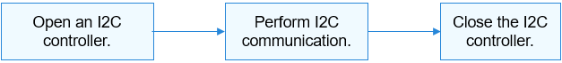

I2C Usage Guidelines
====================

How to Use
----------

`Figure 1 <#fig166181128151112>`__ illustrates the process of an I2C
device.

**Figure 1** Process of using an I2C device

|image1|

Opening an I2C Controller
-------------------------

Call the following function to open an I2C controller:

struct DevHandle \*I2cOpen(int16_t number);

**Table 1** Description of I2cOpen

.. raw:: html

   <table>

.. raw:: html

   <thead align="left">

.. raw:: html

   <tr id="row1060351914386">

.. raw:: html

   <th class="cellrowborder" valign="top" width="20.66%" id="mcps1.2.3.1.1">

.. raw:: html

   

Parameter

.. raw:: html

   

.. raw:: html

   </th>

.. raw:: html

   <th class="cellrowborder" valign="top" width="79.34%" id="mcps1.2.3.1.2">

.. raw:: html

   

Description

.. raw:: html

   

.. raw:: html

   </th>

.. raw:: html

   </tr>

.. raw:: html

   </thead>

.. raw:: html

   <tbody>

.. raw:: html

   <tr id="row1960431983813">

.. raw:: html

   <td class="cellrowborder" valign="top" width="20.66%" headers="mcps1.2.3.1.1 ">

.. raw:: html

   

number

.. raw:: html

   

.. raw:: html

   </td>

.. raw:: html

   <td class="cellrowborder" valign="top" width="79.34%" headers="mcps1.2.3.1.2 ">

.. raw:: html

   

I2C controller ID.

.. raw:: html

   

.. raw:: html

   </td>

.. raw:: html

   </tr>

.. raw:: html

   <tr id="row11410612183019">

.. raw:: html

   <td class="cellrowborder" valign="top" width="20.66%" headers="mcps1.2.3.1.1 ">

.. raw:: html

   

Return Value

.. raw:: html

   

.. raw:: html

   </td>

.. raw:: html

   <td class="cellrowborder" valign="top" width="79.34%" headers="mcps1.2.3.1.2 ">

.. raw:: html

   

Description

.. raw:: html

   

.. raw:: html

   </td>

.. raw:: html

   </tr>

.. raw:: html

   <tr id="row15410111273017">

.. raw:: html

   <td class="cellrowborder" valign="top" width="20.66%" headers="mcps1.2.3.1.1 ">

.. raw:: html

   

NULL

.. raw:: html

   

.. raw:: html

   </td>

.. raw:: html

   <td class="cellrowborder" valign="top" width="79.34%" headers="mcps1.2.3.1.2 ">

.. raw:: html

   

Failed to open the I2C controller.

.. raw:: html

   

.. raw:: html

   </td>

.. raw:: html

   </tr>

.. raw:: html

   <tr id="row1241081213303">

.. raw:: html

   <td class="cellrowborder" valign="top" width="20.66%" headers="mcps1.2.3.1.1 ">

.. raw:: html

   

Device handle

.. raw:: html

   

.. raw:: html

   </td>

.. raw:: html

   <td class="cellrowborder" valign="top" width="79.34%" headers="mcps1.2.3.1.2 ">

.. raw:: html

   

Handle of the I2C controller.

.. raw:: html

   

.. raw:: html

   </td>

.. raw:: html

   </tr>

.. raw:: html

   </tbody>

.. raw:: html

   </table>

This example assumes that the system has eight I2C controllers (numbered
from 0 to 7) and I2C controller 3 is to open.

::

   struct DevHandle *i2cHandle = NULL; /* I2C controller handle */

   /* Open an I2C controller. */
   i2cHandle = I2cOpen(3);
   if (i2cHandle == NULL) {
       HDF_LOGE("I2cOpen: failed\n");
       return;
   }

Performing I2C Communication
----------------------------

Use the following function for message transfer:

int32_t I2cTransfer(struct DevHandle \*handle, struct I2cMsg \*msgs,
int16_t count);

**Table 2** Description of I2cTransfer

.. raw:: html

   <table>

.. raw:: html

   <thead align="left">

.. raw:: html

   <tr id="row1134415176216">

.. raw:: html

   <th class="cellrowborder" valign="top" width="50%" id="mcps1.2.3.1.1">

.. raw:: html

   

Parameter

.. raw:: html

   

.. raw:: html

   </th>

.. raw:: html

   <th class="cellrowborder" valign="top" width="50%" id="mcps1.2.3.1.2">

.. raw:: html

   

Description

.. raw:: html

   

.. raw:: html

   </th>

.. raw:: html

   </tr>

.. raw:: html

   </thead>

.. raw:: html

   <tbody>

.. raw:: html

   <tr id="row5344101702113">

.. raw:: html

   <td class="cellrowborder" valign="top" width="50%" headers="mcps1.2.3.1.1 ">

.. raw:: html

   

handle

.. raw:: html

   

.. raw:: html

   </td>

.. raw:: html

   <td class="cellrowborder" valign="top" width="50%" headers="mcps1.2.3.1.2 ">

.. raw:: html

   

Handle of an I2C controller.

.. raw:: html

   

.. raw:: html

   </td>

.. raw:: html

   </tr>

.. raw:: html

   <tr id="row17344171722117">

.. raw:: html

   <td class="cellrowborder" valign="top" width="50%" headers="mcps1.2.3.1.1 ">

.. raw:: html

   

msgs

.. raw:: html

   

.. raw:: html

   </td>

.. raw:: html

   <td class="cellrowborder" valign="top" width="50%" headers="mcps1.2.3.1.2 ">

.. raw:: html

   

Message array of the data to transfer.

.. raw:: html

   

.. raw:: html

   </td>

.. raw:: html

   </tr>

.. raw:: html

   <tr id="row45812466213">

.. raw:: html

   <td class="cellrowborder" valign="top" width="50%" headers="mcps1.2.3.1.1 ">

.. raw:: html

   

count

.. raw:: html

   

.. raw:: html

   </td>

.. raw:: html

   <td class="cellrowborder" valign="top" width="50%" headers="mcps1.2.3.1.2 ">

.. raw:: html

   

Length of the message array.

.. raw:: html

   

.. raw:: html

   </td>

.. raw:: html

   </tr>

.. raw:: html

   <tr id="row04701426105110">

.. raw:: html

   <td class="cellrowborder" valign="top" width="50%" headers="mcps1.2.3.1.1 ">

.. raw:: html

   

Return Value

.. raw:: html

   

.. raw:: html

   </td>

.. raw:: html

   <td class="cellrowborder" valign="top" width="50%" headers="mcps1.2.3.1.2 ">

.. raw:: html

   

Description

.. raw:: html

   

.. raw:: html

   </td>

.. raw:: html

   </tr>

.. raw:: html

   <tr id="row74701226125110">

.. raw:: html

   <td class="cellrowborder" valign="top" width="50%" headers="mcps1.2.3.1.1 ">

.. raw:: html

   

Positive integer

.. raw:: html

   

.. raw:: html

   </td>

.. raw:: html

   <td class="cellrowborder" valign="top" width="50%" headers="mcps1.2.3.1.2 ">

.. raw:: html

   

Number of message structures that are successfully transmitted.

.. raw:: html

   

.. raw:: html

   </td>

.. raw:: html

   </tr>

.. raw:: html

   <tr id="row204701126195115">

.. raw:: html

   <td class="cellrowborder" valign="top" width="50%" headers="mcps1.2.3.1.1 ">

.. raw:: html

   

Negative value

.. raw:: html

   

.. raw:: html

   </td>

.. raw:: html

   <td class="cellrowborder" valign="top" width="50%" headers="mcps1.2.3.1.2 ">

.. raw:: html

   

Failed to perform the message transfer.

.. raw:: html

   

.. raw:: html

   </td>

.. raw:: html

   </tr>

.. raw:: html

   </tbody>

.. raw:: html

   </table>

The type of an I2C message transfer is defined by **I2cMsg**. Each
message structure indicates a read or write operation. Multiple read or
write operations can be performed by using a message array.

::

   int32_t ret;
   uint8_t wbuff[2] = { 0x12, 0x13 };
   uint8_t rbuff[2] = { 0 };
   struct I2cMsg msgs[2]; /* Custom message array for transfer */
   msgs[0].buf = wbuff;    /* Data to write */
   msgs[0].len = 2;        /* The length of the data to write is 2. */
   msgs[0].addr = 0x5A;    /* The address of the device to write the data is 0x5A. */
   msgs[0].flags = 0;      /* The flag is 0, indicating the write operation. */
   msgs[1].buf = rbuff;    /* Data to read */
   msgs[1].len = 2;        /* The length of the data to read is 2. */
   msgs[1].addr = 0x5A;    /* The address of the device to read the data is 0x5A. */
   msgs[1].flags = I2C_FLAG_READ /* I2C_FLAG_READ is configured, indicating the read operation. */
   /* Perform a custom transfer to transfer two messages. */
   ret = I2cTransfer(i2cHandle, msgs, 2);
   if (ret != 2) {
       HDF_LOGE("I2cTransfer: failed, ret %d\n", ret);
       return;
   }

..

   |image2| **CAUTION:** - The device address in the **I2cMsg**
   structure does not contain the read/write flag bit. The read/write
   information is transferred by the read/write control bit in the
   member variable **flags**. - The **I2cTransfer** function does not
   limit the number of message structures, which is determined by the
   I2C controller. - The **I2cTransfer** function does not limit the
   data length of each message structure, which is determined by the I2C
   controller. - The **I2cTransfer** function may cause the system to
   sleep and therefore cannot be invoked in the interrupt context.

Closing an I2C Controller
-------------------------

Call the following function to close the I2C controller after the
communication is complete:

void I2cClose(DevHandle \*handle);

**Table 3** Description of I2cClose

.. raw:: html

   <table>

.. raw:: html

   <thead align="left">

.. raw:: html

   <tr id="row1525793312">

.. raw:: html

   <th class="cellrowborder" valign="top" width="50%" id="mcps1.2.3.1.1">

.. raw:: html

   

Parameter

.. raw:: html

   

.. raw:: html

   </th>

.. raw:: html

   <th class="cellrowborder" valign="top" width="50%" id="mcps1.2.3.1.2">

.. raw:: html

   

Description

.. raw:: html

   

.. raw:: html

   </th>

.. raw:: html

   </tr>

.. raw:: html

   </thead>

.. raw:: html

   <tbody>

.. raw:: html

   <tr id="row1926109193116">

.. raw:: html

   <td class="cellrowborder" valign="top" width="50%" headers="mcps1.2.3.1.1 ">

.. raw:: html

   

handle

.. raw:: html

   

.. raw:: html

   </td>

.. raw:: html

   <td class="cellrowborder" valign="top" width="50%" headers="mcps1.2.3.1.2 ">

.. raw:: html

   

Handle of an I2C controller.

.. raw:: html

   

.. raw:: html

   </td>

.. raw:: html

   </tr>

.. raw:: html

   </tbody>

.. raw:: html

   </table>

::

   I2cClose(i2cHandle); /* Close the I2C controller. */

.. |image2| image:: public_sys-resources/icon-caution.gif
