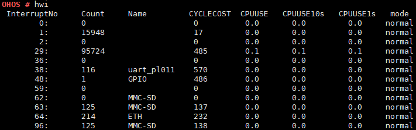

hwi
===

Command Function
----------------

This command is used to query information about the current interrupts.

Syntax
------

hwi

Parameter Description
---------------------

None

Usage
-----

-  Enter **hwi** to display the current interrupt ID, count of
   interrupts, and registered interrupt name.
-  If **LOSCFG_CPUP_INCLUDE_IRQ** is enabled, the processing time
   (cycles), CPU usage, and interrupt type of each interrupt are
   displayed.

Example
-------

Enter **hwi**.

Output
------

1. Interrupt information (with **LOSCFG_CPUP_INCLUDE_IRQ** disabled)

   |image1|

2. Interrupt information (with **LOSCFG_CPUP_INCLUDE_IRQ** enabled)

   |image2|

   **Table 1** Output description

   .. raw:: html

      <table>

   .. raw:: html

      <thead align="left">

   .. raw:: html

      <tr id="row814mcpsimp">

   .. raw:: html

      <th class="cellrowborder" valign="top" width="50%" id="mcps1.2.3.1.1">

   .. raw:: html

      

   Parameter

   .. raw:: html

      

   .. raw:: html

      </th>

   .. raw:: html

      <th class="cellrowborder" valign="top" width="50%" id="mcps1.2.3.1.2">

   .. raw:: html

      

   Description

   .. raw:: html

      

   .. raw:: html

      </th>

   .. raw:: html

      </tr>

   .. raw:: html

      </thead>

   .. raw:: html

      <tbody>

   .. raw:: html

      <tr id="row20360171311398">

   .. raw:: html

      <td class="cellrowborder" valign="top" width="50%" headers="mcps1.2.3.1.1 ">

   .. raw:: html

      

   InterruptNo

   .. raw:: html

      

   .. raw:: html

      </td>

   .. raw:: html

      <td class="cellrowborder" valign="top" width="50%" headers="mcps1.2.3.1.2 ">

   .. raw:: html

      

   Indicates the interrupt ID.

   .. raw:: html

      

   .. raw:: html

      </td>

   .. raw:: html

      </tr>

   .. raw:: html

      <tr id="row262535153913">

   .. raw:: html

      <td class="cellrowborder" valign="top" width="50%" headers="mcps1.2.3.1.1 ">

   .. raw:: html

      

   Count

   .. raw:: html

      

   .. raw:: html

      </td>

   .. raw:: html

      <td class="cellrowborder" valign="top" width="50%" headers="mcps1.2.3.1.2 ">

   .. raw:: html

      

   Indicates the count of interrupts.

   .. raw:: html

      

   .. raw:: html

      </td>

   .. raw:: html

      </tr>

   .. raw:: html

      <tr id="row9683953153916">

   .. raw:: html

      <td class="cellrowborder" valign="top" width="50%" headers="mcps1.2.3.1.1 ">

   .. raw:: html

      

   Name

   .. raw:: html

      

   .. raw:: html

      </td>

   .. raw:: html

      <td class="cellrowborder" valign="top" width="50%" headers="mcps1.2.3.1.2 ">

   .. raw:: html

      

   Indicates the registered interrupt name.

   .. raw:: html

      

   .. raw:: html

      </td>

   .. raw:: html

      </tr>

   .. raw:: html

      <tr id="row85721136402">

   .. raw:: html

      <td class="cellrowborder" valign="top" width="50%" headers="mcps1.2.3.1.1 ">

   .. raw:: html

      

   CYCLECOST

   .. raw:: html

      

   .. raw:: html

      </td>

   .. raw:: html

      <td class="cellrowborder" valign="top" width="50%" headers="mcps1.2.3.1.2 ">

   .. raw:: html

      

   Indicates the interrupt processing time (cycles).

   .. raw:: html

      

   .. raw:: html

      </td>

   .. raw:: html

      </tr>

   .. raw:: html

      <tr id="row19180126151415">

   .. raw:: html

      <td class="cellrowborder" valign="top" width="50%" headers="mcps1.2.3.1.1 ">

   .. raw:: html

      

   CPUUSE

   .. raw:: html

      

   .. raw:: html

      </td>

   .. raw:: html

      <td class="cellrowborder" valign="top" width="50%" headers="mcps1.2.3.1.2 ">

   .. raw:: html

      

   Indicates the CPU usage.

   .. raw:: html

      

   .. raw:: html

      </td>

   .. raw:: html

      </tr>

   .. raw:: html

      <tr id="row511517331702">

   .. raw:: html

      <td class="cellrowborder" valign="top" width="50%" headers="mcps1.2.3.1.1 ">

   .. raw:: html

      

   CPUUSE10s

   .. raw:: html

      

   .. raw:: html

      </td>

   .. raw:: html

      <td class="cellrowborder" valign="top" width="50%" headers="mcps1.2.3.1.2 ">

   .. raw:: html

      

   Indicates CPU usage within the last 10 seconds.

   .. raw:: html

      

   .. raw:: html

      </td>

   .. raw:: html

      </tr>

   .. raw:: html

      <tr id="row1868124415413">

   .. raw:: html

      <td class="cellrowborder" valign="top" width="50%" headers="mcps1.2.3.1.1 ">

   .. raw:: html

      

   CPUUSE1s

   .. raw:: html

      

   .. raw:: html

      </td>

   .. raw:: html

      <td class="cellrowborder" valign="top" width="50%" headers="mcps1.2.3.1.2 ">

   .. raw:: html

      

   Indicates CPU usage within the last 1 second.

   .. raw:: html

      

   .. raw:: html

      </td>

   .. raw:: html

      </tr>

   .. raw:: html

      <tr id="row7681164454112">

   .. raw:: html

      <td class="cellrowborder" valign="top" width="50%" headers="mcps1.2.3.1.1 ">

   .. raw:: html

      

   mode

   .. raw:: html

      

   .. raw:: html

      </td>

   .. raw:: html

      <td class="cellrowborder" valign="top" width="50%" headers="mcps1.2.3.1.2 ">

   .. raw:: html

      

   Indicates the interrupt mode.

   .. raw:: html

      

   .. raw:: html

      <ul id="ul682912412419">

   .. raw:: html

      <li>

   normal: non-shared interrupt.

   .. raw:: html

      </li>

   .. raw:: html

      <li>

   shared: shared interrupt.

   .. raw:: html

      </li>

   .. raw:: html

      </ul>

   .. raw:: html

      </td>

   .. raw:: html

      </tr>

   .. raw:: html

      </tbody>

   .. raw:: html

      </table>

.. |image1| image:: figures/en-us_image_0000001053826366.png

