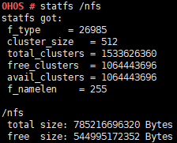

statfs
======

Command Function
----------------

This command is used to print information about a file system, such as
the type, total size, and available size.

Syntax
------

statfs [*directory*]

Parameter Description
---------------------

**Table 1** Parameters

.. raw:: html

   <table>

.. raw:: html

   <thead align="left">

.. raw:: html

   <tr id="row1603mcpsimp">

.. raw:: html

   <th class="cellrowborder" valign="top" width="33.33333333333333%" id="mcps1.2.4.1.1">

.. raw:: html

   

Parameter

.. raw:: html

   

.. raw:: html

   </th>

.. raw:: html

   <th class="cellrowborder" valign="top" width="33.33333333333333%" id="mcps1.2.4.1.2">

.. raw:: html

   

Description

.. raw:: html

   

.. raw:: html

   </th>

.. raw:: html

   <th class="cellrowborder" valign="top" width="33.33333333333333%" id="mcps1.2.4.1.3">

.. raw:: html

   

Value Range

.. raw:: html

   

.. raw:: html

   </th>

.. raw:: html

   </tr>

.. raw:: html

   </thead>

.. raw:: html

   <tbody>

.. raw:: html

   <tr id="row1610mcpsimp">

.. raw:: html

   <td class="cellrowborder" valign="top" width="33.33333333333333%" headers="mcps1.2.4.1.1 ">

.. raw:: html

   

directory

.. raw:: html

   

.. raw:: html

   </td>

.. raw:: html

   <td class="cellrowborder" valign="top" width="33.33333333333333%" headers="mcps1.2.4.1.2 ">

.. raw:: html

   

Indicates the file system directory.

.. raw:: html

   

.. raw:: html

   </td>

.. raw:: html

   <td class="cellrowborder" valign="top" width="33.33333333333333%" headers="mcps1.2.4.1.3 ">

.. raw:: html

   

The file system must exist and support the statfs command. Currently,
the following file systems are supported: JFFS2, FAT, and NFS.

.. raw:: html

   

.. raw:: html

   </td>

.. raw:: html

   </tr>

.. raw:: html

   </tbody>

.. raw:: html

   </table>

Usage
-----

The printed information varies depending on the file system.

Example
-------

The following uses the NFS file system as an example:

Enter **statfs /nfs**.

| **Figure 1** Output of the statfs command
| |image1|

