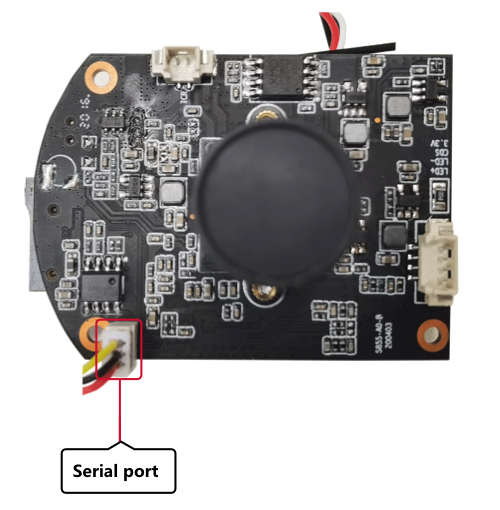

Introduction to the Hi3518 Development Board
============================================

Hi3518
------

Hi3518EV300 is a next-generation system on chip (SoC) designed for the
industry-dedicated smart HD IP camera. It introduces a next-generation
image signal processor (ISP), the latest H.265 video compression
encoder, and the advanced low-power process and architecture design,
leading the industry in terms of low bit rate, high image quality, and
low power consumption.

| **Figure 1** Front view of the Hi3518EV300 board
| |image1|

**Figure 2** Rear view of the Hi3518EV300 board

|image2|

Development Board Specifications
--------------------------------

**Table 1** Specifications of the Hi3518 development board

.. raw:: html

   <table>

.. raw:: html

   <thead align="left">

.. raw:: html

   <tr id="r7d87cdc7a09d445c824000228ae4a3b0">

.. raw:: html

   <th class="cellrowborder" valign="top" width="28.749999999999996%" id="mcps1.2.3.1.1">

.. raw:: html

   

Type

.. raw:: html

   

.. raw:: html

   </th>

.. raw:: html

   <th class="cellrowborder" valign="top" width="71.25%" id="mcps1.2.3.1.2">

.. raw:: html

   

Description

.. raw:: html

   

.. raw:: html

   </th>

.. raw:: html

   </tr>

.. raw:: html

   </thead>

.. raw:: html

   <tbody>

.. raw:: html

   <tr id="r9c0a0b643fd7495ab799c1eab9fbe1ec">

.. raw:: html

   <td class="cellrowborder" valign="top" width="28.749999999999996%" headers="mcps1.2.3.1.1 ">

.. raw:: html

   

Processor core

.. raw:: html

   

.. raw:: html

   </td>

.. raw:: html

   <td class="cellrowborder" valign="top" width="71.25%" headers="mcps1.2.3.1.2 ">

.. raw:: html

   <ul id="ul12459548104218">

.. raw:: html

   <li>

Hi3518EV300

.. raw:: html

   </li>

.. raw:: html

   </ul>

.. raw:: html

   </td>

.. raw:: html

   </tr>

.. raw:: html

   <tr id="row1527851224210">

.. raw:: html

   <td class="cellrowborder" valign="top" width="28.749999999999996%" headers="mcps1.2.3.1.1 ">

.. raw:: html

   

Imaging device

.. raw:: html

   

.. raw:: html

   </td>

.. raw:: html

   <td class="cellrowborder" valign="top" width="71.25%" headers="mcps1.2.3.1.2 ">

.. raw:: html

   <ul id="ul49841342134210">

.. raw:: html

   <li>

1/2.9 F23

.. raw:: html

   </li>

.. raw:: html

   </ul>

.. raw:: html

   </td>

.. raw:: html

   </tr>

.. raw:: html

   <tr id="r79097125b7f64c189f67ac280cdacae9">

.. raw:: html

   <td class="cellrowborder" valign="top" width="28.749999999999996%" headers="mcps1.2.3.1.1 ">

.. raw:: html

   

External interfaces

.. raw:: html

   

.. raw:: html

   </td>

.. raw:: html

   <td class="cellrowborder" valign="top" width="71.25%" headers="mcps1.2.3.1.2 ">

.. raw:: html

   <ul id="u6a04d9aa22f6410f91bbcdaf902d0e5f">

.. raw:: html

   <li>

External microphone

.. raw:: html

   </li>

.. raw:: html

   <li>

External 8 Ω/1.5 W speaker

.. raw:: html

   </li>

.. raw:: html

   </ul>

.. raw:: html

   </td>

.. raw:: html

   </tr>

.. raw:: html

   <tr id="r785d104d71f6426aa9aab25d14a7581b">

.. raw:: html

   <td class="cellrowborder" valign="top" width="28.749999999999996%" headers="mcps1.2.3.1.1 ">

.. raw:: html

   

External memory interface

.. raw:: html

   

.. raw:: html

   </td>

.. raw:: html

   <td class="cellrowborder" valign="top" width="71.25%" headers="mcps1.2.3.1.2 ">

.. raw:: html

   <ul id="u8f323b7322a14e109e2937b9660af0c4">

.. raw:: html

   <li>

TF card

.. raw:: html

   

A maximum file size of 128 GB is allowed (FAT32 format).

.. raw:: html

   

.. raw:: html

   </li>

.. raw:: html

   </ul>

.. raw:: html

   </td>

.. raw:: html

   </tr>

.. raw:: html

   <tr id="rae3f8ef812894db3951e01b4a1b85438">

.. raw:: html

   <td class="cellrowborder" valign="top" width="28.749999999999996%" headers="mcps1.2.3.1.1 ">

.. raw:: html

   

WLAN protocol

.. raw:: html

   

.. raw:: html

   </td>

.. raw:: html

   <td class="cellrowborder" valign="top" width="71.25%" headers="mcps1.2.3.1.2 ">

.. raw:: html

   <ul id="ul1311935314215">

.. raw:: html

   <li>

802.11 b/g/n

.. raw:: html

   </li>

.. raw:: html

   </ul>

.. raw:: html

   </td>

.. raw:: html

   </tr>

.. raw:: html

   </tbody>

.. raw:: html

   </table>

.. |image1| image:: figures/front-view-of-the-hi3518ev300-board.png

