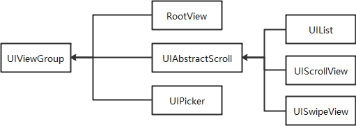
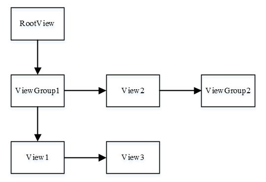

Development Guidelines on Container Components
==============================================

Container components are capable of containing UI components and inherit
from **UIViewGroup**. Components that are commonly used and need to
contain child components are placed in the container class inheritance
structure. For example, you need to call the **Add** function to add
information such as time statistics and icons to **UIAnalogClock**.

**Figure 1** Structure of a common container component

|image1|

The **RootView**, **UIAbstractScroll**, and **UIPicker** components
inherit from **UIViewGroup**, and the **UIList**, **UIScrollView**, and
**UISwipeView** components inherit from **UIAbstractScroll**.

UIViewGroup
-----------

When to Use
-----------

**UIViewGroup** is a base class for container components. For example,
you can call the functions in this class to add, remove, and insert
container components. Also, you can call the **Add** function to add
child components for a container component. You need to set the position
information for child components in a common container component. The
position information is the coordinates relative to those of their
parent component. The following figure shows the component tree
structure.

**Figure 2** Component tree structure

|image2|

As shown in the figure, the container component **ViewGroup1** and the
component **View1** are added to **rootView**, the component **View2**
and the container component **ViewGroup2** are added to **ViewGroup1**,
and then the component **View3** (as a sibling of **View1**) is also
added to **ViewGroup1**.

-  Rendering: During rendering of a container component, you need to
   call the **OnDraw** function on all its child components to update
   them.
-  Coordinates: As the position information of child components is the
   coordinates relative to those of their parent components, the system
   calculates and displays the absolute coordinates of child components
   during rendering.
-  Tree structure traversing: The **UIViewGroup** class provides the
   functions below to traverse, search for, and manage the component
   tree.

Available APIs
--------------

**Table 1** Available functions in ViewGroup

.. raw:: html

   <table>

.. raw:: html

   <thead align="left">

.. raw:: html

   <tr id="row14957132342220">

.. raw:: html

   <th class="cellrowborder" valign="top" width="64.73%" id="mcps1.2.3.1.1">

.. raw:: html

   

Function

.. raw:: html

   

.. raw:: html

   </th>

.. raw:: html

   <th class="cellrowborder" valign="top" width="35.27%" id="mcps1.2.3.1.2">

.. raw:: html

   

Description

.. raw:: html

   

.. raw:: html

   </th>

.. raw:: html

   </tr>

.. raw:: html

   </thead>

.. raw:: html

   <tbody>

.. raw:: html

   <tr id="row14957123162218">

.. raw:: html

   <td class="cellrowborder" valign="top" width="64.73%" headers="mcps1.2.3.1.1 ">

.. raw:: html

   

virtual void Add(UIView\* view)

.. raw:: html

   

.. raw:: html

   </td>

.. raw:: html

   <td class="cellrowborder" valign="top" width="35.27%" headers="mcps1.2.3.1.2 ">

.. raw:: html

   

Adds a child component.

.. raw:: html

   

.. raw:: html

   </td>

.. raw:: html

   </tr>

.. raw:: html

   <tr id="row895892310224">

.. raw:: html

   <td class="cellrowborder" valign="top" width="64.73%" headers="mcps1.2.3.1.1 ">

.. raw:: html

   

virtual void Insert(UIView\* prevView, UIView\* insertView)

.. raw:: html

   

.. raw:: html

   </td>

.. raw:: html

   <td class="cellrowborder" valign="top" width="35.27%" headers="mcps1.2.3.1.2 ">

.. raw:: html

   

Inserts a child component.

.. raw:: html

   

.. raw:: html

   </td>

.. raw:: html

   </tr>

.. raw:: html

   <tr id="row395862315229">

.. raw:: html

   <td class="cellrowborder" valign="top" width="64.73%" headers="mcps1.2.3.1.1 ">

.. raw:: html

   

virtual void Remove(UIView\* view)

.. raw:: html

   

.. raw:: html

   </td>

.. raw:: html

   <td class="cellrowborder" valign="top" width="35.27%" headers="mcps1.2.3.1.2 ">

.. raw:: html

   

Removes a child component.

.. raw:: html

   

.. raw:: html

   </td>

.. raw:: html

   </tr>

.. raw:: html

   <tr id="row195832352212">

.. raw:: html

   <td class="cellrowborder" valign="top" width="64.73%" headers="mcps1.2.3.1.1 ">

.. raw:: html

   

virtual void RemoveAll()

.. raw:: html

   

.. raw:: html

   </td>

.. raw:: html

   <td class="cellrowborder" valign="top" width="35.27%" headers="mcps1.2.3.1.2 ">

.. raw:: html

   

Removes all child components.

.. raw:: html

   

.. raw:: html

   </td>

.. raw:: html

   </tr>

.. raw:: html

   <tr id="row895818232223">

.. raw:: html

   <td class="cellrowborder" valign="top" width="64.73%" headers="mcps1.2.3.1.1 ">

.. raw:: html

   

virtual void GetTargetView(const Point& point, UIView*\* last)

.. raw:: html

   

.. raw:: html

   </td>

.. raw:: html

   <td class="cellrowborder" valign="top" width="35.27%" headers="mcps1.2.3.1.2 ">

.. raw:: html

   

Obtains the target view.

.. raw:: html

   

.. raw:: html

   </td>

.. raw:: html

   </tr>

.. raw:: html

   <tr id="row795917235227">

.. raw:: html

   <td class="cellrowborder" valign="top" width="64.73%" headers="mcps1.2.3.1.1 ">

.. raw:: html

   

virtual void MoveChildByOffset(int16_t x, int16_t y)

.. raw:: html

   

.. raw:: html

   </td>

.. raw:: html

   <td class="cellrowborder" valign="top" width="35.27%" headers="mcps1.2.3.1.2 ">

.. raw:: html

   

Moves a child component by a specified offset.

.. raw:: html

   

.. raw:: html

   </td>

.. raw:: html

   </tr>

.. raw:: html

   <tr id="row1395912314227">

.. raw:: html

   <td class="cellrowborder" valign="top" width="64.73%" headers="mcps1.2.3.1.1 ">

.. raw:: html

   

UIView\* GetChildrenHead() const

.. raw:: html

   

.. raw:: html

   </td>

.. raw:: html

   <td class="cellrowborder" valign="top" width="35.27%" headers="mcps1.2.3.1.2 ">

.. raw:: html

   

Obtains the first child view in a view group.

.. raw:: html

   

.. raw:: html

   </td>

.. raw:: html

   </tr>

.. raw:: html

   <tr id="row7959192317226">

.. raw:: html

   <td class="cellrowborder" valign="top" width="64.73%" headers="mcps1.2.3.1.1 ">

.. raw:: html

   

UIView\* GetChildrenTail() const

.. raw:: html

   

.. raw:: html

   </td>

.. raw:: html

   <td class="cellrowborder" valign="top" width="35.27%" headers="mcps1.2.3.1.2 ">

.. raw:: html

   

Obtains the last child view in a view group.

.. raw:: html

   

.. raw:: html

   </td>

.. raw:: html

   </tr>

.. raw:: html

   <tr id="row39591423142214">

.. raw:: html

   <td class="cellrowborder" valign="top" width="64.73%" headers="mcps1.2.3.1.1 ">

.. raw:: html

   

virtual UIView\* GetChildById(const char\* id) const override

.. raw:: html

   

.. raw:: html

   </td>

.. raw:: html

   <td class="cellrowborder" valign="top" width="35.27%" headers="mcps1.2.3.1.2 ">

.. raw:: html

   

Obtains a child view based on its ID.

.. raw:: html

   

.. raw:: html

   </td>

.. raw:: html

   </tr>

.. raw:: html

   </tbody>

.. raw:: html

   </table>

How to Develop
--------------

1. Create **ULLabelButton** instances and set their coordinates.

   ::

      UILabelButton* btn1 = new UILabelButton();
      btn1->SetPosition(0, 0, 100, 50);
      btn1->SetText("btn1");

      UILabelButton* btn2 = new UILabelButton();
      btn2->SetPosition(50, 50, 100, 50);
      btn2->SetText("btn2");

      UILabelButton* btn3 = new UILabelButton();
      btn3->SetPosition(100, 100, 100, 50);
      btn3->SetText("btn3");

2. Create a **UIViewGroup** instance and set its coordinates.

   ::

      UIViewGroup* group = new UIViewGroup();
      group->SetPosition(0, 0, 300, 300);

3. Add the **ULLabelButton** instances to **UIViewGroup**.

   ::

      group->Add(btn1);
      group->Add(btn2);
      group->Add(btn3);

4. The following figure shows the effect of adding view instances to a
   **ViewGroup**.

   | **Figure 3** Effect of adding view instances to a ViewGroup
   | |image3|

UIScrollView
------------

.. _when-to-use-1:

When to Use
-----------

**UIScrollView** provides scrolling container components, which enable
child components to scroll upwards, downwards, leftwards, and rightwards
upon a touch event. This class also supports horizontal and vertical
cursor display.

.. _available-apis-1:

Available APIs
--------------

**Table 2** Available functions in ScrollView

.. raw:: html

   <table>

.. raw:: html

   <thead align="left">

.. raw:: html

   <tr id="row432202014249">

.. raw:: html

   <th class="cellrowborder" valign="top" width="50%" id="mcps1.2.3.1.1">

.. raw:: html

   

Function

.. raw:: html

   

.. raw:: html

   </th>

.. raw:: html

   <th class="cellrowborder" valign="top" width="50%" id="mcps1.2.3.1.2">

.. raw:: html

   

Description

.. raw:: html

   

.. raw:: html

   </th>

.. raw:: html

   </tr>

.. raw:: html

   </thead>

.. raw:: html

   <tbody>

.. raw:: html

   <tr id="row13392032417">

.. raw:: html

   <td class="cellrowborder" valign="top" width="50%" headers="mcps1.2.3.1.1 ">

.. raw:: html

   

void ScrollBy(int16_t xDistance, int16_t yDistance)

.. raw:: html

   

.. raw:: html

   </td>

.. raw:: html

   <td class="cellrowborder" valign="top" width="50%" headers="mcps1.2.3.1.2 ">

.. raw:: html

   

Scrolls a view.

.. raw:: html

   

.. raw:: html

   </td>

.. raw:: html

   </tr>

.. raw:: html

   <tr id="row1633132032415">

.. raw:: html

   <td class="cellrowborder" valign="top" width="50%" headers="mcps1.2.3.1.1 ">

.. raw:: html

   

void SetScrollbarWidth(uint8_t width)

.. raw:: html

   

.. raw:: html

   </td>

.. raw:: html

   <td class="cellrowborder" valign="top" width="50%" headers="mcps1.2.3.1.2 ">

.. raw:: html

   

Sets the scrollbar width.

.. raw:: html

   

.. raw:: html

   </td>

.. raw:: html

   </tr>

.. raw:: html

   <tr id="row033152012416">

.. raw:: html

   <td class="cellrowborder" valign="top" width="50%" headers="mcps1.2.3.1.1 ">

.. raw:: html

   

void SetHorizontalScrollState(bool state)

.. raw:: html

   

.. raw:: html

   </td>

.. raw:: html

   <td class="cellrowborder" valign="top" width="50%" headers="mcps1.2.3.1.2 ">

.. raw:: html

   

Sets the horizontal scrolling state.

.. raw:: html

   

.. raw:: html

   </td>

.. raw:: html

   </tr>

.. raw:: html

   <tr id="row03362011242">

.. raw:: html

   <td class="cellrowborder" valign="top" width="50%" headers="mcps1.2.3.1.1 ">

.. raw:: html

   

bool GetHorizontalScrollState() const

.. raw:: html

   

.. raw:: html

   </td>

.. raw:: html

   <td class="cellrowborder" valign="top" width="50%" headers="mcps1.2.3.1.2 ">

.. raw:: html

   

Checks whether horizontal scrolling is allowed.

.. raw:: html

   

.. raw:: html

   </td>

.. raw:: html

   </tr>

.. raw:: html

   <tr id="row1933520142413">

.. raw:: html

   <td class="cellrowborder" valign="top" width="50%" headers="mcps1.2.3.1.1 ">

.. raw:: html

   

void SetVerticalScrollState(bool state)

.. raw:: html

   

.. raw:: html

   </td>

.. raw:: html

   <td class="cellrowborder" valign="top" width="50%" headers="mcps1.2.3.1.2 ">

.. raw:: html

   

Sets the vertical scrolling state.

.. raw:: html

   

.. raw:: html

   </td>

.. raw:: html

   </tr>

.. raw:: html

   <tr id="row183318200243">

.. raw:: html

   <td class="cellrowborder" valign="top" width="50%" headers="mcps1.2.3.1.1 ">

.. raw:: html

   

bool GetVerticalScrollState() const

.. raw:: html

   

.. raw:: html

   </td>

.. raw:: html

   <td class="cellrowborder" valign="top" width="50%" headers="mcps1.2.3.1.2 ">

.. raw:: html

   

Checks whether vertical scrolling is allowed.

.. raw:: html

   

.. raw:: html

   </td>

.. raw:: html

   </tr>

.. raw:: html

   <tr id="row43462072418">

.. raw:: html

   <td class="cellrowborder" valign="top" width="50%" headers="mcps1.2.3.1.1 ">

.. raw:: html

   

void SetXScrollBarVisible(bool state)

.. raw:: html

   

.. raw:: html

   </td>

.. raw:: html

   <td class="cellrowborder" valign="top" width="50%" headers="mcps1.2.3.1.2 ">

.. raw:: html

   

Sets whether the x-axis scrollbar is visible.

.. raw:: html

   

.. raw:: html

   </td>

.. raw:: html

   </tr>

.. raw:: html

   <tr id="row1834720132417">

.. raw:: html

   <td class="cellrowborder" valign="top" width="50%" headers="mcps1.2.3.1.1 ">

.. raw:: html

   

void SetYScrollBarVisible(bool state)

.. raw:: html

   

.. raw:: html

   </td>

.. raw:: html

   <td class="cellrowborder" valign="top" width="50%" headers="mcps1.2.3.1.2 ">

.. raw:: html

   

Sets whether the y-axis scrollbar is visible.

.. raw:: html

   

.. raw:: html

   </td>

.. raw:: html

   </tr>

.. raw:: html

   <tr id="row13482082411">

.. raw:: html

   <td class="cellrowborder" valign="top" width="50%" headers="mcps1.2.3.1.1 ">

.. raw:: html

   

void RegisterScrollListener(OnScrollListener\* scrollListener)

.. raw:: html

   

.. raw:: html

   </td>

.. raw:: html

   <td class="cellrowborder" valign="top" width="50%" headers="mcps1.2.3.1.2 ">

.. raw:: html

   

Registers the scrolling callback class.

.. raw:: html

   

.. raw:: html

   </td>

.. raw:: html

   </tr>

.. raw:: html

   <tr id="row934192014242">

.. raw:: html

   <td class="cellrowborder" valign="top" width="50%" headers="mcps1.2.3.1.1 ">

.. raw:: html

   

void RefreshScrollBar()

.. raw:: html

   

.. raw:: html

   </td>

.. raw:: html

   <td class="cellrowborder" valign="top" width="50%" headers="mcps1.2.3.1.2 ">

.. raw:: html

   

Refreshes the scrollbar.

.. raw:: html

   

.. raw:: html

   </td>

.. raw:: html

   </tr>

.. raw:: html

   <tr id="row63422072418">

.. raw:: html

   <td class="cellrowborder" valign="top" width="50%" headers="mcps1.2.3.1.1 ">

.. raw:: html

   

virtual void OnScrollStart() {}

.. raw:: html

   

.. raw:: html

   </td>

.. raw:: html

   <td class="cellrowborder" valign="top" width="50%" headers="mcps1.2.3.1.2 ">

.. raw:: html

   

Called when scrolling starts.

.. raw:: html

   

.. raw:: html

   </td>

.. raw:: html

   </tr>

.. raw:: html

   <tr id="row93432017244">

.. raw:: html

   <td class="cellrowborder" valign="top" width="50%" headers="mcps1.2.3.1.1 ">

.. raw:: html

   

virtual void OnScrollEnd() {}

.. raw:: html

   

.. raw:: html

   </td>

.. raw:: html

   <td class="cellrowborder" valign="top" width="50%" headers="mcps1.2.3.1.2 ">

.. raw:: html

   

Called when scrolling ends.

.. raw:: html

   

.. raw:: html

   </td>

.. raw:: html

   </tr>

.. raw:: html

   <tr id="row33532012247">

.. raw:: html

   <td class="cellrowborder" valign="top" width="50%" headers="mcps1.2.3.1.1 ">

.. raw:: html

   

uint8_t GetScrollState() const

.. raw:: html

   

.. raw:: html

   </td>

.. raw:: html

   <td class="cellrowborder" valign="top" width="50%" headers="mcps1.2.3.1.2 ">

.. raw:: html

   

Obtains the scrolling state.

.. raw:: html

   

.. raw:: html

   </td>

.. raw:: html

   </tr>

.. raw:: html

   <tr id="row1535142022415">

.. raw:: html

   <td class="cellrowborder" valign="top" width="50%" headers="mcps1.2.3.1.1 ">

.. raw:: html

   

void SetScrollState(uint8_t state)

.. raw:: html

   

.. raw:: html

   </td>

.. raw:: html

   <td class="cellrowborder" valign="top" width="50%" headers="mcps1.2.3.1.2 ">

.. raw:: html

   

Sets the scrolling state.

.. raw:: html

   

.. raw:: html

   </td>

.. raw:: html

   </tr>

.. raw:: html

   </tbody>

.. raw:: html

   </table>

.. _how-to-develop-1:

How to Develop
--------------

Add two buttons as child components and display horizontal and vertical
cursors.

::

   scrollView* scroll = new UIScrollView();
   scroll->SetStyle(STYLE_BACKGROUND_COLOR, Color::Red().full);
   scroll->SetPosition(0,0, 200, 200);
   scroll->SetXScrollBarVisible(true);
   scroll->SetYScrollBarVisible(true);
   UILabelButton* button1 = new UILabelButton();
   button1->SetText("button1");
   button1->SetPosition(0, 0, 300, 300);
   UILabelButton* button2 = new UILabelButton();
   button2->SetText("button2");
   button2->SetPosition(0, 300, 300, 300);
   scroll->Add(button1);
   scroll->Add(button2);

| **Figure 4** Scrolling effect in both horizontal and vertical
  directions
| |image4|

.. |image3| image:: figures/effect-of-adding-view-instances-to-a-viewgroup.png
.. |image4| image:: figures/scrolling-effect-in-both-horizontal-and-vertical-directions.gif
