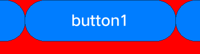

Development Guidelines on Layout Container Components
=====================================================

Layout container components consist of basic view classes. You can set
the view positions to achieve nested and overlapped layouts, set the
layout type and margin to standardize the child components in the
layout, and call certain functions to implement layout views based on
parent and sibling components.

UISwipeView
-----------

When to Use
-----------

**UISwipeView** inherits from **UIViewGroup**. In addition to the
**Add**, **Remove**, and **Insert** functions, **UISwipeView** provides
the functions to swipe contents by page and center the current page
after swiping. This component can be horizontally or vertically
centered. Child components added via the **Add** function are
automatically horizontally or vertically centered, adaptive to the
**UISwipeView** direction, in the sequence they were added.

Available APIs
--------------

**Table 1** Available functions in SwipeView

.. raw:: html

   <table>

.. raw:: html

   <thead align="left">

.. raw:: html

   <tr id="row8336122032615">

.. raw:: html

   <th class="cellrowborder" valign="top" width="50%" id="mcps1.2.3.1.1">

.. raw:: html

   

Function

.. raw:: html

   

.. raw:: html

   </th>

.. raw:: html

   <th class="cellrowborder" valign="top" width="50%" id="mcps1.2.3.1.2">

.. raw:: html

   

Description

.. raw:: html

   

.. raw:: html

   </th>

.. raw:: html

   </tr>

.. raw:: html

   </thead>

.. raw:: html

   <tbody>

.. raw:: html

   <tr id="row9336720172616">

.. raw:: html

   <td class="cellrowborder" valign="top" width="50%" headers="mcps1.2.3.1.1 ">

.. raw:: html

   

void SetCurrentPage(uint16_t index);

.. raw:: html

   

.. raw:: html

   </td>

.. raw:: html

   <td class="cellrowborder" valign="top" width="50%" headers="mcps1.2.3.1.2 ">

.. raw:: html

   

Sets the current page.

.. raw:: html

   

.. raw:: html

   </td>

.. raw:: html

   </tr>

.. raw:: html

   <tr id="row15336172002613">

.. raw:: html

   <td class="cellrowborder" valign="top" width="50%" headers="mcps1.2.3.1.1 ">

.. raw:: html

   

uint16_t GetCurrentPage()

.. raw:: html

   

.. raw:: html

   </td>

.. raw:: html

   <td class="cellrowborder" valign="top" width="50%" headers="mcps1.2.3.1.2 ">

.. raw:: html

   

Obtains the current page.

.. raw:: html

   

.. raw:: html

   </td>

.. raw:: html

   </tr>

.. raw:: html

   <tr id="row9336920102614">

.. raw:: html

   <td class="cellrowborder" valign="top" width="50%" headers="mcps1.2.3.1.1 ">

.. raw:: html

   

UIView\* GetCurrentView() const

.. raw:: html

   

.. raw:: html

   </td>

.. raw:: html

   <td class="cellrowborder" valign="top" width="50%" headers="mcps1.2.3.1.2 ">

.. raw:: html

   

Obtains the current view.

.. raw:: html

   

.. raw:: html

   </td>

.. raw:: html

   </tr>

.. raw:: html

   <tr id="row03371820162616">

.. raw:: html

   <td class="cellrowborder" valign="top" width="50%" headers="mcps1.2.3.1.1 ">

.. raw:: html

   

void SetOnSwipeListener(OnSwipeListener& onSwipeListener)

.. raw:: html

   

.. raw:: html

   </td>

.. raw:: html

   <td class="cellrowborder" valign="top" width="50%" headers="mcps1.2.3.1.2 ">

.. raw:: html

   

Sets the swiping callback class.

.. raw:: html

   

.. raw:: html

   </td>

.. raw:: html

   </tr>

.. raw:: html

   <tr id="row23371520172613">

.. raw:: html

   <td class="cellrowborder" valign="top" width="50%" headers="mcps1.2.3.1.1 ">

.. raw:: html

   

void SetAnimatorTime(uint16_t time);

.. raw:: html

   

.. raw:: html

   </td>

.. raw:: html

   <td class="cellrowborder" valign="top" width="50%" headers="mcps1.2.3.1.2 ">

.. raw:: html

   

Sets the animator event.

.. raw:: html

   

.. raw:: html

   </td>

.. raw:: html

   </tr>

.. raw:: html

   <tr id="row12337152011269">

.. raw:: html

   <td class="cellrowborder" valign="top" width="50%" headers="mcps1.2.3.1.1 ">

.. raw:: html

   

void SetLoopState(bool loop)

.. raw:: html

   

.. raw:: html

   </td>

.. raw:: html

   <td class="cellrowborder" valign="top" width="50%" headers="mcps1.2.3.1.2 ">

.. raw:: html

   

Sets whether to enable the cyclic state.

.. raw:: html

   

.. raw:: html

   </td>

.. raw:: html

   </tr>

.. raw:: html

   <tr id="row1033713201266">

.. raw:: html

   <td class="cellrowborder" valign="top" width="50%" headers="mcps1.2.3.1.1 ">

.. raw:: html

   

UIView\* GetViewByIndex(uint16_t index);

.. raw:: html

   

.. raw:: html

   </td>

.. raw:: html

   <td class="cellrowborder" valign="top" width="50%" headers="mcps1.2.3.1.2 ">

.. raw:: html

   

Obtains a view based on its index.

.. raw:: html

   

.. raw:: html

   </td>

.. raw:: html

   </tr>

.. raw:: html

   </tbody>

.. raw:: html

   </table>

Development Procedure (Non-Cyclic Horizontal Swiping)
-----------------------------------------------------

1. Create a horizontal swiping **UISwipeView**.

   ::

      UISwipeView* swipe = new UISwipeView(UISwipeView::HORIZONTAL);

2. Add child components to **UISwipeView**.

   ::

      UILabelButton* button1 = new UILabelButton();
      button1->SetPosition(0, 0, g_ButtonW, g_ButtonH);
      button1->SetText("button1");
      swipe->Add(button1);
      UILabelButton* button2 = new UILabelButton();
      button2->SetPosition(0, 0, g_ButtonW, g_ButtonH);
      button2->SetText("button2");
      swipe->Add(button2);
      UILabelButton* button3 = new UILabelButton();
      button3->SetPosition(0, 0, g_ButtonW, g_ButtonH);
      button3->SetText("button3");
      swipe->Add(button3);

3. Verify that the components are swiping horizontally but not
   cyclically.

   **Figure 1** Horizontal swiping effect of **UISwipeView**\ 

   |image1|

Development Procedure (Cyclic Horizontal Swiping)
-------------------------------------------------

1. Create a horizontal swiping **UISwipeView** and add its child
   components.

   ::

      UISwipeView* swipe = new UISwipeView(UISwipeView::HORIZONTAL);
      UILabelButton* button1 = new UILabelButton();
      button1->SetPosition(0, 0, g_ButtonW, g_ButtonH);
      button1->SetText("button1");
      swipe->Add(button1);
      UILabelButton* button2 = new UILabelButton();
      button2->SetPosition(0, 0, g_ButtonW, g_ButtonH);
      button2->SetText("button2");
      swipe->Add(button2);
      UILabelButton* button3 = new UILabelButton();
      button3->SetPosition(0, 0, g_ButtonW, g_ButtonH);
      button3->SetText("button3");
      swipe->Add(button3);

2. Enable cyclic swiping for the **UISwipeView**.

   ::

      swipe->SetLoopState(true);

3. Verify that the components are swiping horizontally and cyclically.

   **Figure 2** Cyclic horizontal swiping effect of **UISwipeView**\ 

   |image2|

GridLayout
----------

.. _when-to-use-1:

When to Use
-----------

**GridLayout** provides the basic layout capability to set the number of
grid rows and columns. Child components added via the **Add** function
are automatically arranged after the **LayoutChildren()** function is
called.

.. _available-apis-1:

Available APIs
--------------

**Table 2** Available functions in GridLayout

.. raw:: html

   <table>

.. raw:: html

   <thead align="left">

.. raw:: html

   <tr id="row9997104632911">

.. raw:: html

   <th class="cellrowborder" valign="top" width="50%" id="mcps1.2.3.1.1">

.. raw:: html

   

Function

.. raw:: html

   

.. raw:: html

   </th>

.. raw:: html

   <th class="cellrowborder" valign="top" width="50%" id="mcps1.2.3.1.2">

.. raw:: html

   

Description

.. raw:: html

   

.. raw:: html

   </th>

.. raw:: html

   </tr>

.. raw:: html

   </thead>

.. raw:: html

   <tbody>

.. raw:: html

   <tr id="row149976467292">

.. raw:: html

   <td class="cellrowborder" valign="top" width="50%" headers="mcps1.2.3.1.1 ">

.. raw:: html

   

void SetRows(const uint16_t& rows)

.. raw:: html

   

.. raw:: html

   </td>

.. raw:: html

   <td class="cellrowborder" valign="top" width="50%" headers="mcps1.2.3.1.2 ">

.. raw:: html

   

Sets the number of grid rows.

.. raw:: html

   

.. raw:: html

   </td>

.. raw:: html

   </tr>

.. raw:: html

   <tr id="row299774652915">

.. raw:: html

   <td class="cellrowborder" valign="top" width="50%" headers="mcps1.2.3.1.1 ">

.. raw:: html

   

void SetCols(const uint16_t& cols)

.. raw:: html

   

.. raw:: html

   </td>

.. raw:: html

   <td class="cellrowborder" valign="top" width="50%" headers="mcps1.2.3.1.2 ">

.. raw:: html

   

Sets the number of grid columns.

.. raw:: html

   

.. raw:: html

   </td>

.. raw:: html

   </tr>

.. raw:: html

   <tr id="row1199724616291">

.. raw:: html

   <td class="cellrowborder" valign="top" width="50%" headers="mcps1.2.3.1.1 ">

.. raw:: html

   

void LayoutChildren(bool needInvalidate = false)

.. raw:: html

   

.. raw:: html

   </td>

.. raw:: html

   <td class="cellrowborder" valign="top" width="50%" headers="mcps1.2.3.1.2 ">

.. raw:: html

   

Lays out child components.

.. raw:: html

   

.. raw:: html

   </td>

.. raw:: html

   </tr>

.. raw:: html

   </tbody>

.. raw:: html

   </table>

How to Develop
--------------

1. Create a **GridLayout** instance and set its position and size.

   ::

      GridLayout* layout_ = new GridLayout();
      layout_->SetPosition(0, g_y, HROIZONTAL_RESOLUTION, 200);
      layout_->SetLayoutDirection(LAYOUT_HOR);
      layout_->SetRows(2);
      layout_->SetCols(2);

2. Create **UILabelButton** instances.

   ::

      UILabelButton* bt1 = new UILabelButton();
      bt1->SetPosition(0,0,100,50);
      bt1->SetText("bt1");
      UILabelButton* bt2 = new UILabelButton();
      bt2->SetPosition(0, 0, 100, 50);
      bt2->SetText("bt2");
      UILabelButton* bt3 = new UILabelButton();
      bt3->SetPosition(0, 0, 100, 50);
      bt3->SetText("bt3");
      UILabelButton* bt4 = new UILabelButton();
      bt4->SetPosition(0, 0, 100, 50);
      bt4->SetText("bt4");

3. Add child components and call the **LayoutChildren()** function.

   ::

      layout_->Add(bt1);
      layout_->Add(bt2);
      layout_->Add(bt3);
      layout_->Add(bt4);
      layout_->LayoutChildren();

4. Verify the layout of buttons, as shown in the following figure.

   | **Figure 3** Setting a 2x2 grid and adding four buttons in a layout
   | |image3|

.. |image3| image:: figures/setting-a-2x2-grid-and-adding-four-buttons-in-a-layout.png
