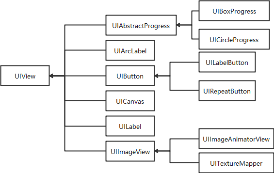
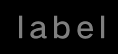
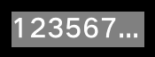
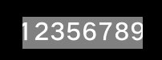

Development Guidelines on Common Components
===========================================

Common components inherit from the base class **UIView**. Child
components cannot be added to common components, such as buttons,
images, and labels.

| **Figure 1** Tree structure of common components
| |image1|

**UIView** is a base class of the following components:
**UIAbstractProgress**, **UIArcLabel**, **UIButton**, **UICanvas**,
**UILabel**, and **UIImageView**. **UIBoxProgress** and
**UICircleProgress** inherit from **UIAbstractProgress**.
**UILabelButton** and **UIRepeatButton** inherit from **UIButton**.
**UIImageAnimatorView** and **UITextureMapper** inherit from
**UIImageView**.

UIButton
--------

When to Use
-----------

**UIButton** supports the click event and allows you to set styles in
different states.

Available APIs
--------------

**Table 1** Available functions in UIButton

.. raw:: html

   <table>

.. raw:: html

   <thead align="left">

.. raw:: html

   <tr id="row13192303311">

.. raw:: html

   <th class="cellrowborder" valign="top" width="50%" id="mcps1.2.3.1.1">

.. raw:: html

   

Function

.. raw:: html

   

.. raw:: html

   </th>

.. raw:: html

   <th class="cellrowborder" valign="top" width="50%" id="mcps1.2.3.1.2">

.. raw:: html

   

Description

.. raw:: html

   

.. raw:: html

   </th>

.. raw:: html

   </tr>

.. raw:: html

   </thead>

.. raw:: html

   <tbody>

.. raw:: html

   <tr id="row191914306313">

.. raw:: html

   <td class="cellrowborder" valign="top" width="50%" headers="mcps1.2.3.1.1 ">

.. raw:: html

   

void SetImageSrc (const char *defaultImgSrc, const
char*\ triggeredImgSrc)

.. raw:: html

   

.. raw:: html

   </td>

.. raw:: html

   <td class="cellrowborder" valign="top" width="50%" headers="mcps1.2.3.1.2 ">

.. raw:: html

   

Sets the button image.

.. raw:: html

   

.. raw:: html

   </td>

.. raw:: html

   </tr>

.. raw:: html

   <tr id="row141915307313">

.. raw:: html

   <td class="cellrowborder" valign="top" width="50%" headers="mcps1.2.3.1.1 ">

.. raw:: html

   

void SetImagePosition (const int16_t x, const int16_t y)

.. raw:: html

   

.. raw:: html

   </td>

.. raw:: html

   <td class="cellrowborder" valign="top" width="50%" headers="mcps1.2.3.1.2 ">

.. raw:: html

   

Sets the position of the button image.

.. raw:: html

   

.. raw:: html

   </td>

.. raw:: html

   </tr>

.. raw:: html

   <tr id="row1119930183115">

.. raw:: html

   <td class="cellrowborder" valign="top" width="50%" headers="mcps1.2.3.1.1 ">

.. raw:: html

   

int16_t GetImageX () const

.. raw:: html

   

.. raw:: html

   </td>

.. raw:: html

   <td class="cellrowborder" valign="top" width="50%" headers="mcps1.2.3.1.2 ">

.. raw:: html

   

Obtains the x-coordinate of the button image.

.. raw:: html

   

.. raw:: html

   </td>

.. raw:: html

   </tr>

.. raw:: html

   <tr id="row62083017317">

.. raw:: html

   <td class="cellrowborder" valign="top" width="50%" headers="mcps1.2.3.1.1 ">

.. raw:: html

   

int16_t GetImageY () const

.. raw:: html

   

.. raw:: html

   </td>

.. raw:: html

   <td class="cellrowborder" valign="top" width="50%" headers="mcps1.2.3.1.2 ">

.. raw:: html

   

Obtains the y-coordinate of the button image.

.. raw:: html

   

.. raw:: html

   </td>

.. raw:: html

   </tr>

.. raw:: html

   <tr id="row72013013114">

.. raw:: html

   <td class="cellrowborder" valign="top" width="50%" headers="mcps1.2.3.1.1 ">

.. raw:: html

   

const ImageInfo\* GetCurImageSrc() const

.. raw:: html

   

.. raw:: html

   </td>

.. raw:: html

   <td class="cellrowborder" valign="top" width="50%" headers="mcps1.2.3.1.2 ">

.. raw:: html

   

Obtains the image of the button in the current state.

.. raw:: html

   

.. raw:: html

   </td>

.. raw:: html

   </tr>

.. raw:: html

   <tr id="row320103017318">

.. raw:: html

   <td class="cellrowborder" valign="top" width="50%" headers="mcps1.2.3.1.1 ">

.. raw:: html

   

Style& GetStyleForState (ButtonState state)

.. raw:: html

   

.. raw:: html

   </td>

.. raw:: html

   <td class="cellrowborder" valign="top" width="50%" headers="mcps1.2.3.1.2 ">

.. raw:: html

   

Sets the style for the button in the current state.

.. raw:: html

   

.. raw:: html

   </td>

.. raw:: html

   </tr>

.. raw:: html

   <tr id="row420730193117">

.. raw:: html

   <td class="cellrowborder" valign="top" width="50%" headers="mcps1.2.3.1.1 ">

.. raw:: html

   

voidSetStyleForState (const Style &style, ButtonState state)

.. raw:: html

   

.. raw:: html

   </td>

.. raw:: html

   <td class="cellrowborder" valign="top" width="50%" headers="mcps1.2.3.1.2 ">

.. raw:: html

   

Sets the style for the button in a specified state.

.. raw:: html

   

.. raw:: html

   </td>

.. raw:: html

   </tr>

.. raw:: html

   <tr id="row1320193010317">

.. raw:: html

   <td class="cellrowborder" valign="top" width="50%" headers="mcps1.2.3.1.1 ">

.. raw:: html

   

void Disable ()

.. raw:: html

   

.. raw:: html

   </td>

.. raw:: html

   <td class="cellrowborder" valign="top" width="50%" headers="mcps1.2.3.1.2 ">

.. raw:: html

   

Disables the button.

.. raw:: html

   

.. raw:: html

   </td>

.. raw:: html

   </tr>

.. raw:: html

   <tr id="row02017308315">

.. raw:: html

   <td class="cellrowborder" valign="top" width="50%" headers="mcps1.2.3.1.1 ">

.. raw:: html

   

void Enable ()

.. raw:: html

   

.. raw:: html

   </td>

.. raw:: html

   <td class="cellrowborder" valign="top" width="50%" headers="mcps1.2.3.1.2 ">

.. raw:: html

   

Enables the button.

.. raw:: html

   

.. raw:: html

   </td>

.. raw:: html

   </tr>

.. raw:: html

   </tbody>

.. raw:: html

   </table>

How to Develop
--------------

1. Implement the click event.

   ::

      class TestBtnOnClickListener : public OHOS::UIView::OnClickListener {
          bool OnClick(UIView& view, const ClickEvent& event) override
          {
              int16_t width = view.GetWidth() + 10;
              int16_t height = view.GetHeight() + 10;
              view.Resize(width, height);
              view.Invalidate();
              return true;
          }
      };

2. Create a **UIButton** instance.

   ::

      UIButton* button = new UIButton();
      button->SetPosition(50, 50);
      button->SetWidth(100);
      button->SetHeight(50);

3. Register the click event callback for **UIButton**.

   ::

      button->SetOnClickListener(new TestBtnOnClickListener());

4. Verify that the button is clicked and its size increases gradually,
   as shown in the following figure.

   | **Figure 2** Effect of clicking a **UIButton**\ 
   | |image2|

UIImageView
-----------

.. _when-to-use-1:

When to Use
-----------

**UIImageView** supports the functions to display images, set opacity,
rotate images, and zoom in or out images. The following image formats
are supported: RGB565, RGB888, RGBA8888, PNG, and JPG.

.. _available-apis-1:

Available APIs
--------------

**Table 2** Available functions in UIImageView

.. raw:: html

   <table>

.. raw:: html

   <thead align="left">

.. raw:: html

   <tr id="row483811426401">

.. raw:: html

   <th class="cellrowborder" valign="top" width="50%" id="mcps1.2.3.1.1">

.. raw:: html

   

Function

.. raw:: html

   

.. raw:: html

   </th>

.. raw:: html

   <th class="cellrowborder" valign="top" width="50%" id="mcps1.2.3.1.2">

.. raw:: html

   

Description

.. raw:: html

   

.. raw:: html

   </th>

.. raw:: html

   </tr>

.. raw:: html

   </thead>

.. raw:: html

   <tbody>

.. raw:: html

   <tr id="row198391442134016">

.. raw:: html

   <td class="cellrowborder" valign="top" width="50%" headers="mcps1.2.3.1.1 ">

.. raw:: html

   

void SetSrc (const char \*src)

.. raw:: html

   

.. raw:: html

   </td>

.. raw:: html

   <td class="cellrowborder" valign="top" width="50%" headers="mcps1.2.3.1.2 ">

.. raw:: html

   

Sets the image path with binary data.

.. raw:: html

   

.. raw:: html

   </td>

.. raw:: html

   </tr>

.. raw:: html

   <tr id="row9839642194011">

.. raw:: html

   <td class="cellrowborder" valign="top" width="50%" headers="mcps1.2.3.1.1 ">

.. raw:: html

   

void SetSrc (const ImageInfo \*src)

.. raw:: html

   

.. raw:: html

   </td>

.. raw:: html

   <td class="cellrowborder" valign="top" width="50%" headers="mcps1.2.3.1.2 ">

.. raw:: html

   

Sets the pointer to image information.

.. raw:: html

   

.. raw:: html

   </td>

.. raw:: html

   </tr>

.. raw:: html

   <tr id="row158391342194014">

.. raw:: html

   <td class="cellrowborder" valign="top" width="50%" headers="mcps1.2.3.1.1 ">

.. raw:: html

   

void SetAutoEnable (bool enable)

.. raw:: html

   

.. raw:: html

   </td>

.. raw:: html

   <td class="cellrowborder" valign="top" width="50%" headers="mcps1.2.3.1.2 ">

.. raw:: html

   

Sets whether the component size adapts to the image size.

.. raw:: html

   

.. raw:: html

   </td>

.. raw:: html

   </tr>

.. raw:: html

   <tr id="row4839342154012">

.. raw:: html

   <td class="cellrowborder" valign="top" width="50%" headers="mcps1.2.3.1.1 ">

.. raw:: html

   

const void\* GetSrcType () const

.. raw:: html

   

.. raw:: html

   </td>

.. raw:: html

   <td class="cellrowborder" valign="top" width="50%" headers="mcps1.2.3.1.2 ">

.. raw:: html

   

Obtains the image type.

.. raw:: html

   

.. raw:: html

   </td>

.. raw:: html

   </tr>

.. raw:: html

   <tr id="row283918426406">

.. raw:: html

   <td class="cellrowborder" valign="top" width="50%" headers="mcps1.2.3.1.1 ">

.. raw:: html

   

bool GetAutoEnable () const

.. raw:: html

   

.. raw:: html

   </td>

.. raw:: html

   <td class="cellrowborder" valign="top" width="50%" headers="mcps1.2.3.1.2 ">

.. raw:: html

   

Checks whether the component size adapts to the image size.

.. raw:: html

   

.. raw:: html

   </td>

.. raw:: html

   </tr>

.. raw:: html

   <tr id="row183912426406">

.. raw:: html

   <td class="cellrowborder" valign="top" width="50%" headers="mcps1.2.3.1.1 ">

.. raw:: html

   

void SetBlurLevel(BlurLevel level)

.. raw:: html

   

.. raw:: html

   </td>

.. raw:: html

   <td class="cellrowborder" valign="top" width="50%" headers="mcps1.2.3.1.2 ">

.. raw:: html

   

Sets the blur level for the image background.

.. raw:: html

   

.. raw:: html

   </td>

.. raw:: html

   </tr>

.. raw:: html

   <tr id="row9840842174012">

.. raw:: html

   <td class="cellrowborder" valign="top" width="50%" headers="mcps1.2.3.1.1 ">

.. raw:: html

   

BlurLevel GetBlurLevel() const

.. raw:: html

   

.. raw:: html

   </td>

.. raw:: html

   <td class="cellrowborder" valign="top" width="50%" headers="mcps1.2.3.1.2 ">

.. raw:: html

   

Obtains the blur level of the image background.

.. raw:: html

   

.. raw:: html

   </td>

.. raw:: html

   </tr>

.. raw:: html

   <tr id="row184015424405">

.. raw:: html

   <td class="cellrowborder" valign="top" width="50%" headers="mcps1.2.3.1.1 ">

.. raw:: html

   

void SetTransformAlgorithm(TransformAlgorithm algorithm)

.. raw:: html

   

.. raw:: html

   </td>

.. raw:: html

   <td class="cellrowborder" valign="top" width="50%" headers="mcps1.2.3.1.2 ">

.. raw:: html

   

Sets the transformation algorithm.

.. raw:: html

   

.. raw:: html

   </td>

.. raw:: html

   </tr>

.. raw:: html

   <tr id="row1484064244017">

.. raw:: html

   <td class="cellrowborder" valign="top" width="50%" headers="mcps1.2.3.1.1 ">

.. raw:: html

   

TransformAlgorithm GetTransformAlgorithm() const

.. raw:: html

   

.. raw:: html

   </td>

.. raw:: html

   <td class="cellrowborder" valign="top" width="50%" headers="mcps1.2.3.1.2 ">

.. raw:: html

   

Obtains the transformation algorithm.

.. raw:: html

   

.. raw:: html

   </td>

.. raw:: html

   </tr>

.. raw:: html

   </tbody>

.. raw:: html

   </table>

How to Develop (Adaptive Mode)
------------------------------

1. Create a **UIImageView** instance.

   ::

      UIImageView* imageView = new UIImageView();
      imageView->SetPosition(0, 30);

2. Set the image path with binary data.

   ::

      imageView->SetSrc("..\\config\\images\\A021_001.bin");

3. Verify that the **UIImageView** component is adaptive to the image.

   | **Figure 3** Image auto-adaption effect
   | |image3|

How to Develop (Tile Mode)
--------------------------

1. Create a **UIImageView** instance.

   ::

      UIImageView* imageView = new UIImageView();
      imageView->SetPosition(0, 30);

2. Set the image path.

   ::

      imageView->SetSrc("..\\config\\images\\A021_001.bin");

3. Disable the image auto-adaptation effect and resize the image to
   display the image in tile mode.

   ::

      imageView->SetAutoEnable(false);
      imageView->Resize(454, 150);

4. Verify that the tile mode has been enabled for the **UIImageView**.

   | **Figure 4** Image tile effect
   | |image4|

UILabel
-------

.. _when-to-use-2:

When to Use
-----------

**UILabel** displays text in an area. You can set the background color,
text display style, and long text display effect for a label.

.. _available-apis-2:

Available APIs
--------------

**Table 3** Available functions in UILabel

.. raw:: html

   <table>

.. raw:: html

   <thead align="left">

.. raw:: html

   <tr id="row874571512438">

.. raw:: html

   <th class="cellrowborder" valign="top" width="46.37%" id="mcps1.2.3.1.1">

.. raw:: html

   

Function

.. raw:: html

   

.. raw:: html

   </th>

.. raw:: html

   <th class="cellrowborder" valign="top" width="53.63%" id="mcps1.2.3.1.2">

.. raw:: html

   

Description

.. raw:: html

   

.. raw:: html

   </th>

.. raw:: html

   </tr>

.. raw:: html

   </thead>

.. raw:: html

   <tbody>

.. raw:: html

   <tr id="row674561515438">

.. raw:: html

   <td class="cellrowborder" valign="top" width="46.37%" headers="mcps1.2.3.1.1 ">

.. raw:: html

   

void SetText(const char\* text);

.. raw:: html

   

.. raw:: html

   </td>

.. raw:: html

   <td class="cellrowborder" valign="top" width="53.63%" headers="mcps1.2.3.1.2 ">

.. raw:: html

   

Sets text for the label.

.. raw:: html

   

.. raw:: html

   </td>

.. raw:: html

   </tr>

.. raw:: html

   <tr id="row77451315154311">

.. raw:: html

   <td class="cellrowborder" valign="top" width="46.37%" headers="mcps1.2.3.1.1 ">

.. raw:: html

   

const char\* GetText() const;

.. raw:: html

   

.. raw:: html

   </td>

.. raw:: html

   <td class="cellrowborder" valign="top" width="53.63%" headers="mcps1.2.3.1.2 ">

.. raw:: html

   

Obtains text of the label.

.. raw:: html

   

.. raw:: html

   </td>

.. raw:: html

   </tr>

.. raw:: html

   <tr id="row6745121516437">

.. raw:: html

   <td class="cellrowborder" valign="top" width="46.37%" headers="mcps1.2.3.1.1 ">

.. raw:: html

   

void SetLineBreakMode(const uint8_t lineBreakMode);

.. raw:: html

   

.. raw:: html

   </td>

.. raw:: html

   <td class="cellrowborder" valign="top" width="53.63%" headers="mcps1.2.3.1.2 ">

.. raw:: html

   

Sets the label mode, such as truncation and automatic extension.

.. raw:: html

   

.. raw:: html

   </td>

.. raw:: html

   </tr>

.. raw:: html

   <tr id="row2745115104318">

.. raw:: html

   <td class="cellrowborder" valign="top" width="46.37%" headers="mcps1.2.3.1.1 ">

.. raw:: html

   

uint8_t GetLineBreakMode() const

.. raw:: html

   

.. raw:: html

   </td>

.. raw:: html

   <td class="cellrowborder" valign="top" width="53.63%" headers="mcps1.2.3.1.2 ">

.. raw:: html

   

Obtains the label mode.

.. raw:: html

   

.. raw:: html

   </td>

.. raw:: html

   </tr>

.. raw:: html

   <tr id="row17745515114319">

.. raw:: html

   <td class="cellrowborder" valign="top" width="46.37%" headers="mcps1.2.3.1.1 ">

.. raw:: html

   

void SetTextColor(ColorType color)

.. raw:: html

   

.. raw:: html

   </td>

.. raw:: html

   <td class="cellrowborder" valign="top" width="53.63%" headers="mcps1.2.3.1.2 ">

.. raw:: html

   

Set the text color.

.. raw:: html

   

.. raw:: html

   </td>

.. raw:: html

   </tr>

.. raw:: html

   <tr id="row1074541511437">

.. raw:: html

   <td class="cellrowborder" valign="top" width="46.37%" headers="mcps1.2.3.1.1 ">

.. raw:: html

   

ColorType GetTextColor() const

.. raw:: html

   

.. raw:: html

   </td>

.. raw:: html

   <td class="cellrowborder" valign="top" width="53.63%" headers="mcps1.2.3.1.2 ">

.. raw:: html

   

Obtains the text color.

.. raw:: html

   

.. raw:: html

   </td>

.. raw:: html

   </tr>

.. raw:: html

   <tr id="row874651510439">

.. raw:: html

   <td class="cellrowborder" valign="top" width="46.37%" headers="mcps1.2.3.1.1 ">

.. raw:: html

   

void SetAlign(UITextLanguageAlignment horizontalAlign,

.. raw:: html

   

.. raw:: html

   

UITextLanguageAlignment verticalAlign = TEXT_ALIGNMENT_TOP);

.. raw:: html

   

.. raw:: html

   </td>

.. raw:: html

   <td class="cellrowborder" valign="top" width="53.63%" headers="mcps1.2.3.1.2 ">

.. raw:: html

   

Sets the text alignment mode.

.. raw:: html

   

.. raw:: html

   </td>

.. raw:: html

   </tr>

.. raw:: html

   <tr id="row15746151514437">

.. raw:: html

   <td class="cellrowborder" valign="top" width="46.37%" headers="mcps1.2.3.1.1 ">

.. raw:: html

   

UITextLanguageAlignment GetHorAlign() const

.. raw:: html

   

.. raw:: html

   </td>

.. raw:: html

   <td class="cellrowborder" valign="top" width="53.63%" headers="mcps1.2.3.1.2 ">

.. raw:: html

   

Obtains the horizontal alignment mode of text.

.. raw:: html

   

.. raw:: html

   </td>

.. raw:: html

   </tr>

.. raw:: html

   <tr id="row197467150431">

.. raw:: html

   <td class="cellrowborder" valign="top" width="46.37%" headers="mcps1.2.3.1.1 ">

.. raw:: html

   

UITextLanguageAlignment GetVerAlign() const

.. raw:: html

   

.. raw:: html

   </td>

.. raw:: html

   <td class="cellrowborder" valign="top" width="53.63%" headers="mcps1.2.3.1.2 ">

.. raw:: html

   

Obtains the vertical alignment mode of text.

.. raw:: html

   

.. raw:: html

   </td>

.. raw:: html

   </tr>

.. raw:: html

   <tr id="row1474613152438">

.. raw:: html

   <td class="cellrowborder" valign="top" width="46.37%" headers="mcps1.2.3.1.1 ">

.. raw:: html

   

void SetDirect(UITextLanguageDirect direct)

.. raw:: html

   

.. raw:: html

   </td>

.. raw:: html

   <td class="cellrowborder" valign="top" width="53.63%" headers="mcps1.2.3.1.2 ">

.. raw:: html

   

Sets the text display direction.

.. raw:: html

   

.. raw:: html

   </td>

.. raw:: html

   </tr>

.. raw:: html

   <tr id="row1374661524316">

.. raw:: html

   <td class="cellrowborder" valign="top" width="46.37%" headers="mcps1.2.3.1.1 ">

.. raw:: html

   

UITextLanguageDirect GetDirect() const

.. raw:: html

   

.. raw:: html

   </td>

.. raw:: html

   <td class="cellrowborder" valign="top" width="53.63%" headers="mcps1.2.3.1.2 ">

.. raw:: html

   

Obtains the text display direction.

.. raw:: html

   

.. raw:: html

   </td>

.. raw:: html

   </tr>

.. raw:: html

   <tr id="row3746115164316">

.. raw:: html

   <td class="cellrowborder" valign="top" width="46.37%" headers="mcps1.2.3.1.1 ">

.. raw:: html

   

void SetFontId(uint8_t fontId);

.. raw:: html

   

.. raw:: html

   </td>

.. raw:: html

   <td class="cellrowborder" valign="top" width="53.63%" headers="mcps1.2.3.1.2 ">

.. raw:: html

   

Sets the dynamic font ID.

.. raw:: html

   

.. raw:: html

   </td>

.. raw:: html

   </tr>

.. raw:: html

   <tr id="row57471415134313">

.. raw:: html

   <td class="cellrowborder" valign="top" width="46.37%" headers="mcps1.2.3.1.1 ">

.. raw:: html

   

uint8_t GetFontId() const

.. raw:: html

   

.. raw:: html

   </td>

.. raw:: html

   <td class="cellrowborder" valign="top" width="53.63%" headers="mcps1.2.3.1.2 ">

.. raw:: html

   

Obtains the dynamic font ID.

.. raw:: html

   

.. raw:: html

   </td>

.. raw:: html

   </tr>

.. raw:: html

   <tr id="row13747115124310">

.. raw:: html

   <td class="cellrowborder" valign="top" width="46.37%" headers="mcps1.2.3.1.1 ">

.. raw:: html

   

void SetFont(const char \*name, uint8_t size);

.. raw:: html

   

.. raw:: html

   </td>

.. raw:: html

   <td class="cellrowborder" valign="top" width="53.63%" headers="mcps1.2.3.1.2 ">

.. raw:: html

   

Sets the font name and size.

.. raw:: html

   

.. raw:: html

   </td>

.. raw:: html

   </tr>

.. raw:: html

   <tr id="row177471015184318">

.. raw:: html

   <td class="cellrowborder" valign="top" width="46.37%" headers="mcps1.2.3.1.1 ">

.. raw:: html

   

void SetAnimatorSpeed(uint16_t animSpeed);

.. raw:: html

   

.. raw:: html

   </td>

.. raw:: html

   <td class="cellrowborder" valign="top" width="53.63%" headers="mcps1.2.3.1.2 ">

.. raw:: html

   

Sets the font rotation speed.

.. raw:: html

   

.. raw:: html

   </td>

.. raw:: html

   </tr>

.. raw:: html

   <tr id="row474701534317">

.. raw:: html

   <td class="cellrowborder" valign="top" width="46.37%" headers="mcps1.2.3.1.1 ">

.. raw:: html

   

uint16_t GetTextWidth();

.. raw:: html

   

.. raw:: html

   </td>

.. raw:: html

   <td class="cellrowborder" valign="top" width="53.63%" headers="mcps1.2.3.1.2 ">

.. raw:: html

   

Obtains the font width.

.. raw:: html

   

.. raw:: html

   </td>

.. raw:: html

   </tr>

.. raw:: html

   <tr id="row117471015164313">

.. raw:: html

   <td class="cellrowborder" valign="top" width="46.37%" headers="mcps1.2.3.1.1 ">

.. raw:: html

   

uint16_t GetTextHeight();

.. raw:: html

   

.. raw:: html

   </td>

.. raw:: html

   <td class="cellrowborder" valign="top" width="53.63%" headers="mcps1.2.3.1.2 ">

.. raw:: html

   

Obtains the font height.

.. raw:: html

   

.. raw:: html

   </td>

.. raw:: html

   </tr>

.. raw:: html

   <tr id="row7747201504317">

.. raw:: html

   <td class="cellrowborder" valign="top" width="46.37%" headers="mcps1.2.3.1.1 ">

.. raw:: html

   

void SetRollStartPos(int16_t pos)

.. raw:: html

   

.. raw:: html

   </td>

.. raw:: html

   <td class="cellrowborder" valign="top" width="53.63%" headers="mcps1.2.3.1.2 ">

.. raw:: html

   

Sets the rotation position.

.. raw:: html

   

.. raw:: html

   </td>

.. raw:: html

   </tr>

.. raw:: html

   <tr id="row16747215174313">

.. raw:: html

   <td class="cellrowborder" valign="top" width="46.37%" headers="mcps1.2.3.1.1 ">

.. raw:: html

   

int16_t GetRollStartPos() const

.. raw:: html

   

.. raw:: html

   </td>

.. raw:: html

   <td class="cellrowborder" valign="top" width="53.63%" headers="mcps1.2.3.1.2 ">

.. raw:: html

   

Obtains the rotation position.

.. raw:: html

   

.. raw:: html

   </td>

.. raw:: html

   </tr>

.. raw:: html

   <tr id="row117489151434">

.. raw:: html

   <td class="cellrowborder" valign="top" width="46.37%" headers="mcps1.2.3.1.1 ">

.. raw:: html

   

void SetTextRotation(LabelRotateDegree angle)

.. raw:: html

   

.. raw:: html

   </td>

.. raw:: html

   <td class="cellrowborder" valign="top" width="53.63%" headers="mcps1.2.3.1.2 ">

.. raw:: html

   

Sets the enumerated value of the text rotation angle.

.. raw:: html

   

.. raw:: html

   </td>

.. raw:: html

   </tr>

.. raw:: html

   <tr id="row1474831544318">

.. raw:: html

   <td class="cellrowborder" valign="top" width="46.37%" headers="mcps1.2.3.1.1 ">

.. raw:: html

   

LabelRotateDegree GetTextRotation() const

.. raw:: html

   

.. raw:: html

   </td>

.. raw:: html

   <td class="cellrowborder" valign="top" width="53.63%" headers="mcps1.2.3.1.2 ">

.. raw:: html

   

Obtains the enumerated value of the text rotation angle.

.. raw:: html

   

.. raw:: html

   </td>

.. raw:: html

   </tr>

.. raw:: html

   <tr id="row4748615154315">

.. raw:: html

   <td class="cellrowborder" valign="top" width="46.37%" headers="mcps1.2.3.1.1 ">

.. raw:: html

   

uint16_t GetTextRotateDegree() const

.. raw:: html

   

.. raw:: html

   </td>

.. raw:: html

   <td class="cellrowborder" valign="top" width="53.63%" headers="mcps1.2.3.1.2 ">

.. raw:: html

   

Obtains the number of text rotation degrees.

.. raw:: html

   

.. raw:: html

   </td>

.. raw:: html

   </tr>

.. raw:: html

   </tbody>

.. raw:: html

   </table>

How to Develop (Default Mode)
-----------------------------

1. Create a **lUILabel** instance and set its size and position.

   ::

      UILabel* label = new UILabel();
      label->SetPosition(x, y);
      label->Resize(width, height);

2. Set the font.

   ::

      label->SetFont("SourceHanSansSC-Regular.otf", 30);

3. Set the text.

   ::

      label->SetText("label");

4. Verify the label size and display effect, as shown in the following
   figure.

   |image5|

How to Develop (Background Color and Opacity)
---------------------------------------------

1. Create a **lUILabel** instance and set its size and position.

   ::

      UILabel* label = new UILabel();
      label->SetPosition(x, y);
      label->Resize(width, height);

2. Set the font.

   ::

      label->SetFont("SourceHanSansSC-Regular.otf", 30);

3. Set the background color and opacity.

   ::

      label->SetStyle(STYLE_BACKGROUND_COLOR, Color::Gray().full);
      label->SetStyle(STYLE_BACKGROUND_OPA, 127);
      label->SetText("Label");

4. Verify that the background color of the label is **Gray**, as shown
   in the following figure.

   |image6|

How to Develop (Letter Spacing)
-------------------------------

1. Create a **lUILabel** instance and set its size and position.

   ::

      UILabel* label = new UILabel();
      label->SetPosition(x, y);
      label->Resize(width, height);

2. Set the font.

   ::

      label->SetFont("SourceHanSansSC-Regular.otf", 30);

3. Set the font color and letter spacing.

   ::

      label->SetStyle(STYLE_BACKGROUND_COLOR, Color::Gray().full);
      label->SetStyle(STYLE_LETTER_SPACE, 5);
      label->SetText("Label");

4. Verify that the letter spacing is **5** pixels on the label, as shown
   in the following figure.

   |image7|

How to Develop (Size-Adaptive Mode)
-----------------------------------

Regarding too long text, the size of a label can be automatically
adjusted based on the text, or the text can be truncated or displayed
with the scrolling effect.

1. Create a **lUILabel** instance and set its size and position.

   ::

      UILabel* label = new UILabel();
      label->SetPosition(x, y);
      label->Resize(width, height);

2. Set the font.

   ::

      label->SetFont("SourceHanSansSC-Regular.otf", 30);

3. Set the font color to **Gray** and enable the label size to adapt to
   the text.

   ::

      label->SetStyle(STYLE_BACKGROUND_COLOR, Color::Gray().full);
      label->SetLineBreakMode(UILabel::LINE_BREAK_ADAPT);
      label->SetText("123\n567890");

4. Verify that the label size adapts to the text, as shown in the
   following figure.

   |image8|

How to Develop (Ellipsis Mode)
------------------------------

In ellipsis mode, an ellipsis (…) is displayed at the end of the label
if the text cannot be completely displayed.

1. Create a **lUILabel** instance and set its size and position.

   ::

      UILabel* label = new UILabel();
      label->SetPosition(x, y);
      label->Resize(width, height);

2. Set the font.

   ::

      label->SetFont("SourceHanSansSC-Regular.otf", 30);

3. Set the text display mode to **LINE_BREAK_ELLIPSIS**.

   ::

      label->SetStyle(STYLE_BACKGROUND_COLOR, Color::Gray().full);
      label->SetLineBreakMode(UILabel::LINE_BREAK_ELLIPSIS);
      label->SetText("123567890");

4. Verify that the ellipsis mode has taken effect on the label, as shown
   in the following figure.

   |image9|

How to Develop (Scrolling Mode)
-------------------------------

In scrolling mode, long text is kept scrolling on a screen to bring the
entire text into view.

1. Create a **lUILabel** instance and set its size and position.

   ::

      UILabel* label = new UILabel();
      label->SetPosition(x, y);
      label->Resize(width, height);

2. Set the font.

   ::

      label->SetFont("SourceHanSansSC-Regular.otf", 30);

3. Set the text display mode to **UI_LABEL_LONG_ROLL**.

   ::

      label->SetStyle(STYLE_BACKGROUND_COLOR, Color::Gray().full);
      label->SetStyle(STYLE_BACKGROUND_OPA, 127);
      label->SetLineBreakMode(UILabel::LINE_BREAK_MARQUEE);
      label->SetText("123567890");

4. Verify that the text is scrolling on the label, as shown in the
   following figure.

   |image10|

.. |image5| image:: figures/en-us_image_0000001051782526.png

